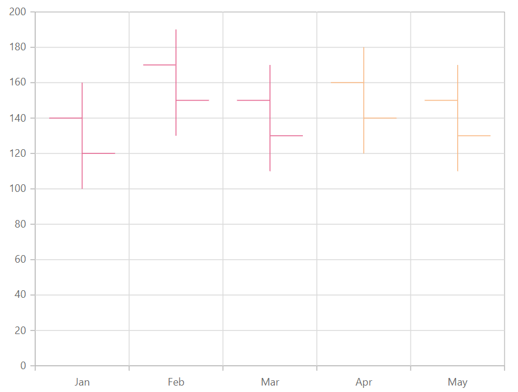

# High Low Open Close in Blazor Charts Component

## High Low Open Close

[HiloOpenClose](https://help.syncfusion.com/cr/blazor/Syncfusion.Blazor.Charts.ChartSeriesType.html#Syncfusion_Blazor_Charts_ChartSeriesType_HiloOpenClose) series is used to represent the **Low**, **High**, **Open** and **Closing** values over time and it can be rendered by specifying the series [Type](https://help.syncfusion.com/cr/blazor/Syncfusion.Blazor.Charts.ChartSeries.html#Syncfusion_Blazor_Charts_ChartSeries_Type) as [HiloOpenClose](https://help.syncfusion.com/cr/blazor/Syncfusion.Blazor.Charts.ChartSeriesType.html#Syncfusion_Blazor_Charts_ChartSeriesType_HiloOpenClose).

```cshtml 

@using Syncfusion.Blazor.Charts

<SfChart>
    <ChartPrimaryXAxis ValueType="Syncfusion.Blazor.Charts.ValueType.Category" />

    <ChartSeriesCollection>
        <ChartSeries DataSource="@StockDetails" XName="X" High="High" Low="Low" Open="Open" Close="Close" Type="ChartSeriesType.HiloOpenClose">
        </ChartSeries>
    </ChartSeriesCollection>
</SfChart>

@code{
    public class Data
    {
        public string X { get; set; }
        public double Y { get; set; }
        public double High { get; set; }
        public double Low { get; set; }
        public double Open { get; set; }
        public double Close { get; set; }
    }

    public List<Data> StockDetails = new List<Data>
	{
        new Data{ X= "Jan", Open= 120, High= 160, Low= 100, Close= 140 },
        new Data{ X= "Feb", Open= 150, High= 190, Low= 130, Close= 170 },
        new Data{ X= "Mar", Open= 130, High= 170, Low= 110, Close= 150 },
        new Data{ X= "Apr", Open= 160, High= 180, Low= 120, Close= 140 },
        new Data{ X= "May", Open= 150, High= 170, Low= 110, Close= 130 }
    };
}

```

## Series Customization

In [HiloOpenClose](https://help.syncfusion.com/cr/blazor/Syncfusion.Blazor.Charts.ChartSeriesType.html#Syncfusion_Blazor_Charts_ChartSeriesType_HiloOpenClose) series, [BullFillColor](https://help.syncfusion.com/cr/blazor/Syncfusion.Blazor.Charts.ChartSeries.html#Syncfusion_Blazor_Charts_ChartSeries_BullFillColor) property is used to fill the segment when the open value is greater than the close value and [BearFillColor](https://help.syncfusion.com/cr/blazor/Syncfusion.Blazor.Charts.ChartSeries.html#Syncfusion_Blazor_Charts_ChartSeries_BearFillColor) property is used to fill the segment when the open value is less than the close value. By default, [BullFillColor](https://help.syncfusion.com/cr/blazor/Syncfusion.Blazor.Charts.ChartSeries.html#Syncfusion_Blazor_Charts_ChartSeries_BullFillColor) is set as **green** and [BearFillColor](https://help.syncfusion.com/cr/blazor/Syncfusion.Blazor.Charts.ChartSeries.html#Syncfusion_Blazor_Charts_ChartSeries_BearFillColor) is set as **red**.

```cshtml 

@using Syncfusion.Blazor.Charts

<SfChart>
    <ChartPrimaryXAxis ValueType="Syncfusion.Blazor.Charts.ValueType.Category"/>    

    <ChartSeriesCollection>
        <ChartSeries DataSource="@StockDetails" XName="X" High="High" Width="5" BearFillColor="darkred" BullFillColor="darkgreen" Low="Low" Open="Open" Close="Close" Type="ChartSeriesType.HiloOpenClose">
        </ChartSeries>
    </ChartSeriesCollection>
</SfChart>

@code{
    public class Data
    {
        public string X { get; set; }
        public double Y { get; set; }
        public double High { get; set; }
        public double Low { get; set; }
        public double Open { get; set; }
        public double Close { get; set; }
    }

    public List<Data> StockDetails = new List<Data>
	{
        new Data{ X= "Jan", Open= 120, High= 160, Low= 100, Close= 140 },
        new Data{ X= "Feb", Open= 150, High= 190, Low= 130, Close= 170 },
        new Data{ X= "Mar", Open= 130, High= 170, Low= 110, Close= 150 },
        new Data{ X= "Apr", Open= 160, High= 180, Low= 120, Close= 140 },
        new Data{ X= "May", Open= 150, High= 170, Low= 110, Close= 130 }
    };
}

```



> Refer to our [Blazor Charts](https://www.syncfusion.com/blazor-components/blazor-charts) feature tour page for its groundbreaking feature representations and also explore our [Blazor Chart Example](https://blazor.syncfusion.com/demos/chart/line?theme=bootstrap4) to know various chart types and how to represent time-dependent data, showing trends at equal intervals.

## See Also

* [Data Label](../data-labels)
* [Tooltip](../tool-tip)