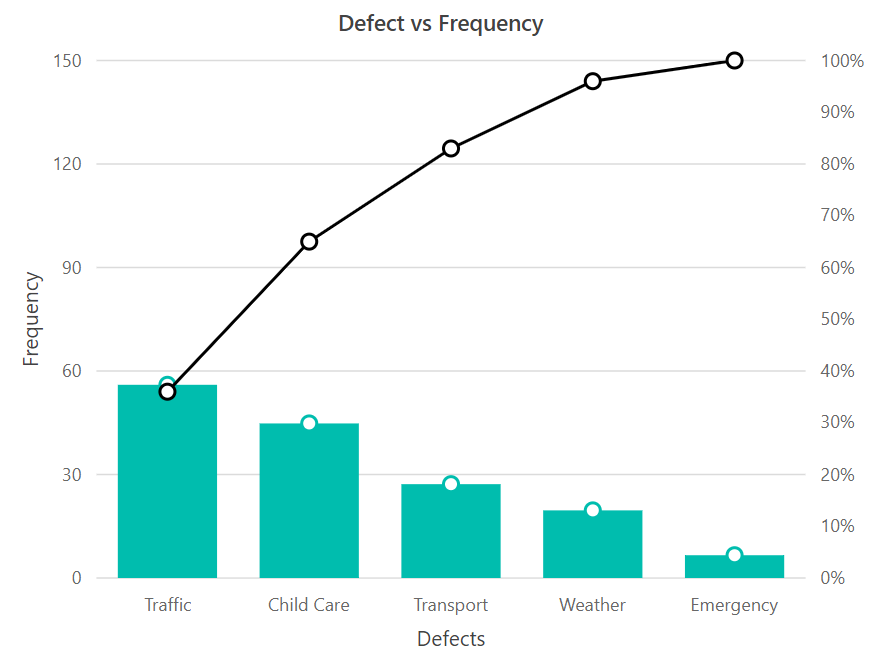

# Pareto in Blazor Charts Component

## Pareto

[Pareto Chart](https://help.syncfusion.com/cr/blazor/Syncfusion.Blazor.Charts.ChartSeriesType.html#Syncfusion_Blazor_Charts_ChartSeriesType_Pareto) is used to find the cumulative values of data in different categories. It is a combination of [Column](https://help.syncfusion.com/cr/blazor/Syncfusion.Blazor.Charts.ChartSeriesType.html#Syncfusion_Blazor_Charts_ChartSeriesType_Column) and [Line](https://help.syncfusion.com/cr/blazor/Syncfusion.Blazor.Charts.ChartSeriesType.html#Syncfusion_Blazor_Charts_ChartSeriesType_Pareto) series. The initial values are represented by column chart and the cumulative values are represented by line chart. To render a pareto chart, set series [Type](https://help.syncfusion.com/cr/blazor/Syncfusion.Blazor.Charts.ChartSeries.html#Syncfusion_Blazor_Charts_ChartSeries_Type) to [Pareto](https://help.syncfusion.com/cr/blazor/Syncfusion.Blazor.Charts.ChartSeriesType.html#Syncfusion_Blazor_Charts_ChartSeriesType_Pareto).

```cshtml

@using Syncfusion.Blazor.Charts

<SfChart Title="Defect vs Frequency">

    <ChartPrimaryXAxis ValueType="Syncfusion.Blazor.Charts.ValueType.Category" Interval="1" Title="Defects">
        <ChartAxisLineStyle Width="0"></ChartAxisLineStyle>
        <ChartAxisMajorTickLines Width="0"></ChartAxisMajorTickLines>
        <ChartAxisMajorGridLines Width="0"></ChartAxisMajorGridLines>
        <ChartAxisMinorTickLines Width="0"></ChartAxisMinorTickLines>
        <ChartAxisMinorGridLines Width="0"></ChartAxisMinorGridLines>
    </ChartPrimaryXAxis>

    <ChartPrimaryYAxis Title="Frequency" Minimum="0" Maximum="150" Interval="30">
        <ChartAxisLineStyle Width="0"></ChartAxisLineStyle>
        <ChartAxisMajorTickLines Width="0"></ChartAxisMajorTickLines>
        <ChartAxisMajorGridLines Width="1"></ChartAxisMajorGridLines>
        <ChartAxisMinorTickLines Width="0"></ChartAxisMinorTickLines>
        <ChartAxisMinorGridLines Width="1"></ChartAxisMinorGridLines>
    </ChartPrimaryYAxis>

    <ChartSeriesCollection>
        <ChartSeries DataSource="@Data" XName="X" YName="Y" Name="Defect" Width="2" Type="ChartSeriesType.Pareto">
            <ChartMarker Visible="true" Height="10" Width="10">
            </ChartMarker>
        </ChartSeries>
    </ChartSeriesCollection>

    <ChartLegendSettings Visible="false"></ChartLegendSettings>
</SfChart>

@code{
    public class ChartData
    {
        public string X { get; set; }
        public double Y { get; set; }
    }

    public List<ChartData> Data = new List<ChartData>
	{
        new ChartData { X= "Traffic", Y= 56 },
        new ChartData { X= "Child Care", Y= 44.8 },
        new ChartData { X= "Transport", Y= 27.2 },
        new ChartData { X= "Weather", Y= 19.6 },
        new ChartData { X= "Emergency", Y= 6.6 }
    };
}

``` 



> Refer to our [Blazor Charts](https://www.syncfusion.com/blazor-components/blazor-charts) feature tour page for its groundbreaking feature representations and also explore our [Blazor Chart Example](https://blazor.syncfusion.com/demos/chart/line?theme=bootstrap4) to know various chart types and how to represent time-dependent data, showing trends at equal intervals.

## See Also

* [Data Label](../data-labels)
* [Tooltip](../tool-tip)