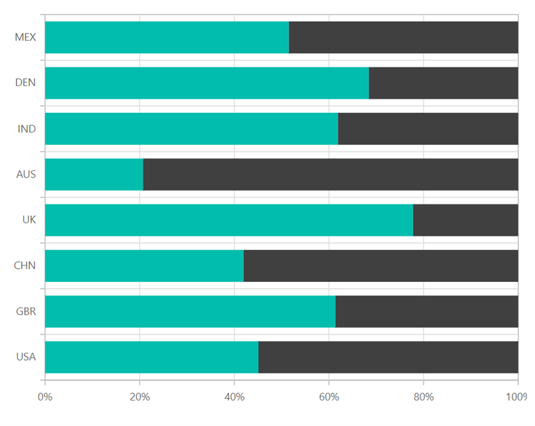
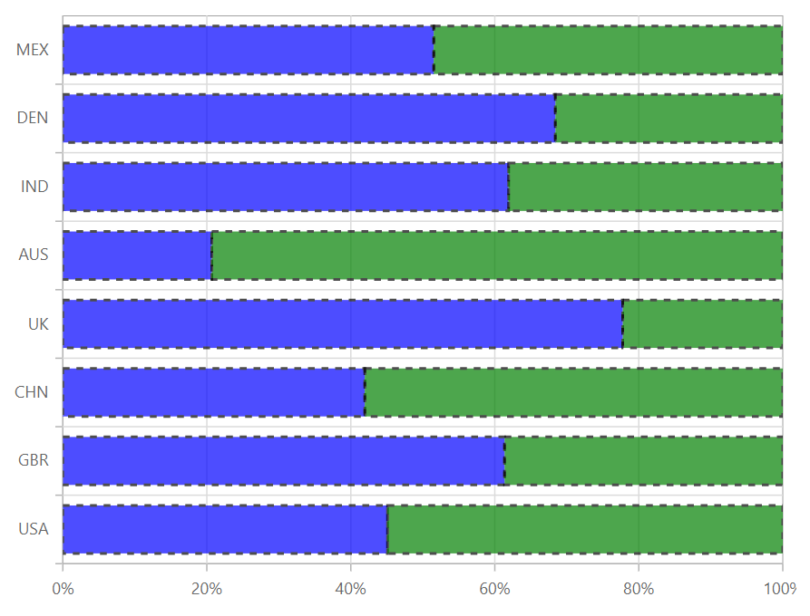

# 100% Stacked Bar in Blazor Charts Component

## 100% Stacked Bar

[100% Stacked Bar Chart](https://www.syncfusion.com/blazor-components/blazor-charts/chart-types/100-stacked-bar-chart) displays multiple series of data as stacked bars, ensuring that the cumulative proportion of each stacked element always totals 100%. Hence, the y-axis will always be rendered with the range 0–100%. To render a [100% Stacked Bar](https://www.syncfusion.com/blazor-components/blazor-charts/chart-types/100-stacked-bar-chart) series, set the series [Type](https://help.syncfusion.com/cr/blazor/Syncfusion.Blazor.Charts.ChartSeries.html#Syncfusion_Blazor_Charts_ChartSeries_Type) as [StackingBar100](https://help.syncfusion.com/cr/blazor/Syncfusion.Blazor.Charts.ChartSeriesType.html#Syncfusion_Blazor_Charts_ChartSeriesType_StackingBar100).

```cshtml

@using Syncfusion.Blazor.Charts

<SfChart>
    <ChartPrimaryXAxis ValueType="Syncfusion.Blazor.Charts.ValueType.Category"></ChartPrimaryXAxis>
	
    <ChartSeriesCollection>
        <ChartSeries DataSource="@MedalDetails" XName="X" YName="YValue" Type="ChartSeriesType.StackingBar100">
        </ChartSeries>
        <ChartSeries DataSource="@MedalDetails" XName="X" YName="YValue1" Type="ChartSeriesType.StackingBar100">
        </ChartSeries>
    </ChartSeriesCollection>
</SfChart>

@code{
    public class ChartData
    {
        public string X { get; set; }
        public double YValue { get; set; }
        public double YValue1 { get; set; }
    }
	
    public List<ChartData> MedalDetails = new List<ChartData>
	{
        new ChartData { X= "USA", YValue= 46, YValue1=56 },
        new ChartData { X= "GBR", YValue= 27, YValue1=17 },
        new ChartData { X= "CHN", YValue= 26, YValue1=36 },
        new ChartData { X= "UK", YValue= 56,  YValue1=16 },
        new ChartData { X= "AUS", YValue= 12, YValue1=46 },
        new ChartData { X= "IND", YValue= 26, YValue1=16 },
        new ChartData { X= "DEN", YValue= 26, YValue1=12 },
        new ChartData { X= "MEX", YValue= 34, YValue1=32},
    };
}

``` 



> Refer to our [Blazor 100% Stacked Bar Chart](https://www.syncfusion.com/blazor-components/blazor-charts/chart-types/100-stacked-bar-chart) feature tour page to know about its other groundbreaking feature representations. You can also explore our [Blazor 100% Stacked Bar Chart Example](https://blazor.syncfusion.com/demos/chart/percent-stacked-bar?theme=bootstrap4) to know how to render and configure the 100% Stacked Bar type chart.

## Series Customization

The following properties can be used to customize the [100% Stacked Bar](https://help.syncfusion.com/cr/blazor/Syncfusion.Blazor.Charts.ChartSeriesType.html#Syncfusion_Blazor_Charts_ChartSeriesType_StackingBar100) series.

* [Fill](https://help.syncfusion.com/cr/blazor/Syncfusion.Blazor.Charts.ChartSeries.html#Syncfusion_Blazor_Charts_ChartSeries_Fill) – Specifies the color of the series.
* [Opacity](https://help.syncfusion.com/cr/blazor/Syncfusion.Blazor.Charts.ChartSeries.html#Syncfusion_Blazor_Charts_ChartSeries_Opacity) – Specifies the opacity of [Fill](https://help.syncfusion.com/cr/blazor/Syncfusion.Blazor.Charts.ChartSeries.html#Syncfusion_Blazor_Charts_ChartSeries_Fill).
* [DashArray](https://help.syncfusion.com/cr/blazor/Syncfusion.Blazor.Charts.ChartSeries.html#Syncfusion_Blazor_Charts_ChartSeries_DashArray) – Specifies the dashes of series border.
* [ChartSeriesBorder](https://help.syncfusion.com/cr/blazor/Syncfusion.Blazor.Charts.ChartSeriesBorder.html) – Specifies the [Color](https://help.syncfusion.com/cr/blazor/Syncfusion.Blazor.Charts.ChartCommonBorder.html#Syncfusion_Blazor_Charts_ChartCommonBorder_Color) and [Width](https://help.syncfusion.com/cr/blazor/Syncfusion.Blazor.Charts.ChartCommonBorder.html#Syncfusion_Blazor_Charts_ChartCommonBorder_Width) of series border.

```cshtml

@using Syncfusion.Blazor.Charts

<SfChart>
    <ChartPrimaryXAxis ValueType="Syncfusion.Blazor.Charts.ValueType.Category"></ChartPrimaryXAxis>
	
    <ChartSeriesCollection>
        <ChartSeries DataSource="@MedalDetails" XName="X" YName="YValue" DashArray="5,5" Fill="blue" Opacity="0.7" Type="ChartSeriesType.StackingBar100">
            <ChartSeriesBorder Width="2" Color="black"></ChartSeriesBorder>
        </ChartSeries>
        <ChartSeries DataSource="@MedalDetails" XName="X" YName="YValue1" DashArray="5,5" Fill="green" Opacity="0.7" Type="ChartSeriesType.StackingBar100">
            <ChartSeriesBorder Width="2" Color="black"></ChartSeriesBorder>
        </ChartSeries>
    </ChartSeriesCollection>
</SfChart>

@code{
    public class ChartData
    {
        public string X { get; set; }
        public double YValue { get; set; }
        public double YValue1 { get; set; }
    }
	
    public List<ChartData> MedalDetails = new List<ChartData>
	{
        new ChartData { X= "USA", YValue= 46, YValue1=56 },
        new ChartData { X= "GBR", YValue= 27, YValue1=17 },
        new ChartData { X= "CHN", YValue= 26, YValue1=36 },
        new ChartData { X= "UK", YValue= 56,  YValue1=16 },
        new ChartData { X= "AUS", YValue= 12, YValue1=46 },
        new ChartData { X= "IND", YValue= 26, YValue1=16 },
        new ChartData { X= "DEN", YValue= 26, YValue1=12 },
        new ChartData { X= "MEX", YValue= 34, YValue1=32},
    };
}

``` 



> Refer to our [Blazor Charts](https://www.syncfusion.com/blazor-components/blazor-charts) feature tour page for its groundbreaking feature representations and also explore our [Blazor Chart Example](https://blazor.syncfusion.com/demos/chart/line?theme=bootstrap4) to know various chart types and how to represent time-dependent data, showing trends at equal intervals.

## See Also

* [Data Label](../data-labels)
* [Tooltip](../tool-tip)