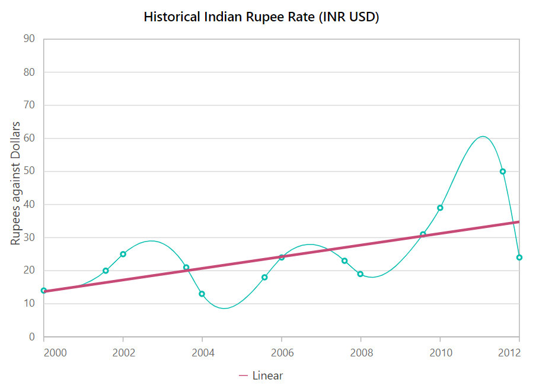
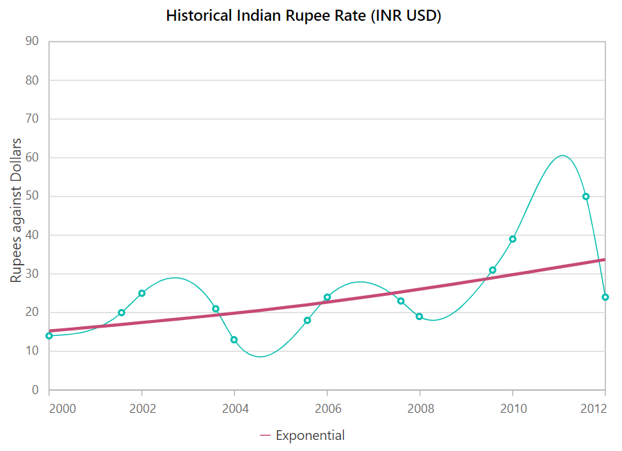
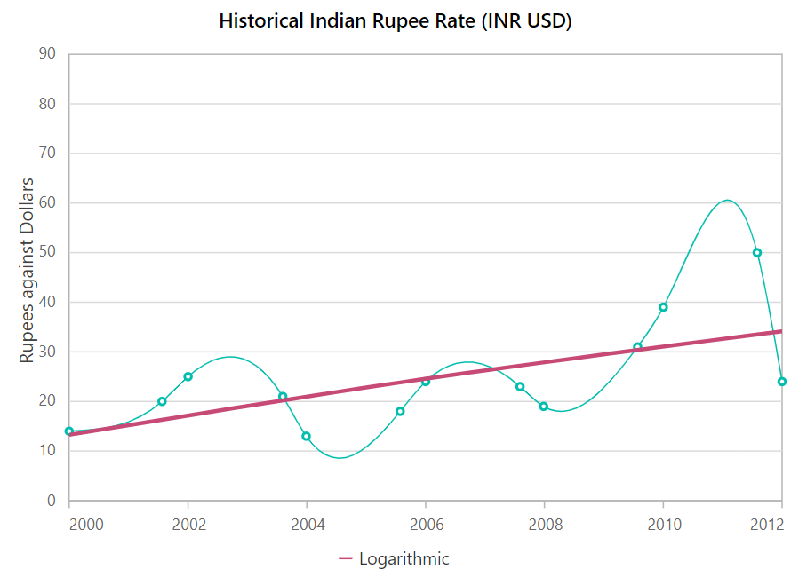
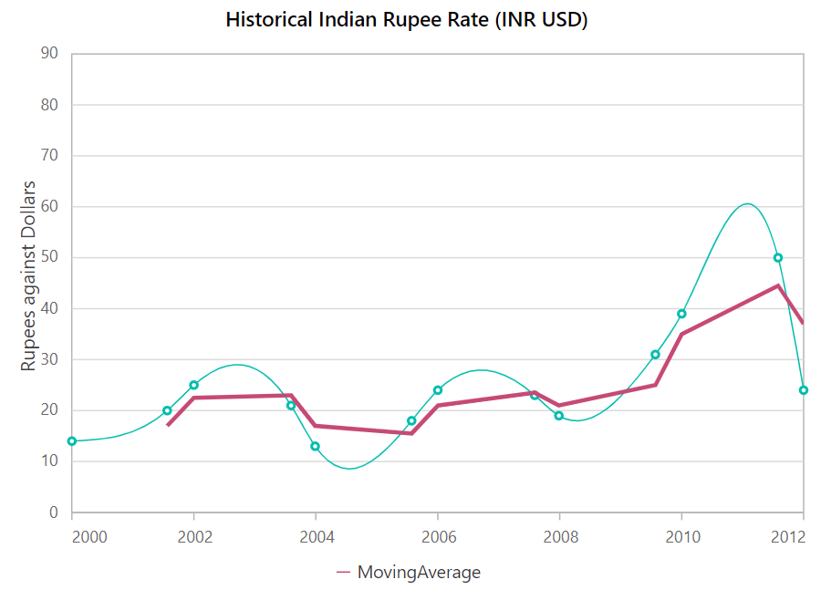

<!-- markdownlint-disable MD036 -->

# Trendlines in Blazor Charts Component

Trendlines are used to show the price's direction and pace. Except for bar series, trendlines can be generated for Cartesian series like Line, Column, Scatter, Area, Candle, Hilo, and so on. In addition, a series can have multiple trendlines. There are six different types of trendlines that can be used on the chart. They are as follows:

## Linear

A linear trendline is a best-fit straight line used with simpler data sets. To render a linear trendline, set the [Type](https://help.syncfusion.com/cr/blazor/Syncfusion.Blazor.Charts.ChartTrendline.html#Syncfusion_Blazor_Charts_ChartTrendline_Type) property to [Linear](https://help.syncfusion.com/cr/blazor/Syncfusion.Blazor.Charts.TrendlineTypes.html#Syncfusion_Blazor_Charts_TrendlineTypes_Linear).

```cshtml

@using Syncfusion.Blazor.Charts

<SfChart Title="Historical Indian Rupee Rate (INR USD)">  
    <ChartPrimaryXAxis LabelFormat="yyyy" ValueType="Syncfusion.Blazor.Charts.ValueType.DateTime" EdgeLabelPlacement="EdgeLabelPlacement.Shift">
        <ChartAxisMajorGridLines Width="0"></ChartAxisMajorGridLines>
    </ChartPrimaryXAxis>

    <ChartPrimaryYAxis Title="Rupees against Dollars">
        <ChartAxisLineStyle Width="0"></ChartAxisLineStyle>
        <ChartAxisMajorTickLines Width="0"></ChartAxisMajorTickLines>
    </ChartPrimaryYAxis>

    <ChartSeriesCollection>
        <ChartSeries DataSource="@Data" XName="XValue" YName="YValue" Type="ChartSeriesType.Spline">
            <ChartMarker Visible="true">
            </ChartMarker>
            <ChartTrendlines>
                <ChartTrendline Type="TrendlineTypes.Linear" Width="3" Name="Linear" Fill="#C64A75">
                </ChartTrendline>
            </ChartTrendlines>
        </ChartSeries>
    </ChartSeriesCollection>
</SfChart>

@code{
    public class ChartData
    {
        public DateTime XValue { get; set; }
        public double YValue { get; set; }
    }

    public List<ChartData> Data = new List<ChartData>
	{
        new ChartData { XValue = new DateTime(2000, 2, 11), YValue = 14 },
        new ChartData { XValue = new DateTime(2001, 9, 4), YValue = 20 },
        new ChartData { XValue = new DateTime(2002, 2, 11), YValue = 25 },
        new ChartData { XValue = new DateTime(2003, 9, 16), YValue = 21 },
        new ChartData { XValue = new DateTime(2004, 2, 7), YValue = 13},
        new ChartData { XValue = new DateTime(2005, 9, 7), YValue = 18 },
        new ChartData { XValue = new DateTime(2006, 2, 11), YValue = 24 },
        new ChartData { XValue = new DateTime(2007, 9, 14), YValue = 23 },
        new ChartData { XValue = new DateTime(2008, 2, 6), YValue = 19 },
        new ChartData { XValue = new DateTime(2009, 9, 6), YValue = 31 },
        new ChartData { XValue = new DateTime(2010, 2, 11), YValue = 39},
        new ChartData { XValue = new DateTime(2011, 9, 11), YValue = 50 },
        new ChartData { XValue = new DateTime(2012, 2, 11), YValue = 24 },
    };
}

```



## Exponential

Exponential trendline is a curved line that is most useful when data values rise or fall at increasingly higher rates. If the data contains zero or negative values, an exponential trendline cannot be created. To render a exponential trendline, set the [Type](https://help.syncfusion.com/cr/blazor/Syncfusion.Blazor.Charts.ChartTrendline.html#Syncfusion_Blazor_Charts_ChartTrendline_Type) property to [Exponential](https://help.syncfusion.com/cr/blazor/Syncfusion.Blazor.Charts.TrendlineTypes.html#Syncfusion_Blazor_Charts_TrendlineTypes_Exponential).

```cshtml

@using Syncfusion.Blazor.Charts

<SfChart Title="Historical Indian Rupee Rate (INR USD)">
    <ChartPrimaryXAxis LabelFormat="yyyy" ValueType="Syncfusion.Blazor.Charts.ValueType.DateTime" EdgeLabelPlacement="EdgeLabelPlacement.Shift">
        <ChartAxisMajorGridLines Width="0"></ChartAxisMajorGridLines>
    </ChartPrimaryXAxis>

    <ChartPrimaryYAxis Title="Rupees against Dollars">
        <ChartAxisLineStyle Width="0"></ChartAxisLineStyle>
        <ChartAxisMajorTickLines Width="0"></ChartAxisMajorTickLines>
    </ChartPrimaryYAxis>

    <ChartSeriesCollection>
        <ChartSeries DataSource="@Data" XName="XValue" YName="YValue" Type="ChartSeriesType.Spline">
            <ChartMarker Visible="true">
            </ChartMarker>
            <ChartTrendlines>
                <ChartTrendline Type="TrendlineTypes.Exponential" Width="3" Name="Exponential" Fill="#C64A75">
                </ChartTrendline>
            </ChartTrendlines>
        </ChartSeries>
    </ChartSeriesCollection>
</SfChart>

@code{
    public class ChartData
    {
        public DateTime XValue { get; set; }
        public double YValue { get; set; }
    }

    public List<ChartData> Data = new List<ChartData>
	{
        new ChartData { XValue = new DateTime(2000, 2, 11), YValue = 14 },
        new ChartData { XValue = new DateTime(2001, 9, 4), YValue = 20 },
        new ChartData { XValue = new DateTime(2002, 2, 11), YValue = 25 },
        new ChartData { XValue = new DateTime(2003, 9, 16), YValue = 21 },
        new ChartData { XValue = new DateTime(2004, 2, 7), YValue = 13},
        new ChartData { XValue = new DateTime(2005, 9, 7), YValue = 18 },
        new ChartData { XValue = new DateTime(2006, 2, 11), YValue = 24 },
        new ChartData { XValue = new DateTime(2007, 9, 14), YValue = 23 },
        new ChartData { XValue = new DateTime(2008, 2, 6), YValue = 19 },
        new ChartData { XValue = new DateTime(2009, 9, 6), YValue = 31 },
        new ChartData { XValue = new DateTime(2010, 2, 11), YValue = 39},
        new ChartData { XValue = new DateTime(2011, 9, 11), YValue = 50 },
        new ChartData { XValue = new DateTime(2012, 2, 11), YValue = 24 },
    };
}

```



## Logarithmic

A logarithmic trendline is a best-fit curved line that is most useful when the rate of change in the data increases or decreases quickly and then levels out. Negative and positive numbers can be used in a logarithmic trendline. To render a logarithmic trendline, set the [Type](https://help.syncfusion.com/cr/blazor/Syncfusion.Blazor.Charts.ChartTrendline.html#Syncfusion_Blazor_Charts_ChartTrendline_Type) property to [Logarithmic](https://help.syncfusion.com/cr/blazor/Syncfusion.Blazor.Charts.TrendlineTypes.html#Syncfusion_Blazor_Charts_TrendlineTypes_Logarithmic).

```cshtml

@using Syncfusion.Blazor.Charts

<SfChart Title="Historical Indian Rupee Rate (INR USD)">
    <ChartPrimaryXAxis LabelFormat="yyyy" ValueType="Syncfusion.Blazor.Charts.ValueType.DateTime" EdgeLabelPlacement="EdgeLabelPlacement.Shift">
        <ChartAxisMajorGridLines Width="0"></ChartAxisMajorGridLines>
    </ChartPrimaryXAxis>

    <ChartPrimaryYAxis Title="Rupees against Dollars">
        <ChartAxisLineStyle Width="0"></ChartAxisLineStyle>
        <ChartAxisMajorTickLines Width="0"></ChartAxisMajorTickLines>
    </ChartPrimaryYAxis>

    <ChartSeriesCollection>
        <ChartSeries DataSource="@Data" XName="XValue" YName="YValue" Type="ChartSeriesType.Spline">
            <ChartMarker Visible="true">
            </ChartMarker>
            <ChartTrendlines>
                <ChartTrendline Type="TrendlineTypes.Logarithmic" Width="3" Name="Logarithmic" Fill="#C64A75">
                </ChartTrendline>
            </ChartTrendlines>
        </ChartSeries>
    </ChartSeriesCollection>
</SfChart>

@code{
    public class ChartData
    {
        public DateTime XValue { get; set; }
        public double YValue { get; set; }
    }

    public List<ChartData> Data = new List<ChartData>
	{
        new ChartData { XValue = new DateTime(2000, 2, 11), YValue = 14 },
        new ChartData { XValue = new DateTime(2001, 9, 4), YValue = 20 },
        new ChartData { XValue = new DateTime(2002, 2, 11), YValue = 25 },
        new ChartData { XValue = new DateTime(2003, 9, 16), YValue = 21 },
        new ChartData { XValue = new DateTime(2004, 2, 7), YValue = 13},
        new ChartData { XValue = new DateTime(2005, 9, 7), YValue = 18 },
        new ChartData { XValue = new DateTime(2006, 2, 11), YValue = 24 },
        new ChartData { XValue = new DateTime(2007, 9, 14), YValue = 23 },
        new ChartData { XValue = new DateTime(2008, 2, 6), YValue = 19 },
        new ChartData { XValue = new DateTime(2009, 9, 6), YValue = 31 },
        new ChartData { XValue = new DateTime(2010, 2, 11), YValue = 39},
        new ChartData { XValue = new DateTime(2011, 9, 11), YValue = 50 },
        new ChartData { XValue = new DateTime(2012, 2, 11), YValue = 24 },
    };
}

```



## Polynomial

A polynomial trendline is a curved line that is used when data fluctuates. To render a polynomial trendline, set the [Type](https://help.syncfusion.com/cr/blazor/Syncfusion.Blazor.Charts.ChartTrendline.html#Syncfusion_Blazor_Charts_ChartTrendline_Type) property to [Polynomial](https://help.syncfusion.com/cr/blazor/Syncfusion.Blazor.Charts.TrendlineTypes.html#Syncfusion_Blazor_Charts_TrendlineTypes_Polynomial).

```cshtml

@using Syncfusion.Blazor.Charts

<SfChart Title="Historical Indian Rupee Rate (INR USD)">
    <ChartPrimaryXAxis LabelFormat="yyyy" ValueType="Syncfusion.Blazor.Charts.ValueType.DateTime" EdgeLabelPlacement="EdgeLabelPlacement.Shift">
        <ChartAxisMajorGridLines Width="0"></ChartAxisMajorGridLines>
    </ChartPrimaryXAxis>

    <ChartPrimaryYAxis Title="Rupees against Dollars">
        <ChartAxisLineStyle Width="0"></ChartAxisLineStyle>
        <ChartAxisMajorTickLines Width="0"></ChartAxisMajorTickLines>
    </ChartPrimaryYAxis>

    <ChartSeriesCollection>
        <ChartSeries DataSource="@Data" XName="XValue" YName="YValue" Type="ChartSeriesType.Spline">
            <ChartMarker Visible="true">
            </ChartMarker>
            <ChartTrendlines>
                <ChartTrendline Type="TrendlineTypes.Polynomial" Width="3" Name="Polynomial" Fill="#C64A75">
                </ChartTrendline>
            </ChartTrendlines>
        </ChartSeries>
    </ChartSeriesCollection>
</SfChart>

@code{
    public class ChartData
    {
        public DateTime XValue { get; set; }
        public double YValue { get; set; }
    }

    public List<ChartData> Data = new List<ChartData>
	{
        new ChartData { XValue = new DateTime(2000, 2, 11), YValue = 14 },
        new ChartData { XValue = new DateTime(2001, 9, 4), YValue = 20 },
        new ChartData { XValue = new DateTime(2002, 2, 11), YValue = 25 },
        new ChartData { XValue = new DateTime(2003, 9, 16), YValue = 21 },
        new ChartData { XValue = new DateTime(2004, 2, 7), YValue = 13},
        new ChartData { XValue = new DateTime(2005, 9, 7), YValue = 18 },
        new ChartData { XValue = new DateTime(2006, 2, 11), YValue = 24 },
        new ChartData { XValue = new DateTime(2007, 9, 14), YValue = 23 },
        new ChartData { XValue = new DateTime(2008, 2, 6), YValue = 19 },
        new ChartData { XValue = new DateTime(2009, 9, 6), YValue = 31 },
        new ChartData { XValue = new DateTime(2010, 2, 11), YValue = 39},
        new ChartData { XValue = new DateTime(2011, 9, 11), YValue = 50 },
        new ChartData { XValue = new DateTime(2012, 2, 11), YValue = 24 },
    };
}

```


## Power

A power trendline is a curved line that is best used with data sets that compare measurements that increase at a specific rate. To render a power trendline, set the [Type](https://help.syncfusion.com/cr/blazor/Syncfusion.Blazor.Charts.ChartTrendline.html#Syncfusion_Blazor_Charts_ChartTrendline_Type) property to [Power](https://help.syncfusion.com/cr/blazor/Syncfusion.Blazor.Charts.TrendlineTypes.html#Syncfusion_Blazor_Charts_TrendlineTypes_Power).

```cshtml

@using Syncfusion.Blazor.Charts

<SfChart Title="Historical Indian Rupee Rate (INR USD)">
    <ChartPrimaryXAxis LabelFormat="yyyy" ValueType="Syncfusion.Blazor.Charts.ValueType.DateTime" EdgeLabelPlacement="EdgeLabelPlacement.Shift">
        <ChartAxisMajorGridLines Width="0"></ChartAxisMajorGridLines>
    </ChartPrimaryXAxis>

    <ChartPrimaryYAxis Title="Rupees against Dollars">
        <ChartAxisLineStyle Width="0"></ChartAxisLineStyle>
        <ChartAxisMajorTickLines Width="0"></ChartAxisMajorTickLines>
    </ChartPrimaryYAxis>

    <ChartSeriesCollection>
        <ChartSeries DataSource="@Data" XName="XValue" YName="YValue" Type="ChartSeriesType.Spline">
            <ChartMarker Visible="true">
            </ChartMarker>
            <ChartTrendlines>
                <ChartTrendline Type="TrendlineTypes.Power" Width="3" Name="Power" Fill="#C64A75">
                </ChartTrendline>
            </ChartTrendlines>
        </ChartSeries>
    </ChartSeriesCollection>
</SfChart>

@code{
    public class ChartData
    {
        public DateTime XValue { get; set; }
        public double YValue { get; set; }
    }

    public List<ChartData> Data = new List<ChartData>
	{
        new ChartData { XValue = new DateTime(2000, 2, 11), YValue = 14 },
        new ChartData { XValue = new DateTime(2001, 9, 4), YValue = 20 },
        new ChartData { XValue = new DateTime(2002, 2, 11), YValue = 25 },
        new ChartData { XValue = new DateTime(2003, 9, 16), YValue = 21 },
        new ChartData { XValue = new DateTime(2004, 2, 7), YValue = 13},
        new ChartData { XValue = new DateTime(2005, 9, 7), YValue = 18 },
        new ChartData { XValue = new DateTime(2006, 2, 11), YValue = 24 },
        new ChartData { XValue = new DateTime(2007, 9, 14), YValue = 23 },
        new ChartData { XValue = new DateTime(2008, 2, 6), YValue = 19 },
        new ChartData { XValue = new DateTime(2009, 9, 6), YValue = 31 },
        new ChartData { XValue = new DateTime(2010, 2, 11), YValue = 39},
        new ChartData { XValue = new DateTime(2011, 9, 11), YValue = 50 },
        new ChartData { XValue = new DateTime(2012, 2, 11), YValue = 24 },
    };
}

```


## Moving Average

A moving average trendline smoothen out fluctuations in data to show a pattern or trend more clearly. To render a moving average trendline, set the [Type](https://help.syncfusion.com/cr/blazor/Syncfusion.Blazor.Charts.ChartTrendline.html#Syncfusion_Blazor_Charts_ChartTrendline_Type) property to [MovingAverage](https://help.syncfusion.com/cr/blazor/Syncfusion.Blazor.Charts.TrendlineTypes.html#Syncfusion_Blazor_Charts_TrendlineTypes_MovingAverage). The [Period](https://help.syncfusion.com/cr/blazor/Syncfusion.Blazor.Charts.ChartTrendline.html#Syncfusion_Blazor_Charts_ChartTrendline_Period) property specifies how long the moving average should be calculated over.

```cshtml

@using Syncfusion.Blazor.Charts

<SfChart Title="Historical Indian Rupee Rate (INR USD)">
    <ChartPrimaryXAxis LabelFormat="yyyy" ValueType="Syncfusion.Blazor.Charts.ValueType.DateTime" EdgeLabelPlacement="EdgeLabelPlacement.Shift">
        <ChartAxisMajorGridLines Width="0"></ChartAxisMajorGridLines>
    </ChartPrimaryXAxis>

    <ChartPrimaryYAxis Title="Rupees against Dollars">
        <ChartAxisLineStyle Width="0"></ChartAxisLineStyle>
        <ChartAxisMajorTickLines Width="0"></ChartAxisMajorTickLines>
    </ChartPrimaryYAxis>

    <ChartSeriesCollection>
        <ChartSeries DataSource="@Data" XName="XValue" YName="YValue" Type="ChartSeriesType.Spline">
            <ChartMarker Visible="true">
            </ChartMarker>
            <ChartTrendlines>
                <ChartTrendline Type="TrendlineTypes.MovingAverage" Width="3" Name="MovingAverage" Fill="#C64A75">
                </ChartTrendline>
            </ChartTrendlines>
        </ChartSeries>
    </ChartSeriesCollection>
</SfChart>

@code{
    public class ChartData
    {
        public DateTime XValue { get; set; }
        public double YValue { get; set; }
    }

    public List<ChartData> Data = new List<ChartData>
	{
        new ChartData { XValue = new DateTime(2000, 2, 11), YValue = 14 },
        new ChartData { XValue = new DateTime(2001, 9, 4), YValue = 20 },
        new ChartData { XValue = new DateTime(2002, 2, 11), YValue = 25 },
        new ChartData { XValue = new DateTime(2003, 9, 16), YValue = 21 },
        new ChartData { XValue = new DateTime(2004, 2, 7), YValue = 13},
        new ChartData { XValue = new DateTime(2005, 9, 7), YValue = 18 },
        new ChartData { XValue = new DateTime(2006, 2, 11), YValue = 24 },
        new ChartData { XValue = new DateTime(2007, 9, 14), YValue = 23 },
        new ChartData { XValue = new DateTime(2008, 2, 6), YValue = 19 },
        new ChartData { XValue = new DateTime(2009, 9, 6), YValue = 31 },
        new ChartData { XValue = new DateTime(2010, 2, 11), YValue = 39},
        new ChartData { XValue = new DateTime(2011, 9, 11), YValue = 50 },
        new ChartData { XValue = new DateTime(2012, 2, 11), YValue = 24 },
    };
}

```



## Forecasting

Trendlines forecasting is the prediction of future/past situations. There are two types of forecasting available: forward forecasting and backward forecasting.

### Forward Forecasting

The value set to [ForwardForecast](https://help.syncfusion.com/cr/blazor/Syncfusion.Blazor.Charts.ChartTrendline.html#Syncfusion_Blazor_Charts_ChartTrendline_ForwardForecast) property is used to calculate the distance between the current trend and the future trend.

```cshtml

@using Syncfusion.Blazor.Charts

<SfChart Title="Historical Indian Rupee Rate (INR USD)">
    <ChartPrimaryXAxis LabelFormat="yyyy" ValueType="Syncfusion.Blazor.Charts.ValueType.DateTime" EdgeLabelPlacement="EdgeLabelPlacement.Shift">
        <ChartAxisMajorGridLines Width="0"></ChartAxisMajorGridLines>
    </ChartPrimaryXAxis>

    <ChartPrimaryYAxis Title="Rupees against Dollars">
        <ChartAxisLineStyle Width="0"></ChartAxisLineStyle>
        <ChartAxisMajorTickLines Width="0"></ChartAxisMajorTickLines>
    </ChartPrimaryYAxis>

    <ChartSeriesCollection>
        <ChartSeries DataSource="@Data" XName="XValue" YName="YValue" Type="ChartSeriesType.Spline">
            <ChartMarker Visible="true">
            </ChartMarker>
            <ChartTrendlines>
                <ChartTrendline Type="TrendlineTypes.Linear" Width="3" Name="Linear" Fill="#C64A75" ForwardForecast="5">
                </ChartTrendline>
            </ChartTrendlines>
        </ChartSeries>
    </ChartSeriesCollection>
</SfChart>

@code{
    public class ChartData
    {
        public DateTime XValue { get; set; }
        public double YValue { get; set; }
    }

    public List<ChartData> Data = new List<ChartData>
	{
        new ChartData { XValue = new DateTime(2000, 2, 11), YValue = 14 },
        new ChartData { XValue = new DateTime(2001, 9, 4), YValue = 20 },
        new ChartData { XValue = new DateTime(2002, 2, 11), YValue = 25 },
        new ChartData { XValue = new DateTime(2003, 9, 16), YValue = 21 },
        new ChartData { XValue = new DateTime(2004, 2, 7), YValue = 13},
        new ChartData { XValue = new DateTime(2005, 9, 7), YValue = 18 },
        new ChartData { XValue = new DateTime(2006, 2, 11), YValue = 24 },
        new ChartData { XValue = new DateTime(2007, 9, 14), YValue = 23 },
        new ChartData { XValue = new DateTime(2008, 2, 6), YValue = 19 },
        new ChartData { XValue = new DateTime(2009, 9, 6), YValue = 31 },
        new ChartData { XValue = new DateTime(2010, 2, 11), YValue = 39},
        new ChartData { XValue = new DateTime(2011, 9, 11), YValue = 50 },
        new ChartData { XValue = new DateTime(2012, 2, 11), YValue = 24 },
    };
}

```


### Backward Forecasting

The value set to [BackwardForecast](https://help.syncfusion.com/cr/blazor/Syncfusion.Blazor.Charts.ChartTrendline.html#Syncfusion_Blazor_Charts_ChartTrendline_BackwardForecast) property is used to determine historical trends.

```cshtml

@using Syncfusion.Blazor.Charts

<SfChart Title="Historical Indian Rupee Rate (INR USD)">
    <ChartPrimaryXAxis LabelFormat="yyyy" ValueType="Syncfusion.Blazor.Charts.ValueType.DateTime" EdgeLabelPlacement="EdgeLabelPlacement.Shift">
        <ChartAxisMajorGridLines Width="0"></ChartAxisMajorGridLines>
    </ChartPrimaryXAxis>

    <ChartPrimaryYAxis Title="Rupees against Dollars">
        <ChartAxisLineStyle Width="0"></ChartAxisLineStyle>
        <ChartAxisMajorTickLines Width="0"></ChartAxisMajorTickLines>
    </ChartPrimaryYAxis>

    <ChartSeriesCollection>
        <ChartSeries DataSource="@Data" XName="XValue" YName="YValue" Type="ChartSeriesType.Spline">
            <ChartMarker Visible="true">
            </ChartMarker>
            <ChartTrendlines>
                <ChartTrendline Type="TrendlineTypes.Linear" Width="3" Name="Linear" Fill="#C64A75" BackwardForecast="5">
                </ChartTrendline>
            </ChartTrendlines>
        </ChartSeries>
    </ChartSeriesCollection>
</SfChart>

@code{
    public class ChartData
    {
        public DateTime XValue { get; set; }
        public double YValue { get; set; }
    }

    public List<ChartData> Data = new List<ChartData>
	{
        new ChartData { XValue = new DateTime(2000, 2, 11), YValue = 14 },
        new ChartData { XValue = new DateTime(2001, 9, 4), YValue = 20 },
        new ChartData { XValue = new DateTime(2002, 2, 11), YValue = 25 },
        new ChartData { XValue = new DateTime(2003, 9, 16), YValue = 21 },
        new ChartData { XValue = new DateTime(2004, 2, 7), YValue = 13},
        new ChartData { XValue = new DateTime(2005, 9, 7), YValue = 18 },
        new ChartData { XValue = new DateTime(2006, 2, 11), YValue = 24 },
        new ChartData { XValue = new DateTime(2007, 9, 14), YValue = 23 },
        new ChartData { XValue = new DateTime(2008, 2, 6), YValue = 19 },
        new ChartData { XValue = new DateTime(2009, 9, 6), YValue = 31 },
        new ChartData { XValue = new DateTime(2010, 2, 11), YValue = 39},
        new ChartData { XValue = new DateTime(2011, 9, 11), YValue = 50 },
        new ChartData { XValue = new DateTime(2012, 2, 11), YValue = 24 },
    };
}

```


## Trendlines Customization

The [Fill](https://help.syncfusion.com/cr/blazor/Syncfusion.Blazor.Charts.ChartTrendline.html#Syncfusion_Blazor_Charts_ChartTrendline_Fill) and [Width](https://help.syncfusion.com/cr/blazor/Syncfusion.Blazor.Charts.ChartTrendline.html#Syncfusion_Blazor_Charts_ChartTrendline_Width) properties are used to customize the appearance of the trendline.

> Refer to our [Blazor Charts](https://www.syncfusion.com/blazor-components/blazor-charts) feature tour page for its groundbreaking feature representations and also explore our [Blazor Chart Example](https://blazor.syncfusion.com/demos/chart/line?theme=bootstrap4) to know various chart types and how to represent time-dependent data, showing trends at equal intervals.

## See Also

* [Data label](./data-labels)
* [Tooltip](./tool-tip)
* [Marker](./data-markers)