# Grouping in Blazor Pivot Table Component

Grouping is the most-useful feature in pivot table and the component automatically groups date, time, number and string. For example, the date type can be formatted and displayed based on year, quarter, month, and more. Likewise, the number type can be grouped range-wise, such as 1-5, 6-10, etc. These group fields will act as individual fields and allows users to drag them between different axes such as columns, rows, values, and filters and create pivot table at runtime.

> This feature is applicable only for relational data source.

The grouping can be enabled by setting the [AllowGrouping](https://help.syncfusion.com/cr/blazor/Syncfusion.Blazor.PivotView.PivotViewModel-1.html#Syncfusion_Blazor_PivotView_PivotViewModel_1_AllowGrouping) property in [SfPivotView](https://help.syncfusion.com/cr/blazor/Syncfusion.Blazor.PivotView.SfPivotView-1.html) class to **true**. To perform the grouping action via UI, right click on the pivot table's row or column header, select "**Group**", a dialog will appear in which fill the appropriate options to group the data. To ungroup,right click on the pivot table's row or column header, select "**Ungroup**".

The following are the three different types of grouping:

* Number Grouping
* Date Grouping
* Custom Grouping

> Similar to Excel, only one type of grouping can be applied for a field.

```cshtml
@using Syncfusion.Blazor.PivotView

<SfPivotView TValue="ProductDetails" ShowGroupingBar="true" AllowGrouping="true">
    <PivotViewDataSourceSettings DataSource="@data">
        <PivotViewColumns>
            <PivotViewColumn Name="Product_ID" Caption="Product ID"></PivotViewColumn>
        </PivotViewColumns>
        <PivotViewRows>
            <PivotViewRow Name="Date" Caption="Date"></PivotViewRow>
        </PivotViewRows>
        <PivotViewValues>
            <PivotViewValue Name="Sold" Caption="Unit Sold"></PivotViewValue>
            <PivotViewValue Name="Amount" Caption="Sold Amount"></PivotViewValue>
        </PivotViewValues>
        <PivotViewFormatSettings>
            <PivotViewFormatSetting Name="Date" Type="date" Format="dd/MM/yyyy-hh:mm a"></PivotViewFormatSetting>
            <PivotViewFormatSetting Name="Product_ID" Format="N" UseGrouping=true></PivotViewFormatSetting>
            <PivotViewFormatSetting Name="Amount" Format="C" UseGrouping=true></PivotViewFormatSetting>
        </PivotViewFormatSettings>
    </PivotViewDataSourceSettings>
</SfPivotView>

@code{
    public List<ProductDetails> data { get; set; }
    protected override void OnInitialized()
    {
        this.data = ProductDetails.GetProductData().ToList();
        //Bind the data source collection here. Refer "Assigning sample data to the pivot table" section in getting started for more details.
    }
}

```

## Number Grouping

Number grouping allows users to organize data, which is in number format into different ranges, such as 1-5, 6-10, etc. Number grouping can be configured via UI, by right-clicking on the number based header in the pivot table.

```cshtml
@using Syncfusion.Blazor.PivotView

<SfPivotView TValue="ProductDetails" ShowGroupingBar="true" AllowGrouping="true">
    <PivotViewDataSourceSettings DataSource="@data">
        <PivotViewColumns>
            <PivotViewColumn Name="Products" Caption="Products"></PivotViewColumn>
        </PivotViewColumns>
        <PivotViewRows>
            <PivotViewRow Name="Product_ID" Caption="Product ID"></PivotViewRow>
        </PivotViewRows>
        <PivotViewValues>
            <PivotViewValue Name="Sold" Caption="Unit Sold"></PivotViewValue>
            <PivotViewValue Name="Amount" Caption="Sold Amount"></PivotViewValue>
        </PivotViewValues>
        <PivotViewFormatSettings>
            <PivotViewFormatSetting Name="Product_ID" Format="N" UseGrouping=true></PivotViewFormatSetting>
            <PivotViewFormatSetting Name="Amount" Format="C" UseGrouping=true></PivotViewFormatSetting>
        </PivotViewFormatSettings>
    </PivotViewDataSourceSettings>
</SfPivotView>

@code{
    public List<ProductDetails> data { get; set; }
    protected override void OnInitialized()
    {
        this.data = ProductDetails.GetProductData().ToList();
        //Bind the data source collection here. Refer "Assigning sample data to the pivot table" section in getting started for more details.
    }
}

```

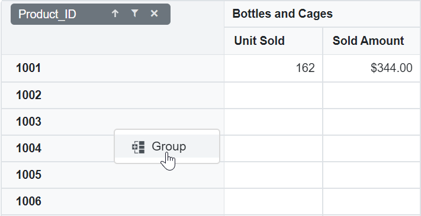

### Range selection

The "**Starting at**" and "**Ending at**" options are used to set the number range depending on which the headers will be grouped. For example, if the "Product_ID" field holds the number from "1001" to "1010" and the user chooses to group the number range by setting "**1004**" to "**Starting at**" and "**1008**" to "**Ending at**" options on their own. Then the specified number range will be used for number grouping and the rest will be grouped as "**Out of Range**".

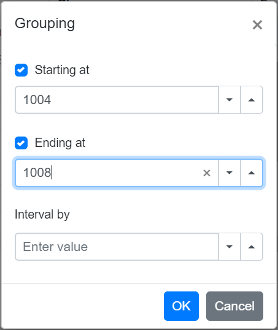

### Range interval

The "**Interval by**" option is used to separate the selected number data type field into range-wise such as 1-5, 6-10, etc.
For example, if the user wants to display the "Product_ID" data field with a group interval of "**2**" by setting the "**Interval by**" option on their own. The "Product_ID" field will then be grouped by the specified range of intervals, such as "**1004-1005**", "**1006-1007**",etc.

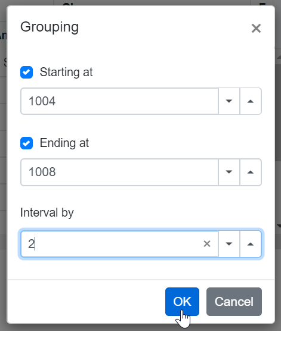
<br/>


Number grouping can also be configured using the [PivotViewGroupSettings](https://help.syncfusion.com/cr/blazor/Syncfusion.Blazor.PivotView.PivotViewGroupSetting.html) class through code-behind. The properties required are:

* [Name](https://help.syncfusion.com/cr/blazor/Syncfusion.Blazor.PivotView.PivotViewGroupSetting.html#Syncfusion_Blazor_PivotView_PivotViewGroupSetting_Name): Allows user to set the field name.
* [RangeInterval](https://help.syncfusion.com/cr/blazor/Syncfusion.Blazor.PivotView.PivotViewGroupSetting.html#Syncfusion_Blazor_PivotView_PivotViewGroupSetting_RangeInterval): Allows user to set the interval between two numbers.
* [StartingAt](https://help.syncfusion.com/cr/blazor/Syncfusion.Blazor.PivotView.PivotViewGroupSetting.html#Syncfusion_Blazor_PivotView_PivotViewGroupSetting_StartingAt): Allows user to set the starting number.
* [EndingAt](https://help.syncfusion.com/cr/blazor/Syncfusion.Blazor.PivotView.PivotViewGroupSetting.html#Syncfusion_Blazor_PivotView_PivotViewGroupSetting_EndingAt): Allows user to set the ending number.
* [Type](https://help.syncfusion.com/cr/blazor/Syncfusion.Blazor.PivotView.PivotViewGroupSetting.html#Syncfusion_Blazor_PivotView_PivotViewGroupSetting_Type): Allows user to set the group type. For number grouping, [GroupType.Number](https://help.syncfusion.com/cr/blazor/Syncfusion.Blazor.PivotView.GroupType.html) is set.

> If starting and ending numbers specified in [StartingAt](https://help.syncfusion.com/cr/blazor/Syncfusion.Blazor.PivotView.PivotViewGroupSetting.html#Syncfusion_Blazor_PivotView_PivotViewGroupSetting_StartingAt) and [EndingAt](https://help.syncfusion.com/cr/blazor/Syncfusion.Blazor.PivotView.PivotViewGroupSetting.html#Syncfusion_Blazor_PivotView_PivotViewGroupSetting_EndingAt) properties are in-between the number range, then rest of the numbers will be grouped and placed in “Out of Range” section introduced specific to this feature.

```cshtml
@using Syncfusion.Blazor.PivotView

<SfPivotView TValue="ProductDetails" ShowGroupingBar="true" AllowGrouping="true">
    <PivotViewDataSourceSettings DataSource="@data">
        <PivotViewColumns>
            <PivotViewColumn Name="Products" Caption="Products"></PivotViewColumn>
        </PivotViewColumns>
        <PivotViewRows>
            <PivotViewRow Name="Product_ID" Caption="Product ID"></PivotViewRow>
        </PivotViewRows>
        <PivotViewValues>
            <PivotViewValue Name="Sold" Caption="Unit Sold"></PivotViewValue>
            <PivotViewValue Name="Amount" Caption="Sold Amount"></PivotViewValue>
        </PivotViewValues>
        <PivotViewFormatSettings>
            <PivotViewFormatSetting Name="Product_ID" Format="N" UseGrouping=true></PivotViewFormatSetting>
            <PivotViewFormatSetting Name="Amount" Format="C" UseGrouping=true></PivotViewFormatSetting>
        </PivotViewFormatSettings>
        <PivotViewGroupSettings>
            <PivotViewGroupSetting Name="Product_ID" Type=GroupType.Number RangeInterval=2 StartingAt="1004"  EndingAt="1008"></PivotViewGroupSetting>
        </PivotViewGroupSettings>
    </PivotViewDataSourceSettings>
</SfPivotView>

@code{
    public List<ProductDetails> data { get; set; }
    protected override void OnInitialized()
    {
        this.data = ProductDetails.GetProductData().ToList();
        //Bind the data source collection here. Refer "Assigning sample data to the pivot table" section in getting started for more details.
    }
}

```


### Ungrouping the existing number groups

By right-clicking the appropriate header and selecting "**Ungroup**" from the context menu in the pivot table component, users can ungroup the applied number grouping.

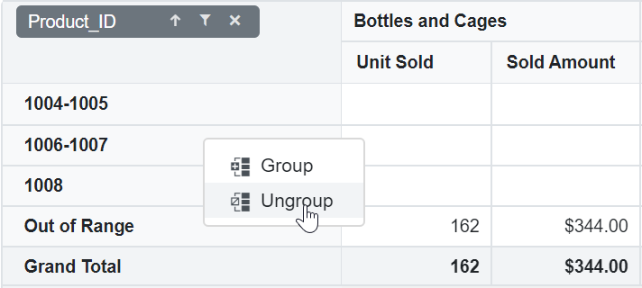

## Date Grouping

Date grouping allows users to organize data, which is in date format into different sections such as years, quarters, months, days, hours, minutes, and seconds. Date grouping can be configured via UI, by right-clicking on the date and time based header in the pivot table.

```cshtml
@using Syncfusion.Blazor.PivotView

<SfPivotView TValue="ProductDetails" ShowGroupingBar="true" AllowGrouping="true">
    <PivotViewDataSourceSettings DataSource="@data">
        <PivotViewColumns>
            <PivotViewColumn Name="Product_Categories" Caption="Product Categories"></PivotViewColumn>
        </PivotViewColumns>
        <PivotViewRows>
            <PivotViewRow Name="Date"></PivotViewRow>
        </PivotViewRows>
        <PivotViewValues>
            <PivotViewValue Name="Sold" Caption="Unit Sold"></PivotViewValue>
            <PivotViewValue Name="Amount" Caption="Sold Amount"></PivotViewValue>
        </PivotViewValues>
            <PivotViewFilters>
            <PivotViewFilter Name="Products"></PivotViewFilter>
            <PivotViewFilter Name="Product_ID" Caption="Product ID"></PivotViewFilter>
        </PivotViewFilters>
        <PivotViewFormatSettings>
            <PivotViewFormatSetting Name="Date" Type="date" Format="dd/MM/yyyy-hh:mm a"></PivotViewFormatSetting>
            <PivotViewFormatSetting Name="Amount" Format="C" UseGrouping=true></PivotViewFormatSetting>
        </PivotViewFormatSettings>
    </PivotViewDataSourceSettings>
</SfPivotView>

@code{
    public List<ProductDetails> data { get; set; }
    protected override void OnInitialized()
    {
        this.data = ProductDetails.GetProductData().ToList();
        //Bind the data source collection here. Refer "Assigning sample data to the pivot table" section in getting started for more details.
    }
}

```

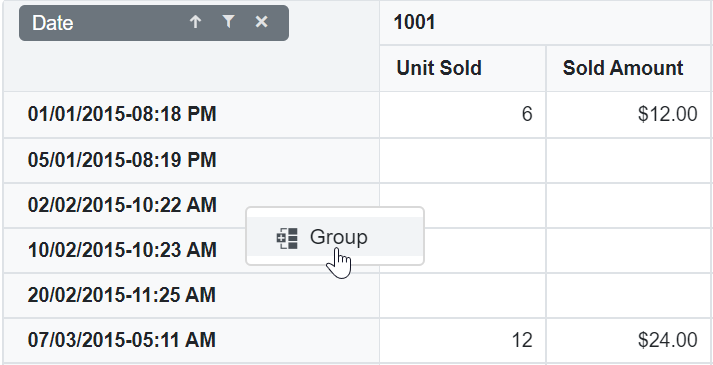

### Range selection

The "**Starting at**" and "**Ending at**" options are used to set the date range depending on which the headers will be grouped. For example, if the "Date" field holds the date from "01/01/2015" to "02/12/2018" and the user chooses to group the date range by setting "**01/07/2015**" to "**Starting at**" and "**31/07/2017**" to "**Ending at**" options on their own. Then the specified date range will be used for date grouping and the rest will be considered as "**Out of Range**".

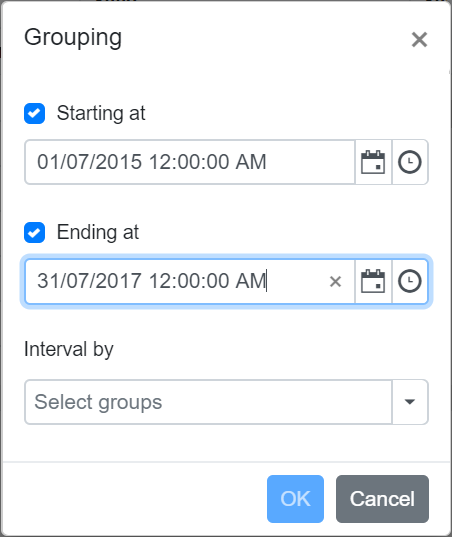

### Group interval

The "**Interval by**" option is used to separate the selected date fields into years, quarters, months, days, hours, minutes and seconds. For example, if the user wants to display the "Date" field with group intervals as "**Years**" and "**Months**" by selecting the "**Interval by**" option on their own. The "Date" field will then be separated by the specified group intervals and created as two new fields, namely "**Years (Date)**" which holds the date years and "**Months (Date)**" which holds the date months. Such fields can be used for report manipulations in the pivot table at runtime.

> When none of the **Interval by** options are chosen, the **OK** button in the dialog will be disabled, meaning that at least one interval option should be selected in order to apply the date grouping.

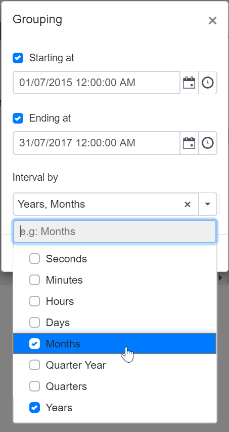
<br/>
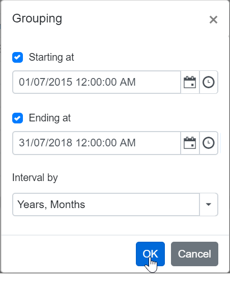
<br/>


Date grouping can also be configured using the [PivotViewGroupSettings](https://help.syncfusion.com/cr/blazor/Syncfusion.Blazor.PivotView.PivotViewGroupSetting.html) class through code-behind. The properties required are:

* [Name](https://help.syncfusion.com/cr/blazor/Syncfusion.Blazor.PivotView.PivotViewGroupSetting.html#Syncfusion_Blazor_PivotView_PivotViewGroupSetting_Name): Allows user to set the field name.
* [Type](https://help.syncfusion.com/cr/blazor/Syncfusion.Blazor.PivotView.PivotViewGroupSetting.html#Syncfusion_Blazor_PivotView_PivotViewGroupSetting_Type): Allows user to set the group type. For date grouping, [GroupType.Date](https://help.syncfusion.com/cr/blazor/Syncfusion.Blazor.PivotView.GroupType.html) is set.
* [StartingAt](https://help.syncfusion.com/cr/blazor/Syncfusion.Blazor.PivotView.PivotViewGroupSetting.html#Syncfusion_Blazor_PivotView_PivotViewGroupSetting_StartingAt): Allows user to set starting date.
* [EndingAt](https://help.syncfusion.com/cr/blazor/Syncfusion.Blazor.PivotView.PivotViewGroupSetting.html#Syncfusion_Blazor_PivotView_PivotViewGroupSetting_EndingAt): Allows user to set ending date.
* [GroupInterval](https://help.syncfusion.com/cr/blazor/Syncfusion.Blazor.PivotView.PivotViewGroupSetting.html#Syncfusion_Blazor_PivotView_PivotViewGroupSetting_GroupInterval): Allows user to set interval in year, quarter, month, day, hour, minute, or second pattern.

> From the date format "YYYY-DD-MM HH:MM:SS", if user wants to display only year and month, then the [GroupInterval](https://help.syncfusion.com/cr/blazor/Syncfusion.Blazor.PivotView.PivotViewGroupSetting.html#Syncfusion_Blazor_PivotView_PivotViewGroupSetting_GroupInterval) property should be set with [DateGroup.Years](https://help.syncfusion.com/cr/blazor/Syncfusion.Blazor.PivotView.DateGroup.html) and [DateGroup.Months](https://help.syncfusion.com/cr/blazor/Syncfusion.Blazor.PivotView.DateGroup.html) alone. Also, user can shuffle the order of year, quarter, month, day, hour, minute, or second based on their requirement and display the same in the pivot table.

```cshtml
@using Syncfusion.Blazor.PivotView

<SfPivotView TValue="ProductDetails" ShowGroupingBar="true" AllowGrouping="true">
    <PivotViewDataSourceSettings DataSource="@data">
        <PivotViewColumns>
            <PivotViewColumn Name="Product_Categories" Caption="Product Categories"></PivotViewColumn>
        </PivotViewColumns>
        <PivotViewRows>
            <PivotViewRow Name="Date"></PivotViewRow>
        </PivotViewRows>
        <PivotViewValues>
            <PivotViewValue Name="Sold" Caption="Unit Sold"></PivotViewValue>
            <PivotViewValue Name="Amount" Caption="Sold Amount"></PivotViewValue>
        </PivotViewValues>
            <PivotViewFilters>
            <PivotViewFilter Name="Products"></PivotViewFilter>
            <PivotViewFilter Name="Product_ID" Caption="Product ID"></PivotViewFilter>
        </PivotViewFilters>
        <PivotViewFormatSettings>
            <PivotViewFormatSetting Name="Date" Type="date" Format="dd/MM/yyyy-hh:mm a"></PivotViewFormatSetting>
            <PivotViewFormatSetting Name="Amount" Format="C" UseGrouping=true></PivotViewFormatSetting>
        </PivotViewFormatSettings>
        <PivotViewGroupSettings>
            <PivotViewGroupSetting Name="Date" Type=GroupType.Date GroupInterval="new List<DateGroup> { DateGroup.Years, DateGroup.Months }" StartingAt="2015-07-01" EndingAt="2017-07-31"></PivotViewGroupSetting>
        </PivotViewGroupSettings>
    </PivotViewDataSourceSettings>
</SfPivotView>

@code{
    public List<ProductDetails> data { get; set; }
    protected override void OnInitialized()
    {
        this.data = ProductDetails.GetProductData().ToList();
        //Bind the data source collection here. Refer "Assigning sample data to the pivot table" section in getting started for more details.
    }
}

```


### Ungrouping the existing date groups

By right-clicking the appropriate header and selecting "**Ungroup**" from the context menu in the pivot table component, users can ungroup the applied date grouping.

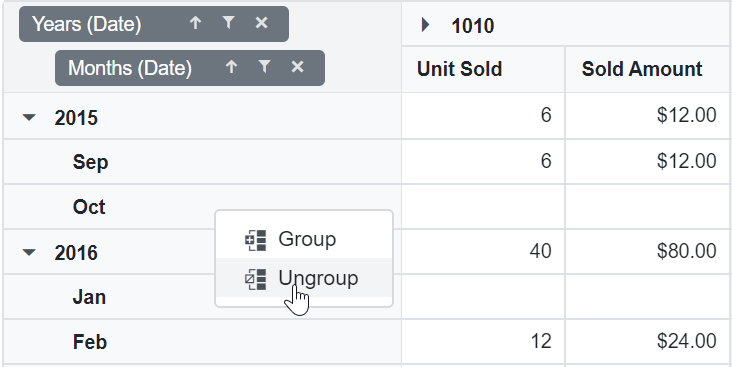

## Custom Grouping

Custom grouping can group any data type, such as date, time, number and string, into a custom field based on the user's needs. It can be configured via the UI by right-clicking on any header in the pivot table.

```cshtml
@using Syncfusion.Blazor.PivotView

<SfPivotView TValue="ProductDetails" ShowGroupingBar="true" AllowGrouping="true">
    <PivotViewDataSourceSettings DataSource="@data">
        <PivotViewColumns>
            <PivotViewColumn Name="Product_ID" Caption="Product ID"></PivotViewColumn>
        </PivotViewColumns>
        <PivotViewRows>
            <PivotViewRow Name="Products"></PivotViewRow>
        </PivotViewRows>
        <PivotViewValues>
            <PivotViewValue Name="Sold" Caption="Unit Sold"></PivotViewValue>
            <PivotViewValue Name="Amount" Caption="Sold Amount"></PivotViewValue>
        </PivotViewValues>
        <PivotViewFormatSettings>
            <PivotViewFormatSetting Name="Product_ID" Format="N" UseGrouping=true></PivotViewFormatSetting>
            <PivotViewFormatSetting Name="Amount" Format="C" UseGrouping=true></PivotViewFormatSetting>
        </PivotViewFormatSettings>
    </PivotViewDataSourceSettings>
</SfPivotView>

@code{
    public List<ProductDetails> data { get; set; }
    protected override void OnInitialized()
    {
        this.data = ProductDetails.GetProductData().ToList();
        //Bind the data source collection here. Refer "Assigning sample data to the pivot table" section in getting started for more details.
    }
}

```

In order to create custom grouping in the pivot table, a minimum of two headers belonging to a specific field should be chosen. To select more than one header, press and hold the CTRL key or hold the SHIFT key and click the appropriate row or column headers. Once selection is done, right-click and select "**Group**".

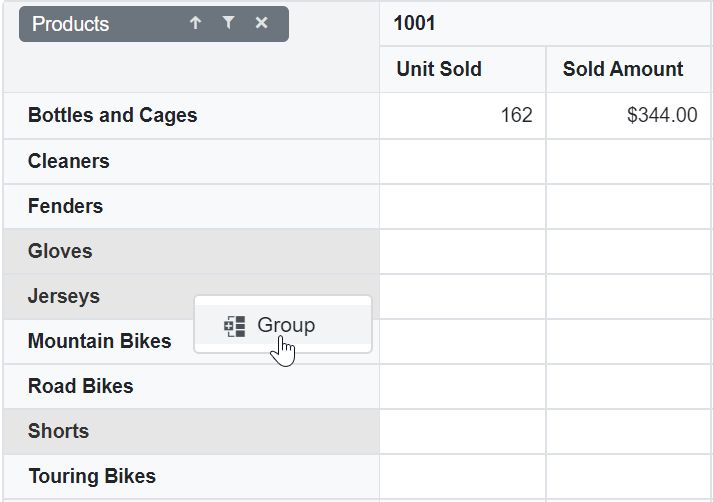

In the dialog, the "**Field caption**" is the alias name of the new custom field that will be used to shown up in the pivot table component.

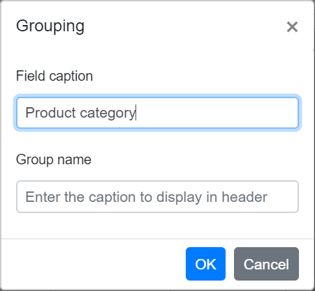

The "**Group Name**" option helps to set the name of the header to hold the other selected headers. For example, if the user wants to group headers such as "**Gloves**", "**Jerseys**" and "**Shorts**" in the "Products" field by setting the top level name as "**Clothings**" to "**Group Name**" on their own. The selected headers are then grouped under the name "**Clothings**" in the pivot table.

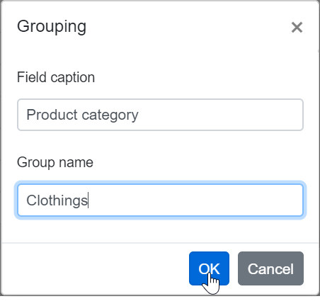
<br/>


User can also apply new custom grouping options to an existing custom field by right-clicking on the custom group header in the pivot table. For example, if the user wants to create a new custom group for the current custom group headers such as "**Bottles and Cages**", "**Cleaners**" and "**Fenders**" by setting the top level name as "**Accessories**" to "**Group Name**" on their own. The selected headers will then be grouped in the pivot table under the name "**Accessories**" with a new custom field called "**Product category 1**".

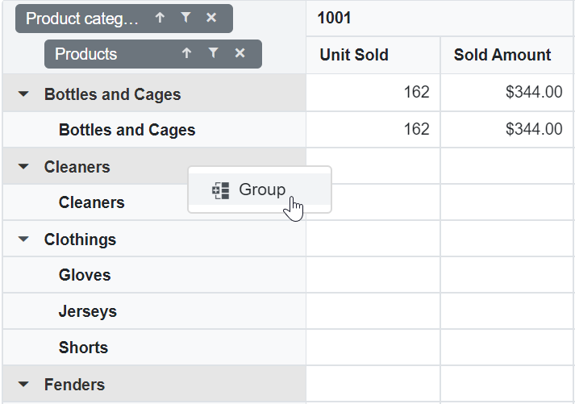
<br/>
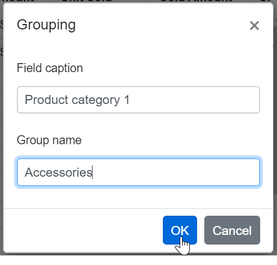
<br/>
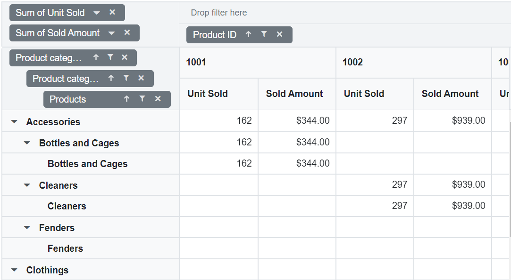

Custom grouping can also be configured using the [PivotViewGroupSettings](https://help.syncfusion.com/cr/blazor/Syncfusion.Blazor.PivotView.PivotViewGroupSetting.html) class through code-behind. The properties required are:

* [Name](https://help.syncfusion.com/cr/blazor/Syncfusion.Blazor.PivotView.PivotViewGroupSetting.html#Syncfusion_Blazor_PivotView_PivotViewGroupSetting_Name): Allows user to set the field name.
* [Caption](https://help.syncfusion.com/cr/blazor/Syncfusion.Blazor.PivotView.PivotViewGroupSetting.html#Syncfusion_Blazor_PivotView_PivotViewGroupSetting_Caption): Allows user to set the caption name for custom grouping field.
* [PivotViewCustomGroups](https://help.syncfusion.com/cr/blazor/Syncfusion.Blazor.PivotView.PivotViewCustomGroups.html): Allows user to set the custom groups.
* [Type](https://help.syncfusion.com/cr/blazor/Syncfusion.Blazor.PivotView.PivotViewGroupSetting.html#Syncfusion_Blazor_PivotView_PivotViewGroupSetting_Type): Allows user to set the group type. For custom grouping, [GroupType.Custom](https://help.syncfusion.com/cr/blazor/Syncfusion.Blazor.PivotView.GroupType.html) is set.

The available custom group properties in [PivotViewCustomGroup](https://help.syncfusion.com/cr/blazor/Syncfusion.Blazor.PivotView.PivotViewCustomGroup.html) in [PivotViewCustomGroups](https://help.syncfusion.com/cr/blazor/Syncfusion.Blazor.PivotView.PivotViewCustomGroups.html) class are:

* [GroupName](https://help.syncfusion.com/cr/blazor/Syncfusion.Blazor.PivotView.PivotViewCustomGroup.html#Syncfusion_Blazor_PivotView_PivotViewCustomGroup_GroupName): Allows user to set the group name (or title) for selected headers.
* [Items](https://help.syncfusion.com/cr/blazor/Syncfusion.Blazor.PivotView.PivotViewCustomGroup.html#Syncfusion_Blazor_PivotView_PivotViewCustomGroup_Items): It allows to set the headers which needs to be grouped from display.

> When the [GroupName](https://help.syncfusion.com/cr/blazor/Syncfusion.Blazor.PivotView.PivotViewCustomGroup.html#Syncfusion_Blazor_PivotView_PivotViewCustomGroup_GroupName) with the headers listed in [Items](https://help.syncfusion.com/cr/blazor/Syncfusion.Blazor.PivotView.PivotViewCustomGroup.html#Syncfusion_Blazor_PivotView_PivotViewCustomGroup_Items) in the [PivotViewCustomGroup](https://help.syncfusion.com/cr/blazor/Syncfusion.Blazor.PivotView.PivotViewGroupSetting.html#Syncfusion_Blazor_PivotView_PivotViewGroupSetting_RangeInterval) class is grouped by the defined [GroupName](https://help.syncfusion.com/cr/blazor/Syncfusion.Blazor.PivotView.PivotViewCustomGroup.html#Syncfusion_Blazor_PivotView_PivotViewCustomGroup_GroupName) and the rest is grouped by its own name in the pivot table.

```cshtml
@using Syncfusion.Blazor.PivotView

<SfPivotView TValue="ProductDetails" ShowGroupingBar="true" AllowGrouping="true">
    <PivotViewDataSourceSettings DataSource="@data">
        <PivotViewColumns>
            <PivotViewColumn Name="Product_ID" Caption="Product ID"></PivotViewColumn>
        </PivotViewColumns>
        <PivotViewRows>
            <PivotViewRow Name="Products"></PivotViewRow>
        </PivotViewRows>
        <PivotViewValues>
            <PivotViewValue Name="Sold" Caption="Unit Sold"></PivotViewValue>
            <PivotViewValue Name="Amount" Caption="Sold Amount"></PivotViewValue>
        </PivotViewValues>
        <PivotViewFormatSettings>
            <PivotViewFormatSetting Name="Product_ID" Format="N" UseGrouping=true></PivotViewFormatSetting>
            <PivotViewFormatSetting Name="Amount" Format="C" UseGrouping=true></PivotViewFormatSetting>
        </PivotViewFormatSettings>
        <PivotViewGroupSettings>
            <PivotViewGroupSetting Name="Products" Caption="Product catergory" Type=GroupType.Custom>
                <PivotViewCustomGroups>
                    <PivotViewCustomGroup GroupName="Clothings" Items="@(new string[] { "Gloves", "Jerseys", "Shorts" })"></PivotViewCustomGroup>
                </PivotViewCustomGroups>
            </PivotViewGroupSetting>
        </PivotViewGroupSettings>
    </PivotViewDataSourceSettings>
</SfPivotView>

@code{
    public List<ProductDetails> data { get; set; }
    protected override void OnInitialized()
    {
        this.data = ProductDetails.GetProductData().ToList();
        //Bind the data source collection here. Refer "Assigning sample data to the pivot table" section in getting started for more details.
    }
}

```


### Ungrouping the existing custom groups

By right-clicking the appropriate header and selecting "**Ungroup**" from the context menu in the pivot table component, users can ungroup the applied custom grouping.

> When a specific field is removed from the report after ungrouping, its custom group fields will also be removed from the pivot table.

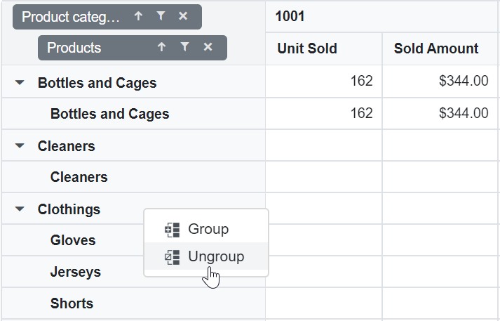

> You can refer to our [Blazor Pivot Table](https://www.syncfusion.com/blazor-components/blazor-pivot-table) feature tour page for its groundbreaking feature representations. You can also explore our [Blazor Pivot Table example](https://blazor.syncfusion.com/demos/pivot-table/default-functionalities?theme=bootstrap4) to knows how to render and configure the pivot table.