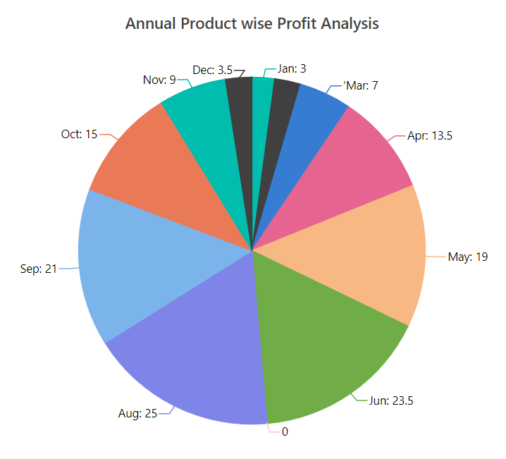

# Empty Points

Data points that contains `NaN` value are considered as empty points. The empty data points
can be ignored or not plotted in the chart. You can customize those points, using the [`EmptyPointSettings`](https://help.syncfusion.com/cr/blazor/Syncfusion.Blazor~Syncfusion.Blazor.Charts.AccumulationChartSeries~EmptyPointSettings.html) property in
series. The default mode of the empty point is `Gap`. Other supported modes are `Average` and `Zero`.





## Customization

Specific color for an empty point can be set by using the [`Fill`](https://help.syncfusion.com/cr/blazor/Syncfusion.Blazor~Syncfusion.Blazor.Charts.AccumulationChartEmptyPointSettings~Fill.html) property in [`EmptyPointSettings`](https://help.syncfusion.com/cr/blazor/Syncfusion.Blazor~Syncfusion.Blazor.Charts.AccumulationChartSeries~EmptyPointSettings.html) and the
border for an empty point can be set by using the [`Border`](https://help.syncfusion.com/cr/blazor/Syncfusion.Blazor~Syncfusion.Blazor.Charts.AccumulationChartEmptyPointSettings~Border.html) property.



