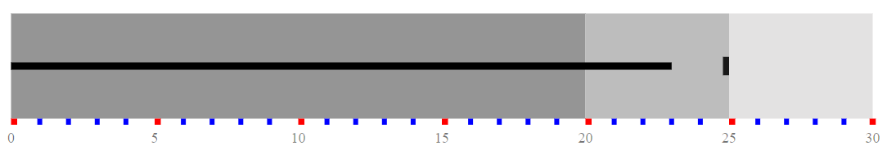
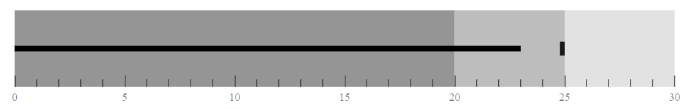
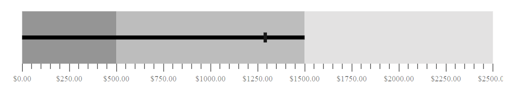
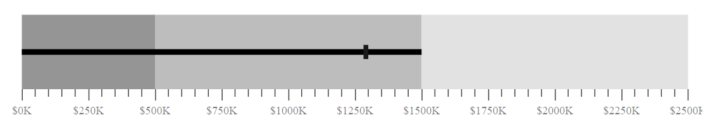
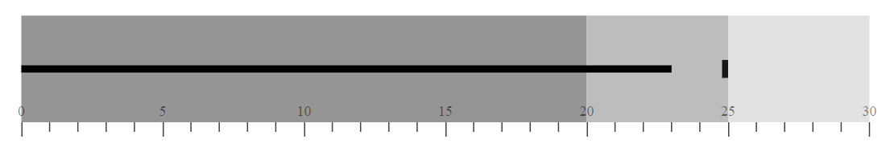
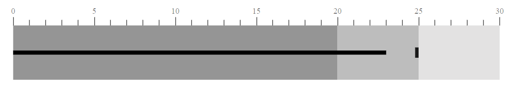
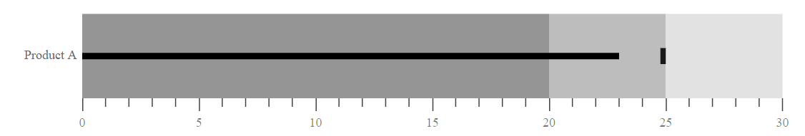

# Axis Customization

## MajorTickLines and MinorTickLines Customization

You can customize the `Width`, `Color`, and `Size` of minor and major tick lines using the
[`MajorTickLines`](../api/bullet-chart/bullet-chartModel/) and
[`MinorTickLines`](../api/bullet-chart/bullet-chartModel/) properties of the bullet-chart.

```csharp
@using Syncfusion.Blazor.Charts

<SfBulletChart DataSource="@BulletChartData" ValueField="value" TargetField="target" Minimum="0" Maximum="30" Interval="5">
    <BulletChartMinorTickLines Width="4" Color="blue"></BulletChartMinorTickLines>
    <BulletChartMajorTickLines Width="5" Color="red"></BulletChartMajorTickLines>
    <BulletChartRangeCollection>
        <BulletChartRange End=20> </BulletChartRange>
        <BulletChartRange End=25></BulletChartRange>
        <BulletChartRange End=30></BulletChartRange>
    </BulletChartRangeCollection>
</SfBulletChart>

@code{
    public class ChartData
    {
        public double value { get; set; }
        public double target { get; set; }
    }
    public List<ChartData> BulletChartData = new List<ChartData>
{
        new ChartData { value = 23, target = 25 }
    };
}
```



## Tick Placement

You can place major and minor ticks `Inside` or `Outside` the ranges using the [`TickPosition`](../api/bullet-chart/bullet-chartModel/) property of bullet-chart.

```csharp
@using Syncfusion.Blazor.Charts

<SfBulletChart DataSource="@BulletChartData" TickPosition="TickPosition.Inside" ValueField="value" TargetField="target" Minimum="0" Maximum="30" Interval="5">
    <BulletChartRangeCollection>
        <BulletChartRange End=20> </BulletChartRange>
        <BulletChartRange End=25></BulletChartRange>
        <BulletChartRange End=30></BulletChartRange>
    </BulletChartRangeCollection>
</SfBulletChart>

@code{
    public class ChartData
    {
        public double value { get; set; }
        public double target { get; set; }
    }
    public List<ChartData> BulletChartData = new List<ChartData>
{
        new ChartData { value = 23, target = 25 }
    };
}
```



## Label Format

***Axis Label Format***

Axis numeric labels can be formatted by using the [`LabelFormat`](../api/bullet-chart/bullet-chartModel/#labelformat-string)property. Axis labels support all globalize formats. The following table describes the result of applying some commonly used label formats on numeric axis values.

```csharp
@using Syncfusion.Blazor.Charts

<SfBulletChart DataSource="@BulletChartData" LabelFormat="c" ValueField="value" TargetField="target" Minimum="0" Maximum="2500" Interval="250">
    <BulletChartRangeCollection>
        <BulletChartRange End=500> </BulletChartRange>
        <BulletChartRange End=1500></BulletChartRange>
        <BulletChartRange End=2500></BulletChartRange>
    </BulletChartRangeCollection>
</SfBulletChart>

@code{
    public class ChartData
    {
        public double value { get; set; }
        public double target { get; set; }
    }
    public List<ChartData> BulletChartData = new List<ChartData>
{
        new ChartData { value = 1500, target = 1300 }
    };
}
```



The following 'Table' describes the result of applying some commonly used 'Label' formats on Numeric axis values.

<!-- markdownlint-disable MD033 -->
<table>
<tr>
<td><b>Label Value</b></td>
<td><b>Label Format property value</b></td>
<td><b>Result </b></td>
<td><b>Description </b></td>
</tr>
<tr>
<td>1000</td>
<td>n1</td>
<td>1000.0</td>
<td>The Number is rounded to 1 decimal place</td>
</tr>
<tr>
<td>1000</td>
<td>n2</td>
<td>1000.00</td>
<td>The Number is rounded to 2 decimal place</td>
</tr>
<tr>
<td>1000</td>
<td>n3</td>
<td>1000.000</td>
<td>The Number is rounded to 3 decimal place</td>
</tr>
<tr>
<td>0.01</td>
<td>p1</td>
<td>1.0%</td>
<td>The Number is converted to percentage with 1 decimal place</td>
</tr>
<tr>
<td>0.01</td>
<td>p2</td>
<td>1.00%</td>
<td>The Number is converted to percentage with 2 decimal place</td>
</tr>
<tr>
<td>0.01</td>
<td>p3</td>
<td>1.000%</td>
<td>The Number is converted to percentage with 3 decimal place</td>
</tr>
<tr>
<td>1000</td>
<td>c1</td>
<td>$1000.0</td>
<td>The Currency symbol is appended to number and number is rounded to 1 decimal place</td>
</tr>
<tr>
<td>1000</td>
<td>c2</td>
<td>$1000.00</td>
<td>The Currency symbol is appended to number and number is rounded to 2 decimal place</td>
</tr>
</table>

## GroupingSeparator

To separate groups of thousands, use the [`EnableGroupSeparator`](../api/bullet-chart/bullet-chartModel/# enableGroupSeparator-boolean) property of bullet-chart.

```csharp
@using Syncfusion.Blazor.Charts

<SfBulletChart DataSource="@BulletChartData" EnableGroupSeparator="true" ValueField="value" TargetField="target" Minimum="0" Maximum="2500" Interval="250">
    <BulletChartRangeCollection>
        <BulletChartRange End=500> </BulletChartRange>
        <BulletChartRange End=1500></BulletChartRange>
        <BulletChartRange End=2500></BulletChartRange>
    </BulletChartRangeCollection>
</SfBulletChart>

@code{
    public class ChartData
    {
        public double value { get; set; }
        public double target { get; set; }
    }
    public List<ChartData> BulletChartData = new List<ChartData>
{
        new ChartData { value = 1500, target = 1300 }
    };
}
```


## Custom Label Format

You can also customize the axis label format using a placeholder like ${value}K, in which the value represents the axis label, e.g. $20K.

```csharp
@using Syncfusion.Blazor.Charts

<SfBulletChart DataSource="@BulletChartData" LabelFormat="${value}K" ValueField="value" TargetField="target" Minimum="0" Maximum="2500" Interval="250">
    <BulletChartRangeCollection>
        <BulletChartRange End=500> </BulletChartRange>
        <BulletChartRange End=1500></BulletChartRange>
        <BulletChartRange End=2500></BulletChartRange>
    </BulletChartRangeCollection>
</SfBulletChart>

@code{
    public class ChartData
    {
        public double value { get; set; }
        public double target { get; set; }
    }
    public List<ChartData> BulletChartData = new List<ChartData>
{
        new ChartData { value = 1500, target = 1300 }
    };
}
```



## Label Placement

You can customize the axis labels `Inside` or `Iutside` the bullet-chart using the [`LabelPosition`](../api/bullet-chart/bullet-chartModel/) property.

```csharp
@using Syncfusion.Blazor.Charts

<SfBulletChart DataSource="@BulletChartData" LabelPosition="LabelsPlacement.Inside" ValueField="value" TargetField="target" Minimum="0" Maximum="30" Interval="5">

    <BulletChartRangeCollection>
        <BulletChartRange End=20> </BulletChartRange>
        <BulletChartRange End=25></BulletChartRange>
        <BulletChartRange End=30></BulletChartRange>
    </BulletChartRangeCollection>
</SfBulletChart>

@code{
    public class ChartData
    {
        public double value { get; set; }
        public double target { get; set; }
    }
    public List<ChartData> BulletChartData = new List<ChartData>
{
        new ChartData { value = 23, target = 25 }
    };
}
```



## Opposed Position

To place an axis opposite to its original position,
set the [`OpposedPosition`](../api/bullet-chart/bullet-chartModel/) property to true.

```csharp
@using Syncfusion.Blazor.Charts

<SfBulletChart DataSource="@BulletChartData" OpposedPosition="true" ValueField="value" TargetField="target" Minimum="0" Maximum="30" Interval="5">

    <BulletChartRangeCollection>
        <BulletChartRange End=20> </BulletChartRange>
        <BulletChartRange End=25></BulletChartRange>
        <BulletChartRange End=30></BulletChartRange>
    </BulletChartRangeCollection>
</SfBulletChart>

@code{
    public class ChartData
    {
        public double value { get; set; }
        public double target { get; set; }
    }
    public List<ChartData> BulletChartData = new List<ChartData>
{
        new ChartData { value = 23, target = 25 }
    };
}
```



## Category Label

You can display the x axis label by mapping the `CategoryField` from dataSource of a bullet-chart. It is a more efficient way to understand data.

```csharp
@using Syncfusion.Blazor.Charts

<SfBulletChart DataSource="@BulletChartData" CategoryField="category" ValueField="value" TargetField="target" Minimum="0" Maximum="30" Interval="5">

    <BulletChartRangeCollection>
        <BulletChartRange End=20> </BulletChartRange>
        <BulletChartRange End=25></BulletChartRange>
        <BulletChartRange End=30></BulletChartRange>
    </BulletChartRangeCollection>
</SfBulletChart>

@code{
    public class ChartData
    {
        public double value { get; set; }
        public double target { get; set; }
        public string category { get; set; }
    }
    public List<ChartData> BulletChartData = new List<ChartData>
{
        new ChartData { value = 23, target = 25, category="Product A" }
    };
}
```



## Category Label Customization

You can customize the category label by using the `CategoryLabelStyle` property of the bullet-chart.

```csharp
@using Syncfusion.Blazor.Charts

<SfBulletChart DataSource="@BulletChartData" CategoryField="category" ValueField="value" TargetField="target" Minimum="0" Maximum="30" Interval="5">

    <BulletChartRangeCollection>
        <BulletChartRange End=20> </BulletChartRange>
        <BulletChartRange End=25></BulletChartRange>
        <BulletChartRange End=30></BulletChartRange>
    </BulletChartRangeCollection>
</SfBulletChart>

@code{
    public class ChartData
    {
        public double value { get; set; }
        public double target { get; set; }
        public string category { get; set; }
    }
    public List<ChartData> BulletChartData = new List<ChartData>
{
        new ChartData { value = 23, target = 25, category="Product A" }
    };
}
```