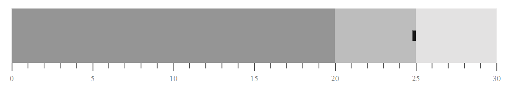

<!-- markdownlint-disable MD036 -->

# Target Bar

The line marker that runs perpendicular to the orientation of the graph is known as the `Comparative Measure` and is used as a target marker to compare against the Feature Measure value. This is also called as `Target Bar` of the bullet chart. Also, if you want to display the target bar you should map the `TargetField` name from the dataSource.

```csharp
@using Syncfusion.Blazor.Charts

<SfBulletChart DataSource="@BulletChartData" TargetField="target" Minimum="0" Maximum="30" Interval="5">
    <BulletChartRangeCollection>
        <BulletChartRange End=20> </BulletChartRange>
        <BulletChartRange End=25></BulletChartRange>
        <BulletChartRange End=30></BulletChartRange>
    </BulletChartRangeCollection>
</SfBulletChart>

@code{
    public class ChartData
    {
        public double target { get; set; }
    }
    public List<ChartData> BulletChartData = new List<ChartData>
{
        new ChartData { target = 25 }
    };
}
```



## Target Bar Types

You can customize the shape of the target bar or comparative bar using the `TargetTypes` property of the bullet chart. Target bar contains `Circle`, `Cross`, and `Rect` shapes. The default type of target bar is `Rect`.

```csharp
@using Syncfusion.Blazor.Charts

<SfBulletChart DataSource="@BulletChartData" TargetField="target" Minimum="0" Maximum="30" Interval="5">
    <BulletChartRangeCollection>
        <BulletChartRange End=20> </BulletChartRange>
        <BulletChartRange End=25></BulletChartRange>
        <BulletChartRange End=30></BulletChartRange>
    </BulletChartRangeCollection>
</SfBulletChart>

@code{
    public class ChartData
    {
        public double target { get; set; }
    }
    public List<ChartData> BulletChartData = new List<ChartData>
{
        new ChartData { target = 25 }
    };
}
```

## Customization

**Color Customization**

Using the `TargetColor` property of the bullet chart, you can customize the fill color of the target bar.

```csharp
@using Syncfusion.Blazor.Charts

<SfBulletChart DataSource="@BulletChartData" TargetColor="red" TargetField="target" Minimum="0" Maximum="30" Interval="5">
    <BulletChartRangeCollection>
        <BulletChartRange End=20> </BulletChartRange>
        <BulletChartRange End=25></BulletChartRange>
        <BulletChartRange End=30></BulletChartRange>
    </BulletChartRangeCollection>
</SfBulletChart>

@code{
    public class ChartData
    {
        public double target { get; set; }
    }
    public List<ChartData> BulletChartData = new List<ChartData>
{
        new ChartData { target = 25 }
    };
}
```


**Width Customization**

You can customize the width of the target bar using the `TargetWidth` property of the bullet chart.

```csharp
@using Syncfusion.Blazor.Charts

<SfBulletChart DataSource="@BulletChartData" TargetWidth="15" TargetField="target" Minimum="0" Maximum="30" Interval="5">
    <BulletChartRangeCollection>
        <BulletChartRange End=20> </BulletChartRange>
        <BulletChartRange End=25></BulletChartRange>
        <BulletChartRange End=30></BulletChartRange>
    </BulletChartRangeCollection>
</SfBulletChart>

@code{
    public class ChartData
    {
        public double target { get; set; }
    }
    public List<ChartData> BulletChartData = new List<ChartData>
{
        new ChartData { target = 25 }
    };
}
```

