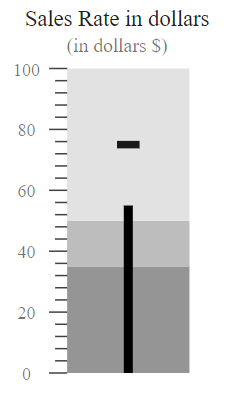
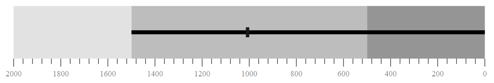
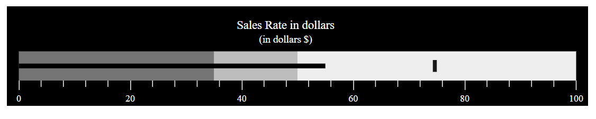

<!-- markdownlint-disable MD036 -->

# Orientation

Bullet Chart can be rendered in different mode as `Horizontal` or `Vertical` by using `Orientation` property of the bullet-chart. By default bullet-chart rendered in horizontal mode.

```csharp
@using Syncfusion.Blazor.Charts

<SfBulletChart DataSource="@BulletChartData" Orientation="OrientationType.Vertical" Width="20%" Title="Sales Rate in dollars" Subtitle="(in dollars $)" ValueField="value" TargetField="target" Minimum="0" Maximum="100" Interval="20">
    <BulletChartRangeCollection>
        <BulletChartRange End=35> </BulletChartRange>
        <BulletChartRange End=50></BulletChartRange>
        <BulletChartRange End=100></BulletChartRange>
    </BulletChartRangeCollection>
</SfBulletChart>

@code{
    public class ChartData
    {
        public double value { get; set; }
        public double target { get; set; }
    }
    public List<ChartData> BulletChartData = new List<ChartData>
{
        new ChartData { value = 55, target = 75 }
    };
}
```



## Flow Direction

Using `EnableRtl` boolean property of the bullet-chart, you can render bullet-chart in right to left or left to right direction.

```csharp
@using Syncfusion.Blazor.Charts

<SfBulletChart DataSource="@BulletChartData" EnableRtl="true" ValueField="value" TargetField="target" Minimum="0" Maximum="2000" Interval="200">
    <BulletChartRangeCollection>
        <BulletChartRange End=500> </BulletChartRange>
        <BulletChartRange End=1500></BulletChartRange>
        <BulletChartRange End=2000></BulletChartRange>
    </BulletChartRangeCollection>
</SfBulletChart>

@code{
    public class ChartData
    {
        public double value { get; set; }
        public double target { get; set; }
    }
    public List<ChartData> BulletChartData = new List<ChartData>
{
        new ChartData { value = 1500, target = 1000 }
    };
}
```



## Animation

By setting `Animation` property value as `true`, you can enable the linear animation of the feature and target bars.

```csharp
@using Syncfusion.Blazor.Charts

<SfBulletChart DataSource="@BulletChartData" ValueField="value" TargetField="target" Minimum="0" Maximum="2000" Interval="200">
    <BulletChartAnimation Enable="true"></BulletChartAnimation>
    <BulletChartRangeCollection>
        <BulletChartRange End=500> </BulletChartRange>
        <BulletChartRange End=1500></BulletChartRange>
        <BulletChartRange End=2000></BulletChartRange>
    </BulletChartRangeCollection>
</SfBulletChart>

@code{
    public class ChartData
    {
        public double value { get; set; }
        public double target { get; set; }
    }
    public List<ChartData> BulletChartData = new List<ChartData>
{
        new ChartData { value = 1500, target = 1000 }
    };
}
```

## Theme

Bullet chart also support different types of themes. Using `Theme` property of the bullet-chart, you can customize the theme styles.

```csharp
@using Syncfusion.Blazor.Charts

<SfBulletChart DataSource="@BulletChartData" Theme="ChartTheme.HighContrast" Title="Sales Rate in dollars" Subtitle="(in dollars $)" ValueField="value" TargetField="target" Minimum="0" Maximum="100" Interval="20">
    <BulletChartRangeCollection>
        <BulletChartRange End=35> </BulletChartRange>
        <BulletChartRange End=50></BulletChartRange>
        <BulletChartRange End=100></BulletChartRange>
    </BulletChartRangeCollection>
</SfBulletChart>

@code{
    public class ChartData
    {
        public double value { get; set; }
        public double target { get; set; }
    }
    public List<ChartData> BulletChartData = new List<ChartData>
{
        new ChartData { value = 55, target = 75 }
    };
}
```

