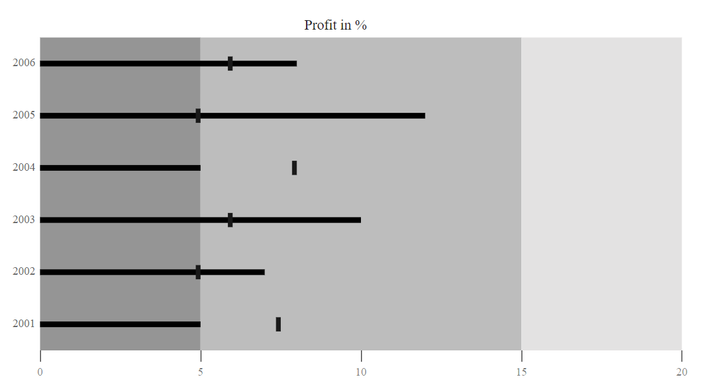

# Working with Data

Bullet Chart can visualise data bound from local or remote data.

## Local Data

You can bind a simple data to the bullet chart using
[`DataSource`](../api/bullet-chart/) direct property of the bullet-chart. Now map the fields to [`ValueField`](../api/bullet-chart/#valueField-string) and [`TargetField`](../api/bullet-chart/#targetField-string) properties.

```csharp
@using Syncfusion.Blazor.Charts

<SfBulletChart DataSource="@LocalChartData" ValueField="value" TargetField="ComparativeMeasureValue" CategoryField="Category"
                Height="400" Minimum="0" Maximum="20" Interval="5" Title="Profit in %">
    <BulletChartAnimation Enable="false"></BulletChartAnimation>
    <BulletChartMinorTickLines Width="0"></BulletChartMinorTickLines>
    <BulletChartRangeCollection>
        <BulletChartRange End=5> </BulletChartRange>
        <BulletChartRange End=15></BulletChartRange>
        <BulletChartRange End=20></BulletChartRange>
    </BulletChartRangeCollection>
</SfBulletChart>

@code{
    public class BulletChartData
    {
        public double value { get; set; }
        public double ComparativeMeasureValue { get; set; }
        public string Category { get; set; }
    }
    public List<BulletChartData> LocalChartData = new List<BulletChartData>
{
        new BulletChartData { value = 5, ComparativeMeasureValue = 7.5, Category = "2001" },
        new BulletChartData { value = 7, ComparativeMeasureValue = 5, Category = "2002" },
        new BulletChartData { value = 10, ComparativeMeasureValue = 6, Category = "2003" },
        new BulletChartData { value = 5, ComparativeMeasureValue = 8, Category = "2004" },
        new BulletChartData { value = 12, ComparativeMeasureValue = 5, Category = "2005" },
        new BulletChartData { value = 8, ComparativeMeasureValue = 6, Category = "2006" }
    };
}
```

