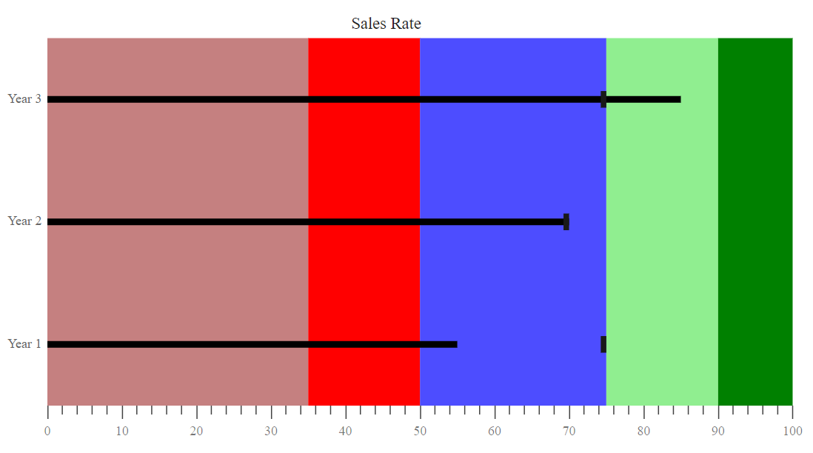

<!-- markdownlint-disable MD036 -->

# Ranges

' Ranges ' represent the quality of a specific range as 'Good', 'Bad', and 'Satisfactory' in the 'Bullet-chart scale.' The 'Ending' point of the qualitative range is specified by the property `End.` The ' Minimum value ' of a quantitative scale is considered as the starting point for the 'First range' and the 'Previous range' end points are considered as the starting point for other ranges.

```csharp
@using Syncfusion.Blazor.Charts

<SfBulletChart DataSource="@BulletChartData" ValueField="value" TargetField="target" Minimum="0" Maximum="300" Interval="50" Title="Revenue">
    <BulletChartRangeCollection>
        <BulletChartRange End=150> </BulletChartRange>
        <BulletChartRange End=250></BulletChartRange>
        <BulletChartRange End=300></BulletChartRange>
    </BulletChartRangeCollection>
</SfBulletChart>

@code{
    public class ChartData
    {
        public double value { get; set; }
        public double target { get; set; }
    }
    public List<ChartData> BulletChartData = new List<ChartData>
{
        new ChartData { value = 270, target = 250 }
    };
}
```

## Color Customization

`Color` is customized with the `Color` property based on the 'End' values for each qualitative range. You can also customize the `Opacity` of the Color of each range.

```csharp
@using Syncfusion.Blazor.Charts

<SfBulletChart DataSource="@BulletChartData" CategoryField="category" ValueField="value" TargetField="target" Minimum="0" Maximum="100"
                Interval="10" Title="Sales Rate" Height="400">
    <BulletChartRangeCollection>
        <BulletChartRange End=35 Color="darkred" Opacity="0.5"></BulletChartRange>
        <BulletChartRange End=50 Color="red" Opacity="1"></BulletChartRange>
        <BulletChartRange End=75 Color="blue" Opacity="0.7"></BulletChartRange>
        <BulletChartRange End=90 Color="lightgreen" Opacity="1"></BulletChartRange>
        <BulletChartRange End=100 Color="green" Opacity="1"></BulletChartRange>
    </BulletChartRangeCollection>
</SfBulletChart>

@code{
    public class ChartData
    {
        public double value { get; set; }
        public double target { get; set; }
        public string category { get; set; }
    }
    public List<ChartData> BulletChartData = new List<ChartData>
{
        new ChartData { value = 55, target = 75, category = "Year 1" },
        new ChartData { value = 70, target = 70, category = "Year 2" },
        new ChartData { value = 85, target = 75, category = "Year 3" }
    };
}
```

