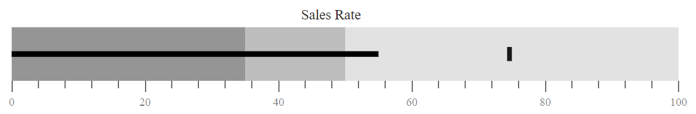
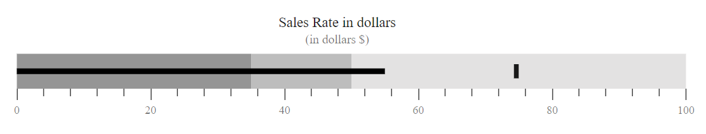
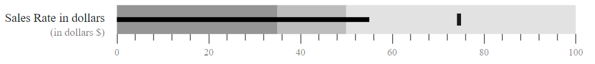
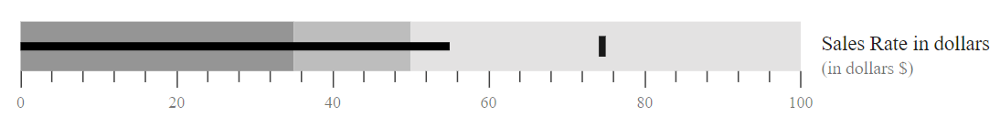
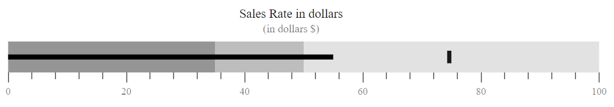
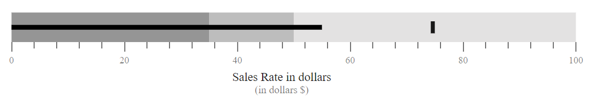

<!-- markdownlint-disable MD036 -->

# Title

A title can be given to a bullet chart using the `Title` property to show information about the data plotted.

```csharp
@using Syncfusion.Blazor.Charts

<SfBulletChart DataSource="@BulletChartData" Title="Sales Rate" ValueField="value" TargetField="target" Minimum="0" Maximum="100" Interval="20">
    <BulletChartRangeCollection>
        <BulletChartRange End=35> </BulletChartRange>
        <BulletChartRange End=50></BulletChartRange>
        <BulletChartRange End=100></BulletChartRange>
    </BulletChartRangeCollection>
</SfBulletChart>

@code{
    public class ChartData
    {
        public double value { get; set; }
        public double target { get; set; }
    }
    public List<ChartData> BulletChartData = new List<ChartData>
{
        new ChartData { value = 55, target = 75 }
    };
}
```



## Subtitle

A subtitle can also be given to a bullet chart using the `Subtitle` property to show additional information about the data plotted.

```csharp
@using Syncfusion.Blazor.Charts

<SfBulletChart DataSource="@BulletChartData" Title="Sales Rate in dollars" Subtitle="(in dollars $)" ValueField="value" TargetField="target" Minimum="0" Maximum="100" Interval="20">
    <BulletChartRangeCollection>
        <BulletChartRange End=35> </BulletChartRange>
        <BulletChartRange End=50></BulletChartRange>
        <BulletChartRange End=100></BulletChartRange>
    </BulletChartRangeCollection>
</SfBulletChart>

@code{
    public class ChartData
    {
        public double value { get; set; }
        public double target { get; set; }
    }
    public List<ChartData> BulletChartData = new List<ChartData>
{
        new ChartData { value = 55, target = 75 }
    };
}
```



## Title and Subtitle Position

You can place the title and subtitle in different positions. By using the `TitlePosition` property of the bullet chart, you can place the title and subtitles in different positions like `Left`, `Right`, `Top`, and `Bottom`.

**Position as Left**

By setting the `TitlePosition` to `Left`, you can display the title and subtitle at the left side of the chart.

```csharp
@using Syncfusion.Blazor.Charts

<SfBulletChart DataSource="@BulletChartData" TitlePosition="TextPosition.Left" Title="Sales Rate in dollars" Subtitle="(in dollars $)" ValueField="value" TargetField="target" Minimum="0" Maximum="100" Interval="20">
    <BulletChartRangeCollection>
        <BulletChartRange End=35> </BulletChartRange>
        <BulletChartRange End=50></BulletChartRange>
        <BulletChartRange End=100></BulletChartRange>
    </BulletChartRangeCollection>
</SfBulletChart>

@code{
    public class ChartData
    {
        public double value { get; set; }
        public double target { get; set; }
    }
    public List<ChartData> BulletChartData = new List<ChartData>
{
        new ChartData { value = 55, target = 75 }
    };
}
```



**Position as Right**

By setting the `TitlePosition` to `Right`, you can display the title and subtitle at the right side of the chart.

```csharp
@using Syncfusion.Blazor.Charts

<SfBulletChart DataSource="@BulletChartData" TitlePosition="TextPosition.Right" Title="Sales Rate in dollars" Subtitle="(in dollars $)" ValueField="value" TargetField="target" Minimum="0" Maximum="100" Interval="20">
    <BulletChartRangeCollection>
        <BulletChartRange End=35> </BulletChartRange>
        <BulletChartRange End=50></BulletChartRange>
        <BulletChartRange End=100></BulletChartRange>
    </BulletChartRangeCollection>
</SfBulletChart>

@code{
    public class ChartData
    {
        public double value { get; set; }
        public double target { get; set; }
    }
    public List<ChartData> BulletChartData = new List<ChartData>
{
        new ChartData { value = 55, target = 75 }
    };
}
```



**Position as Top**

By setting the `TitlePosition` to `Top`, you can display the title and subtitle at the top of the chart. The default title and subtitle positions of the bullet chart is `Top`.

```csharp
@using Syncfusion.Blazor.Charts

<SfBulletChart DataSource="@BulletChartData" TitlePosition="TextPosition.Top" Title="Sales Rate in dollars" Subtitle="(in dollars $)" ValueField="value" TargetField="target" Minimum="0" Maximum="100" Interval="20">
    <BulletChartRangeCollection>
        <BulletChartRange End=35> </BulletChartRange>
        <BulletChartRange End=50></BulletChartRange>
        <BulletChartRange End=100></BulletChartRange>
    </BulletChartRangeCollection>
</SfBulletChart>

@code{
    public class ChartData
    {
        public double value { get; set; }
        public double target { get; set; }
    }
    public List<ChartData> BulletChartData = new List<ChartData>
{
        new ChartData { value = 55, target = 75 }
    };
}
```



**Position as Bottom**

By setting the `TitlePosition` to `Bottom`, you can display the title and subtitle at the bottom of the chart.

```csharp
@using Syncfusion.Blazor.Charts

<SfBulletChart DataSource="@BulletChartData" TitlePosition="TextPosition.Bottom" Title="Sales Rate in dollars" Subtitle="(in dollars $)" ValueField="value" TargetField="target" Minimum="0" Maximum="100" Interval="20">
    <BulletChartRangeCollection>
        <BulletChartRange End=35> </BulletChartRange>
        <BulletChartRange End=50></BulletChartRange>
        <BulletChartRange End=100></BulletChartRange>
    </BulletChartRangeCollection>
</SfBulletChart>

@code{
    public class ChartData
    {
        public double value { get; set; }
        public double target { get; set; }
    }
    public List<ChartData> BulletChartData = new List<ChartData>
{
        new ChartData { value = 55, target = 75 }
    };
}
```



## Title customization

You can customize the bullet chart title’s `FontStyle`, `Size`, `Color`, `FontWeight`, and `FontFamily` using the `BulletChartTitleStyle` tag.

```csharp
@using Syncfusion.Blazor.Charts

<SfBulletChart DataSource="@BulletChartData" Title="Sales Rate" ValueField="value" TargetField="target" Minimum="0" Maximum="100" Interval="20">
    <BulletChartTitleStyle></BulletChartTitleStyle>
    <BulletChartRangeCollection>
        <BulletChartRange End=35> </BulletChartRange>
        <BulletChartRange End=50></BulletChartRange>
        <BulletChartRange End=100></BulletChartRange>
    </BulletChartRangeCollection>
</SfBulletChart>

@code{
    public class ChartData
    {
        public double value { get; set; }
        public double target { get; set; }
    }
    public List<ChartData> BulletChartData = new List<ChartData>
{
        new ChartData { value = 55, target = 75 }
    };
}
```

## Subtitle customization

You can customize the bullet chart subtitle’s `FontStyle`, `Size`, `Color`, `FontWeight`, and `FontFamily` using the `BulletChartSubtitleStyle` tag.

```csharp
@using Syncfusion.Blazor.Charts

<SfBulletChart DataSource="@BulletChartData" Title="Sales Rate" ValueField="value" TargetField="target" Minimum="0" Maximum="100" Interval="20">
    <BulletChartSubTitleStyle></BulletChartSubTitleStyle>
    <BulletChartRangeCollection>
        <BulletChartRange End=35> </BulletChartRange>
        <BulletChartRange End=50></BulletChartRange>
        <BulletChartRange End=100></BulletChartRange>
    </BulletChartRangeCollection>
</SfBulletChart>

@code{
    public class ChartData
    {
        public double value { get; set; }
        public double target { get; set; }
    }
    public List<ChartData> BulletChartData = new List<ChartData>
{
        new ChartData { value = 55, target = 75 }
    };
}
```