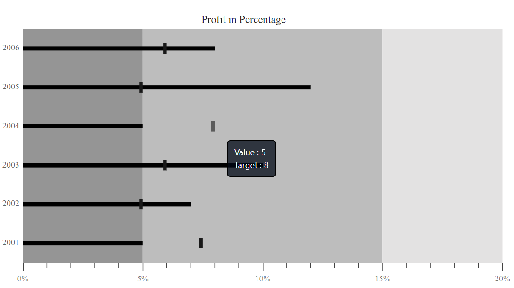

# Tooltip

<!-- markdownlint-disable MD036 -->

'Bullet Chart' will display the details of 'Actual' and 'Target' values through 'Tooltip' when the mouse is moved over the 'Target' and the 'Feature' bar.

## Default Tooltip

By setting [`Enable`](https://help.syncfusion.com/cr/blazor/Syncfusion.Blazor~Syncfusion.Blazor.Charts.BulletChartTooltip~Enable.html)the property to 'True' in `BulletChartTooltip` tag. The 'Tooltip' is visible in the 'Bullet chart' by default.

```csharp
@using Syncfusion.Blazor.Charts

    <SfBulletChart DataSource="@LocalChartData" ValueField="value" TargetField="ComparativeMeasureValue" CategoryField="Category"
                    Height="400" Minimum="0" Maximum="20" Interval="5" LabelFormat="{value}%" Title="Profit in Percentage">
        <BulletChartTooltip Enable="true"></BulletChartTooltip>
        <BulletChartRangeCollection>
            <BulletChartRange End=5> </BulletChartRange>
            <BulletChartRange End=15></BulletChartRange>
            <BulletChartRange End=20></BulletChartRange>
        </BulletChartRangeCollection>
    </SfBulletChart>

@code{
    public class BulletChartData
    {
        public double value { get; set; }
        public double ComparativeMeasureValue { get; set; }
        public string Category { get; set; }
    }
    public List<BulletChartData> LocalChartData = new List<BulletChartData>
    {
        new BulletChartData { value = 5, ComparativeMeasureValue = 7.5, Category = "2001" },
        new BulletChartData { value = 7, ComparativeMeasureValue = 5, Category = "2002" },
        new BulletChartData { value = 10, ComparativeMeasureValue = 6, Category = "2003" },
        new BulletChartData { value = 5, ComparativeMeasureValue = 8, Category = "2004" },
        new BulletChartData { value = 12, ComparativeMeasureValue = 5, Category = "2005" },
        new BulletChartData { value = 8, ComparativeMeasureValue = 6, Category = "2006" }
    };
}
```

