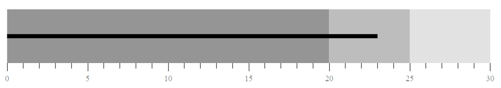
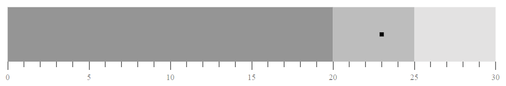

<!-- markdownlint-disable MD036 -->

# Feature Bar

The main data value is encoded by a length of the main bar in the middle of the chart, known as the `Feature Measure`. This is also called as `Value Bar`. Also, if you want to display the target bar you should map the `ValueField` name from the dataSource.

```csharp
@using Syncfusion.Blazor.Charts

<SfBulletChart DataSource="@BulletChartData" ValueField="value" Minimum="0" Maximum="30" Interval="5">
    <BulletChartRangeCollection>
        <BulletChartRange End=20> </BulletChartRange>
        <BulletChartRange End=25></BulletChartRange>
        <BulletChartRange End=30></BulletChartRange>
    </BulletChartRangeCollection>
</SfBulletChart>

@code{
    public class ChartData
    {
        public double value { get; set; }
    }
    public List<ChartData> BulletChartData = new List<ChartData>
{
        new ChartData { value = 23}
    };
}
```



## Feature bar types

You can customize the shape of the feature bar or value bar using the `Type` property of the bullet chart. Feature bar contains `Rect` and `Dot` shapes. The default type of feature bar is `Rect`.

```csharp
@using Syncfusion.Blazor.Charts

<SfBulletChart DataSource="@BulletChartData" Type="FeatureType.Dot" ValueField="value" Minimum="0" Maximum="30" Interval="5">
    <BulletChartRangeCollection>
        <BulletChartRange End=20> </BulletChartRange>
        <BulletChartRange End=25></BulletChartRange>
        <BulletChartRange End=30></BulletChartRange>
    </BulletChartRangeCollection>
</SfBulletChart>

@code{
    public class ChartData
    {
        public double value { get; set; }
    }
    public List<ChartData> BulletChartData = new List<ChartData>
{
        new ChartData { value = 23}
    };
}
```



## Customization

**Border customization**

Using the `ValueBorder` property of the bullet chart, you can customize the border `Color` and `Width` of the feature bar.

```csharp
@using Syncfusion.Blazor.Charts

<SfBulletChart DataSource="@BulletChartData" ValueField="value" Minimum="0" Maximum="30" Interval="5">
    <BulletChartRangeCollection>
        <BulletChartRange End=20> </BulletChartRange>
        <BulletChartRange End=25></BulletChartRange>
        <BulletChartRange End=30></BulletChartRange>
    </BulletChartRangeCollection>
</SfBulletChart>

@code{
    public class ChartData
    {
        public double value { get; set; }
    }
    public List<ChartData> BulletChartData = new List<ChartData>
{
        new ChartData { value = 23}
    };
}
```

**Fill Color and Height customization**

You can customize the fill color and height of the feature bar using the `ValueFill` and `ValueHeight` properties of the bullet chart.

```csharp
@using Syncfusion.Blazor.Charts

<SfBulletChart DataSource="@BulletChartData" ValueFill="blue" ValueHeight="15" ValueField="value" Minimum="0" Maximum="30" Interval="5">
    <BulletChartRangeCollection>
        <BulletChartRange End=20> </BulletChartRange>
        <BulletChartRange End=25></BulletChartRange>
        <BulletChartRange End=30></BulletChartRange>
    </BulletChartRangeCollection>
</SfBulletChart>

@code{
    public class ChartData
    {
        public double value { get; set; }
    }
    public List<ChartData> BulletChartData = new List<ChartData>
{
        new ChartData { value = 23}
    };
}
```

