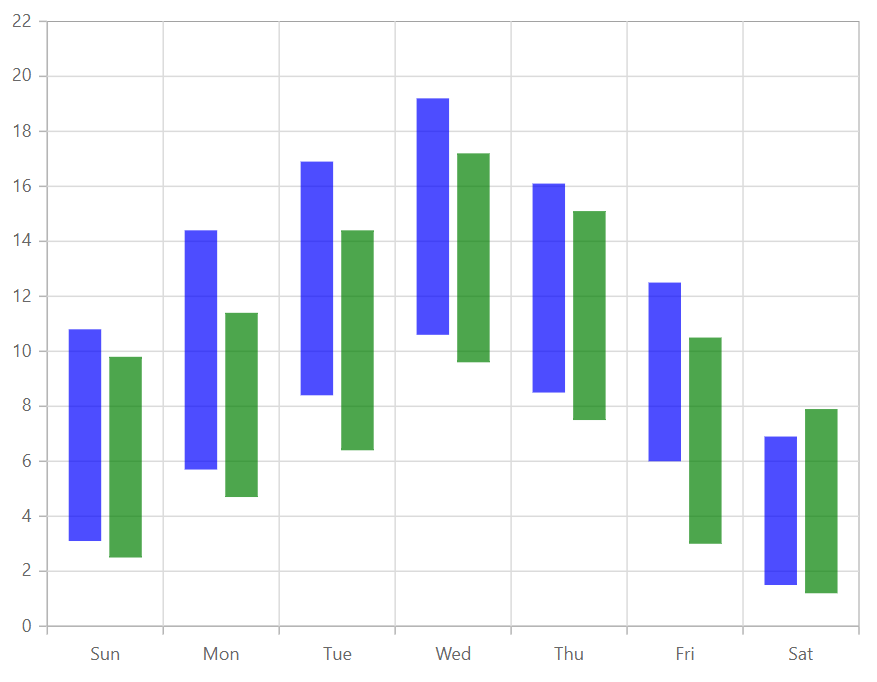

# Range Column

## Range

Like the column chart, but shows the variations in the data values for a given time using vertical bars. To render a range column series, use series [`Type`](https://help.syncfusion.com/cr/cref_files/aspnetcore-js2/aspnetcore/Syncfusion.EJ2~Syncfusion.EJ2.Charts.ChartSeries~Type.html) as `RangeColumn`.






## Customization

You can use the following properties to customize the range column series.

* [`Fill`](https://help.syncfusion.com/cr/cref_files/aspnetcore-js2/aspnetcore/Syncfusion.EJ2~Syncfusion.EJ2.Charts.ChartSeries~Fill.html) – used to change the color of the range column.
* [`Opacity`](https://help.syncfusion.com/cr/blazor/Syncfusion.Blazor~Syncfusion.Blazor.Charts.ChartSeries~Opacity.html) – used to control the transparency of the chart series.
* [``DashArray``](https://help.syncfusion.com/cr/cref_files/aspnetcore-js2/aspnetcore/Syncfusion.EJ2~Syncfusion.EJ2.Charts.ChartSeries~DashArray.html) – used to render range column series with dashes.
* [`Border`](https://help.syncfusion.com/cr/blazor/Syncfusion.Blazor~Syncfusion.Blazor.Charts.ChartSeries~Border.html) – used to render range column with border.
* [`ColumnSpacing`](https://help.syncfusion.com/cr/blazor/Syncfusion.Blazor~Syncfusion.Blazor.Charts.ChartSeries~ColumnSpacing.html) – used to render range column series between space.

```csharp
@using Syncfusion.Blazor.Charts

<SfChart Width="60%">
    <ChartPrimaryXAxis ValueType="Syncfusion.Blazor.Charts.ValueType.Category"></ChartPrimaryXAxis>

    <ChartSeriesCollection>
        <ChartSeries DataSource="@WeatherReport1" XName="X" High="High" Low="Low" Fill="blue" ColumnSpacing="0.2" Opacity="0.7" Type="ChartSeriesType.RangeColumn">
        </ChartSeries>
        <ChartSeries DataSource="@WeatherReport2" XName="X" High="High" Low="Low" Fill="green" ColumnSpacing="0.2" Opacity="0.7" Type="ChartSeriesType.RangeColumn">
        </ChartSeries>
    </ChartSeriesCollection>
</SfChart>

@code{
    public class ChartData
    {
        public string X;
        public double Low;
        public double High;
    }
    public List<ChartData> WeatherReport1 = new List<ChartData>
{
         new ChartData { X= "Sun", Low= 3.1, High= 10.8 },
         new ChartData { X= "Mon", Low= 5.7, High= 14.4 },
         new ChartData { X= "Tue", Low= 8.4, High= 16.9 },
         new ChartData { X= "Wed", Low= 10.6, High= 19.2 },
         new ChartData { X= "Thu", Low= 8.5, High= 16.1 },
         new ChartData { X= "Fri", Low= 6.0, High= 12.5 },
         new ChartData { X= "Sat", Low= 1.5, High= 6.9 }
    };

    public List<ChartData> WeatherReport2 = new List<ChartData>
{
         new ChartData { X= "Sun", Low= 2.5, High= 9.8 },
         new ChartData { X= "Mon", Low= 4.7, High= 11.4 },
         new ChartData { X= "Tue", Low= 6.4, High= 14.4 },
         new ChartData { X= "Wed", Low= 9.6, High= 17.2 },
         new ChartData { X= "Thu", Low= 7.5, High= 15.1 },
         new ChartData { X= "Fri", Low= 3.0, High= 10.5 },
         new ChartData { X= "Sat", Low= 1.2, High= 7.9 }
    };
}
```



## See Also

* [Data label](../data-labels)
* [Tooltip](../tool-tip)