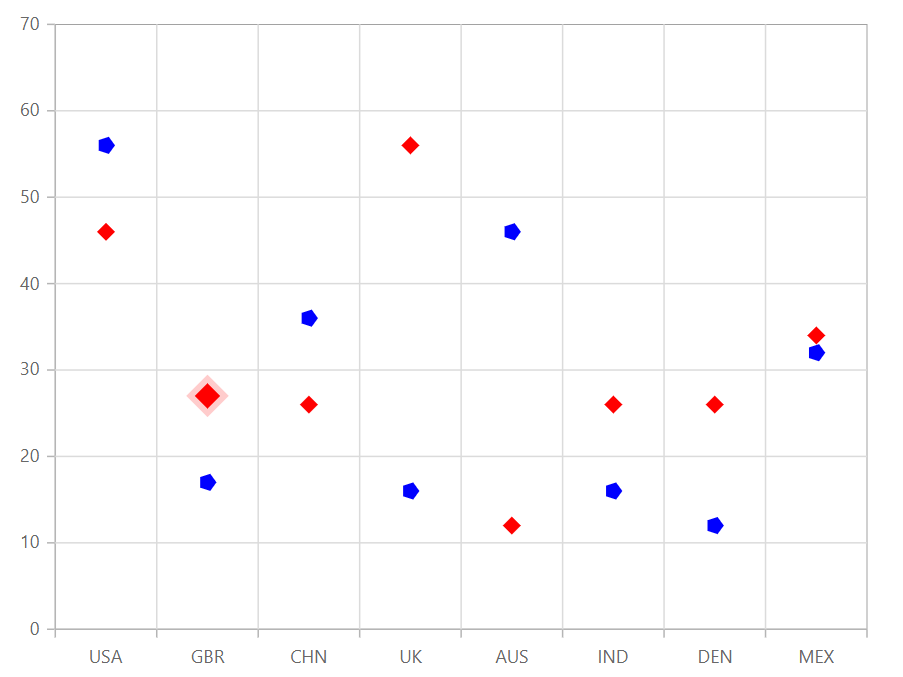

# Scatter Chart

## Scatter

Scatter plot or scatter chart plots data with two numeric parameters. To render a scatter series, use series [`Type`](https://help.syncfusion.com/cr/cref_files/aspnetcore-js2/aspnetcore/Syncfusion.EJ2~Syncfusion.EJ2.Charts.ChartSeries~Type.html) as `Scatter`.






## Customization

You can use the following properties to customize the scatter series.

* [`Fill`](https://help.syncfusion.com/cr/cref_files/aspnetcore-js2/aspnetcore/Syncfusion.EJ2~Syncfusion.EJ2.Charts.ChartSeries~Fill.html) – used to change the color of the scatter.
* [`Opacity`](https://help.syncfusion.com/cr/blazor/Syncfusion.Blazor~Syncfusion.Blazor.Charts.ChartSeries~Opacity.html) – used to control the transparency of the chart series.
* [`Shape`](https://help.syncfusion.com/cr/blazor/Syncfusion.Blazor~Syncfusion.Blazor.ChartCommonMarkerSettings~Shape.html) - used to change the shape of the scatter series.

```csharp
@using Syncfusion.Blazor.Charts

<SfChart Width="60%" DataSource="@SalesReports">
    <ChartPrimaryXAxis ValueType="Syncfusion.Blazor.Charts.ValueType.Category"></ChartPrimaryXAxis>

    <ChartSeriesCollection>
        <ChartSeries XName="X" YName="YValue" Fill="red" Type="ChartSeriesType.Scatter">
            <ChartMarker Visible="false" Width="12" Height="12" Shape="ChartShape.Diamond"></ChartMarker>
        </ChartSeries>
        <ChartSeries XName="X" YName="YValue1" Fill="blue" Type="ChartSeriesType.Scatter">
            <ChartMarker Visible="false" Width="12" Height="12" Shape="ChartShape.Pentagon"></ChartMarker>
        </ChartSeries>
    </ChartSeriesCollection>
</SfChart>

@code{
    public class ChartData
    {
        public string X;
        public double YValue;
        public double YValue1;
    }
    public List<ChartData> SalesReports = new List<ChartData>
        {
        new ChartData { X= "USA", YValue= 46, YValue1=56 },
        new ChartData { X= "GBR", YValue= 27, YValue1=17 },
        new ChartData { X= "CHN", YValue= 26, YValue1=36 },
        new ChartData { X= "UK", YValue= 56,  YValue1=16 },
        new ChartData { X= "AUS", YValue= 12, YValue1=46 },
        new ChartData { X= "IND", YValue= 26, YValue1=16 },
        new ChartData { X= "DEN", YValue= 26, YValue1=12 },
        new ChartData { X= "MEX", YValue= 34, YValue1=32},
        };
        }

```



## See Also

* [Data label](../data-labels)
* [Tooltip](../tool-tip)