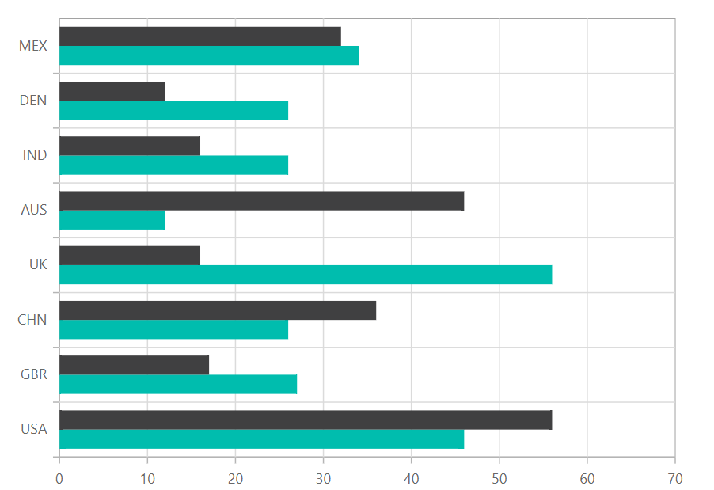

# 100% Stacked Bar

## 100% Stacked

Shows the relative percentage of multiple data series in stacked bars. The cumulative proportion of each stacked bar always totals 100%. To render a 100% stacked bar series, use series [`Type`](https://help.syncfusion.com/cr/cref_files/aspnetcore-js2/aspnetcore/Syncfusion.EJ2~Syncfusion.EJ2.Charts.ChartSeries~Type.html) as `StackingBar100`.

{% aspTab template="chart/series/bar-charts/100%stackedbar", sourceFiles="stackedbar100.razor" %}



## Stacking Group

You can use the [`StackingGroup`](https://help.syncfusion.com/cr/cref_files/aspnetcore-js2/aspnetcore/Syncfusion.EJ2~Syncfusion.EJ2.Charts.ChartSeries~StackingGroup.html) property to group the stacked
bar and 100% stacked bar. Bars with same group name are stacked on top of each other.





## Customization

You can use the following properties to customize the 100% stacked bar series.

* [`Fill`](https://help.syncfusion.com/cr/cref_files/aspnetcore-js2/aspnetcore/Syncfusion.EJ2~Syncfusion.EJ2.Charts.ChartSeries~Fill.html) – used to change the color of the 100% stacked bar.
* [`Opacity`](https://help.syncfusion.com/cr/blazor/Syncfusion.Blazor~Syncfusion.Blazor.Charts.ChartSeries~Opacity.html) – used to control the transparency of the chart series.
* [``DashArray``](https://help.syncfusion.com/cr/cref_files/aspnetcore-js2/aspnetcore/Syncfusion.EJ2~Syncfusion.EJ2.Charts.ChartSeries~DashArray.html) – used to render 100% stacked bar series with dashes.
* [`Border`](https://help.syncfusion.com/cr/blazor/Syncfusion.Blazor~Syncfusion.Blazor.Charts.ChartSeries~Border.html) – used to render 100% stacked bar with border.





## See Also

* [Data label](../data-labels)
* [Tooltip](../tool-tip)