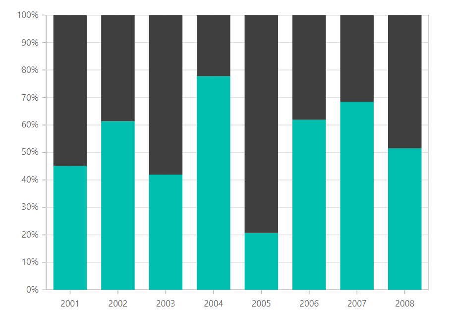
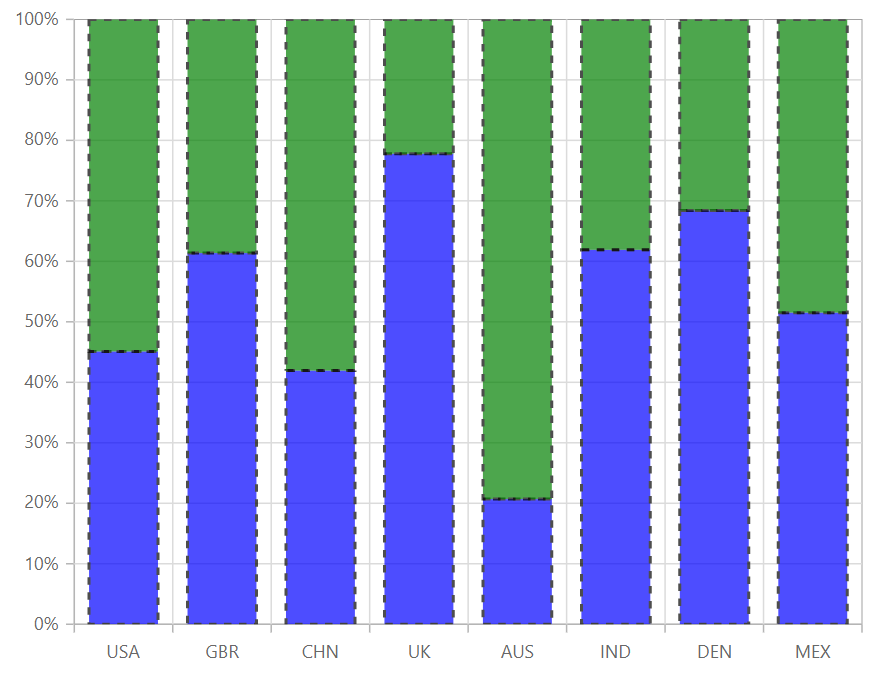

# 100% Stacked Column

## 100% Stacked

Shows the relative percentage of multiple data series in stacked columns. The cumulative proportion of each stacked column always totals 100%. To render a 100% stacked column series, use series [`Type`](https://help.syncfusion.com/cr/cref_files/aspnetcore-js2/aspnetcore/Syncfusion.EJ2~Syncfusion.EJ2.Charts.ChartSeries~Type.html) as `StackingColumn100`.

{% aspTab template="chart/series/column-charts/100%stackedcolumn", sourceFiles="stackedcolumn100.razor" %}





## Stacking Group

You can use the [`StackingGroup`](https://help.syncfusion.com/cr/cref_files/aspnetmvc-js2/Syncfusion.EJ2~Syncfusion.EJ2.Charts.ChartSeries~StackingGroup.html) property to group the stacked columns and 100% stacked columns.
Columns with same group name are stacked on top of each other.





## Customization

You can use the following properties to customize the 100% stacked column series.

* [`Fill`](https://help.syncfusion.com/cr/cref_files/aspnetcore-js2/aspnetcore/Syncfusion.EJ2~Syncfusion.EJ2.Charts.ChartSeries~Fill.html) – used to change the color of the 100% stacked column.
* [`Opacity`](https://help.syncfusion.com/cr/blazor/Syncfusion.Blazor~Syncfusion.Blazor.Charts.ChartSeries~Opacity.html) – used to control the transparency of the chart series.
* [``DashArray``](https://help.syncfusion.com/cr/cref_files/aspnetcore-js2/aspnetcore/Syncfusion.EJ2~Syncfusion.EJ2.Charts.ChartSeries~DashArray.html) – used to render 100% stacked column series with dashes.
* [`Border`](https://help.syncfusion.com/cr/blazor/Syncfusion.Blazor~Syncfusion.Blazor.Charts.ChartSeries~Border.html) – used to render 100% stacked column with border.

```csharp
@using Syncfusion.Blazor.Charts

<SfChart Width="60%">
    <ChartPrimaryXAxis ValueType="Syncfusion.Blazor.Charts.ValueType.Category"></ChartPrimaryXAxis>

    <ChartSeriesCollection>
        <ChartSeries DataSource="@MedalDetails" XName="X" YName="YValue" DashArray="5,5" Fill="blue" Opacity="0.7" Type="ChartSeriesType.StackingColumn100">
            <ChartSeriesBorder Width="2" Color="black"></ChartSeriesBorder>
        </ChartSeries>
        <ChartSeries DataSource="@MedalDetails" XName="X" YName="YValue1" DashArray="5,5" Fill="green" Opacity="0.7" Type="ChartSeriesType.StackingColumn100">
            <ChartSeriesBorder Width="2" Color="black"></ChartSeriesBorder>
        </ChartSeries>
    </ChartSeriesCollection>
</SfChart>

@code{
    public class ChartData
    {
        public string X;
        public double YValue;
        public double YValue1;
    }
    public List<ChartData> MedalDetails = new List<ChartData>
{
        new ChartData { X= "USA", YValue= 46, YValue1=56 },
        new ChartData { X= "GBR", YValue= 27, YValue1=17 },
        new ChartData { X= "CHN", YValue= 26, YValue1=36 },
        new ChartData { X= "UK", YValue= 56,  YValue1=16 },
        new ChartData { X= "AUS", YValue= 12, YValue1=46 },
        new ChartData { X= "IND", YValue= 26, YValue1=16 },
        new ChartData { X= "DEN", YValue= 26, YValue1=12 },
        new ChartData { X= "MEX", YValue= 34, YValue1=32},
    };
}
```



## See Also

* [Data label](../data-labels)
* [Tooltip](../tool-tip)