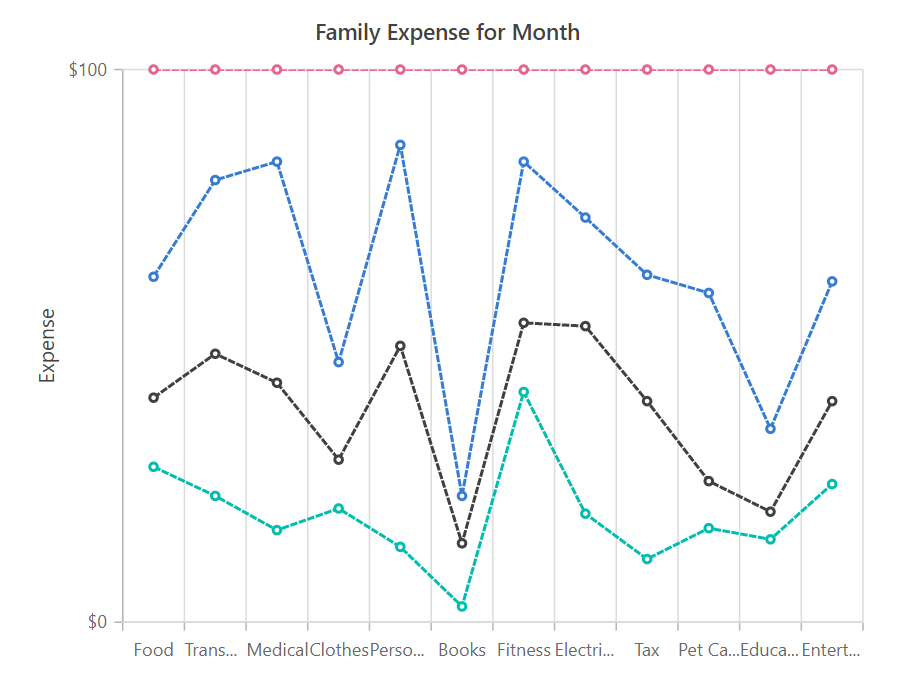

# 100% Stacked Line

## 100% Stacked

This chart shows the percentage contribution to a whole categories. To render a 100% stacked line series, use series [`Type`](https://help.syncfusion.com/cr/cref_files/aspnetcore-js2/aspnetcore/Syncfusion.EJ2~Syncfusion.EJ2.Charts.ChartSeries~Type.html) as `StackingLine100`.





## Customization

You can use the following properties to customize 100% stacked line series.

* [`Fill`](https://help.syncfusion.com/cr/cref_files/aspnetcore-js2/aspnetcore/Syncfusion.EJ2~Syncfusion.EJ2.Charts.ChartSeries~Fill.html) – used to change the color of 100% stacked line.
* [`Width`](https://help.syncfusion.com/cr/cref_files/aspnetcore-js2/aspnetcore/Syncfusion.EJ2~Syncfusion.EJ2.Charts.ChartSeries~Width.html) – used to change the width of 100% stacked line.
* [`Opacity`](https://help.syncfusion.com/cr/blazor/Syncfusion.Blazor~Syncfusion.Blazor.Charts.ChartSeries~Opacity.html) – used to control the transparency of the chart series.
* [``DashArray``](https://help.syncfusion.com/cr/cref_files/aspnetcore-js2/aspnetcore/Syncfusion.EJ2~Syncfusion.EJ2.Charts.ChartSeries~DashArray.html) – used to render 100% stacked line series with dashes.

## See Also

* [Data label](../data-labels)
* [Tooltip](../tool-tip)