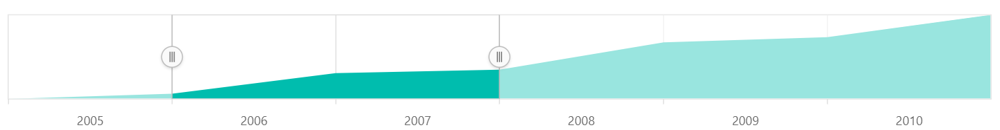

<!-- markdownlint-disable MD040 -->

# Getting Started

This section briefly explains about how to include a `RangeNavigator` in your Blazor server-side application. You can refer [Getting Started with Syncfusion Blazor for Server-Side in Visual Studio 2019](https://blazor.syncfusion.com/documentation/getting-started/blazor-webassembly/) page for the introduction and configuring the common specifications.

## Importing Syncfusion Blazor component in the application

1. Install **Syncfusion.Blazor** NuGet package to the application by using the NuGet Package Manager. Please ensure to check the **Include prerelease** option.
2. You can add the client-side style resources through CDN or from NuGet package in the `HEAD` element of the `~/Pages/_Host.cshtml` page.

```html
<head>
    <link href="_content/Syncfusion.Blazor/styles/bootstrap4.css" rel="stylesheet" />
</head>
```

**Note:** The same theme file can be referred through the CDN version by using `https://cdn.syncfusion.com/blazor/18.1.36-beta/styles/bootstrap4.css`

> For Internet Explorer 11 kindly refer the polyfills. Refer the [`documentation`](https://blazor.syncfusion.com/documentation/common/how-to/render-blazor-server-app-in-ie/) for more information.

```html
<head>
    <link href="_content/Syncfusion.Blazor/styles/bootstrap4.css" rel="stylesheet" />
    <script src="https://github.com/Daddoon/Blazor.Polyfill/releases/download/3.0.1/blazor.polyfill.min.js"></script>
</head>
```

## Adding component package to the application

Open `**~/_Imports.razor` file and import the `Syncfusion.Blazor.**`

```csharp
@using Syncfusion.Blazor
@using Syncfusion.Blazor.Charts
```

## Add SyncfusionBlazor service in Startup.cs

Open the **Startup.cs** file and add services required by Syncfusion components using **service.AddSyncfusionBlazor()** method. Add this method in the **ConfigureServices** function as follows.

```csharp
using Syncfusion.Blazor;
namespace BlazorApplication
{
    public class Startup
    {
        ....
        ....
        public void ConfigureServices(IServiceCollection services)
        {
            ....
            ....
            services.AddSyncfusionBlazor();
        }
    }
}
```

**Note:** To enable custom client side resource loading from CRG or CDN. You need to disable resource loading by `AddSyncfusionBlazor(true)` and load the scripts in the **HEAD** element of the **~/Pages/_Host.cshtml** page.

```csharp
<head>
    <script src="https://cdn.syncfusion.com/blazor/18.1.36-beta/dist/syncfusion-blazor.min.js"></script>
</head>
```

## Adding RangeNavigator component to the application

Now, add the Syncfusion Blazor components in any web page (razor) in the Pages folder. For example, the `Range navigator` component is added in the **~/Pages/Index.razor** page.

```csharp
<SfRangeNavigator></SfRangeNavigator>
```

## Populate Range Navigator with Data

To bind data for the Range Navigator component, you can assign a IEnumerable object to
the [`DataSource`](https://help.syncfusion.com/cr/blazor/Syncfusion.Blazor~Syncfusion.Blazor.Charts.RangeNavigatorSeries~DataSource.html) property. The list can also be provided as an instance of the **DataManager**.

```csharp
public class StockPrice
{
    public DateTime Date;
    public double Close;
}
public List<StockPrice> StockDetails = new List<StockPrice>
        {
            new StockPrice { Date = new DateTime(2005, 01, 01), Close = 21 },
            new StockPrice { Date = new DateTime(2006, 01, 01), Close = 24 },
            new StockPrice { Date = new DateTime(2007, 01, 01), Close = 36 },
            new StockPrice { Date = new DateTime(2008, 01, 01), Close = 38 },
            new StockPrice { Date = new DateTime(2009, 01, 01), Close = 54 },
            new StockPrice { Date = new DateTime(2010, 01, 01), Close = 57 },
            new StockPrice { Date = new DateTime(2011, 01, 01), Close = 62 }
        };
```

Now map the field names `Date` and `Close` in the data to the [`XName`](https://help.syncfusion.com/cr/blazor/Syncfusion.Blazor~Syncfusion.Blazor.Charts.RangeNavigatorSeries~XName.html) and [`YName`](https://help.syncfusion.com/cr/blazor/Syncfusion.Blazor~Syncfusion.Blazor.Charts.RangeNavigatorSeries~YName.html) properties of the range navigator series, then set the StockDetails to [`DataSource`](https://help.syncfusion.com/cr/blazor/Syncfusion.Blazor~Syncfusion.Blazor.Charts.RangeNavigatorSeries~DataSource.html) property.

```csharp
<SfRangeNavigator Value="@Value" ValueType="Syncfusion.EJ2.Blazor.Charts.RangeValueType.DateTime" IntervalType="RangeIntervalType.Years" LabelFormat="yyyy">
    <RangeNavigatorSeriesCollection>
        <RangeNavigatorSeries DataSource="@StockDetails" XName="Date" Type="RangeNavigatorType.Area" YName="Close"></RangeNavigatorSeries>
    </RangeNavigatorSeriesCollection>
</SfRangeNavigator>
```

## Run the application

After successful compilation of your application, the Syncfusion Blazor Range Navigator component will render in the web browser.



## See also

* [Getting Started with Syncfusion Blazor for Client-Side in .NET Core CLI](https://blazor.syncfusion.com/documentation/getting-started/blazor-webassembly-dotnet-cli/)
* [Getting Started with Syncfusion Blazor for Server-Side in Visual Studio 2019 Preview](https://blazor.syncfusion.com/documentation/getting-started/server-side-blazor/?no-cache=1)
* [Getting Started with Syncfusion Blazor for Server-Side in .NET Core CLI](https://blazor.syncfusion.com/documentation/getting-started/server-side-blazor-dotnet-cli/)