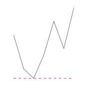

# Axis Customization

You can customize axis value types and min and max values of the Sparkline Charts.

## Change value type of the Sparkline Charts

You can change the Sparkline Charts value type by setting the [`ValueType`](https://help.syncfusion.com/cr/cref_files/aspnetcore-blazor/Syncfusion.Blazor~Syncfusion.Blazor.Charts.ValueType.html) property to [`Numeric`](https://help.syncfusion.com/cr/cref_files/aspnetcore-blazor/Syncfusion.Blazor~Syncfusion.Blazor.Charts.ValueType.html), [`Category`](https://help.syncfusion.com/cr/cref_files/aspnetcore-blazor/Syncfusion.Blazor~Syncfusion.Blazor.Charts.ValueType.html), or [`DateTime`](https://help.syncfusion.com/cr/cref_files/aspnetcore-blazor/Syncfusion.Blazor~Syncfusion.Blazor.Charts.ValueType.html).

### Category

You can assign category values to the Sparkline Charts by setting [`ValueType`](https://help.syncfusion.com/cr/cref_files/aspnetcore-blazor/Syncfusion.Blazor~Syncfusion.Blazor.Charts.ValueType.html) to [`Category`](https://help.syncfusion.com/cr/cref_files/aspnetcore-blazor/Syncfusion.Blazor~Syncfusion.Blazor.Charts.ValueType.html).

```csharp
@using Syncfusion.Blazor.Charts

<SfSparkline XName="EmployeeName"
              YName="WorkHours"
              TValue="WorkDetails"
              DataSource='EmployeeWorkReport'
              Type="SparklineType.Column"
              ValueType="SparklineValueType.Category"
              Height="150px"
              Width="130px">
</SfSparkline>

@code {
    public class WorkDetails
    {
        public string EmployeeName;
        public double WorkHours;
    };
    private List<WorkDetails> EmployeeWorkReport = new List<WorkDetails> {
        new WorkDetails { EmployeeName = "Robert", WorkHours= 60 },
        new WorkDetails { EmployeeName = "Andrew", WorkHours= 65 },
        new WorkDetails { EmployeeName = "Suyama", WorkHours= 70 },
        new WorkDetails { EmployeeName = "Michael", WorkHours= 80 },
        new WorkDetails { EmployeeName = "Janet", WorkHours= 55 },
        new WorkDetails { EmployeeName = "Davolio", WorkHours= 90 },
        new WorkDetails { EmployeeName = "Fuller", WorkHours= 75 },
        new WorkDetails { EmployeeName = "Nancy", WorkHours= 85 }
    };
}
```


### Numeric

You can assign numeric values to the Sparkline Charts by setting [`ValueType`](https://help.syncfusion.com/cr/cref_files/aspnetcore-blazor/Syncfusion.Blazor~Syncfusion.Blazor.Charts.ValueType.html) to [`Numeric`](https://help.syncfusion.com/cr/cref_files/aspnetcore-blazor/Syncfusion.Blazor~Syncfusion.Blazor.Charts.ValueType.html)

```csharp
@using Syncfusion.Blazor.Charts

<SfSparkline DataSource="ExpenditureReport"
              TValue="ExpenditureDetails"
              XName="Year"
              YName="Expense"
              Type="SparklineType.Column"
              ValueType="SparklineValueType.Numeric"
              Height="150px"
              Width="130px">
</SfSparkline>

@code {
    public class ExpenditureDetails
    {
        public int Year;
        public int Expense;
    };
    private List<ExpenditureDetails> ExpenditureReport = new List<ExpenditureDetails> {
        new ExpenditureDetails{ Year= 2010, Expense= 190 },
        new ExpenditureDetails{ Year= 2011, Expense= 165 },
        new ExpenditureDetails{ Year= 2012, Expense= 158 },
        new ExpenditureDetails{ Year= 2013, Expense= 175 },
        new ExpenditureDetails{ Year= 2014, Expense= 200 },
        new ExpenditureDetails{ Year= 2015, Expense= 180 },
        new ExpenditureDetails{ Year= 2016, Expense= 210 }
    };
}
```


## Change min and max values of axis

You can change the min and max values of x-axis by setting the [`MinX`](https://help.syncfusion.com/cr/cref_files/aspnetcore-blazor/Syncfusion.Blazor~Syncfusion.Blazor.Charts.SparklineAxisSettings~_minX.html) and [`MaxX`](https://help.syncfusion.com/cr/cref_files/aspnetcore-blazor/Syncfusion.Blazor~Syncfusion.Blazor.Charts.SparklineAxisSettings~_maxX.html) values to the [`SparklineAxisSettings`](https://help.syncfusion.com/cr/blazor/Syncfusion.Blazor~Syncfusion.Blazor.Charts.SparklineAxisSettings.html) tag.

You can also change the min and max values of y-axis by setting the [`MinY`](https://help.syncfusion.com/cr/cref_files/aspnetcore-blazor/Syncfusion.Blazor~Syncfusion.Blazor.Charts.SparklineAxisSettings~_minY.html) and [`MaxY`](https://help.syncfusion.com/cr/cref_files/aspnetcore-blazor/Syncfusion.Blazor~Syncfusion.Blazor.Charts.SparklineAxisSettings~_maxY.html) values to the [`SparklineAxisSettings`](https://help.syncfusion.com/cr/cref_files/aspnetcore-blazor/Syncfusion.Blazor~Syncfusion.Blazor.Charts.SparklineAxisSettings.html) tag.

```csharp
@using Syncfusion.Blazor.Charts

<SfSparkline DataSource="ExpenditureReport"
              TValue="ExpenditureDetails"
              XName="Year"
              YName="Expense"
              Type="SparklineType.Column"
              ValueType="SparklineValueType.Numeric"
              Height="150px"
              Width="130px">
    <SparklineAxisSettings MinY="100" MaxY="220"></SparklineAxisSettings>
</SfSparkline>
```

> Refer [code block](#numeric) to know the property value of `ExpenditureReport`.


## Change value of axis

You can set horizontal axis line value of the Sparkline Charts by setting [`Value`](https://help.syncfusion.com/cr/cref_files/aspnetcore-blazor/Syncfusion.Blazor~Syncfusion.Blazor.Charts.SparklineAxisSettings~_value.html) to the [`SparklineAxisSettings`](https://help.syncfusion.com/cr/cref_files/aspnetcore-blazor/Syncfusion.Blazor~Syncfusion.Blazor.Charts.SparklineAxisSettings.html) tag. The following code example demonstrates this.

```csharp
@using Syncfusion.Blazor.Charts

<SfSparkline DataSource="ExpenditureReport"
              TValue="ExpenditureDetails"
              XName="Year"
              YName="Expense"
              Type="SparklineType.Column"
              Height="150px"
              Width="130px">
    <SparklineAxisSettings Value="170"></SparklineAxisSettings>
</SfSparkline>
```

> Refer [code block](#numeric) to know the property value of `ExpenditureReport`.


## Axis line customization

Axis of the Sparkline Charts can be collapsed using the [`Visible`](https://help.syncfusion.com/cr/cref_files/aspnetcore-blazor/Syncfusion.Blazor~Syncfusion.Blazor.Charts.SparklineAxisLineSettings~Visible.html) property in [`LineSettings`](https://help.syncfusion.com/cr/cref_files/aspnetcore-blazor/Syncfusion.Blazor~Syncfusion.Blazor.Charts.SparklineAxisLineSettings.html); this is not applicable for win-loss type.

You can customize the [`Color`](https://help.syncfusion.com/cr/cref_files/aspnetcore-blazor/Syncfusion.Blazor~Syncfusion.Blazor.Charts.SparklineAxisLineSettings.html), [`Width`](https://help.syncfusion.com/cr/cref_files/aspnetcore-blazor/Syncfusion.Blazor~Syncfusion.Blazor.Charts.SparklineAxisLineSettings~_width.html), [`Opacity`](https://help.syncfusion.com/cr/cref_files/aspnetcore-blazor/Syncfusion.Blazor~Syncfusion.Blazor.Charts.SparklineAxisLineSettings~_opacity.html), and [`DashArray`](https://help.syncfusion.com/cr/cref_files/aspnetcore-blazor/Syncfusion.Blazor~Syncfusion.Blazor.Charts.SparklineAxisLineSettings~_opacity.html) of axis line.

```csharp
@using Syncfusion.Blazor.Charts

<SfSparkline DataSource="ExpenditureReport"
              TValue="ExpenditureDetails"
              XName="Year"
              YName="Expense"
              Type="SparklineType.Line"
              Height="150px"
              Width="130px">
    <SparklineAxisSettings>
        <SparklineAxisLineSettings Visible="true" Color="#ff14ae" DashArray="5"></SparklineAxisLineSettings>
    </SparklineAxisSettings>
</SfSparkline>
```

> Refer [code block](#numeric) to know the property value of `ExpenditureReport`.


