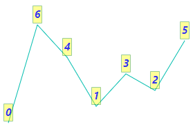

# Data Labels

Data labels are used to display values of data points to improve the readability.

## Enable data label

To enable data label for Sparkline Charts series, provide [`Visible`](https://help.syncfusion.com/cr/blazor/Syncfusion.Blazor~Syncfusion.Blazor.Charts.SparklineDataLabelSettings~Visible.html) of the [`SparklineDataLabelSettings`](https://help.syncfusion.com/cr/blazor/Syncfusion.Blazor~Syncfusion.Blazor.Charts.SparklineDataLabelSettings.html) as following possible values:

* All - Enables data label of  all points.
* Start - Enables data label of the start point.
* End - Enables data label of the end point.
* High - Enables data label of the high point.
* Low - Enables data label of the low point.
* Negative - Enables data labels of the negative points.

The following example shows enabling Sparkline Charts data label for all points.

```csharp
@using Syncfusion.Blazor.Charts

<SfSparkline DataSource="new int[]{ 0, 6, 4, 1, 3, 2, 5 }"
              Type="SparklineType.Line"
              Height="200px"
              Width="350px">
    <SparklineAxisSettings MinX="-1" MaxX="7" MaxY="7" MinY="-1"></SparklineAxisSettings>
    <SparklineDataLabelSettings Visible="@dataLabelSettings"></SparklineDataLabelSettings>
</SfSparkline>

@code {
    private List<VisibleType> dataLabelSettings = new List<VisibleType> { VisibleType.All };
}
```


## Customize data label

Following data label properties can be customized using [`SparklineDataLabelSettings`](https://help.syncfusion.com/cr/cref_files/aspnetcore-blazor/Syncfusion.Blazor~Syncfusion.Blazor.Charts.SparklineDataLabelSettings.html) tag.

* [`Fill`](https://help.syncfusion.com/cr/blazor/Syncfusion.Blazor~Syncfusion.Blazor.Charts.SparklineDataLabelSettings~Fill.html) - Specifies fill color for data label
* [`Opacity`](https://help.syncfusion.com/cr/blazor/Syncfusion.Blazor~Syncfusion.Blazor.Charts.SparklineDataLabelSettings~Opacity.html) - Specifies opacity of fill color for data label.
* [`EdgeLabelMode`](https://help.syncfusion.com/cr/blazor/Syncfusion.Blazor~Syncfusion.Blazor.Charts.SparklineDataLabelSettings~EdgeLabelMode.html) - Specifies controlling option when label comes in edge. Available options are 'Shift', 'None' and 'Hide'
* [`SparklineFont`](https://help.syncfusion.com/cr/blazor/Syncfusion.Blazor~Syncfusion.Blazor.Charts.SparklineFont.html) - To customize data label font family, style, weight, color, opacity and size
* [`SparklineDataLabelBorder`](https://help.syncfusion.com/cr/blazor/Syncfusion.Blazor~Syncfusion.Blazor.Charts.SparklineDataLabelBorder.html) - To customize data label border width and color
* [`SparklineDataLabelOffset`](https://help.syncfusion.com/cr/blazor/Syncfusion.Blazor~Syncfusion.Blazor.Charts.SparklineDataLabelOffset.html) - Specifies label offset position from its default position.

The following code example shows customizing data label border, text color, and fill color.

```csharp
@using Syncfusion.Blazor.Charts

<SfSparkline DataSource="new int[]{ 0, 6, 4, 1, 3, 2, 5 }"
              Type="SparklineType.Line"
              Height="200px"
              Width="350px">
    <SparklineAxisSettings MinX="-1" MaxX="7" MaxY="7" MinY="-1"></SparklineAxisSettings>
    <SparklineDataLabelSettings Visible="@dataLabelSettings"
                                Fill="yellow"
                                Opacity="0.4"
                                EdgeLabelMode="EdgeLabelMode.Shift" >
        <SparklineFont Color="blue"
                       FontStyle="italic"
                       FontWeight="bold"
                       Size="15"
                       Opacity="0.8">
        </SparklineFont>
        <SparklineDataLabelBorder Color="green"
                                  Width="1">
        </SparklineDataLabelBorder>
    </SparklineDataLabelSettings>
</SfSparkline>

@code {
    private List<VisibleType> dataLabelSettings = new List<VisibleType> { VisibleType.All };
}
```



## Format data label text

The text of data labels can be formatted using the [`Format`](https://help.syncfusion.com/cr/blazor/Syncfusion.Blazor~Syncfusion.Blazor.Charts.SparklineDataLabelSettings~Format.html) API in the Sparkline Charts [`SparklineDataLabelSettings`](https://help.syncfusion.com/cr/blazor/Syncfusion.Blazor~Syncfusion.Blazor.Charts.SparklineDataLabelSettings.html). By default, data label shows the y-value of point. The following code example shows how to display x and y-values for points.

```csharp
@using Syncfusion.Blazor.Charts

<SfSparkline DataSource="ClimateData"
              TValue="WeatherReport"
              XName="Month"
              YName="Celsius"
              ValueType="SparklineValueType.Category"
              Height="200px"
              Width="500px">
    <SparklineDataLabelSettings Visible="new List<VisibleType> { VisibleType.All}"
                                Format="${Month} - ${Celsius}"
                                EdgeLabelMode="EdgeLabelMode.Shift">
    </SparklineDataLabelSettings>
    <SparklinePadding Top="25"></SparklinePadding>
</SfSparkline>
@code {
    public class WeatherReport
    {
        public string Month;
        public double Celsius;
    };
    private List<WeatherReport> ClimateData = new List<WeatherReport> {
        new  WeatherReport { Month= "Jan", Celsius= 34 },
        new  WeatherReport { Month= "Feb", Celsius= 36 },
        new  WeatherReport { Month= "Mar", Celsius= 32 },
        new  WeatherReport { Month= "Apr", Celsius= 35 },
        new  WeatherReport { Month= "May", Celsius= 40 },
        new  WeatherReport { Month= "Jun", Celsius= 38 },
        new  WeatherReport { Month= "Jul", Celsius= 33 },
        new  WeatherReport { Month= "Aug", Celsius= 37 },
        new  WeatherReport { Month= "Sep", Celsius= 34 },
        new  WeatherReport { Month= "Oct", Celsius= 31 },
        new  WeatherReport { Month= "Nov", Celsius= 30 },
        new  WeatherReport { Month= "Dec", Celsius= 29}
    };
}
```

