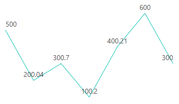

# Globalization

## Internationalization

Internationalization library provides support for formatting and parsing the number using the official [Unicode CLDR](http://cldr.unicode.org/) JSON data and also provides the `loadCldr` method to load the culture specific CLDR JSON data. The Sparkline Chart component comes with built-in internationalization support to adapt based on culture.

By default, all the Blazor components are specific to English culture ('en-US'). If you want to go with a different culture, follow the below steps:

* Install the [`CLDR-Data`](http://cldr.unicode.org/index/cldr-spec/json) package using the following command (it installs the CLDR JSON data): To
know more about CLDR-Data, refer to the
[CLDR-Data](http://cldr.unicode.org/index/cldr-spec/json).

```cmd
npm install cldr-data --save
```

After the package has been installed, you can find the culture specific JSON data under the following location `\node_modules\cldr-data\main`. Then copy the required `cldr-data` file into the `wwwroot\cldr-data` folder.

The Sparkline Chart component supports internationalization for the following elements:

* Data labels
* Tooltips

In the following code example, tooltip is set to the Deutsch culture.

```csharp
@using Microsoft.JSInterop
@using Syncfusion.Blazor
@using Syncfusion.Blazor.Charts

<SfSparkline DataSource="new double[]{ 300.00, 600.00, 400.21, 100.20, 300.70, 200.04, 500.00 }"
              Height="200px"
              Width="350px"
              Format="c2">
    <SparklineTooltipSettings Visible="true"></SparklineTooltipSettings>
</SfSparkline>

@code {
[Inject]
protected IJSRuntime JsRuntime { get; set; }

protected override void OnAfterRender()
{
    this.JsRuntime.Ejs().LoadCldrData(new string[] { "wwwroot/cldr-data/currencies.json", "wwwroot/cldr-data/numbers.json" }).SetCulture("de").SetCurrencyCode("EUR");
}
}
```


## RTL support

If you set the [`EnableRtl`](https://help.syncfusion.com/cr/blazor/Syncfusion.Blazor~Syncfusion.Blazor.Charts.SfSparkline%601~EnableRtl.html) property to true, then the Sparkline Charts will be rendered from right-to-left direction.

The following example shows the Sparkline Charts render from "Right-to-left".

```csharp
@using Syncfusion.Blazor.Charts

<SfSparkline DataSource="new double[]{ 300.00, 600.00, 400.21, 100.20, 300.70, 200.04, 500.00 }"
              Height="200px"
              Width="350px"
              Format="c2"
              EnableRtl="true">
    <SparklineDataLabelSettings Visible="@dataLabelSettings" EdgeLabelMode="EdgeLabelMode.Shift"></SparklineDataLabelSettings>
    <SparklinePadding Top="25"></SparklinePadding>
</SfSparkline>
@code {
    private List<VisibleType> dataLabelSettings = new List<VisibleType> { VisibleType.All };
}
```

