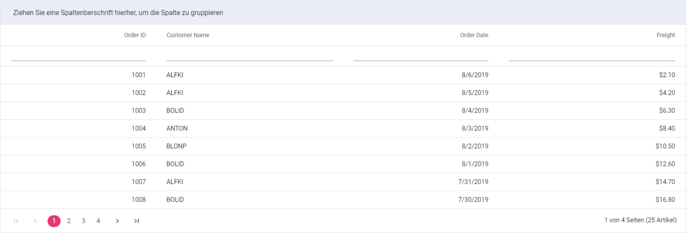

# Localization

Localization library allows you to localize the text content of the Syncfusion Blazor control.

## Loading translations

The following example demonstrates the Grid in `Deutsch` culture. Here, the `LoadLocaleData` method is used to load the `locale.json` file and the `SetCulture` method is set to the culture of the Component.

To set different culture, other than `English`, follow the below steps:

## Syncfusion locale text

Syncfusion `ej2-locale` repository contains currently supported locale translations for Syncfusion Blazor components in multiple languages.

* Download the required locale files to render the Blazor component with specified locale.

* Download the locale files of Blazor components from [GitHub](https://github.com/syncfusion/ej2-locale).

* After downloading the `ej2-locale` repository, copy the required locale files into the `wwwroot` folder.

* By default, the `ej2-locale` repository contains the localized text for static text present in components such as button, placeholder, tooltip, and more.

### Loading translation for Blazor Server application

The locale object can be loaded in the `./pages/index.razor` file using the following code snippet. The current locale can be changed for all Syncfusion Blazor components by invoking the `SetCulture` function with desired culture name.

```csharp
@functions {
    [Inject]
    protected IJSRuntime JsRuntime { get; set; }

     protected override async Task OnInitializedAsync()
    {
        await base.OnInitializedAsync();
        this.JsRuntime.Ejs().LoadLocaleData("wwwroot/de.json").SetCulture("de");
    }
}
```

### Localization translation for Blazor WebAssembly application

Inject the `HttpClient` module in the `index.razor` file using the following code snippet in the `pages/index.razor` file.

```csharp
@inject HttpClient Http;
```

To load locale object, read it using the `http` request, store using variable, and then load it as shown in the following code snippet in `./pages/index.razor`. The current locale can be changed for all Syncfusion Blazor components in your application by invoking the `SetCulture` function with desired culture name.

```csharp
@functions {
    [Inject]
    protected IJSRuntime JsRuntime { get; set; }

    protected override async Task OnInitializedAsync()
    {
        var Locale = await Http.GetJsonAsync<object>("ej2-locale/src/de.json");
        this.JsRuntime.Ejs().LoadLocaleData(Locale).SetCulture("de");
    }
}
```

Run the application.

The following screenshot illustrates the output.



## Customize the localized text

* You can change the localized text of a particular component by editing the `wwwroot/ej2-locale/src/{{locale name}}.json` file.

* In the following code, modify the localized text of `GroupDropArea` in `de` culture.

[`wwwroot/ej2-locale/src/de.json`]

```csharp
{
  "de": {
    "grid": {
        "GroupDropArea": "Ziehen Sie eine Spaltenberschrift hierher, um die Spalte zu gruppieren",
    }
  }
}
```
