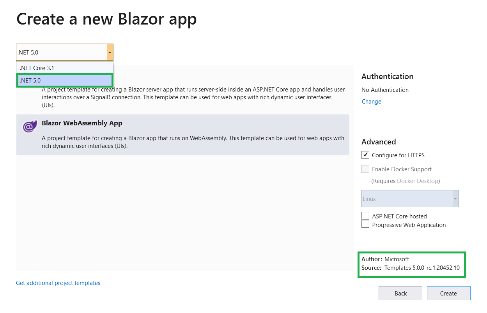
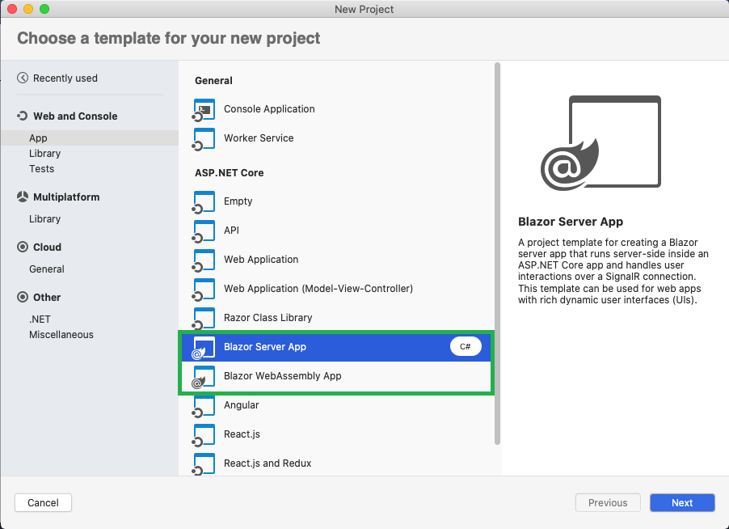
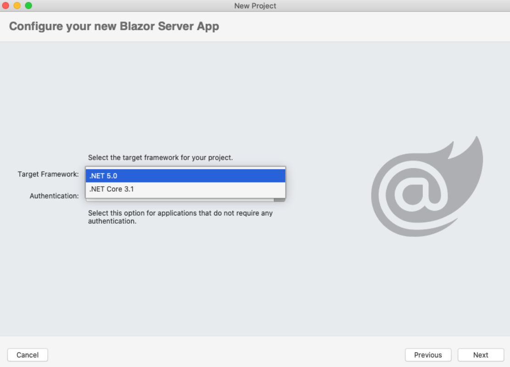
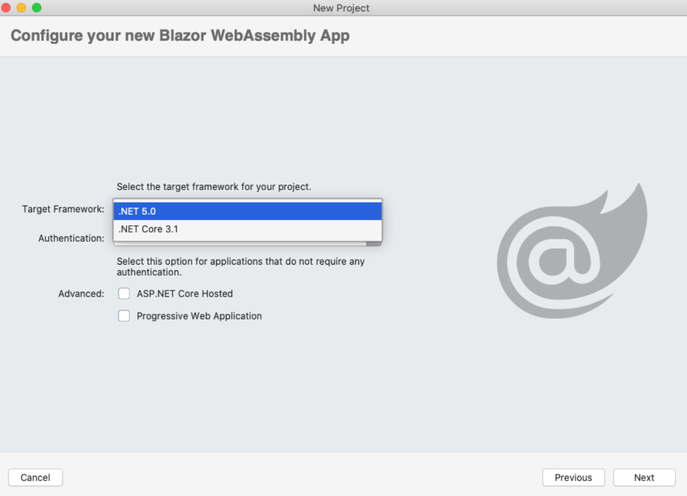
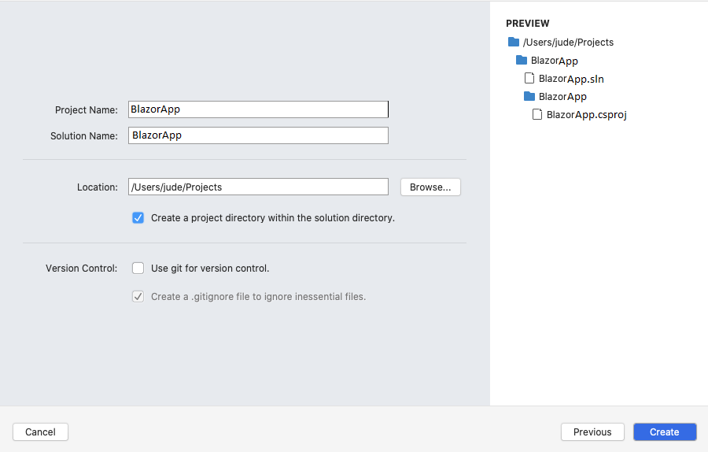

# Getting started with Syncfusion Blazor Application in Visual Studio 2019 preview with .NET 5.0 RC

This article provides a step-by-step introduction to configure Syncfusion Blazor setup, build and run a simple blazor application using [.NET 5.0 RC](https://dotnet.microsoft.com/download/dotnet/5.0)

## Visual Studio 2019 preview with .NET 5.0 RC - Windows

### Prerequisites

* [Visual Studio 2019 preview](https://visualstudio.microsoft.com/vs/preview/)
* [.NET 5.0 RC](https://dotnet.microsoft.com/download/dotnet/5.0)

### Create a Blazor Server/WebAssembly project using .NET 5.0 RC with visual studio 2019 preview

1. Choose **Create a new project** from the Visual Studio dashboard.

    

2. Select **Blazor App** from the template and click the **Next** button.

    

3. Now, the project configuration window will popup. Click **Create** button to create a new project with the default project configuration.

    

4. Choose **Blazor Server App / Blazor WebAssembly App** from the dashboard and click **Create** button to create a new Blazor Server application. Make sure **.NET 5.0** is selected at the top.

    

    > **Note:** .NET 5.0 available in Visual Studio 2019 preview version.

After that follows the as usual steps for importing syncfusion components in [Blazor Server](server-side-blazor#importing-syncfusion-blazor-component-in-the-application) / [Blazor WebAssembly](blazor-webassembly#importing-syncfusion-blazor-component-in-the-application) Application.

## Visual Studio 2019 preview with .NET 5.0 RC - Mac

This section provides a step-by-step introduction to configure Syncfusion Blazor setup, build and run a simple Blazor application using Mac.

### Prerequisites

* [Visual Studio for Mac](https://visualstudio.microsoft.com/vs/mac/)
* [.NET 5.0 RC](https://dotnet.microsoft.com/download/dotnet/5.0)

### Create a Blazor Server / WebAssembly project in Visual Studio for Mac

1. Choose **New** from the Visual Studio for Mac dashboard.

    

2. Select **Blazor Server / WebAssembly App** from the template and click the **Next** button.

    

3. Continue with **No Authentication** selection in Authentication and click **Next** button. Make sure **.NET 5.0** is selected at the top.

    

    For WebAssembly,

    

4. Now, the Blazor App project configuration window will popup. Click **Create** button to create a new project after filling Project name.

    

After that follows the as usual steps for importing syncfusion components in [Blazor Server](server-side-blazor-mac#importing-syncfusion-blazor-component-in-the-application) / [Blazor WebAssembly](blazor-webassembly-mac#importing-syncfusion-blazor-component-in-the-application) Application.