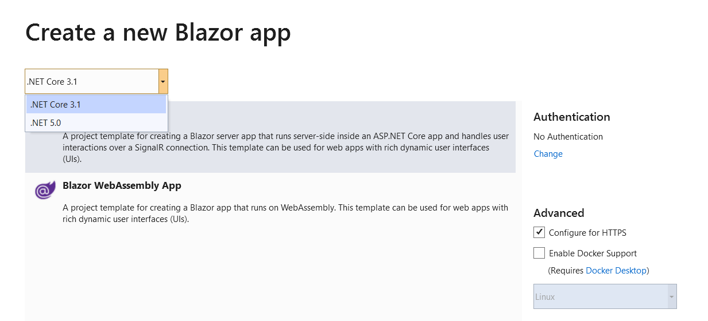
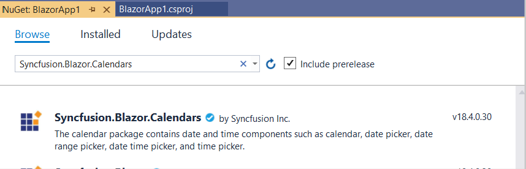

 <!-- markdownlint-disable MD024 -->

# Getting started with Syncfusion Blazor - WebAssembly App in Visual Studio 2019

This article provides a step-by-step introduction to configure Syncfusion Blazor setup, build and run a simple Blazor WebAssembly application using [Visual Studio 2019](https://visualstudio.microsoft.com/vs/).

> **Note:** Starting with version 17.4.0.39 (2019 Volume 4), you need to include a valid license key (either paid or trial key) within your applications. Please refer to this [help topic](https://help.syncfusion.com/common/essential-studio/licensing/license-key#blazor) for more information.

## Prerequisites

* [Visual Studio 2019](https://visualstudio.microsoft.com/vs/)
* [.NET Core SDK 3.1.8](https://dotnet.microsoft.com/download/dotnet-core/3.1) / [.NET 5.0 SDK](https://dotnet.microsoft.com/download/dotnet/5.0)

> **.NET Core SDK 3.1.8** requires Visual Studio 2019 16.7 or later.
>
> **.NET 5.0** requires Visual Studio 2019 16.8 or later.

## Create a Blazor WebAssembly project in Visual Studio 2019

1. Choose **Create a new project** from the Visual Studio dashboard.

    

2. Select **Blazor App** from the template and click **Next** button.

    

3. Now, the project configuration window will popup. Click **Create** button to create a new project with the default project configuration.

    

4. Select the target Framework **ASP.NET Core 3.1** or **.NET 5.0** at the top of the Application based on your required target that you want.

     

5. Choose **Blazor WebAssembly App** from the dashboard and click **Create** button to create a new Blazor WebAssembly application. 

    

## Importing Syncfusion Blazor component in the application

* Starting with Volume 4, 2020 (v18.4.0.30) release, Syncfusion provides [individual NuGet packages](https://blazor.syncfusion.com/documentation/nuget-packages/) for our Syncfusion Blazor components.

    > **Note:** You can use anyone of the below standards to add Syncfusion components in your Blazor application.

### Using Syncfusion individual NuGet Package [Suggested - New standard from v18.4.0.30]

1. Now, install **Syncfusion.Blazor.Calendars** NuGet package to the new application using the `NuGet Package Manager`. For more details about available NuGet packages, refer to the [Individual NuGet Packages](https://blazor.syncfusion.com/documentation/nuget-packages/) documentation.

2. Right-click the project and select Manage NuGet Packages.
     
    

3. Search **Syncfusion.Blazor.Calendars** keyword in the Browse tab and install **Syncfusion.Blazor.Calendars** NuGet package in the application.

    
    
4. The Syncfusion Blazor Calendars package will be installed in the project, once the installation process is completed.

5. Open **~/_Imports.razor** file and import the `Syncfusion.Blazor` namespace.

    ```csharp
    @using Syncfusion.Blazor
    @using Syncfusion.Blazor.Calendars
    ```

6. Open the **~/Program.cs** file and register the Syncfusion Blazor Service.

    ```csharp
    using Syncfusion.Blazor;

    namespace WebApplication1
    {
        public class Program
        {
            public static async Task Main(string[] args)
            {
                ....
                ....
                builder.Services.AddSyncfusionBlazor();
                await builder.Build().RunAsync();
            }
        }
    }
    ```

6. Add the Syncfusion bootstrap4 theme in the `<head>` element of the **~/wwwroot/index.html** page.

    ```html
    <head>
        ....
        ....
        <link href="_content/Syncfusion.Blazor.Themes/bootstrap4.css" rel="stylesheet" />
    </head>
    ```

    > Warning: `Syncfusion.Blazor` package should not install along with [individual NuGet packages](https://blazor.syncfusion.com/documentation/nuget-packages/). Hence, you have to use `Syncfusion.Blazor.Themes` package for applying Syncfusion themes in the application.

### Using Syncfusion.Blazor NuGet Package [Previous standard before v18.4.0.30]

> Warning: If you have used the above individual NuGet package standard, then skip this section. If you use both standards in the same project, it will throw ambiguous errors while compiling the application.

1. Now, install **Syncfusion.Blazor** NuGet package to the newly created application by using the `NuGet Package Manager`. Right-click the project and select Manage NuGet Packages.

    

2. Search **Syncfusion.Blazor** keyword in the Browse tab and install **Syncfusion.Blazor** NuGet package in the application.

    

3. The Syncfusion Blazor package will be installed in the project, once the installation process is completed.

4. Open **~/_Imports.razor** file and import the `Syncfusion.Blazor` namespace.

    ```csharp
    @using Syncfusion.Blazor
    @using Syncfusion.Blazor.Calendars
    ```

5. Open the **~/Program.cs** file and register the Syncfusion Blazor Service.

    ```csharp
    using Syncfusion.Blazor;

    namespace WebApplication1
    {
        public class Program
        {
            public static async Task Main(string[] args)
            {
                ....
                ....
                builder.Services.AddSyncfusionBlazor();
                await builder.Build().RunAsync();
            }
        }
    }
    ```

6. Add the Syncfusion bootstrap4 theme in the `<head>` element of the **~/wwwroot/index.html** page.

    ```html
    <head>
        ....
        ....
         <link href="_content/Syncfusion.Blazor/styles/bootstrap4.css" rel="stylesheet" />
    </head>
    ```
    > **Note:** The same theme file can be referred through the CDN version by using [https://cdn.syncfusion.com/blazor/{:version:}/styles/bootstrap4.css](https://cdn.syncfusion.com/blazor/18.4.30/styles/bootstrap4.css).
    

## Adding Syncfusion Component and Run the Application

1. Now, add the Syncfusion Blazor components in any web page (razor) in the `Pages` folder. For example, the calendar component is added in the **~/Pages/Index.razor** page.

    ```csharp
    <SfCalendar TValue="DateTime"></SfCalendar>
    ```

2. Run the application. The Syncfusion Blazor Calendar component will render in the web browser.

    
