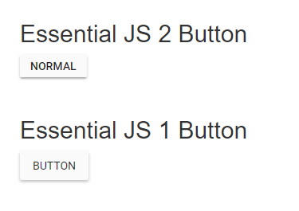

# Compatibility with Essential JS 1 JavaScript

This article provides a step-by-step introduction to configure the Essential JS 1 and Essential JS 2 JavaScript controls in a same web page.

## Prerequisites

To work with the Essential JS 1 and the Essential JS 2 controls compatibility in JavaScript, the below mentioned System requirements are necessary,

* [Essential JS 1 Dependencies](https://help.syncfusion.com/js/dependencies)
* [Node.js](https://nodejs.org/en/)
* [Visual Studio Code](https://code.visualstudio.com/)

## Creating JavaScript application with Essential JS 2 control

1. You can create a JavaScript application with the help of the given Essential JS 2 [Getting Started Documentation](./quick-start/).

2. Now the Essential JS 2 Button control rendered successfully in the web page.

## Adding Essential JS 1 control in the JavaScript application

1. Install the Essential JS 1 npm package with required dependent typing package in the JavaScript quick start application.

    ```sh
    npm install syncfusion-javascript @types/ej.web.all @types/jquery
    ```

    

2. Add the necessary Essential JS 1 scripts in the `<head>` element and add the HTML Button element inside `<body>` element in the `~/src/index.html` for rendering Essential JS 1 Button control.

    ```html
    <head>
        ....
        ....
        <script src="../node_modules/jquery/dist/jquery.min.js" type="text/javascript"></script>
        <script src="../node_modules/syncfusion-javascript/Scripts/ej/web/ej.web.all.min.js" type="text/javascript"></script>
    </head>
    <body>
        ....
        ....

        <div style="margin: 50px;">
            <h2>Essential JS 1 Button</h2>
            <!--Essential JS 1 button-->
            <button id="button">Button</button>
        </div>
    </body>
    ```

    > Refer to this [documentation](https://help.syncfusion.com/js/dependencies) to know more about Essential JS 1 dependencies.

3. After adding the HTML Button element, Add the Essential JS 1 compatibility style references in the `styles.css` file.

    > The compatibility styles of Essential JS 1 and Essential JS 2 must be added in the application to prevent the UI conflicts between the Essential JS 1 and Essential JS 2 controls.

    Replace the `style.css` file content with the below style references.

    ```css
    @import '../../node_modules/@syncfusion/ej2/styles/compatibility/material.css';
    @import '../../node_modules/syncfusion-javascript/Content/ej/web/material/ej.web.all.compatibility.min';
    ```

4. Add the Essential JS 1 type reference to the `types` compiler options in `~/tsconfig.json` file.

    ```json
    {
        "compilerOptions": {
            "types": ["ej.web.all"]
        }
    }
    ```

5. Now, add the Essential JS 1 Definitely Typed references and create the Essential JS 1 Button control in the `~/src/app/app.ts` file.

    ```ts
    /**
    * Essential JS 1 Button
    */
    /// <reference path="jquery.d.ts">
    /// <reference path="ej.web.all.d.ts">

    module ButtonComponent {
        $(function () {
            var sample = new ej.Button($("#button"));
        });
    }
    ```

6. Finally, run the below command line and it will open the web application in the web browser.

    ```shell
    npm start
    ```

    The Essential JS 1 and Essential JS 2 Button control will be rendered in the same web page.

    