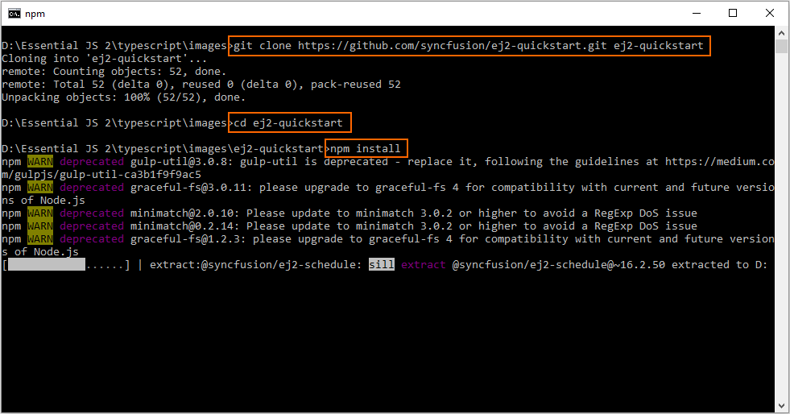

# Getting Started with Syncfusion JavaScript (Essential JS 2) library from a seed application

This article provides a step-by-step introduction to configure Syncfusion JavaScript (Essential JS 2) library and build a simple JavaScript web application from a github [quickstart](https://github.com/syncfusion/ej2-quickstart.git) seed repository.

> This quickstart seed application is integrated with `System.js` configuration. Refer to [`System.js`](https://github.com/systemjs/systemjs)  know more details about `System.js` and its functionalities.

## Prerequisites

* [git](https://git-scm.com/downloads)
* [Node.js](https://nodejs.org/en/)
* [Visual Studio Code](https://code.visualstudio.com/)

## Set up development environment

1. Open the command prompt from the required directory, and run the following command to clone Syncfusion JavaScript (Essential JS 2) quick start project from [GitHub](https://github.com/syncfusion/ej2-quickstart.git).

    ```sh
    git clone https://github.com/syncfusion/ej2-quickstart.git ej2-quickstart
    ```

2. Now, the application is cloned in the `ej2-quickstart` folder. Run the following command line one by one to navigate to `ej2-quickstart` folder, and install the required `npm` dependent packages from the command prompt.

    ```sh
    cd ej2-quickstart
    npm install
    ```

    > The `quickstart` application preconfigures the dependent [`@syncfusion/ej2`](https://www.npmjs.com/package/@syncfusion/ej2) package in the `~/package.json` file. So, running the command line `npm install` will install all required Syncfusion JavaScript packages in application.

    

## Configure Syncfusion JavaScript control in application

1. After configuring the local development environment, open the application in Visual Studio Code, and add the Syncfusion JavaScript UI controls in application. For getting started, the Button control is added in the application `~/src/index.html` and `~/src/app/app.ts` files.

    ```html
    <!DOCTYPE html>
    <html lang="en">

    <head>
        <title>Essential JS 2</title>
        <meta charset="utf-8" />
        <meta name="viewport" content="width=device-width, initial-scale=1.0, user-scalable=no" />
        ....
        ....
    </head>

    <body>
        <div>
            <!--HTML button element, which is going to render as Essential JS 2 Button-->
            <button id="normalbtn">Normal</button>
        </div>
    </body>

    </html>
    ```

2. Now, render the Button control using the following JavaScript code in the `~/src/app/app.ts` file.

    ```typescript
    import { Button } from '@syncfusion/ej2-buttons';

    // initialize button control
    let button: Button = new Button();

    // render initialized button
    button.appendTo('#normalbtn');
    ```

3. Then, map the required Syncfusion packages in the `system.config.js` configuration file.

    ```js
    System.config({
        paths: {
            'npm:': './node_modules/',
            // Configure Syncfusion package path
            'syncfusion:': 'npm:@syncfusion/'
        },
        map: {
            app: 'app',

            // map the umd files from Syncfusion Essential JS 2 packages
            "@syncfusion/ej2-base": "syncfusion:ej2-base/dist/ej2-base.umd.min.js",
            "@syncfusion/ej2-buttons": "syncfusion:ej2-buttons/dist/ej2-buttons.umd.min.js",
        },
        packages: {
            'app': { main: 'app', defaultExtension: 'js' }
        }
    });

    System.import('app');
    ```

4. After configuring `System.js` and rendering the Button control, add the required Syncfusion JavaScript styles in the `~/src/styles/styles.css` file.

    ```css
    @import '../../node_modules/@syncfusion/ej2/material.css';
    ```

    > The `quickstart` application is preconfigured with the above `System.js` settings and imported styles.

5. Finally, the quick start project is configured with Syncfusion JavaScript UI control, and run the following command line to run the application in web browser.

    ```shell
    npm start
    ```

    

        ```typescript
        import { Button } from '@syncfusion/ej2-buttons';

        // initialize button control
        let button: Button = new Button();

        // render initialized button
        button.appendTo('#normalbtn');

        ```

    