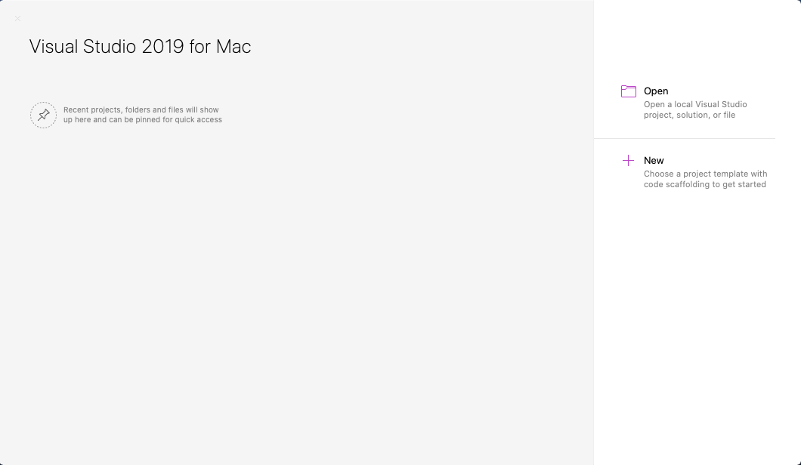
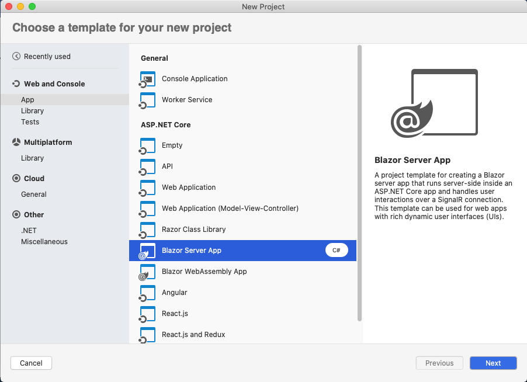
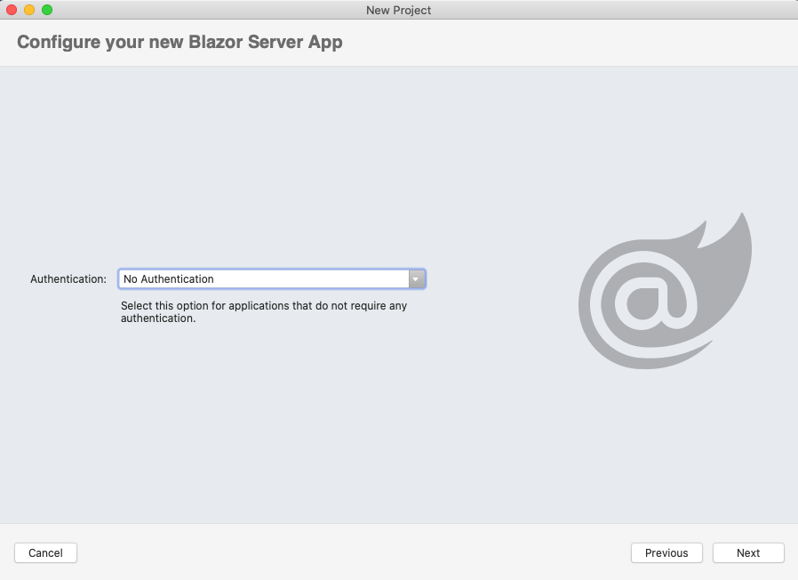
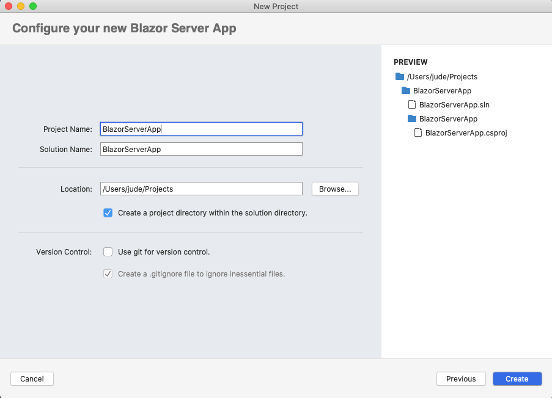
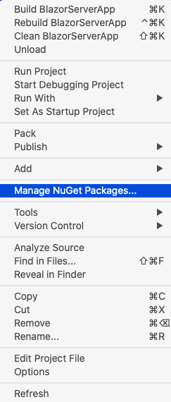
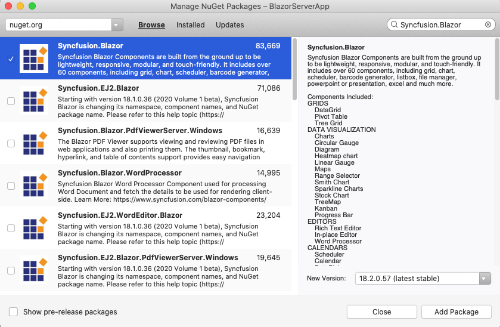
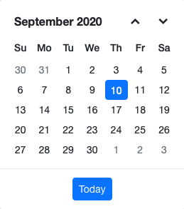

<!-- markdownlint-disable MD024 -->

# Getting started with Syncfusion Blazor - Server App in Visual Studio for Mac

This article provides a step-by-step introduction to configure Syncfusion Blazor setup, build and run a simple Blazor Server application using [Visual Studio for Mac](https://visualstudio.microsoft.com/vs/mac/).

> **Note:** Starting with version 17.4.0.39 (2019 Volume 4), you need to include a valid license key (either paid or trial key) within your applications. Please refer to this [help topic](https://help.syncfusion.com/common/essential-studio/licensing/license-key#blazor) for more information.

> **New:** Syncfusion Blazor components are [compatible with .NET 5.0 RC](blazor-net5-rc) and it requires Visual Studio 2019 for Mac 8.7.6 or later.

## Prerequisites

* [Visual Studio for Mac](https://visualstudio.microsoft.com/vs/mac/)
* [.NET Core SDK 3.1.8](https://dotnet.microsoft.com/download/dotnet-core/3.1) / [.NET 5.0 RC](https://dotnet.microsoft.com/download/dotnet/5.0)

> **Note:** **.NET Core SDK 3.1.8** requires Visual Studio for Mac 8.7.6 or later and **.NET 5.0 RC1** requires Visual Studio 2019 for Mac 8.7.6 or later.

## Create a Blazor Server project in Visual Studio for Mac

1. Choose **New** from the Visual Studio for Mac dashboard.

    

2. Select **Blazor Server App** from the template and click the **Next** button.

    

3. Continue with **No Authentication** selection in Authentication and click **Next** button.

    

4. Now, the Blazor Server App project configuration window will popup. Click **Create** button to create a new project after filling Project name.

    

## Importing Syncfusion Blazor component in the application

1. Now, install **Syncfusion.Blazor** NuGet package to the newly created application by using the `NuGet Package Manager`. Right-click the project and select Manage NuGet Packages.

    

2. Search **Syncfusion.Blazor** keyword in the Browse tab and install **Syncfusion.Blazor** NuGet package in the application.

    

3. The Syncfusion Blazor package will be installed in the project, Once the installation process is completed.

4. Open **~/_Imports.razor** file and import the `Syncfusion.Blazor`.

    ```csharp
    @using Syncfusion.Blazor
    @using Syncfusion.Blazor.Calendars
    ```

5. Open the **~/Startup.cs** file and register the Syncfusion Blazor Service.

    ```csharp
    using Syncfusion.Blazor;

    namespace WebApplication1
    {
        public class Startup
        {
            public void ConfigureServices(IServiceCollection services)
            {
                ....
                ....
                services.AddSyncfusionBlazor();
            }
        }
    }
    ```

6. Add the Syncfusion bootstrap4 theme in the `<head>` element of the **~/Pages/_Host.html** page.

    ```html
    <head>
        ....
        ....
        <link href="_content/Syncfusion.Blazor/styles/bootstrap4.css" rel="stylesheet" />
    </head>
    ```

    > **Note:** The same theme file can be referred through the CDN version by using [https://cdn.syncfusion.com/blazor/{:version:}/styles/bootstrap4.css](https://cdn.syncfusion.com/blazor/18.3.35/styles/bootstrap4.css).
    >
    > To use manual scripts other than the scripts from NuGet package, register the Blazor service in **~/Startup.cs** file by using true parameter as mentioned below.
    >
    > ```csharp
    > using Syncfusion.Blazor;
    >
    > namespace WebApplication1
    > {
    >     public class Startup
    >     {
    >         public void ConfigureServices(IServiceCollection services)
    >         {
    >            ....
    >            ....
    >            services.AddSyncfusionBlazor(true);
    >         }
    >     }
    > }
    >
    > ```

7. Now, add the Syncfusion Blazor components in any web page (razor) in the `~/Pages` folder. For example, the Calendar component is added in the **~/Pages/Index.razor** page.

    ```csharp
    <SfCalendar TValue="DateTime"></SfCalendar>
    ```

8. Run the application, The Syncfusion Blazor Calendar component will render in the default web browser.

    
