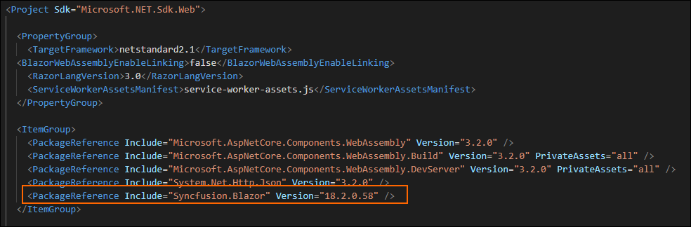

# Visual Studio Code Extensions

## Convert project

Syncfusion project conversion is a Visual Studio Code add-in that converts an existing Blazor application into a Syncfusion Blazor Web Application by adding the required NuGet packages and CDN links.

   > The Syncfusion Blazor Web Application Project Conversion utility is available from `v17.4.0.39`.

The following steps helps you to use the Syncfusion Project conversion in the existing Blazor Web Application:

1. Open an existing Blazor Web Application or create a new Microsoft Blazor Web Application in Visual Studio Code.

2. Right-click on the **Project file** from Explorer (Workspace), select the **Convert to Syncfusion Blazor Application…** Refer to the following screenshot for more information.

    

3. **Select Blazor Version** (which published in `nuget.org`) from the palette appears.

    

4. Choose the **Theme** from the palette appears.

    

5. The project configured with Syncfusion Blazor required NuGet packages and CDN links.

### NuGet Packages

The following NuGet packages are added as NuGet references based on application type.

| Syncfusion Blazor NuGet packages  | Application type  |
|---|---|
| `Syncfusion.EJ2.Blazor`  | Syncfusion Blazor Server App   Syncfusion Blazor WebAssembly App (ASPNET Core hosted)   Syncfusion Blazor WebAssembly App |
| `Syncfusion.EJ2.Blazor.PdfViewerServer.Windows`  | Syncfusion Blazor Server App  |
| `Syncfusion.EJ2.WordEditor.Blazor`  | Syncfusion Blazor Server App   Syncfusion Blazor WebAssembly App (ASPNET Core hosted)   Syncfusion Blazor WebAssembly App |

The NuGet packages added to the project file as follows.

### CDN links

The Syncfusion Blazor scripts and the selected theme (while converting the project) are added as a CDN link in the following location of Blazor type application.

| Application type  | File location  |
|---|---|
| Syncfusion Blazor Server App | {Project location}\pages\\_Host.cshtml |
| Syncfusion Blazor WebAssembly App (ASPNET Core hosted) | {Client Project location}\wwwroot\index.html  |
| Syncfusion Blazor WebAssembly App  | {Project location}\wwwroot\index.html|

