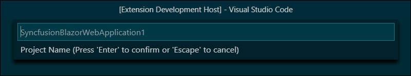
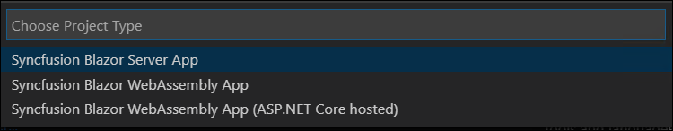
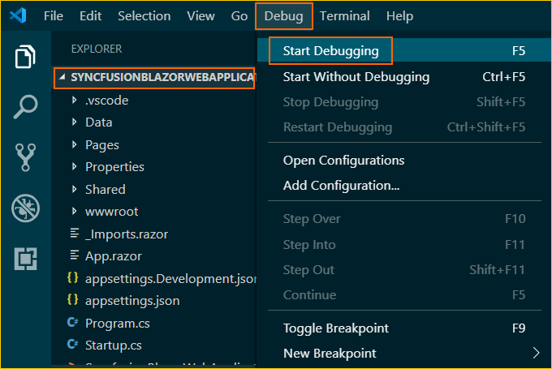
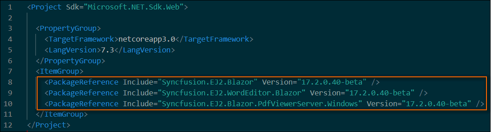
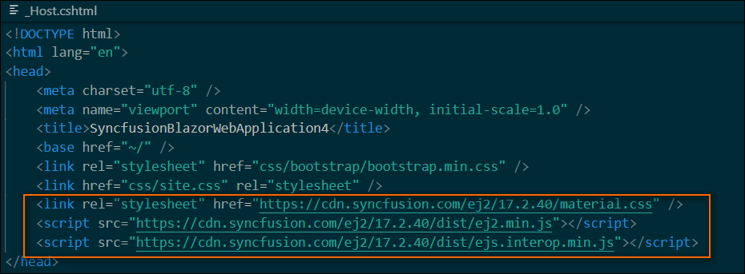
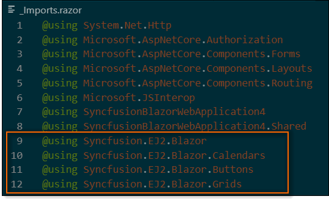
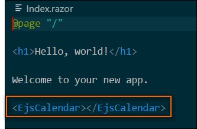
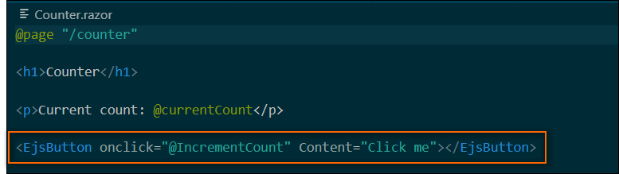
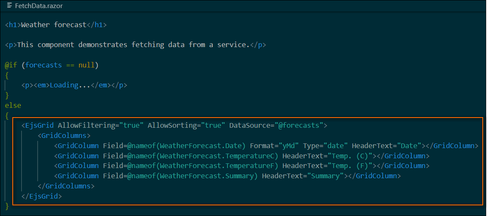

# Visual Studio Code Extensions

## Create project

Syncfusion provides **project templates** for **Visual Studio Code** to create Syncfusion Blazor applications. Syncfusion Blazor creates applications with the required Syncfusion NuGet packages, namespaces, and component render code for the Calendar, Button, and DataGrid components, and the style for making development easier with Syncfusion components.

The following steps help you create **Syncfusion Blazor Applications** through the **Visual Studio Code:**

1. In Visual Studio Code, open the command palette by pressing **Ctrl+Shift+P** to create a Syncfusion Blazor project. When the Visual Studio Code palette opens, search for the word **Syncfusion** so you can get the templates provided.

    

2. Select **Create Syncfusion Blazor Project** and then press **Enter**. The **Project Location** palette appears to store the application.

    

3. Provide the destination location and then press **Enter**. The **Project Name** palette appears.

    

    > The Syncfusion Visual Studio Code project template provides support for Blazor project templates from `v17.4.0.39`.

4. Select the required version of .NET Core and then press **Enter**.

    

5. Fill in the name of the project, and then press **Enter**. The palette of project types for Syncfusion Blazor appears. Syncfusion Blazor has two types of projects:
   * Syncfusion Blazor Server App
   * Syncfusion Blazor WebAssembly App

      

    If you choose a Syncfusion Blazor Web Assembly App, you will have the option to include ASP.NET Core hosted and Progressive Web Application.

      

6. Select and desired Syncfusion Blazor application and then press **Enter**. The palette of theme selection appears. Choose the preferred theme and then click **Enter**. The project will be created.

   

7. The created Syncfusion Blazor app is configured with the Syncfusion NuGet packages, styles, and the component render code for the Syncfusion component added to the Index, Counter, and FetchData pages.

8. To show the Syncfusion components, you can run the application. Click on **F5** or navigate to **Debug>Start Debugging**.

   

9. If you installed the trial setup or NuGet packages from nuget.org you have to register the Syncfusion license key to your project since Syncfusion introduced the licensing system from 2018 Volume 2 (v16.2.0.41) Essential Studio release. Navigate to the [help topic](https://help.syncfusion.com/common/essential-studio/licensing/license-key#how-to-generate-syncfusion-license-key) to generate and register the Syncfusion license key to your project. Refer to this [blog](https://blog.syncfusion.com/post/Whats-New-in-2018-Volume-2-Licensing-Changes-in-the-1620x-Version-of-Essential-Studio.aspx?_ga=2.11237684.1233358434.1587355730-230058891.1567654773) post for understanding the licensing changes introduced in Essential Studio.

## Syncfusion integration

The latest Syncfusion Blazor NuGet packages, styles, namespaces, and component render code for Syncfusion components are added in the created application.

### NuGet Packages

The following NuGet packages are added as NuGet references based on application type.

| Syncfusion Blazor NuGet packages  | Application type  |
|---|---|
| `Syncfusion.Blazor`  | Syncfusion Blazor Server App   Syncfusion Blazor WebAssembly App   Syncfusion Blazor WebAssembly App (ASPNET Core hosted)   Syncfusion Blazor WebAssembly App (Progressive Web Application) |
| `Syncfusion.Blazor.PdfViewerServer.Windows`  | Syncfusion Blazor Server App  |
| `Syncfusion.Blazor.WordProcessor`  | Syncfusion Blazor Server App   Syncfusion Blazor WebAssembly App   Syncfusion Blazor WebAssembly App (ASPNET Core hosted)   Syncfusion Blazor WebAssembly App (Progressive Web Application) |

### Style

The selected theme is added from Syncfusion NuGet and its reference at these applications locations in Blazor.

| Application type  | File location  |
|---|---|
| Syncfusion Blazor Server App | {Project location}\Pages\\_Host.cshtml |
| Syncfusion Blazor WebAssembly App (ASPNET Core hosted)   Syncfusion Blazor WebAssembly App (Progressive Web Application) | {Client Project location}\wwwroot\index.html  |
| Syncfusion Blazor WebAssembly App  | {Project location}\wwwroot\index.html|

### Namespaces

The Syncfusion Blazor namespaces are added in the **`_imports.razor`** file.

### Component render code

The Calendar, Button, and DataGrid component render code is in the Razor files in the pages folder. The render code is updated in these Razor files.

| File name  | Code snippet added |
|---|---|
| `~/Pages/Index.razor`  |  |
| `~/Pages/Counter.razor` |  |
| `~/Pages/FetchData.razor`  |  |