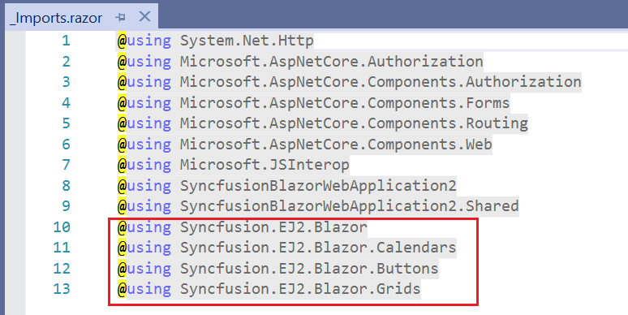
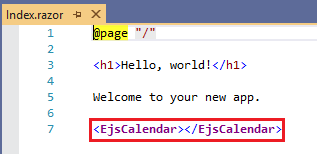
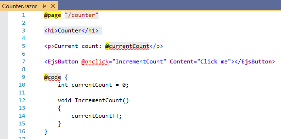

# Visual Studio Extensions

## Create project

Syncfusion provides the Visual Studio Project Templates to create the Syncfusion Blazor Application. The Syncfusion Blazor application creates an application with the required Syncfusion references, namespaces, component code snippet, and CDN links for the earlier development with Syncfusion components.

The following steps will help you create your **Syncfusion Blazor Application** through **Visual Studio 2019**:

1. Open the Visual Studio 2019.

2. To create a Syncfusion Blazor project, either of the following options should be followed:

    **Option 1**

    Choose **Extension->Syncfusion->Essential Studio for Blazor->Create New Syncfusion Project...** from the **Visual Studio menu**.

    

    **Option 2**

    Select **File -> New -> Project**. Opens a new dialog to create a new project. You can obtain the templates provided by Syncfusion for Blazor by filtering the project type with Syncfusion or Blazor, or by using the Syncfusion keyword in the search option.

    

3. Select the Syncfusion Blazor Application and select the Next button.

    

4. Name the project, pick the location of the destination, then press the Create button. Appears the configuration wizard for the Syncfusion Blazor project.

    

5. The Syncfusion Blazor has three types of project and is listed below,

    1. Syncfusion Blazor Server App
    2. Syncfusion Blazor WebAssembly App
    3. Syncfusion Blazor WebAssembly App (ASP.NET Core hosted)

6. Choose the desired Syncfusion Blazor application and Theme.
7. Click the Create button to create the Blazor Syncfusion application.
8. The Syncfusion Blazor application has been configured with Syncfusion.
9. You can run the application and see the Syncfusion components.

## Syncfusion integration

Syncfusion adds the required latest version of Syncfusion Blazor NuGet packages, CDN Scripts, namespace, and the
Syncfusion component code snippets.

### NuGet Packages

The following NuGet package(s) are added as NuGet references based on applications.

| Syncfusion Blazor NuGet packages  | Application type  |
|---|---|
| `Syncfusion.EJ2.Blazor`  | Syncfusion Blazor Server App   Syncfusion Blazor WebAssembly App (ASPNET Core hosted)   Syncfusion Blazor WebAssembly App |
| `Syncfusion.EJ2.Blazor.PdfViewerServer.Windows`  | Syncfusion Blazor Server App  |
| `Syncfusion.EJ2.WordEditor.Blazor`  | Syncfusion Blazor Server App   Syncfusion Blazor WebAssembly App (ASPNET Core hosted)   Syncfusion Blazor WebAssembly App |

> The installed Syncfusion Extension version of NuGet package will be added as reference entry if there is no internet connection. You have to restore the NuGet packages when internet available.

### CDN links

The Syncfusion Blazor scripts and the selected themes (while creating the project) are added as CDN link in the
following locations of Blazor type application.

| Application type  | File location  |
|---|---|
| Syncfusion Blazor Server App | {Project location}\pages\\_Host.cshtml |
| Syncfusion Blazor WebAssembly App (ASPNET Core hosted) | {Client Project location}\wwwroot\index.html  |
| Syncfusion Blazor WebAssembly App  | {Project location}\wwwroot\index.html|

### Namespaces

The Syncfusion Blazor component Grids, Calendars, and Buttons namespace are added to the **`_imports.razor`** file in the application. You can add the required other component namespace for development.

### Code snippet

The Syncfusion Blazor components code snippets are added in the created application. The code changes are,

| File name  | Code snippet added |
|---|---|
| `Index.razor`  |  |
| `Counter.razor` |  |
| `FetchData.razor`  |  |