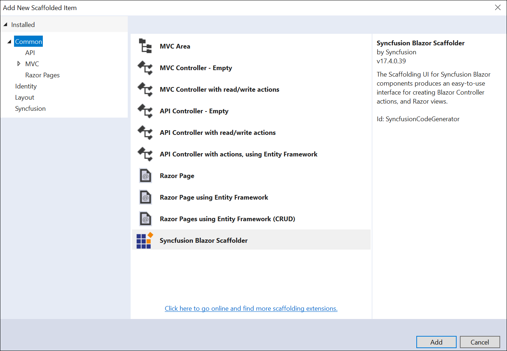
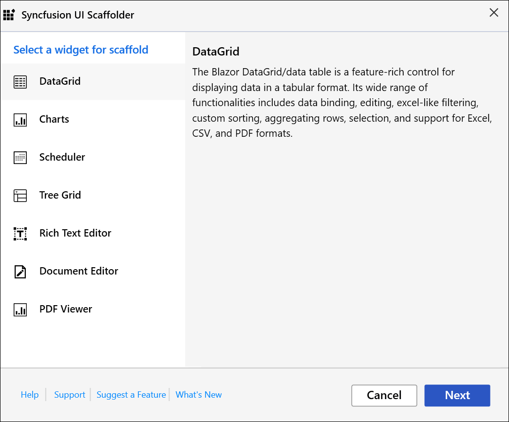
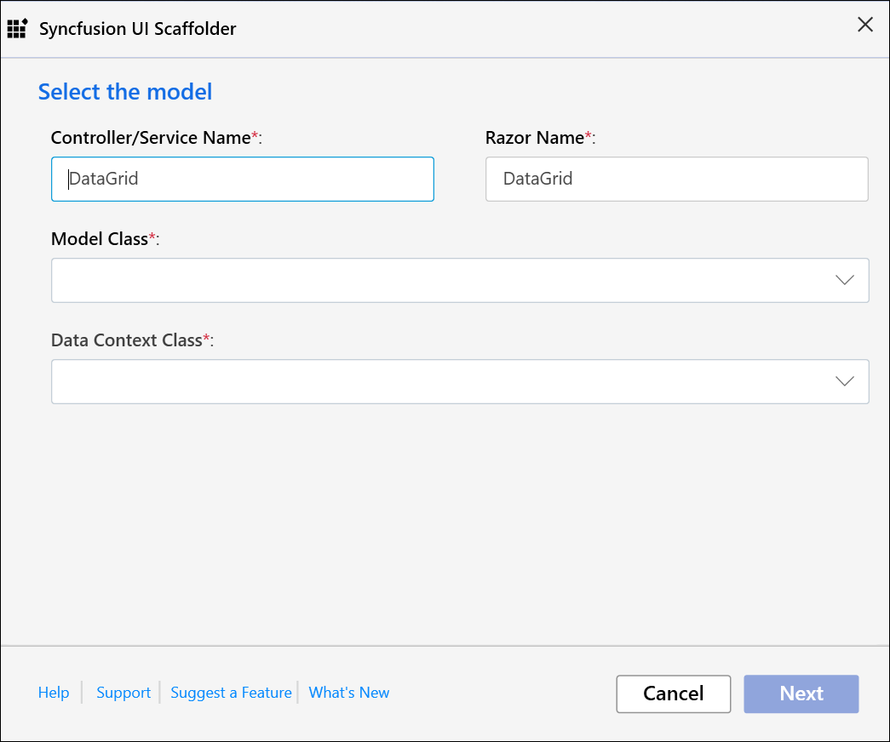
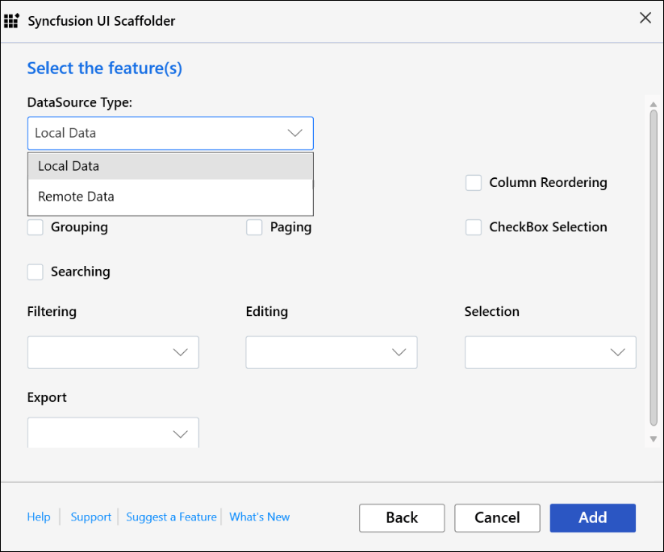
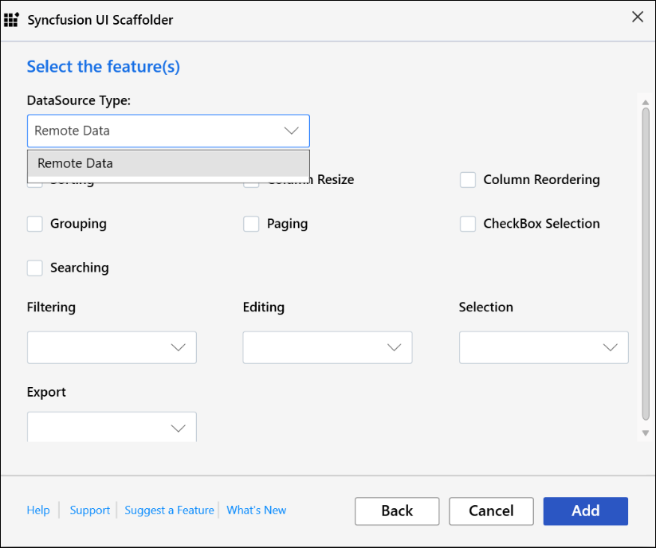

# Scaffolding

Syncfusion provides **Visual Studio Scaffolding** for Syncfusion Blazor platform to quickly add code that interacts with data models and reduce the amount of time to develop with data operation in your project. Scaffolding provides an easier way to create Razor and Controller action methods for Syncfusion Blazor DataGrid, Charts, Scheduler, Tree Grid, Rich Text Editor, Document Editor, and PDF Viewer controls.

    > Check that at least one Entity Framework model exists, and the application has been compiled once. If no Entity Framework model exist in your application, refer to this [documentation](https://www.freecodecamp.org/news/how-to-create-an-application-using-blazor-and-entity-framework-core-1c1679d87c7e/) to generate the Entity Framework model. After the model file has been added, check that the required DBContext and properties are added. Now, build the application, and try scaffolding. If any changes made in the model properties, rebuild the application once before perform scaffolding.

<!-- markdownlint-disable MD026 -->

    > The Syncfusion Blazor Scaffolder is available from `v17.4.0.39`.

## Add a scaffolded item

    > Blazor Scaffolding support is provided only for Blazor ServerSide application and Blazor Hosted application.

The following steps explains how to add a scaffolded item to your Blazor application.

1. If the project type is **Blazor ServerSide**, right-click the **Pages** folder in the Solution Explorer, click **Add**, and then select **New Scaffolded Item..**

    

    If the project type is **Blazor Hosted**, right-click the **Controllers** folder from **{Project Name}.Server** project in the Solution Explorer, click **Add**, and then select **New Scaffolded Item**.

    

2. In the **Add Scaffold** dialog, select **Syncfusion Blazor Scaffolder** and then click **‘Add’**.

    

3. In the Syncfusion UI Scaffolder dialog, select the desired control to perform scaffolding, and then click **Next**.

    

    > Scheduler control is not applicable for Blazor Hosted application.

4. Syncfusion UI Scaffolder dialog will be opened for the selected control. Enter the **Controller/Service** Name and **Razor** Name as application requirements, and then select the required **Model Class** of the active project and its relevant **Data Context Class**, and then click **Next**.

    

5. Syncfusion UI Scaffolder for the selected control feature dialog will open. Select the required features, update the required data field, and then click **Add**.

    For **ServerSide Application**, both Local data and Remote data types will be available.

    

    For **Hosted Application**, Remote data type only available.

    

6. The **Controller/Service** file and the corresponding **Razor** files are generated with the selected features of Syncfusion control code snippet.

    If you select **Local Data**, service file and razor file will be added to the project.

    

    If you select **Remote Data**, controller file and razor file will be added to the project.

    

7. Then, add navigation to the created razor file based on your requirement to open in the webpage.

<!-- markdownlint-disable MD026 -->

## How to render Syncfusion control?

Refer to the following UG links to render Syncfusion control after performing scaffolding:

WebAssembly App: [Configure Blazor controls using Sycnfusion.EJ2.Blazor NuGet Package](https://ej2.syncfusion.com/blazor/documentation/getting-started/vs-blazor/)

Blazor Server App: [Configure Blazor controls using Sycnfusion.EJ2.Blazor NuGet Package](https://ej2.syncfusion.com/blazor/documentation/getting-started/vs-blazor-server/)