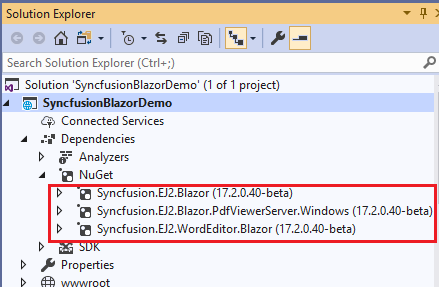
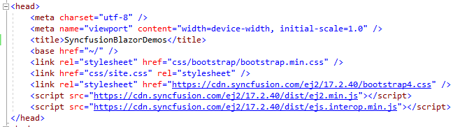

# Visual Studio Extensions

## Upgrade project

Syncfusion Blazor migration is a Visual Studio add-in that allows you to migrate the existing Syncfusion Blazor Application from one version of Essential Studio to another. This helps to avoid manual work in the required places when migrating the Syncfusion version.

The following steps will help you **upgrade the Syncfusion version** to the Syncfusion Blazor application via **Visual Studio 2019**:

1. Open the Blazor application that uses the Syncfusion component.

2. To open the Migration Wizard, either of the following options should be followed:

    **Option 1**

    Choose **Extensions-> Syncfusion-> Essential Studio for Blazor ->Migrate Project…** from Visual Studio 2019 menu.

    

    **Option 2**

    Right-click the application from the **Solution Explorer** and select the **Syncfusion Blazor** and choose the **Migrate Syncfusion Blazor project from another version...**

    

3. The Syncfusion Project Migration window appears. You can choose the required version of Syncfusion Blazor to migrate.

    > The versions are loaded from the Syncfusion Blazor NuGet packages published in [`NuGet.org`](https://www.nuget.org/) and it requires internet connectivity.

    

4. Once the migration process is completed, you will get a successful message window

    

5. The Syncfusion Blazor NuGet packages and CDN links are updated to the respective versions in the application.

### NuGet Packages

The installed packages of Syncfusion Blazor NuGet are updated with the selected version of Syncfusion Blazor.

### CDN

The selected version of Syncfusion Blazor updated in the Syncfusion CDN links in the host.cshtml or index.html file.

