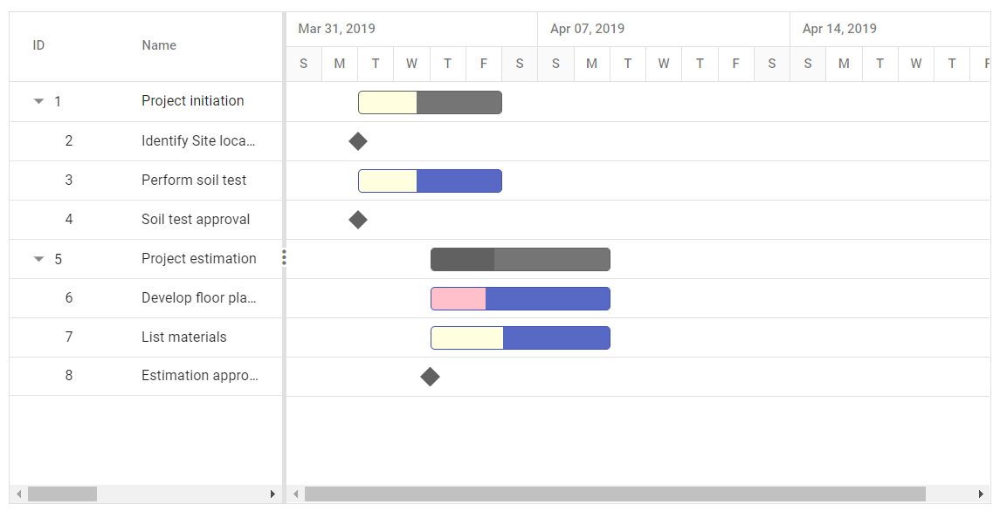
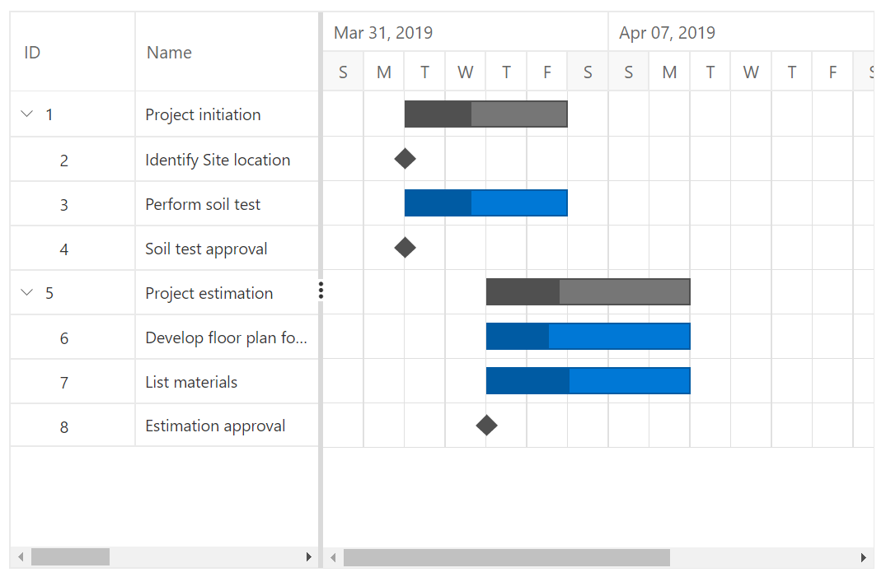

# Appearance And Customization

## Taskbar customization

### Taskbar Height

Height of child taskbars and parent taskbars can be customized by using `TaskbarHeight` property. The following code example shows how to use the property.

```csharp
@using Syncfusion.Blazor.Gantt
<SfGantt DataSource="@TaskCollection" Height="450px" Width="900px" RowHeight=60 TaskbarHeight=50>
    <GanttTaskFields Id="TaskId" Name="TaskName" StartDate="StartDate" EndDate="EndDate"
           Duration="Duration" Progress="Progress" Child="SubTasks">
    </GanttTaskFields>
</SfGantt>
@code{
    public List<TaskData> TaskCollection { get; set; }
    protected override void OnInitialized()
    {
        this.TaskCollection = GetTaskCollection();
    }

    public class TaskData
    {
        public int TaskId { get; set; }
        public string TaskName { get; set; }
        public DateTime StartDate { get; set; }
        public DateTime EndDate { get; set; }
        public string Duration { get; set; }
        public int Progress { get; set; }
        public List<TaskData> SubTasks { get; set; }
    }

    public static List <TaskData> GetTaskCollection() {
    List <TaskData> Tasks = new List <TaskData> () {
        new TaskData() {
            TaskId = 1,
            TaskName = "Project initiation",
            StartDate = new DateTime(2019, 04, 02),
            EndDate = new DateTime(2019, 04, 21),
            SubTasks = (new List <TaskData> () {
                new TaskData() {
                    TaskId = 2,
                    TaskName = "Identify Site location",
                    StartDate = new DateTime(2019, 04, 02),
                    Duration = "0",
                    Progress = 30,
                },
                new TaskData() {
                    TaskId = 3,
                    TaskName = "Perform soil test",
                    StartDate = new DateTime(2019, 04, 02),
                    Duration = "4",
                    Progress = 40,
                },
                new TaskData() {
                    TaskId = 4,
                    TaskName = "Soil test approval",
                    StartDate = new DateTime(2019, 04, 02),
                    Duration = "0",
                    Progress = 30,
                },
            })
        },
        new TaskData() {
            TaskId = 5,
            TaskName = "Project estimation",
            StartDate = new DateTime(2019, 04, 02),
            EndDate = new DateTime(2019, 04, 21),
            SubTasks = (new List <TaskData> () {
                new TaskData() {
                    TaskId = 6,
                    TaskName = "Develop floor plan for estimation",
                    StartDate = new DateTime(2019, 04, 04),
                    Duration = "3",
                    Progress = 30,
                },
                new TaskData() {
                    TaskId = 7,
                    TaskName = "List materials",
                    StartDate = new DateTime(2019, 04, 04),
                    Duration = "3",
                    Progress = 40,
                },
                new TaskData() {
                    TaskId = 8,
                    TaskName = "Estimation approval",
                    StartDate = new DateTime(2019, 04, 04),
                    Duration = "0",
                    Progress = 30
                }
            })
        }
    };

    return Tasks;
}
}
```


> NOTE
The `TaskbarHeight` property accepts only pixel value.

### Conditional formatting

The default taskbar UI can be replaced with custom templates using the `QueryTaskbarInfo` event. The following code example shows customizing the taskbar UI based on task progress values in the Gantt Chart component.

```csharp
@using Syncfusion.Blazor.Gantt
<SfGantt DataSource="@TaskCollection" Height="450px" Width="900px">
    <GanttTaskFields Id="TaskId" Name="TaskName" StartDate="StartDate" EndDate="EndDate"
           Duration="Duration" Progress="Progress" Child="SubTasks">
    </GanttTaskFields>
    <GanttEvents QueryTaskbarInfo="QueryTaskbarInfo" TValue="TaskData"></GanttEvents>
</SfGantt>
@code{
    public void QueryTaskbarInfo(IQueryTaskbarInfoEventArgs<TaskData> args)
    {
        if (args.Data.Progress == 30)
        {
            args.ProgressBarBgColor = "#FFC0CB";
        } else if (args.Data.Progress == 40) {
            args.ProgressBarBgColor = "#FFFFE0";
        }
    }
    public List<TaskData> TaskCollection { get; set; }
    protected override void OnInitialized()
    {
        this.TaskCollection = GetTaskCollection();
    }

    public class TaskData
    {
        public int TaskId { get; set; }
        public string TaskName { get; set; }
        public DateTime StartDate { get; set; }
        public DateTime EndDate { get; set; }
        public string Duration { get; set; }
        public int Progress { get; set; }
        public List<TaskData> SubTasks { get; set; }
    }

    public static List <TaskData> GetTaskCollection() {
    List <TaskData> Tasks = new List <TaskData> () {
        new TaskData() {
            TaskId = 1,
            TaskName = "Project initiation",
            StartDate = new DateTime(2019, 04, 02),
            EndDate = new DateTime(2019, 04, 21),
            SubTasks = (new List <TaskData> () {
                new TaskData() {
                    TaskId = 2,
                    TaskName = "Identify Site location",
                    StartDate = new DateTime(2019, 04, 02),
                    Duration = "0",
                    Progress = 30,
                },
                new TaskData() {
                    TaskId = 3,
                    TaskName = "Perform soil test",
                    StartDate = new DateTime(2019, 04, 02),
                    Duration = "4",
                    Progress = 40,
                },
                new TaskData() {
                    TaskId = 4,
                    TaskName = "Soil test approval",
                    StartDate = new DateTime(2019, 04, 02),
                    Duration = "0",
                    Progress = 30,
                },
            })
        },
        new TaskData() {
            TaskId = 5,
            TaskName = "Project estimation",
            StartDate = new DateTime(2019, 04, 02),
            EndDate = new DateTime(2019, 04, 21),
            SubTasks = (new List <TaskData> () {
                new TaskData() {
                    TaskId = 6,
                    TaskName = "Develop floor plan for estimation",
                    StartDate = new DateTime(2019, 04, 04),
                    Duration = "3",
                    Progress = 30,
                },
                new TaskData() {
                    TaskId = 7,
                    TaskName = "List materials",
                    StartDate = new DateTime(2019, 04, 04),
                    Duration = "3",
                    Progress = 40,
                },
                new TaskData() {
                    TaskId = 8,
                    TaskName = "Estimation approval",
                    StartDate = new DateTime(2019, 04, 04),
                    Duration = "0",
                    Progress = 30
                }
            })
        }
    };

    return Tasks;
}
}
```



### Taskbar template

You can design your own taskbars to view the tasks in Gantt Chart Chart by using `TaskbarTemplate` property. And it is possible to map the template script element’s ID value to this property. It is also possible to customize the parent taskbars and milestones with custom templates by using `ParentTaskbarTemplate` and `MilestoneTemplate` properties.

```csharp
@using Syncfusion.Blazor.Gantt
<SfGantt DataSource="@TaskCollection" ProjectStartDate="@ProjectStart" ProjectEndDate="@ProjectEnd" DateFormat="hh:mm a" Height="450px" Width="900px" RowHeight="75" DurationUnit="DurationUnit.Minute">
    <GanttTaskFields Id="TaskId" Name="TaskName" StartDate="StartDate" EndDate="EndDate" Duration="Duration" Progress="Progress" Dependency="Predecessor" Child="SubTasks"></GanttTaskFields>
    <GanttColumns>
        <GanttColumn Field="TaskId" HeaderText="Event Id"></GanttColumn>
        <GanttColumn Field="TaskName" HeaderText="Event Name"></GanttColumn>
        <GanttColumn Field="StartDate" HeaderText="Start Time"></GanttColumn>
        <GanttColumn Field="EndDate" HeaderText="End Time"></GanttColumn>
        <GanttColumn Field="Winner" HeaderText="Winner"></GanttColumn>
        <GanttColumn Field="Movie" HeaderText="Movie"></GanttColumn>
        <GanttColumn Field="Performance" HeaderText="Moments / Performance Details"></GanttColumn>
    </GanttColumns>
    <GanttTemplates TValue="TaskbarData">
        <TaskbarTemplate>
            @if ((context as TaskbarData).GanttProperties.TaskName == "Oscar moments")
            {
                <div class="e-gantt-child-taskbar e-custom-moments" style="height:68px;border-radius:5px;">
                    <span class="e-task-label" style="position:absolute;top:15px;font-size:12px;text-overflow:ellipsis;height:90%;overflow:hidden;">@((context as TaskbarData).Performance)</span>
                </div>
            }
            else
            {
                <div class="e-gantt-parent-taskbar e-custom-parent" style="height:68px;border-radius:5px;text-overflow:ellipsis;">
                    @if (!string.IsNullOrEmpty(((context as TaskbarData).Winner)) && !string.IsNullOrEmpty(((context as TaskbarData).Movie)))
                    {
                        <span class="e-task-label" style="position:absolute; top:13px;font-size:14px;">@((context as TaskbarData).Winner)</span>
                        <span class="e-task-label" style="position:absolute;top:33px;font-size:10px;text-overflow:ellipsis;">@((context as TaskbarData).Movie)</span>
                    }
                </div>
            }
        </TaskbarTemplate>
        <MilestoneTemplate>
            <div style="margin-top:-7px;">
                <div class="e-gantt-milestone" style="position:absolute;">
                    <div class="e-milestone-top" style="border-right-width:26px; margin-top: -24px;border-left-width:26px;border-bottom-width:26px;"></div>
                    <div class="e-milestone-bottom" style="top:26px;border-right-width:26px; border-left-width:26px; border-top-width:26px;"></div>
                </div>
            </div>
        </MilestoneTemplate>
    </GanttTemplates>
    <GanttTimelineSettings TimelineUnitSize="60">
        <GanttTopTierSettings Unit="TimelineViewMode.Hour" Format="MMM dd, yyyy"></GanttTopTierSettings>
        <GanttBottomTierSettings Unit="TimelineViewMode.Minutes" Count="2" Format="h:mm a"></GanttBottomTierSettings>
    </GanttTimelineSettings>
    <GanttDayWorkingTimeCollection>
        <GanttDayWorkingTime From="0" To="24"></GanttDayWorkingTime>
    </GanttDayWorkingTimeCollection>
</SfGantt>
<style>
    .e-custom-parent {
        background-color: #6d619b;
        border: 1px solid #3f51b5;
    }
    .e-custom-moments {
        background-color: #7ab748;
        border: 1px solid #3f51b5;
    }
    .e-milestone-top {
        border-bottom-color: #7ab748 !important;
        border-bottom: 1px solid #3f51b5;
    }
    .e-milestone-bottom {
        border-top-color: #7ab748 !important;
        border-top: 1px solid #3f51b5;
    }
</style>

@code {
    public DateTime ProjectStart = new DateTime(2018, 3, 5, 18, 0, 0);
    public DateTime ProjectEnd = new DateTime(2018, 3, 5, 21, 50, 0);
    public class TaskProperties
    {
        public string TaskName { get; set; }
        public double Duration { get; set; }
    }
    public List<TaskbarData> TaskCollection { get; set; }
    protected override void OnInitialized() {
        this.TaskCollection = GetTaskCollection();
    }
    public class TaskData {
        public int TaskId { get; set; }
        public string TaskName { get; set; }
        public DateTime StartDate { get; set; }
        public DateTime EndDate { get; set; }
        public string Duration { get; set; }
        public int Progress { get; set; }
        public string Predecessor { get; set; }
    }
    public class TaskbarData : TaskData {
        public string Performance { get; set; }
        public string Winner { get; set; }
        public string Movie { get; set; }
        public TaskProperties GanttProperties { get; set; }
    }
    public static List<TaskbarData> GetTaskCollection() {
        List<TaskbarData> Tasks = new List<TaskbarData>() {
            new TaskbarData() {
                TaskId = 1,
                TaskName = "Oscar moments",
                StartDate = new DateTime(2018, 03, 05, 18, 0, 0),
                EndDate = new DateTime(2018, 03, 05, 18, 15, 0),
                Winner = "",
                Performance = "90th Academy awards kicks-off and Jimmy kimmel hosts the show"
            },
            new TaskbarData() {
                TaskId = 2,
                TaskName = "Actor in a supporting role",
                StartDate = new DateTime(2018, 03, 05, 18, 16, 0),
                EndDate = new DateTime(2018, 03, 05, 18, 25, 0),
                Predecessor = "1",
                Winner = "Sam Rockwell",
                Movie = "Three Billboards Outside Ebbing, Missouri."
            },
            new TaskbarData() {
                TaskId = 3,
                TaskName = "Hair and makeup",
                StartDate = new DateTime(2018, 03, 05, 18, 26, 0),
                EndDate = new DateTime(2018, 03, 05, 18, 32, 0),
                Predecessor = "2",
                Movie = "Darkest Hour"
            },
            new TaskbarData() {
                TaskId = 4,
                TaskName = "Costume design",
                StartDate = new DateTime(2018, 03, 05, 18, 33, 0),
                EndDate = new DateTime(2018, 03, 05, 18, 40, 0),
                Predecessor = "3",
                Winner = "Mark Bridges",
                Movie = "Phantom Thread"
            },
            new TaskbarData() {
                TaskId = 5,
                TaskName = "Documentary feature",
                StartDate = new DateTime(2018, 03, 05, 18, 41, 0),
                EndDate = new DateTime(2018, 03, 05, 18, 58, 0),
                Predecessor = "4",
                Winner = "Bryan Fogel",
                Movie = "Icarus"
            },
            new TaskbarData() {
                TaskId = 6,
                TaskName = "Best sound editing and sound mixing",
                StartDate = new DateTime(2018, 03, 05, 18, 59, 0),
                EndDate = new DateTime(2018, 03, 05, 19, 10, 0),
                Predecessor = "5",
                Winner = "Richard King and Alex Gibson",
                Movie = "Dunkirk"
            },
            new TaskbarData() {
                TaskId = 7,
                TaskName = "Production design",
                StartDate = new DateTime(2018, 03, 05, 19, 11, 0),
                EndDate = new DateTime(2018, 03, 05, 19, 15, 0),
                Predecessor = "6",
                Movie = "The Shape of Water"
            },
            new TaskbarData() {
                TaskId = 8,
                TaskName = "Oscar performance",
                StartDate = new DateTime(2018, 03, 05, 19, 16, 0),
                EndDate = new DateTime(2018, 03, 05, 19, 23, 0),
                Predecessor = "7",
                Performance = "Second performance of the night is 'Remember Me' from Coco",
            },
            new TaskbarData() {
                TaskId = 9,
                TaskName = "90th Academy awards wind-up",
                StartDate = new DateTime(2018, 03, 05, 21, 30, 0),
                EndDate = new DateTime(2018, 03, 05, 21, 30, 0),
                Predecessor = "31",
                Duration = "0",
                Performance = "90th Academy awards wind-up"
            }
        };
    return Tasks;
    }
}
```


## Task labels

The Gantt Chart component maps any data source fields to task labels using the `LabelSettings.LeftLabel`, `LabelSettings.RightLabel`, and `LabelSettings.TaskLabel` properties. You can customize the task labels with templates.

```csharp
@using Syncfusion.Blazor.Gantt
<SfGantt DataSource="@TaskCollection" Height="450px" Width="900px">
    <GanttTaskFields Id="TaskId" Name="TaskName" StartDate="StartDate" EndDate="EndDate"
                     Duration="Duration" Progress="Progress" Child="SubTasks">
    </GanttTaskFields>
    <GanttLabelSettings LeftLabel="TaskId" TValue="TaskData">
        <RightLabelTemplate>
            <div class="e-right-label-inner-div" style="height:22px;margin-top:7px;">
                <span class="e-label">Task Name: @((context as TaskData).TaskName)</span>
            </div>
        </RightLabelTemplate>
        <TaskLabelTemplate>
            <div>@((context as TaskData).Progress)%</div>
        </TaskLabelTemplate>
    </GanttLabelSettings>
</SfGantt>
@code{
    public List<TaskData> TaskCollection { get; set; }
    protected override void OnInitialized()
    {
        this.TaskCollection = GetTaskCollection();
    }

    public class TaskData
    {
        public int TaskId { get; set; }
        public string TaskName { get; set; }
        public DateTime StartDate { get; set; }
        public DateTime EndDate { get; set; }
        public string Duration { get; set; }
        public int Progress { get; set; }
        public List<TaskData> SubTasks { get; set; }
    }

    public static List <TaskData> GetTaskCollection() {
    List <TaskData> Tasks = new List <TaskData> () {
        new TaskData() {
            TaskId = 1,
            TaskName = "Project initiation",
            StartDate = new DateTime(2019, 04, 02),
            EndDate = new DateTime(2019, 04, 21),
            SubTasks = (new List <TaskData> () {
                new TaskData() {
                    TaskId = 2,
                    TaskName = "Identify Site location",
                    StartDate = new DateTime(2019, 04, 02),
                    Duration = "0",
                    Progress = 30,
                },
                new TaskData() {
                    TaskId = 3,
                    TaskName = "Perform soil test",
                    StartDate = new DateTime(2019, 04, 02),
                    Duration = "4",
                    Progress = 40,
                },
                new TaskData() {
                    TaskId = 4,
                    TaskName = "Soil test approval",
                    StartDate = new DateTime(2019, 04, 02),
                    Duration = "0",
                    Progress = 30,
                },
            })
        },
        new TaskData() {
            TaskId = 5,
            TaskName = "Project estimation",
            StartDate = new DateTime(2019, 04, 02),
            EndDate = new DateTime(2019, 04, 21),
            SubTasks = (new List <TaskData> () {
                new TaskData() {
                    TaskId = 6,
                    TaskName = "Develop floor plan for estimation",
                    StartDate = new DateTime(2019, 04, 04),
                    Duration = "3",
                    Progress = 30,
                },
                new TaskData() {
                    TaskId = 7,
                    TaskName = "List materials",
                    StartDate = new DateTime(2019, 04, 04),
                    Duration = "3",
                    Progress = 40,
                },
                new TaskData() {
                    TaskId = 8,
                    TaskName = "Estimation approval",
                    StartDate = new DateTime(2019, 04, 04),
                    Duration = "0",
                    Progress = 30
                }
            })
        }
    };

    return Tasks;
}
}
<style>
    .e-task-label {
        position: absolute;
    }
</style>
```


## Connector lines

The width and background color of connector lines in Gantt Chart can be customized using the `ConnectorLineWidth` and `ConnectorLineBackground` properties. The following code example shows how to use these properties.

```csharp
@using Syncfusion.Blazor.Gantt
<SfGantt DataSource="@TaskCollection" Height="450px" Width="800px" ConnectorLineWidth="3" ConnectorLineBackground="red">
    <GanttTaskFields Id="TaskId" Name="TaskName" StartDate="StartDate" EndDate="EndDate" Duration="Duration" Progress="Progress" Child="SubTasks" Dependency="Predecessor">
    </GanttTaskFields>
</SfGantt>

@code{
    public List<TaskData> TaskCollection { get; set; }
    protected override void OnInitialized()
    {
        this.TaskCollection = GetTaskCollection();
    }

    public class TaskData
    {
        public int TaskId { get; set; }
        public string TaskName { get; set; }
        public DateTime StartDate { get; set; }
        public DateTime EndDate { get; set; }
        public string Duration { get; set; }
        public int Progress { get; set; }
        public string Predecessor { get; set; }
        public List<TaskData> SubTasks { get; set; }
    }

    public static List <TaskData> GetTaskCollection() {
    List <TaskData> Tasks = new List <TaskData> () {
        new TaskData() {
            TaskId = 1,
            TaskName = "Project initiation",
            StartDate = new DateTime(2019, 04, 02),
            EndDate = new DateTime(2019, 04, 21),
            SubTasks = (new List <TaskData> () {
                new TaskData() {
                    TaskId = 2,
                    TaskName = "Identify Site location",
                    StartDate = new DateTime(2019, 04, 02),
                    Duration = "0",
                    Progress = 30,
                },
                new TaskData() {
                    TaskId = 3,
                    TaskName = "Perform soil test",
                    StartDate = new DateTime(2019, 04, 02),
                    Duration = "4",
                    Progress = 40,
                    Predecessor = "2"
                },
                new TaskData() {
                    TaskId = 4,
                    TaskName = "Soil test approval",
                    StartDate = new DateTime(2019, 04, 02),
                    Duration = "0",
                    Progress = 30,
                    Predecessor = "3"
                },
            })
        },
        new TaskData() {
            TaskId = 5,
            TaskName = "Project estimation",
            StartDate = new DateTime(2019, 04, 02),
            EndDate = new DateTime(2019, 04, 21),
            SubTasks = (new List <TaskData> () {
                new TaskData() {
                    TaskId = 6,
                    TaskName = "Develop floor plan for estimation",
                    StartDate = new DateTime(2019, 04, 04),
                    Duration = "3",
                    Progress = 30,
                    Predecessor = "4"
                },
                new TaskData() {
                    TaskId = 7,
                    TaskName = "List materials",
                    StartDate = new DateTime(2019, 04, 04),
                    Duration = "3",
                    Progress = 40,
                    Predecessor = "6"
                },
                new TaskData() {
                    TaskId = 8,
                    TaskName = "Estimation approval",
                    StartDate = new DateTime(2019, 04, 04),
                    Duration = "0",
                    Progress = 30,
                    Predecessor = "7"
                },
            })
        }
    };

    return Tasks;
}
}
```


## Customize rows and cells

While rendering the Tree Grid part in Gantt Chart, the `RowDataBound` and `QueryCellInfo` events trigger for every row and cell. Using these events, you can customize the rows and cells. The following code example shows how to customize the cell and row elements using these events.

```csharp
@using Syncfusion.Blazor.Gantt
<SfGantt DataSource="@TaskCollection" Height="450px" Width="900px">
    <GanttTaskFields Id="TaskId" Name="TaskName" StartDate="StartDate" EndDate="EndDate"
           Duration="Duration" Progress="Progress" Child="SubTasks">
    </GanttTaskFields>
    <GanttColumns>
        <GanttColumn Field="TaskId" Width="150"></GanttColumn>
        <GanttColumn Field="TaskName" HeaderText="Task Name" Width="250"></GanttColumn>
        <GanttColumn Field="Progress" Width="150"></GanttColumn>
        <GanttColumn Field="StartDate" HeaderText="Start Date" Width="150"></GanttColumn>
        <GanttColumn Field="Duration" HeaderText="Duration" Width="150"></GanttColumn>
    </GanttColumns>
    <GanttSplitterSettings ColumnIndex=3></GanttSplitterSettings>
    <GanttEvents QueryCellInfo="QueryCellInfo" RowDataBound="RowDataBound" TValue="TaskData"></GanttEvents>
</SfGantt>
<style>
    .custom-row {
        background-color: #90EE90;
    }
    .yellow-cell {
        background-color: #FFFF00;
    }
    .red-cell {
        background-color: #20B2AA;
    }
</style>
@code{
    public void QueryCellInfo(QueryCellInfoEventArgs<TaskData> args)
    {
        if (args.Column.Field == "Progress")
        {
            if (args.Data.Progress == 30)
            {
                args.Cell.AddClass(new string[] { "yellow-cell" });
            }
            else
            {
                args.Cell.AddClass(new string[] { "red-cell" });
            }
        }
    }
    public void RowDataBound(RowDataBoundEventArgs<TaskData> args)
    {
        if(args.Data.TaskId == 4) {
            args.Row.AddClass(new string[] { "custom-row" });
        }
    }
    public List<TaskData> TaskCollection { get; set; }
    protected override void OnInitialized()
    {
        this.TaskCollection = GetTaskCollection();
    }

    public class TaskData
    {
        public int TaskId { get; set; }
        public string TaskName { get; set; }
        public DateTime StartDate { get; set; }
        public DateTime EndDate { get; set; }
        public string Duration { get; set; }
        public int Progress { get; set; }
        public List<TaskData> SubTasks { get; set; }
    }

    public static List <TaskData> GetTaskCollection() {
    List <TaskData> Tasks = new List <TaskData> () {
        new TaskData() {
            TaskId = 1,
            TaskName = "Project initiation",
            StartDate = new DateTime(2019, 04, 02),
            EndDate = new DateTime(2019, 04, 21),
            SubTasks = (new List <TaskData> () {
                new TaskData() {
                    TaskId = 2,
                    TaskName = "Identify Site location",
                    StartDate = new DateTime(2019, 04, 02),
                    Duration = "0",
                    Progress = 30,
                },
                new TaskData() {
                    TaskId = 3,
                    TaskName = "Perform soil test",
                    StartDate = new DateTime(2019, 04, 02),
                    Duration = "4",
                    Progress = 40,
                },
                new TaskData() {
                    TaskId = 4,
                    TaskName = "Soil test approval",
                    StartDate = new DateTime(2019, 04, 02),
                    Duration = "0",
                    Progress = 30,
                },
            })
        },
        new TaskData() {
            TaskId = 5,
            TaskName = "Project estimation",
            StartDate = new DateTime(2019, 04, 02),
            EndDate = new DateTime(2019, 04, 21),
            SubTasks = (new List <TaskData> () {
                new TaskData() {
                    TaskId = 6,
                    TaskName = "Develop floor plan for estimation",
                    StartDate = new DateTime(2019, 04, 04),
                    Duration = "3",
                    Progress = 30,
                },
                new TaskData() {
                    TaskId = 7,
                    TaskName = "List materials",
                    StartDate = new DateTime(2019, 04, 04),
                    Duration = "3",
                    Progress = 40,
                },
                new TaskData() {
                    TaskId = 8,
                    TaskName = "Estimation approval",
                    StartDate = new DateTime(2019, 04, 04),
                    Duration = "0",
                    Progress = 30
                }
            })
        }
    };

    return Tasks;
}
}
```


## Grid lines

In the Gantt Chart component, you can show or hide the grid lines in the Tree Grid side and chart side by using the `GridLines` property.

The following options are available in the Gantt Chart component for rendering the grid lines:

* Horizontal: The horizontal grid lines alone will be visible.
* Vertical: The vertical grid lines alone will be visible.
* Both: Both the horizontal and vertical grid lines will be visible on the Tree Grid and chart sides.
* None: Gridlines will not be visible on Tree Grid and chart sides.

> By default, the `GridLines` property is set to `Horizontal` type.

```csharp
@using Syncfusion.Blazor.Gantt
<SfGantt DataSource="@TaskCollection" Height="450px" Width="800px" GridLines="GridLine.Both">
    <GanttTaskFields Id="TaskId" Name="TaskName" StartDate="StartDate" EndDate="EndDate" Duration="Duration" Progress="Progress" Child="SubTasks">
    </GanttTaskFields>
</SfGantt>

@code{
    public List<TaskData> TaskCollection { get; set; }
    protected override void OnInitialized()
    {
        this.TaskCollection = GetTaskCollection();
    }

    public class TaskData
    {
        public int TaskId { get; set; }
        public string TaskName { get; set; }
        public DateTime StartDate { get; set; }
        public DateTime EndDate { get; set; }
        public string Duration { get; set; }
        public int Progress { get; set; }
        public List<TaskData> SubTasks { get; set; }
    }

    public static List <TaskData> GetTaskCollection() {
    List <TaskData> Tasks = new List <TaskData> () {
        new TaskData() {
            TaskId = 1,
            TaskName = "Project initiation",
            StartDate = new DateTime(2019, 04, 02),
            EndDate = new DateTime(2019, 04, 21),
            SubTasks = (new List <TaskData> () {
                new TaskData() {
                    TaskId = 2,
                    TaskName = "Identify Site location",
                    StartDate = new DateTime(2019, 04, 02),
                    Duration = "0",
                    Progress = 30,
                },
                new TaskData() {
                    TaskId = 3,
                    TaskName = "Perform soil test",
                    StartDate = new DateTime(2019, 04, 02),
                    Duration = "4",
                    Progress = 40,
                },
                new TaskData() {
                    TaskId = 4,
                    TaskName = "Soil test approval",
                    StartDate = new DateTime(2019, 04, 02),
                    Duration = "0",
                    Progress = 30,
                },
            })
        },
        new TaskData() {
            TaskId = 5,
            TaskName = "Project estimation",
            StartDate = new DateTime(2019, 04, 02),
            EndDate = new DateTime(2019, 04, 21),
            SubTasks = (new List <TaskData> () {
                new TaskData() {
                    TaskId = 6,
                    TaskName = "Develop floor plan for estimation",
                    StartDate = new DateTime(2019, 04, 04),
                    Duration = "3",
                    Progress = 30,
                },
                new TaskData() {
                    TaskId = 7,
                    TaskName = "List materials",
                    StartDate = new DateTime(2019, 04, 04),
                    Duration = "3",
                    Progress = 40,
                },
                new TaskData() {
                    TaskId = 8,
                    TaskName = "Estimation approval",
                    StartDate = new DateTime(2019, 04, 04),
                    Duration = "0",
                    Progress = 30,
                },
            })
        }
    };

    return Tasks;
}
}
```



## Splitter

In the Gantt Chart component, the Splitter separates the Tree Grid section from the Chart section. You can change the position of the Splitter when loading the Gantt Chart component using the `SplitterSettings` property. By splitting the Tree Grid from the chart, the width of the Tree Grid and chart sections will vary in the component. The `SplitterSettings.Position` property denotes the percentage of the Tree Grid section’s width to be rendered and this property supports both pixels and percentage values. You can define the splitter position as column index value using the `SplitterSettings.ColumnIndex` property. You can also define the splitter position with built-in splitter view modes by using the `SplitterSettings.View` property. The following list is the possible values for this property:

* `Default`: Shows Grid side and Gantt Chart side.
* `Grid`: Shows Grid side alone in Gantt Chart.
* `Chart`: Shows chart side alone in Gantt Chart.

```csharp
@using Syncfusion.Blazor.Gantt
<SfGantt DataSource="@TaskCollection" Height="450px" Width="800px">
    <GanttTaskFields Id="TaskId" Name="TaskName" StartDate="StartDate" EndDate="EndDate" Duration="Duration" Progress="Progress" Child="SubTasks">
    </GanttTaskFields>
    <GanttSplitterSettings Position="80%"></GanttSplitterSettings>
</SfGantt>

@code{
    public List<TaskData> TaskCollection { get; set; }
    protected override void OnInitialized()
    {
        this.TaskCollection = GetTaskCollection();
    }

    public class TaskData
    {
        public int TaskId { get; set; }
        public string TaskName { get; set; }
        public DateTime StartDate { get; set; }
        public DateTime EndDate { get; set; }
        public string Duration { get; set; }
        public int Progress { get; set; }
        public List<TaskData> SubTasks { get; set; }
    }

    public static List <TaskData> GetTaskCollection() {
    List <TaskData> Tasks = new List <TaskData> () {
        new TaskData() {
            TaskId = 1,
            TaskName = "Project initiation",
            StartDate = new DateTime(2019, 04, 02),
            EndDate = new DateTime(2019, 04, 21),
            SubTasks = (new List <TaskData> () {
                new TaskData() {
                    TaskId = 2,
                    TaskName = "Identify Site location",
                    StartDate = new DateTime(2019, 04, 02),
                    Duration = "0",
                    Progress = 30,
                },
                new TaskData() {
                    TaskId = 3,
                    TaskName = "Perform soil test",
                    StartDate = new DateTime(2019, 04, 02),
                    Duration = "4",
                    Progress = 40,
                },
                new TaskData() {
                    TaskId = 4,
                    TaskName = "Soil test approval",
                    StartDate = new DateTime(2019, 04, 02),
                    Duration = "0",
                    Progress = 30,
                },
            })
        },
        new TaskData() {
            TaskId = 5,
            TaskName = "Project estimation",
            StartDate = new DateTime(2019, 04, 02),
            EndDate = new DateTime(2019, 04, 21),
            SubTasks = (new List <TaskData> () {
                new TaskData() {
                    TaskId = 6,
                    TaskName = "Develop floor plan for estimation",
                    StartDate = new DateTime(2019, 04, 04),
                    Duration = "3",
                    Progress = 30,
                },
                new TaskData() {
                    TaskId = 7,
                    TaskName = "List materials",
                    StartDate = new DateTime(2019, 04, 04),
                    Duration = "3",
                    Progress = 40,
                },
                new TaskData() {
                    TaskId = 8,
                    TaskName = "Estimation approval",
                    StartDate = new DateTime(2019, 04, 04),
                    Duration = "0",
                    Progress = 30,
                },
            })
        }
    };

    return Tasks;
}
}
```


### Change splitter position dynamically

In Gantt Chart, we can change the splitter position dynamically by using `SetSplitterPosition` method. We can change the splitter position by passing value and type parameter to `SetSplitterPosition` method. Type parameter will accept one of the following values 'position', 'columnIndex', 'viewType'. The following code example shows how to use this method.

```csharp
@using Syncfusion.Blazor.Gantt
@using Syncfusion.Blazor.DropDowns
<button @onclick="UpdateSplitterByPosition">Update splitter by position</button>
<button @onclick="UpdateSplitterByIndex">Update splitter by index</button>
<SfDropDownList TValue="string"  TItem="SplitterView" DataSource="@SplitterViews" Width="200px">
    <DropDownListFieldSettings Value="ID" Text="Text"></DropDownListFieldSettings>
    <DropDownListEvents TValue="string" ValueChange="OnChange"></DropDownListEvents>
</SfDropDownList>
<SfGantt @ref="Gantt" DataSource="@TaskCollection" Height="450px" Width="800px">
    <GanttTaskFields Id="TaskId" Name="TaskName" StartDate="StartDate" EndDate="EndDate" Duration="Duration" Progress="Progress" Child="SubTasks">
    </GanttTaskFields>
</SfGantt>

@code{
    public SfGantt<TaskData> Gantt;
    public class SplitterView
    {
        public string ID { get; set; }
        public string Text { get; set; }
    }
    public List<SplitterView>SplitterViews = new List<SplitterView>
    {
        new SplitterView() { ID= "Default", Text= "Default" },
        new SplitterView() { ID= "Grid", Text= "Grid" },
        new SplitterView() { ID= "Chart", Text= "Chart" },
    };
    public void OnChange(Syncfusion.Blazor.DropDowns.ChangeEventArgs<string, SplitterView> args)
    {
        this.Gantt.SetSplitterPosition(args.Value, "view");
    }
    public void UpdateSplitterByPosition()
    {
    this.Gantt.SetSplitterPosition("50%", "Position");
    }
    public void UpdateSplitterByIndex()
    {
    this.Gantt.SetSplitterPosition(0, "columnIndex");
    }
    public List<TaskData> TaskCollection { get; set; }
    protected override void OnInitialized()
    {
        this.TaskCollection = GetTaskCollection();
    }

    public class TaskData
    {
        public int TaskId { get; set; }
        public string TaskName { get; set; }
        public DateTime StartDate { get; set; }
        public DateTime EndDate { get; set; }
        public string Duration { get; set; }
        public int Progress { get; set; }
        public List<TaskData> SubTasks { get; set; }
    }

    public static List <TaskData> GetTaskCollection() {
    List <TaskData> Tasks = new List <TaskData> () {
        new TaskData() {
            TaskId = 1,
            TaskName = "Project initiation",
            StartDate = new DateTime(2019, 04, 02),
            EndDate = new DateTime(2019, 04, 21),
            SubTasks = (new List <TaskData> () {
                new TaskData() {
                    TaskId = 2,
                    TaskName = "Identify Site location",
                    StartDate = new DateTime(2019, 04, 02),
                    Duration = "0",
                    Progress = 30,
                },
                new TaskData() {
                    TaskId = 3,
                    TaskName = "Perform soil test",
                    StartDate = new DateTime(2019, 04, 02),
                    Duration = "4",
                    Progress = 40,
                },
                new TaskData() {
                    TaskId = 4,
                    TaskName = "Soil test approval",
                    StartDate = new DateTime(2019, 04, 02),
                    Duration = "0",
                    Progress = 30,
                },
            })
        },
        new TaskData() {
            TaskId = 5,
            TaskName = "Project estimation",
            StartDate = new DateTime(2019, 04, 02),
            EndDate = new DateTime(2019, 04, 21),
            SubTasks = (new List <TaskData> () {
                new TaskData() {
                    TaskId = 6,
                    TaskName = "Develop floor plan for estimation",
                    StartDate = new DateTime(2019, 04, 04),
                    Duration = "3",
                    Progress = 30,
                },
                new TaskData() {
                    TaskId = 7,
                    TaskName = "List materials",
                    StartDate = new DateTime(2019, 04, 04),
                    Duration = "3",
                    Progress = 40,
                },
                new TaskData() {
                    TaskId = 8,
                    TaskName = "Estimation approval",
                    StartDate = new DateTime(2019, 04, 04),
                    Duration = "0",
                    Progress = 30,
                },
            })
        }
    };

    return Tasks;
}
}
```

