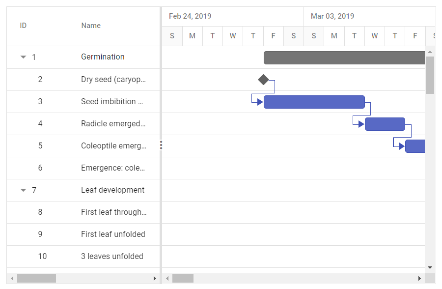

# Data Binding

The Gantt Chart component uses `DataManager` for binding the data source, which supports both RESTful JSON data services and local JavaScript object array. The `DataSource` property can be assigned either with the instance of DataManager or JavaScript object array collection. The Gantt Chart component supports binding two types of data:
* Local data
* Remote data

## Local data

To bind local data to Gantt Chart, you can assign a JavaScript object array to the `DataSource` property. The local data source can also be provided as an instance of the `DataManager`.

In local data binding, the data source for rendering the Gantt Chart component is retrieved from the same application locally.

The following are the two types of data binding possible with the Gantt Chart component:

* Hierarchical data binding.
* Self-referential data binding (Flat data).

### Hierarchical data binding

The `Child` property is used to map the child records in hierarchical data.

The following code example shows how to bind the hierarchical local data into the Gantt Chart component.

```csharp
@using Syncfusion.Blazor.Gantt
<SfGantt DataSource="@TaskCollection" Height="450px" Width="700px">
    <GanttTaskFields Id="TaskId" Name="TaskName" StartDate="StartDate" EndDate="EndDate" Duration="Duration" Progress="Progress" Child="SubTasks">
    </GanttTaskFields>
</SfGantt>

@code{
public List<TaskData> TaskCollection { get; set; }
protected override void OnInitialized()
{
    this.TaskCollection = GetTaskCollection();
}

public class TaskData
{
    public int TaskId { get; set; }
    public string TaskName { get; set; }
    public DateTime StartDate { get; set; }
    public DateTime EndDate { get; set; }
    public string Duration { get; set; }
    public int Progress { get; set; }
    public List<TaskData> SubTasks { get; set; }
}

public static List<TaskData> GetTaskCollection()
{
    List<TaskData> Tasks = new List<TaskData>() {
        new TaskData() {
            TaskId = 1,
            TaskName = "Project initiation",
            StartDate = new DateTime(2019, 04, 02),
            EndDate = new DateTime(2019, 04, 21),
            SubTasks = (new List <TaskData> () {
                new TaskData() {
                    TaskId = 2,
                    TaskName = "Identify Site location",
                    StartDate = new DateTime(2019, 04, 02),
                    Duration = "0",
                    Progress = 30,
                },
                new TaskData() {
                    TaskId = 3,
                    TaskName = "Perform soil test",
                    StartDate = new DateTime(2019, 04, 02),
                    Duration = "4",
                    Progress = 40,
                },
                new TaskData() {
                    TaskId = 4,
                    TaskName = "Soil test approval",
                    StartDate = new DateTime(2019, 04, 02),
                    Duration = "0",
                    Progress = 30
                },
            })
        },
        new TaskData() {
            TaskId = 5,
            TaskName = "Project estimation",
            StartDate = new DateTime(2019, 04, 02),
            EndDate = new DateTime(2019, 04, 21),
            SubTasks = (new List <TaskData> () {
                new TaskData() {
                    TaskId = 6,
                    TaskName = "Develop floor plan for estimation",
                    StartDate = new DateTime(2019, 04, 04),
                    Duration = "3",
                    Progress = 30,
                },
                new TaskData() {
                    TaskId = 7,
                    TaskName = "List materials",
                    StartDate = new DateTime(2019, 04, 04),
                    Duration = "3",
                    Progress = 40
                },
                new TaskData() {
                    TaskId = 8,
                    TaskName = "Estimation approval",
                    StartDate = new DateTime(2019, 04, 04),
                    Duration = "0",
                    Progress = 30,
                }
            })
        }
    };

    return Tasks;
}
}
```

### Self-referential data binding (Flat data)

The Gantt Chart component can be bound with self-referential data by mapping the data source field values to the `Id` and `ParentID` properties.

* ID field: This field contains unique values used to identify each individual task and it is mapped to the `Id` property.
* Parent ID field: This field contains values that indicate parent tasks and it is mapped to the `ParentID` property.

```csharp
@using Syncfusion.Blazor.Gantt
<SfGantt DataSource="@TaskCollection" Height="450px" Width="700px">
    <GanttTaskFields Id="TaskId" Name="TaskName" StartDate="StartDate" EndDate="EndDate" Duration="Duration" Progress="Progress" ParentID="ParentId">
    </GanttTaskFields>
</SfGantt>

@code{
    public List<TaskData> TaskCollection { get; set; }
    protected override void OnInitialized()
    {
        this.TaskCollection = GetTaskCollection();
    }

    public class TaskData
    {
        public int TaskId { get; set; }
        public string TaskName { get; set; }
        public DateTime StartDate { get; set; }
        public DateTime EndDate { get; set; }
        public string Duration { get; set; }
        public int Progress { get; set; }
        public int? ParentId { get; set; }
    }

    public static List <TaskData> GetTaskCollection() {
    List <TaskData> Tasks = new List <TaskData> () {

        new TaskData() {
            TaskId = 1,
            TaskName = "Project initiation",
            StartDate = new DateTime(2019, 04, 02),
            EndDate = new DateTime(2019, 04, 21)
        },
        new TaskData() {
            TaskId = 2,
            TaskName = "Identify Site location",
            StartDate = new DateTime(2019, 04, 02),
            Duration = "0",
            Progress = 30,
            ParentId = 1
        },
        new TaskData() {
            TaskId = 3,
            TaskName = "Perform soil test",
            StartDate = new DateTime(2019, 04, 02),
            Duration = "4",
            Progress = 40,
            ParentId = 1
        },
        new TaskData() {
            TaskId = 4,
            TaskName = "Soil test approval",
            StartDate = new DateTime(2019, 04, 02),
            Duration = "0",
            Progress = 30,
            ParentId = 1
        },
        new TaskData() {
            TaskId = 5,
            TaskName = "Project estimation",
            StartDate = new DateTime(2019, 04, 02),
            EndDate = new DateTime(2019, 04, 21)
        },
        new TaskData() {
            TaskId = 6,
            TaskName = "Develop floor plan for estimation",
            StartDate = new DateTime(2019, 04, 04),
            Duration = "3",
            Progress = 30,
            ParentId = 5
        },
        new TaskData() {
            TaskId = 7,
            TaskName = "List materials",
            StartDate = new DateTime(2019, 04, 04),
            Duration = "3",
            Progress = 40,
            ParentId = 5
        },
        new TaskData() {
            TaskId = 8,
            TaskName = "Estimation approval",
            StartDate = new DateTime(2019, 04, 04),
            Duration = "0",
            Progress = 30,
            ParentId = 5
        }
    };
    return Tasks;
}
}
```

## Remote data

To bind remote data to the Gantt Chart component, assign service data as an instance of `DataManager` to the `DataSource` property.

```csharp
@using Syncfusion.Blazor
@using Syncfusion.Blazor.Gantt
@using Syncfusion.Blazor.Data
<SfGantt TValue="GanttRemoteData" Height="450px">
    <SfDataManager Url="https://ej2services.syncfusion.com/production/web-services/api/GanttData" Adaptor="Adaptors.WebApiAdaptor" CrossDomain="true"></SfDataManager>
    <GanttTaskFields Id="TaskId" Name="TaskName" StartDate="StartDate" Duration="Duration" Progress="Progress" Dependency="Predecessor" Child="SubTasks">
    </GanttTaskFields>
</SfGantt>

@code{
    public class GanttRemoteData
    {
        public int TaskId { get; set; }
        public string TaskName { get; set; }
        public DateTime StartDate { get; set; }
        public string Duration { get; set; }
        public int Progress { get; set; }
        public string Predecessor { get; set; }
        public List<GanttRemoteData>SubTasks { get; set; }
    }
}
```

