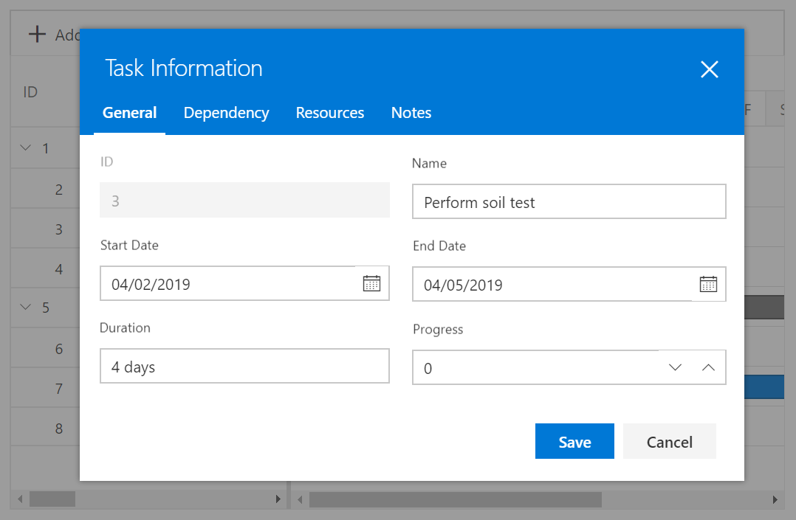
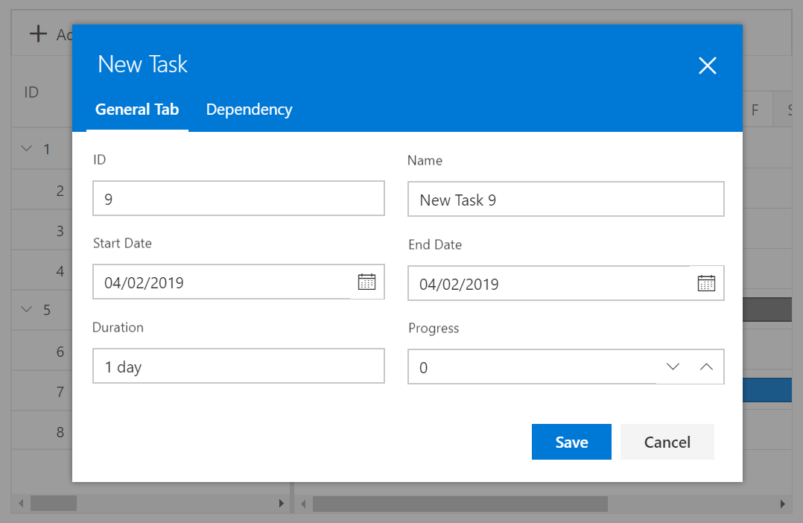
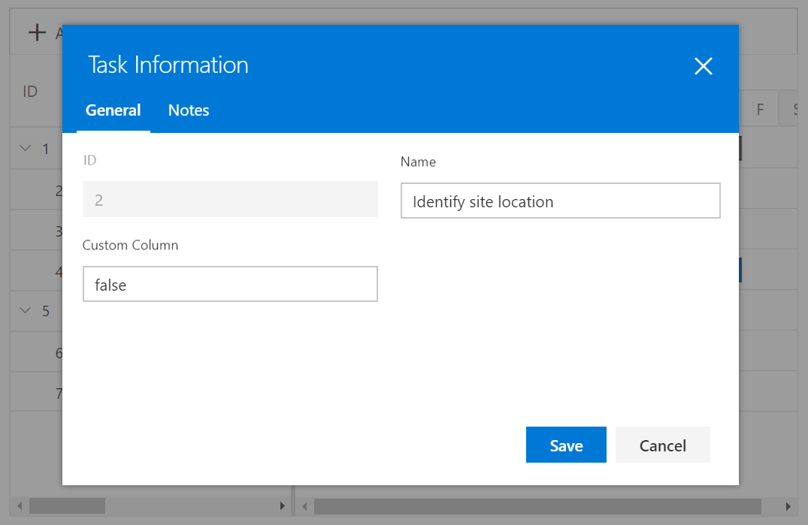
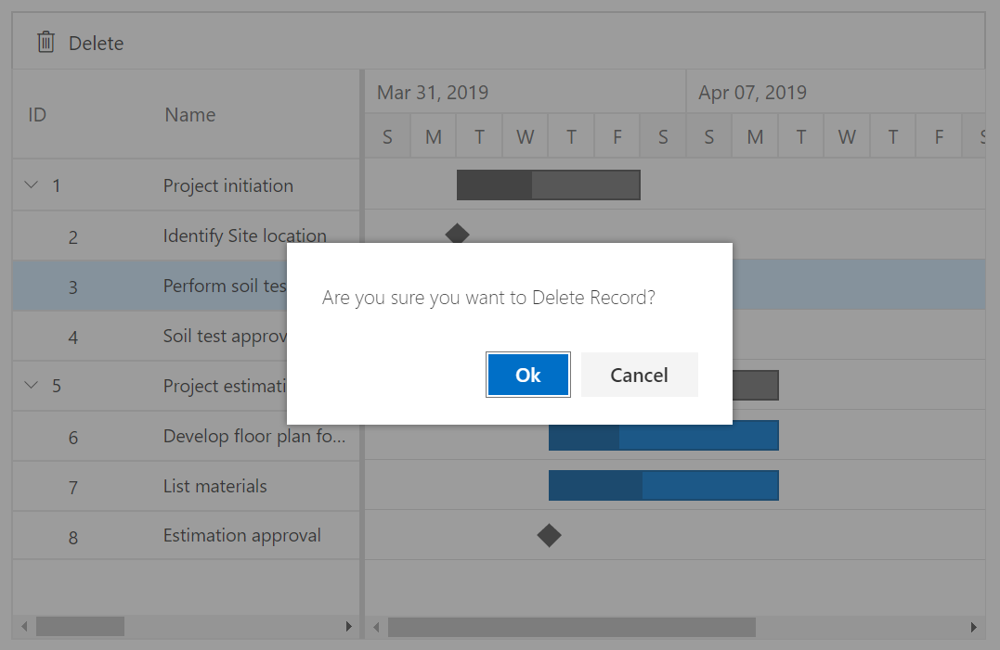

# Managing Tasks

The Gantt Chart component has options to dynamically insert, delete, and update tasks in a project. The primary key column is necessary to manage the tasks and perform CRUD operations in Gantt Chart. To define the primary key, set the `Columns.IsPrimaryKey` property to `true` in the column.

## Adding new tasks

Tasks can be dynamically added to the Gantt Chart project by enabling the `EditSettings.AllowAdding` property.

### Toolbar

A row can be added to the Gantt Chart component from the toolbar while the `EditSettings.AllowAdding` property is set to `true`. After clicking the toolbar add icon, you should provide the task information in the add dialog.

```csharp
@using Syncfusion.Blazor.Gantt
<SfGantt DataSource="@TaskCollection" Toolbar="@(new List<string>() { "Add" })" Height="450px" Width="900px">
    <GanttTaskFields Id="TaskId" Name="TaskName" StartDate="StartDate" EndDate="EndDate" Duration="Duration" Progress="Progress" Child="SubTasks">
    </GanttTaskFields>
    <GanttEditSettings AllowAdding="true"></GanttEditSettings>
</SfGantt>

@code{
    public List<TaskData> TaskCollection { get; set; }
    protected override void OnInitialized()
    {
        this.TaskCollection = GetTaskCollection();
    }

    public class TaskData
    {
        public int TaskId { get; set; }
        public string TaskName { get; set; }
        public DateTime StartDate { get; set; }
        public DateTime EndDate { get; set; }
        public string Duration { get; set; }
        public int Progress { get; set; }
        public List<TaskData> SubTasks { get; set; }
    }

    public static List <TaskData> GetTaskCollection() {
    List <TaskData> Tasks = new List <TaskData> () {
        new TaskData() {
            TaskId = 1,
            TaskName = "Project initiation",
            StartDate = new DateTime(2019, 04, 02),
            EndDate = new DateTime(2019, 04, 21),
            SubTasks = (new List <TaskData> () {
                new TaskData() {
                    TaskId = 2,
                    TaskName = "Identify Site location",
                    StartDate = new DateTime(2019, 04, 02),
                    Duration = "0",
                    Progress = 30,
                },
                new TaskData() {
                    TaskId = 3,
                    TaskName = "Perform soil test",
                    StartDate = new DateTime(2019, 04, 02),
                    Duration = "4",
                    Progress = 40,
                },
                new TaskData() {
                    TaskId = 4,
                    TaskName = "Soil test approval",
                    StartDate = new DateTime(2019, 04, 02),
                    Duration = "0",
                    Progress = 30
                },
            })
        },
        new TaskData() {
            TaskId = 5,
            TaskName = "Project estimation",
            StartDate = new DateTime(2019, 04, 02),
            EndDate = new DateTime(2019, 04, 21),
            SubTasks = (new List <TaskData> () {
                new TaskData() {
                    TaskId = 6,
                    TaskName = "Develop floor plan for estimation",
                    StartDate = new DateTime(2019, 04, 04),
                    Duration = "3",
                    Progress = 30,
                },
                new TaskData() {
                    TaskId = 7,
                    TaskName = "List materials",
                    StartDate = new DateTime(2019, 04, 04),
                    Duration = "3",
                    Progress = 40
                },
                new TaskData() {
                    TaskId = 8,
                    TaskName = "Estimation approval",
                    StartDate = new DateTime(2019, 04, 04),
                    Duration = "0",
                    Progress = 30,
                }
            })
        }
    };

    return Tasks;
}
}
```


> By default, a new row will be added to the top most row in the Gantt Chart component.

### Using method

You can add rows to the Gantt Chart component dynamically using the `AddRecord` method and you can define the add position of the default new record by using the `RowPosition` property. You can also pass the `RowIndex` as an additional parameter.

* Top of all the rows.
* Bottom to all the existing rows.
* Above the selected row.
* Below the selected row.
* As child to the selected row.

```csharp
@using Syncfusion.Blazor.Gantt
<button @onclick="AddRow">Add Row</button>
<SfGantt @ref="Gantt" DataSource="@TaskCollection" Height="450px" Width="900px">
    <GanttTaskFields Id="TaskId" Name="TaskName" StartDate="StartDate" EndDate="EndDate" Duration="Duration" Progress="Progress" Child="SubTasks">
    </GanttTaskFields>
    <GanttEditSettings AllowAdding="true"></GanttEditSettings>
</SfGantt>

@code{
    public SfGantt<TaskData> Gantt;
    public void AddRow()
    {
    this.Gantt.AddRecord(new TaskData() { TaskId = 9, TaskName = "New Added Record", StartDate = new DateTime(2019, 04, 02), Duration = "3",
    Progress = 50}, RowPosition.Below, 2);
    }
    public List<TaskData> TaskCollection { get; set; }
    protected override void OnInitialized()
    {
        this.TaskCollection = GetTaskCollection();
    }

    public class TaskData
    {
        public int TaskId { get; set; }
        public string TaskName { get; set; }
        public DateTime StartDate { get; set; }
        public DateTime EndDate { get; set; }
        public string Duration { get; set; }
        public int Progress { get; set; }
        public List<TaskData> SubTasks { get; set; }
    }

    public static List <TaskData> GetTaskCollection() {
    List <TaskData> Tasks = new List <TaskData> () {
        new TaskData() {
            TaskId = 1,
            TaskName = "Project initiation",
            StartDate = new DateTime(2019, 04, 02),
            EndDate = new DateTime(2019, 04, 21),
            SubTasks = (new List <TaskData> () {
                new TaskData() {
                    TaskId = 2,
                    TaskName = "Identify Site location",
                    StartDate = new DateTime(2019, 04, 02),
                    Duration = "0",
                    Progress = 30,
                },
                new TaskData() {
                    TaskId = 3,
                    TaskName = "Perform soil test",
                    StartDate = new DateTime(2019, 04, 02),
                    Duration = "4",
                    Progress = 40,
                },
                new TaskData() {
                    TaskId = 4,
                    TaskName = "Soil test approval",
                    StartDate = new DateTime(2019, 04, 02),
                    Duration = "0",
                    Progress = 30
                },
            })
        },
        new TaskData() {
            TaskId = 5,
            TaskName = "Project estimation",
            StartDate = new DateTime(2019, 04, 02),
            EndDate = new DateTime(2019, 04, 21),
            SubTasks = (new List <TaskData> () {
                new TaskData() {
                    TaskId = 6,
                    TaskName = "Develop floor plan for estimation",
                    StartDate = new DateTime(2019, 04, 04),
                    Duration = "3",
                    Progress = 30,
                },
                new TaskData() {
                    TaskId = 7,
                    TaskName = "List materials",
                    StartDate = new DateTime(2019, 04, 04),
                    Duration = "3",
                    Progress = 40
                },
                new TaskData() {
                    TaskId = 8,
                    TaskName = "Estimation approval",
                    StartDate = new DateTime(2019, 04, 04),
                    Duration = "0",
                    Progress = 30,
                }
            })
        }
    };

    return Tasks;
}
}
```


## Editing tasks

The editing feature can be enabled in the Gantt Chart component by enabling the `EditSettings.AllowEditing` and `EditSettings.AllowTaskbarEditing` properties.

The following editing options are available to update the tasks in the Gantt chart:
* Cell
* Dialog
* Taskbar
* Dependency links

### Cell editing

By setting the edit mode to auto using the `EditSettings.Mode` property, the tasks can be edited by double-clicking the Tree Grid cells.

The following code example shows you how to enable the cell editing in Gantt Chart component.

```csharp
@using Syncfusion.Blazor.Gantt
<SfGantt DataSource="@TaskCollection" Height="450px" Width="900px">
    <GanttTaskFields Id="TaskId" Name="TaskName" StartDate="StartDate" EndDate="EndDate" Duration="Duration" Progress="Progress" Child="SubTasks">
    </GanttTaskFields>
    <GanttEditSettings AllowEditing="true" Mode="EditMode.Auto"></GanttEditSettings>
</SfGantt>

@code{
    public List<TaskData> TaskCollection { get; set; }
    protected override void OnInitialized()
    {
        this.TaskCollection = GetTaskCollection();
    }

    public class TaskData
    {
        public int TaskId { get; set; }
        public string TaskName { get; set; }
        public DateTime StartDate { get; set; }
        public DateTime EndDate { get; set; }
        public string Duration { get; set; }
        public int Progress { get; set; }
        public List<TaskData> SubTasks { get; set; }
    }

    public static List <TaskData> GetTaskCollection() {
    List <TaskData> Tasks = new List <TaskData> () {
        new TaskData() {
            TaskId = 1,
            TaskName = "Project initiation",
            StartDate = new DateTime(2019, 04, 02),
            EndDate = new DateTime(2019, 04, 21),
            SubTasks = (new List <TaskData> () {
                new TaskData() {
                    TaskId = 2,
                    TaskName = "Identify Site location",
                    StartDate = new DateTime(2019, 04, 02),
                    Duration = "0",
                    Progress = 30,
                },
                new TaskData() {
                    TaskId = 3,
                    TaskName = "Perform soil test",
                    StartDate = new DateTime(2019, 04, 02),
                    Duration = "4",
                    Progress = 40,
                },
                new TaskData() {
                    TaskId = 4,
                    TaskName = "Soil test approval",
                    StartDate = new DateTime(2019, 04, 02),
                    Duration = "0",
                    Progress = 30
                },
            })
        },
        new TaskData() {
            TaskId = 5,
            TaskName = "Project estimation",
            StartDate = new DateTime(2019, 04, 02),
            EndDate = new DateTime(2019, 04, 21),
            SubTasks = (new List <TaskData> () {
                new TaskData() {
                    TaskId = 6,
                    TaskName = "Develop floor plan for estimation",
                    StartDate = new DateTime(2019, 04, 04),
                    Duration = "3",
                    Progress = 30,
                },
                new TaskData() {
                    TaskId = 7,
                    TaskName = "List materials",
                    StartDate = new DateTime(2019, 04, 04),
                    Duration = "3",
                    Progress = 40
                },
                new TaskData() {
                    TaskId = 8,
                    TaskName = "Estimation approval",
                    StartDate = new DateTime(2019, 04, 04),
                    Duration = "0",
                    Progress = 30,
                }
            })
        }
    };

    return Tasks;
}
}
```

`Note:` When the edit mode is set to `Auto`, double-clicking on the Tree Grid side changes, the cells to editable mode. Double-clicking on the chart side opens, the edit dialog for editing the task details.


double click action on Tree Grid side


double click action on chart side

### Dialog editing

Modify the task details through the edit dialog by setting the edit mode.

```csharp
@using Syncfusion.Blazor.Gantt
<SfGantt DataSource="@TaskCollection" Height="450px" Width="900px">
    <GanttTaskFields Id="TaskId" Name="TaskName" StartDate="StartDate" EndDate="EndDate" Duration="Duration" Progress="Progress" Child="SubTasks">
    </GanttTaskFields>
    <GanttEditSettings AllowEditing="true" Mode="EditMode.Dialog"></GanttEditSettings>
</SfGantt>

@code{
    public List<TaskData> TaskCollection { get; set; }
    protected override void OnInitialized()
    {
        this.TaskCollection = GetTaskCollection();
    }

    public class TaskData
    {
        public int TaskId { get; set; }
        public string TaskName { get; set; }
        public DateTime StartDate { get; set; }
        public DateTime EndDate { get; set; }
        public string Duration { get; set; }
        public int Progress { get; set; }
        public List<TaskData> SubTasks { get; set; }
    }

    public static List <TaskData> GetTaskCollection() {
    List <TaskData> Tasks = new List <TaskData> () {
        new TaskData() {
            TaskId = 1,
            TaskName = "Project initiation",
            StartDate = new DateTime(2019, 04, 02),
            EndDate = new DateTime(2019, 04, 21),
            SubTasks = (new List <TaskData> () {
                new TaskData() {
                    TaskId = 2,
                    TaskName = "Identify Site location",
                    StartDate = new DateTime(2019, 04, 02),
                    Duration = "0",
                    Progress = 30,
                },
                new TaskData() {
                    TaskId = 3,
                    TaskName = "Perform soil test",
                    StartDate = new DateTime(2019, 04, 02),
                    Duration = "4",
                    Progress = 40,
                },
                new TaskData() {
                    TaskId = 4,
                    TaskName = "Soil test approval",
                    StartDate = new DateTime(2019, 04, 02),
                    Duration = "0",
                    Progress = 30
                },
            })
        },
        new TaskData() {
            TaskId = 5,
            TaskName = "Project estimation",
            StartDate = new DateTime(2019, 04, 02),
            EndDate = new DateTime(2019, 04, 21),
            SubTasks = (new List <TaskData> () {
                new TaskData() {
                    TaskId = 6,
                    TaskName = "Develop floor plan for estimation",
                    StartDate = new DateTime(2019, 04, 04),
                    Duration = "3",
                    Progress = 30,
                },
                new TaskData() {
                    TaskId = 7,
                    TaskName = "List materials",
                    StartDate = new DateTime(2019, 04, 04),
                    Duration = "3",
                    Progress = 40
                },
                new TaskData() {
                    TaskId = 8,
                    TaskName = "Estimation approval",
                    StartDate = new DateTime(2019, 04, 04),
                    Duration = "0",
                    Progress = 30,
                }
            })
        }
    };

    return Tasks;
}
}
```

`Note:` In dialog editing mode, the edit dialog appears when the Tree Grid or Gantt chart sides are double-clicked.


#### Sections or tabs in dialog

In the Gantt Chart dialog, you can define the required tabs or editing sections using the `AddDialogFields` and `EditDialogFields` properties. Every tab is defined using the `Type` property.

```csharp
@using Syncfusion.Blazor.Gantt
<SfGantt DataSource="@TaskCollection" Toolbar="@(new List<string>() { "Add" })" ResourceNameMapping="ResourceName"
          ResourceIDMapping="ResourceId" Resources="@ResourceCollection" Height="450px" Width="700px">
    <GanttTaskFields Id="TaskId" Name="TaskName" StartDate="StartDate" EndDate="EndDate"
                     Duration="Duration" Progress="Progress" Child="SubTasks" ResourceInfo="ResourceId" Notes="Notes"
                     Dependency="Predecessor">
    </GanttTaskFields>
    <GanttEditSettings AllowAdding="true" AllowEditing="true" Mode="EditMode.Dialog">
    </GanttEditSettings>
    <GanttEditDialogFields>
        <GanttEditDialogField Type="DialogFieldType.General" HeaderText="General">
        </GanttEditDialogField>
        <GanttEditDialogField Type="DialogFieldType.Dependency"></GanttEditDialogField>
        <GanttEditDialogField Type="DialogFieldType.Resources"></GanttEditDialogField>
        <GanttEditDialogField Type="DialogFieldType.Notes"></GanttEditDialogField>
    </GanttEditDialogFields>
    <GanttAddDialogFields>
        <GanttAddDialogField Type="DialogFieldType.General" HeaderText="General Tab"></GanttAddDialogField>
        <GanttAddDialogField Type="DialogFieldType.Dependency"></GanttAddDialogField>
    </GanttAddDialogFields>
</SfGantt>

@code{
    public List<TaskData> TaskCollection { get; set; }
    public List<TaskResources> ResourceCollection { get; set; }
    protected override void OnInitialized()
    {
        this.TaskCollection = GetTaskCollection();
        this.ResourceCollection = GetResourceCollections();
    }

    public class TaskData
    {
        public int TaskId { get; set; }
        public string TaskName { get; set; }
        public DateTime StartDate { get; set; }
        public DateTime EndDate { get; set; }
        public string Duration { get; set; }
        public int Progress { get; set; }
        public List<TaskData> SubTasks { get; set; }
        public int[] ResourceId { get; set; }
        public string Notes { get; set; }
        public string Predecessor { get; set; }
    }
    public class TaskResources
    {
        public int ResourceId { get; set; }
        public string ResourceName { get; set; }
    }

    public static List <TaskResources> GetResourceCollections() {
    List <TaskResources> Resources = new List <TaskResources> () {
        new TaskResources() {
            ResourceId = 1,
            ResourceName = "Martin Tamer"
        },
        new TaskResources() {
            ResourceId = 2,
            ResourceName = "Rose Fuller"
        },
        new TaskResources() {
            ResourceId = 3,
            ResourceName = "Margaret Buchanan"
        },
        new TaskResources() {
            ResourceId = 4,
            ResourceName = "Fuller King"
        }
    };
    return Resources;
}

    public static List <TaskData> GetTaskCollection() {
    List <TaskData> Tasks = new List <TaskData> () {
        new TaskData() {
            TaskId = 1,
            TaskName = "Project initiation",
            StartDate = new DateTime(2019, 04, 02),
            EndDate = new DateTime(2019, 04, 21),
            SubTasks = (new List <TaskData> () {
                new TaskData() {
                    TaskId = 2,
                    TaskName = "Identify Site location",
                    StartDate = new DateTime(2019, 04, 02),
                    Duration = "0",
                    Progress = 30,
                    ResourceId = new int[] {
                        1
                    },
                    Notes = "Measure the total property area alloted for construction"
                },
                new TaskData() {
                    TaskId = 3,
                    TaskName = "Perform soil test",
                    StartDate = new DateTime(2019, 04, 02),
                    Duration = "4",
                    Predecessor = "2",
                    ResourceId = new int[] {
                        2,
                        3,
                        5
                    },
                    Notes = "Obtain an engineered soil test of lot where construction is planned.From an engineer or company specializing in soil testing"

                },
                new TaskData() {
                    TaskId = 4,
                    TaskName = "Soil test approval",
                    StartDate = new DateTime(2019, 04, 02),
                    Duration = "0",
                    Progress = 30,
                    Predecessor = "3"
                },
            })
        },
        new TaskData() {
            TaskId = 5,
            TaskName = "Project estimation",
            StartDate = new DateTime(2019, 04, 02),
            EndDate = new DateTime(2019, 04, 21),
            SubTasks = (new List <TaskData> () {
                new TaskData() {
                    TaskId = 6,
                    TaskName = "Develop floor plan for estimation",
                    StartDate = new DateTime(2019, 04, 04),
                    Duration = "3",
                    Progress = 30,
                    Predecessor = "4",
                    ResourceId = new int[] {
                        4
                    },
                    Notes = "Develop floor plans and obtain a materials list for estimations"
                },
                new TaskData() {
                    TaskId = 7,
                    TaskName = "List materials",
                    StartDate = new DateTime(2019, 04, 04),
                    Duration = "3",
                    Predecessor = "6",
                    ResourceId = new int[] {
                        4,
                        8
                    },
                    Notes = ""
                },
                new TaskData() {
                    TaskId = 8,
                    TaskName = "Estimation approval",
                    StartDate = new DateTime(2019, 04, 04),
                    Duration = "0",
                    Predecessor = "7",
                    ResourceId = new int[] {
                        12,
                        5
                    },
                    Notes = ""
                }
            })
        }
    };

    return Tasks;
}
}
```



Tabs in Edit Dialog



Tabs in Add Dialog

#### Limiting data fields in general tab

In the Gantt Chart dialog, you can make only specific data source fields visible for editing by using the `AddDialogFields` and `EditDialogFields` properties. The data fields are defined with `Type` and `Fields` properties.

`Note:` You can also define the custom fields in the add/edit dialog General tab using the `Fields` property.

```csharp
@using Syncfusion.Blazor.Gantt
<SfGantt DataSource="@TaskCollection" Toolbar="@(new List<string>() { "Add" })" ResourceNameMapping="ResourceName"
          ResourceIDMapping="ResourceId" Resources="@ResourceCollections" Height="450px" Width="700px">
    <GanttTaskFields Id="TaskId" Name="TaskName" StartDate="StartDate" EndDate="EndDate"
          Duration="Duration" Progress="Progress" Child="SubTasks"
          ResourceInfo="ResourceId" Notes="Notes" Dependency="Dependency">
    </GanttTaskFields>
    <GanttEditSettings AllowAdding="true" AllowEditing="true" Mode="EditMode.Dialog">
    </GanttEditSettings>
    <GanttColumns>
        <GanttColumn Field="TaskId" Width="50"></GanttColumn>
        <GanttColumn Field="TaskName"></GanttColumn>
        <GanttColumn Field="isParent" HeaderText="Custom Column"></GanttColumn>
        <GanttColumn Field="StartDate"></GanttColumn>
        <GanttColumn Field="Duration"></GanttColumn>
        <GanttColumn Field="Progress"></GanttColumn>
    </GanttColumns>
    <GanttEditDialogFields>
        <GanttEditDialogField Type="DialogFieldType.General" HeaderText="General"
               Fields="@(new string[]{ "TaskId", "TaskName", "isParent" })"></GanttEditDialogField>
        <GanttEditDialogField Type="DialogFieldType.Notes"></GanttEditDialogField>
    </GanttEditDialogFields>
    <GanttAddDialogFields>
        <GanttAddDialogField Type="DialogFieldType.General" HeaderText="General Tab"
                Fields="@(new string[]{ "TaskId", "TaskName", "isParent" })"></GanttAddDialogField>
        <GanttAddDialogField Type="DialogFieldType.Dependency"></GanttAddDialogField>
    </GanttAddDialogFields>
</SfGantt>

@code{
    public List<TaskData> TaskCollection { get; set; }
    public List<TaskResources> ResourceCollections { get; set; }
    protected override void OnInitialized()
    {
        this.TaskCollection = GetTaskCollection();
        this.ResourceCollections = GetResourceCollection();
    }

    public class TaskData
    {
        public int TaskId { get; set; }
        public string TaskName { get; set; }
        public DateTime StartDate { get; set; }
        public DateTime EndDate { get; set; }
        public string Duration { get; set; }
        public int Progress { get; set; }
        public bool isParent { get; set; }
        public List<TaskData> SubTasks { get; set; }
        public int[] ResourceId { get; set; }
        public string Notes { get; set; }
        public string Predecessor { get; set; }
    }
    public class TaskResources
    {
        public int ResourceId { get; set; }
        public string ResourceName { get; set; }
    }

    public static List <TaskResources> GetResourceCollection() {
    List <TaskResources> Resources = new List <TaskResources> () {
        new TaskResources() {
            ResourceId = 1,
            ResourceName = "Martin Tamer"
        },
        new TaskResources() {
            ResourceId = 2,
            ResourceName = "Rose Fuller"
        },
        new TaskResources() {
            ResourceId = 3,
            ResourceName = "Margaret Buchanan"
        },
        new TaskResources() {
            ResourceId = 4,
            ResourceName = "Fuller King"
        }
    };
    return Resources;
}

    public static List <TaskData> GetTaskCollection() {
    List <TaskData> Tasks = new List <TaskData> () {
        new TaskData() {
            TaskId = 1,
            TaskName = "Project initiation",
            StartDate = new DateTime(2019, 04, 02),
            EndDate = new DateTime(2019, 04, 21),
            isParent = true,
            SubTasks = (new List <TaskData> () {
                new TaskData() {
                    TaskId = 2,
                    TaskName = "Identify Site location",
                    StartDate = new DateTime(2019, 04, 02),
                    Duration = "0",
                    Progress = 30,
                    ResourceId = new int[] {
                        1
                    },
                    Notes = "Measure the total property area alloted for construction"
                },
                new TaskData() {
                    TaskId = 3,
                    TaskName = "Perform soil test",
                    StartDate = new DateTime(2019, 04, 02),
                    Duration = "4",
                    Predecessor = "2",
                    ResourceId = new int[] {
                        2,
                        3
                    },
                    Notes = "Obtain an engineered soil test of lot where construction is planned.From an engineer or company specializing in soil testing"

                },
                new TaskData() {
                    TaskId = 4,
                    TaskName = "Soil test approval",
                    StartDate = new DateTime(2019, 04, 02),
                    Duration = "0",
                    Progress = 30,
                    Predecessor = "3"
                },
            })
        },
        new TaskData() {
            TaskId = 5,
            TaskName = "Project estimation",
            StartDate = new DateTime(2019, 04, 02),
            EndDate = new DateTime(2019, 04, 21),
            isParent = true,
            SubTasks = (new List <TaskData> () {
                new TaskData() {
                    TaskId = 6,
                    TaskName = "Develop floor plan for estimation",
                    StartDate = new DateTime(2019, 04, 04),
                    Duration = "3",
                    Progress = 30,
                    Predecessor = "4",
                    ResourceId = new int[] {
                        4
                    },
                    Notes = "Develop floor plans and obtain a materials list for estimations"
                },
                new TaskData() {
                    TaskId = 7,
                    TaskName = "List materials",
                    StartDate = new DateTime(2019, 04, 04),
                    Duration = "3",
                    Predecessor = "6",
                    ResourceId = new int[] {
                        2,
                        1
                    },
                    Notes = ""
                },
                new TaskData() {
                    TaskId = 8,
                    TaskName = "Estimation approval",
                    StartDate = new DateTime(2019, 04, 04),
                    Duration = "0",
                    Predecessor = "7",
                    ResourceId = new int[] {
                        1,
                        3
                    },
                    Notes = ""
                }
            })
        }
    };

    return Tasks;
}
}
```

The following screenshot show the output of above code example.



### Taskbar editing

Modify the task details through user interaction, such as resizing and dragging the taskbar, by enabling the `AllowTaskbarEditing` property.

```csharp
@using Syncfusion.Blazor.Gantt
<SfGantt DataSource="@TaskCollection" Height="450px" Width="900px">
    <GanttTaskFields Id="TaskId" Name="TaskName" StartDate="StartDate" EndDate="EndDate" Duration="Duration" Progress="Progress" Child="SubTasks">
    </GanttTaskFields>
    <GanttEditSettings AllowTaskbarEditing="true"></GanttEditSettings>
</SfGantt>

@code{
    public List<TaskData> TaskCollection { get; set; }
    protected override void OnInitialized()
    {
        this.TaskCollection = GetTaskCollection();
    }

    public class TaskData
    {
        public int TaskId { get; set; }
        public string TaskName { get; set; }
        public DateTime StartDate { get; set; }
        public DateTime EndDate { get; set; }
        public string Duration { get; set; }
        public int Progress { get; set; }
        public List<TaskData> SubTasks { get; set; }
    }

    public static List<TaskData> GetTaskCollection()
    {
        List<TaskData> Tasks = new List<TaskData>() {
        new TaskData() {
            TaskId = 1,
            TaskName = "Project initiation",
            StartDate = new DateTime(2019, 04, 02),
            EndDate = new DateTime(2019, 04, 21),
            SubTasks = (new List <TaskData> () {
                new TaskData() {
                    TaskId = 2,
                    TaskName = "Identify Site location",
                    StartDate = new DateTime(2019, 04, 02),
                    Duration = "0",
                    Progress = 30,
                },
                new TaskData() {
                    TaskId = 3,
                    TaskName = "Perform soil test",
                    StartDate = new DateTime(2019, 04, 02),
                    Duration = "4",
                    Progress = 40,
                },
                new TaskData() {
                    TaskId = 4,
                    TaskName = "Soil test approval",
                    StartDate = new DateTime(2019, 04, 02),
                    Duration = "0",
                    Progress = 30
                },
            })
        },
        new TaskData() {
            TaskId = 5,
            TaskName = "Project estimation",
            StartDate = new DateTime(2019, 04, 02),
            EndDate = new DateTime(2019, 04, 21),
            SubTasks = (new List <TaskData> () {
                new TaskData() {
                    TaskId = 6,
                    TaskName = "Develop floor plan for estimation",
                    StartDate = new DateTime(2019, 04, 04),
                    Duration = "3",
                    Progress = 30,
                },
                new TaskData() {
                    TaskId = 7,
                    TaskName = "List materials",
                    StartDate = new DateTime(2019, 04, 04),
                    Duration = "3",
                    Progress = 40
                },
                new TaskData() {
                    TaskId = 8,
                    TaskName = "Estimation approval",
                    StartDate = new DateTime(2019, 04, 04),
                    Duration = "0",
                    Progress = 30,
                }
            })
        }
    };

        return Tasks;
    }
}
```

### Task dependencies

In the Gantt Chart component, you can update the dependencies between tasks and link the tasks interactively. The task dependencies can be mapped from the data source using the `Dependency` property.

You can update the task dependencies using the following ways:

* Mouse interactions: Using connector points in the taskbar, you can perform drag and drop action to create task dependency links.
* Edit dialog: Create or remove the task dependencies using the `Dependency` tab in the edit dialog.
* Cell editing: Create or remove the task links using cell editing.

The following code example demonstrates how to enable task dependency editing in the Gantt chart using the `EditSettings` property.

```csharp
@using Syncfusion.Blazor.Gantt
<SfGantt DataSource="@TaskCollection" Height="450px" Width="700px">
    <GanttTaskFields Id="TaskId" Name="TaskName" StartDate="StartDate" EndDate="EndDate" Duration="Duration" Progress="Progress" Child="SubTasks" Dependency="Predecessor">
    </GanttTaskFields>
    <GanttEditSettings AllowTaskbarEditing="true" AllowEditing="true" Mode="EditMode.Auto"></GanttEditSettings>
</SfGantt>

@code{
    public List<TaskData> TaskCollection { get; set; }
    protected override void OnInitialized()
    {
        this.TaskCollection = GetTaskCollection();
    }

    public class TaskData
    {
        public int TaskId { get; set; }
        public string TaskName { get; set; }
        public DateTime StartDate { get; set; }
        public DateTime EndDate { get; set; }
        public string Duration { get; set; }
        public int Progress { get; set; }
        public string Predecessor { get; set; }
        public List<TaskData> SubTasks { get; set; }
    }

    public static List <TaskData> GetTaskCollection() {
    List <TaskData> Tasks = new List <TaskData> ();

    Tasks.Add(new TaskData() {
        TaskId = 1,
        TaskName = "Project initiation",
        StartDate = new DateTime(2019, 04, 02),
        EndDate = new DateTime(2019, 04, 21),
        SubTasks = (new List <TaskData> () {
            new TaskData() {
                TaskId = 2,
                TaskName = "Identify Site location",
                StartDate = new DateTime(2019, 04, 02),
                Duration = "0",
                Progress = 30,
            },
            new TaskData() {
                TaskId = 3,
                TaskName = "Perform soil test",
                StartDate = new DateTime(2019, 04, 02),
                Duration = "4",
                Progress = 40,
                Predecessor = "2"
            },
            new TaskData() {
                TaskId = 4,
                TaskName = "Soil test approval",
                StartDate = new DateTime(2019, 04, 02),
                Duration = "0",
                Progress = 30,
                Predecessor = "3"
            },
        })

    });
    Tasks.Add(new TaskData() {
        TaskId = 5,
        TaskName = "Project estimation",
        StartDate = new DateTime(2019, 04, 02),
        EndDate = new DateTime(2019, 04, 21),
        SubTasks = (new List <TaskData> () {
            new TaskData() {
                TaskId = 6,
                TaskName = "Develop floor plan for estimation",
                StartDate = new DateTime(2019, 04, 04),
                Duration = "3",
                Progress = 30,
                Predecessor = "4"
            },
            new TaskData() {
                TaskId = 7,
                TaskName = "List materials",
                StartDate = new DateTime(2019, 04, 04),
                Duration = "3",
                Progress = 40,
                Predecessor = "6"
            },
            new TaskData() {
                TaskId = 8,
                TaskName = "Estimation approval",
                StartDate = new DateTime(2019, 04, 04),
                Duration = "0",
                Progress = 30,
                Predecessor = "7"
            },
        })
    });
    return Tasks;
}
}
```


Updating with mouse interaction action


Updating with cell Edit


Updating with Dialog

### Update task values using method

Tasks' value can be dynamically updated by using the `UpdateRecordById` method. You can call this method on any custom action. The following code example shows how to use this method to update a task.

>NOTE: Using the `UpdateRecordById` method, you cannot update the task ID value.

```csharp
@using Syncfusion.Blazor.Gantt
<button @onclick="UpdateRecord">Update Task 3</button>
<SfGantt @ref="Gantt" DataSource="@TaskCollection" Height="450px" Width="900px">
    <GanttTaskFields Id="TaskId" Name="TaskName" StartDate="StartDate" EndDate="EndDate" Duration="Duration" Progress="Progress" Child="SubTasks">
    </GanttTaskFields>
    <GanttEditSettings AllowEditing="true"></GanttEditSettings>
</SfGantt>

@code{
    public SfGantt<TaskData> Gantt;
    public void UpdateRecord()
    {
        this.Gantt.UpdateRecordByID(new TaskData() { TaskId = 3, TaskName = "Updated by index value", StartDate = new DateTime(2019, 04, 02), Duration = "4",Progress = 50});
    }
    public List<TaskData> TaskCollection { get; set; }
    protected override void OnInitialized()
    {
        this.TaskCollection = GetTaskCollection();
    }

    public class TaskData
    {
        public int TaskId { get; set; }
        public string TaskName { get; set; }
        public DateTime StartDate { get; set; }
        public DateTime EndDate { get; set; }
        public string Duration { get; set; }
        public int Progress { get; set; }
        public List<TaskData> SubTasks { get; set; }
    }

    public static List <TaskData> GetTaskCollection() {
    List <TaskData> Tasks = new List <TaskData> () {
        new TaskData() {
            TaskId = 1,
            TaskName = "Project initiation",
            StartDate = new DateTime(2019, 04, 02),
            EndDate = new DateTime(2019, 04, 21),
            SubTasks = (new List <TaskData> () {
                new TaskData() {
                    TaskId = 2,
                    TaskName = "Identify Site location",
                    StartDate = new DateTime(2019, 04, 02),
                    Duration = "0",
                    Progress = 30,
                },
                new TaskData() {
                    TaskId = 3,
                    TaskName = "Perform soil test",
                    StartDate = new DateTime(2019, 04, 02),
                    Duration = "4",
                    Progress = 40,
                },
                new TaskData() {
                    TaskId = 4,
                    TaskName = "Soil test approval",
                    StartDate = new DateTime(2019, 04, 02),
                    Duration = "0",
                    Progress = 30
                },
            })
        },
        new TaskData() {
            TaskId = 5,
            TaskName = "Project estimation",
            StartDate = new DateTime(2019, 04, 02),
            EndDate = new DateTime(2019, 04, 21),
            SubTasks = (new List <TaskData> () {
                new TaskData() {
                    TaskId = 6,
                    TaskName = "Develop floor plan for estimation",
                    StartDate = new DateTime(2019, 04, 04),
                    Duration = "3",
                    Progress = 30,
                },
                new TaskData() {
                    TaskId = 7,
                    TaskName = "List materials",
                    StartDate = new DateTime(2019, 04, 04),
                    Duration = "3",
                    Progress = 40
                },
                new TaskData() {
                    TaskId = 8,
                    TaskName = "Estimation approval",
                    StartDate = new DateTime(2019, 04, 04),
                    Duration = "0",
                    Progress = 30,
                }
            })
        }
    };

    return Tasks;
}
}
```


## Deleting tasks

A task delete option in the Gantt Chart component can be enabled by enabling the `EdiSettings.AllowDeleting` property. Tasks can be deleted by clicking the delete toolbar item or using the `DeleteRecord` method. You can call this method dynamically on any custom actions like button click. The following code example shows how to enable the delete option in the Gantt Chart component.

```csharp
@using Syncfusion.Blazor.Gantt
<button @onclick="DeleteRow">Delete task 2</button>
<SfGantt @ref="Gantt" DataSource="@TaskCollection" Height="450px" Width="700px">
    <GanttTaskFields Id="TaskId" Name="TaskName" StartDate="StartDate" EndDate="EndDate" Duration="Duration" Progress="Progress" Child="SubTasks">
    </GanttTaskFields>
    <GanttEditSettings AllowDeleting="true"></GanttEditSettings>
</SfGantt>

@code{
    public SfGantt<TaskData> Gantt;
    public void DeleteRow()
    {
        this.Gantt.DeleteRecord(2);
    }
    public List<TaskData> TaskCollection { get; set; }
    protected override void OnInitialized()
    {
        this.TaskCollection = GetTaskCollection();
    }

    public class TaskData
    {
        public int TaskId { get; set; }
        public string TaskName { get; set; }
        public DateTime StartDate { get; set; }
        public DateTime EndDate { get; set; }
        public string Duration { get; set; }
        public int Progress { get; set; }
        public List<TaskData> SubTasks { get; set; }
    }

    public static List <TaskData> GetTaskCollection() {
    List <TaskData> Tasks = new List <TaskData> () {
        new TaskData() {
            TaskId = 1,
            TaskName = "Project initiation",
            StartDate = new DateTime(2019, 04, 02),
            EndDate = new DateTime(2019, 04, 21),
            SubTasks = (new List <TaskData> () {
                new TaskData() {
                    TaskId = 2,
                    TaskName = "Identify Site location",
                    StartDate = new DateTime(2019, 04, 02),
                    Duration = "0",
                    Progress = 30,
                },
                new TaskData() {
                    TaskId = 3,
                    TaskName = "Perform soil test",
                    StartDate = new DateTime(2019, 04, 02),
                    Duration = "4",
                    Progress = 40,
                },
                new TaskData() {
                    TaskId = 4,
                    TaskName = "Soil test approval",
                    StartDate = new DateTime(2019, 04, 02),
                    Duration = "0",
                    Progress = 30
                },
            })
        },
        new TaskData() {
            TaskId = 5,
            TaskName = "Project estimation",
            StartDate = new DateTime(2019, 04, 02),
            EndDate = new DateTime(2019, 04, 21),
            SubTasks = (new List <TaskData> () {
                new TaskData() {
                    TaskId = 6,
                    TaskName = "Develop floor plan for estimation",
                    StartDate = new DateTime(2019, 04, 04),
                    Duration = "3",
                    Progress = 30,
                },
                new TaskData() {
                    TaskId = 7,
                    TaskName = "List materials",
                    StartDate = new DateTime(2019, 04, 04),
                    Duration = "3",
                    Progress = 40
                },
                new TaskData() {
                    TaskId = 8,
                    TaskName = "Estimation approval",
                    StartDate = new DateTime(2019, 04, 04),
                    Duration = "0",
                    Progress = 30,
                }
            })
        }
    };

    return Tasks;
}
}
```


> You should set the `AllowDeleting` value to `true` to delete the record dynamically.

## Delete confirmation message

Delete confirmation message is used to get confirmation from users before deleting a task. This confirmation message can be enabled by setting the `EditSettings.ShowDeleteConfirmDialog` property to true.

The following code snippet explains how to enable the delete confirmation message in Gantt Chart.

```csharp
@using Syncfusion.Blazor.Gantt
<SfGantt DataSource="@TaskCollection" Height="450px" Width="700px" Toolbar="@(new List<string>() { "Delete" })">
    <GanttTaskFields Id="TaskId" Name="TaskName" StartDate="StartDate" EndDate="EndDate" Duration="Duration" Progress="Progress" Child="SubTasks">
    </GanttTaskFields>
    <GanttEditSettings AllowDeleting="true" ShowDeleteConfirmDialog="true"></GanttEditSettings>
</SfGantt>

@code{
    public List<TaskData> TaskCollection { get; set; }
    protected override void OnInitialized()
    {
        this.TaskCollection = GetTaskCollection();
    }

    public class TaskData
    {
        public int TaskId { get; set; }
        public string TaskName { get; set; }
        public DateTime StartDate { get; set; }
        public DateTime EndDate { get; set; }
        public string Duration { get; set; }
        public int Progress { get; set; }
        public List<TaskData> SubTasks { get; set; }
    }

    public static List <TaskData> GetTaskCollection() {
    List <TaskData> Tasks = new List <TaskData> () {
        new TaskData() {
            TaskId = 1,
            TaskName = "Project initiation",
            StartDate = new DateTime(2019, 04, 02),
            EndDate = new DateTime(2019, 04, 21),
            SubTasks = (new List <TaskData> () {
                new TaskData() {
                    TaskId = 2,
                    TaskName = "Identify Site location",
                    StartDate = new DateTime(2019, 04, 02),
                    Duration = "0",
                    Progress = 30,
                },
                new TaskData() {
                    TaskId = 3,
                    TaskName = "Perform soil test",
                    StartDate = new DateTime(2019, 04, 02),
                    Duration = "4",
                    Progress = 40,
                },
                new TaskData() {
                    TaskId = 4,
                    TaskName = "Soil test approval",
                    StartDate = new DateTime(2019, 04, 02),
                    Duration = "0",
                    Progress = 30
                },
            })
        },
        new TaskData() {
            TaskId = 5,
            TaskName = "Project estimation",
            StartDate = new DateTime(2019, 04, 02),
            EndDate = new DateTime(2019, 04, 21),
            SubTasks = (new List <TaskData> () {
                new TaskData() {
                    TaskId = 6,
                    TaskName = "Develop floor plan for estimation",
                    StartDate = new DateTime(2019, 04, 04),
                    Duration = "3",
                    Progress = 30,
                },
                new TaskData() {
                    TaskId = 7,
                    TaskName = "List materials",
                    StartDate = new DateTime(2019, 04, 04),
                    Duration = "3",
                    Progress = 40
                },
                new TaskData() {
                    TaskId = 8,
                    TaskName = "Estimation approval",
                    StartDate = new DateTime(2019, 04, 04),
                    Duration = "0",
                    Progress = 30,
                }
            })
        }
    };

    return Tasks;
}
}
```



## Entity FrameWork

You need to follow the below steps to consume data from the **Entity Framework** in the Gantt Chart component.

### Create SQL database

The first step is to create a SQL database in your Blazor project. Please refer this [link](https://docs.microsoft.com/en-us/visualstudio/data-tools/create-a-sql-database-by-using-a-designer?view=vs-2019) to create SQL database.

Then, install the below packages for Entity Framework Support using Nuget or Package manager console using the below command.

```bash
Install-Package Microsoft.EntityFrameworkCore.Tools -Version 3.0.0

Install-Package Microsoft.EntityFrameworkCore.SqlServer -Version 3.0.0
```

### Create DBContext class

Then you need to create a DBContext class called **masterContext** to connect to a Microsoft SQL Server database using the below command in Package Manager Console.

```bash
Scaffold-DbContext “Server=ServerName;Database=DatabaseName;Integrated Security=True” Microsoft.EntityFrameworkCore.SqlServer -OutputDir Models
```

```csharp
using System;
using Microsoft.EntityFrameworkCore;
using Microsoft.EntityFrameworkCore.Metadata;

namespace GanttEF.Models
{
    public partial class masterContext : DbContext
    {
        public masterContext()
        {
        }

        public masterContext(DbContextOptions<masterContext> options)
            : base(options)
        {
        }

        public virtual DbSet<Table> Table { get; set; }

        protected override void OnConfiguring(DbContextOptionsBuilder optionsBuilder)
        {
            if (!optionsBuilder.IsConfigured)
            {
                optionsBuilder.UseSqlServer("Server=(localdb)\\MSSQLLocalDB;Database=master;Integrated Security=True");
            }
        }

        protected override void OnModelCreating(ModelBuilder modelBuilder)
        {
            modelBuilder.Entity<Table>(entity =>
            {
                entity.Property(e => e.Id).ValueGeneratedNever();

                entity.Property(e => e.Edate).HasColumnType("datetime");

                entity.Property(e => e.Name)
                    .HasMaxLength(10)
                    .IsFixedLength();

                entity.Property(e => e.Progress)
                    .HasMaxLength(10)
                    .IsFixedLength();

                entity.Property(e => e.Sdate).HasColumnType("datetime");
            });
            OnModelCreatingPartial(modelBuilder);
        }
        partial void OnModelCreatingPartial(ModelBuilder modelBuilder);
    }
}
```

### Custom Adaptor

In Gantt Chart, we can fetch data from the SQL database using `Entity Framework` Data Model and the update
the changes on CRUD action to the server by using `DataManager` support. To communicate with the
remote data, we are using `CustomAdaptor` of DataManager property to call the server method. You can
know more about `CustomAdaptor` from [here](https://blazor.syncfusion.com/documentation/data/custom-binding/).
We can populate the datasource in Gantt from the SQL table using Entity Framework using **Read** method. Please Check the below code snippet to assign the data source to Gantt.

```csharp
@using GanttEF.Models
@using Syncfusion.Blazor.Gantt
@using Syncfusion.Blazor.Data
@using Syncfusion.Blazor


<SfGantt ID="GanttExport" TValue="GanttData" Height="450px" Width="700px"
         Toolbar="@(new List<string>(){ "Add", "Edit", "Update", "Delete", "Cancel", "ExpandAll", "CollapseAll"})">
    <SfDataManager AdaptorInstance="@typeof(CustomAdaptor)" Adaptor="Adaptors.CustomAdaptor"></SfDataManager>
    <GanttColumns>
        <GanttColumn Field=@nameof(GanttData.Id) Width="100"></GanttColumn>
        <GanttColumn Field=@nameof(GanttData.Name) Width="250"></GanttColumn>
        <GanttColumn Field=@nameof(GanttData.Sdate)></GanttColumn>
        <GanttColumn Field=@nameof(GanttData.Edate)></GanttColumn>
        <GanttColumn Field=@nameof(GanttData.Progress)></GanttColumn>
    </GanttColumns>
    <GanttEditSettings AllowAdding="true" AllowDeleting="true" AllowEditing="true" AllowTaskbarEditing="true" ShowDeleteConfirmDialog="true" NewRowPosition="RowPosition.Child"></GanttEditSettings>
    <GanttTimelineSettings>
        <GanttTopTierSettings Unit="TimelineViewMode.Week" Format="MMM dd, y"></GanttTopTierSettings>
        <GanttBottomTierSettings Unit="TimelineViewMode.Day"></GanttBottomTierSettings>
    </GanttTimelineSettings>
    <GanttTaskFields Id="Id" Name="Name" StartDate="Sdate" EndDate="Edate" Progress="Progress"
                     ParentID="ParentId"></GanttTaskFields>
</SfGantt>

@code {
    // Implementing custom adaptor by extending the DataAdaptor class
    public class CustomAdaptor : DataAdaptor
    {
        masterContext db = new masterContext();
        // Performs data Read operation
        public override object Read(DataManagerRequest dm, string key = null)
        {
            IEnumerable<GanttData> DataSource = db.GanttData;
            int count = DataSource.Cast<GanttData>().Count();
            return dm.RequiresCounts ? new DataResult() { Result = DataSource, Count = count } : (object)DataSource;
        }
        .../////

    }
}
```

### Perform CRUD operation in CustomAdaptor

All the CRUD operations in the Gantt Chart are done through DataManager. The DataManager has an option to bind all the CRUD related data in server-side.

We can  do CRUD operations over Gantt data and save the changes into the database. By using **BatchUpdate** method
of DataManager, we can communicate with the controller method to update the data source by CRUD operation. In Gantt
Chart, the CRUD actions on a task are dependent on other tasks. For example, if you edit the child record on the chart side,
the corresponding parent item also will get affected and predecessor dependency task as well get affected. So, all
the CRUD operations in Gantt Chart are considered to be batch editing, where you will get all the affected records as collection.

This server method will be triggered for all the CRUD operations like adding, editing, and deleting actions. We can
handle each operation separately inside this method with corresponding data received in this method argument.

The following sample code explains you about, how to implement CRUD operations for the custom bounded data.

```csharp
@using GanttEF.Models
@using Syncfusion.Blazor.Gantt
@using Syncfusion.Blazor.Data
@using Syncfusion.Blazor

<SfGantt ID="GanttExport" TValue="GanttData" Height="450px" Width="700px"
Toolbar="@(new List<string>(){ "Add", "Edit", "Update", "Delete", "Cancel", "ExpandAll", "CollapseAll"})">
    <SfDataManager AdaptorInstance="@typeof(CustomAdaptor)" Adaptor="Adaptors.CustomAdaptor"></SfDataManager>
    <GanttColumns>
        <GanttColumn Field=@nameof(GanttData.Id) Width="100"></GanttColumn>
        <GanttColumn Field=@nameof(GanttData.Name) Width="250"></GanttColumn>
        <GanttColumn Field=@nameof(GanttData.Sdate)></GanttColumn>
        <GanttColumn Field=@nameof(GanttData.Edate)></GanttColumn>
        <GanttColumn Field=@nameof(GanttData.Progress)></GanttColumn>
    </GanttColumns>
    <GanttEditSettings AllowAdding="true" AllowDeleting="true" AllowEditing="true" AllowTaskbarEditing="true" ShowDeleteConfirmDialog="true" NewRowPosition="RowPosition.Child"></GanttEditSettings>
    <GanttTimelineSettings>
        <GanttTopTierSettings Unit="TimelineViewMode.Week" Format="MMM dd, y"></GanttTopTierSettings>
        <GanttBottomTierSettings Unit="TimelineViewMode.Day"></GanttBottomTierSettings>
    </GanttTimelineSettings>
    <GanttTaskFields Id="Id" Name="Name" StartDate="Sdate" EndDate="Edate" Progress="Progress"
                     ParentID="ParentId"></GanttTaskFields>
</SfGantt>

@code {
    // Implementing custom adaptor by extending the DataAdaptor class
    public class CustomAdaptor : DataAdaptor
    {
        masterContext db = new masterContext();
        // Performs data Read operation
        public override object Read(DataManagerRequest dm, string key = null)
        {
            IEnumerable<GanttData> DataSource = db.GanttData;
            int count = DataSource.Cast<GanttData>().Count();
            return dm.RequiresCounts ? new DataResult() { Result = DataSource, Count = count } : (object)DataSource;
        }

        // Performs CRUD operation
        public override object BatchUpdate(DataManager dm, object changedRecords, object addedRecords, object deletedRecords, string keyField, string key, int? dropIndex)
        {
            List<GanttData> addRecord = addedRecords as List<GanttData>;
            List<GanttData> changed = changedRecords as List<GanttData>;
            List<GanttData> deleteRecord = deletedRecords as List<GanttData>;
            if (changed != null)
            {
                for (var i = 0; i < changed.Count(); i++)
                {
                    var value = changed[i];
                    GanttData result = db.GanttData.Where(or => or.Id == value.Id).FirstOrDefault();
                    result.Id = value.Id;
                    result.Name = value.Name;
                    result.Sdate = value.Sdate;
                    result.Edate = value.Edate;
                    result.Progress = value.Progress;
                    db.SaveChanges();
                }
            }
            if (deleteRecord != null)
            {
                for (var i = 0; i < deleteRecord.Count(); i++)
                {
                    db.GanttData.Remove(db.GanttData.Where(or => or.Id == deleteRecord[i].Id).FirstOrDefault());
                    db.SaveChanges();
                }
            }
            if (addRecord != null)
            {
                for (var i = 0; i < addRecord.Count(); i++)
                {
                    db.GanttData.Add(addRecord[i] as GanttData);
                    db.SaveChanges();
                }
            }
            return (new { addedRecords = addRecord, changedRecords = changed, deletedRecords = deleteRecord });
        }
    }
}
```

>You can find the sample [`here`](https://github.com/SyncfusionExamples/Blazor-Gantt-Chart-with-Entity-framework).