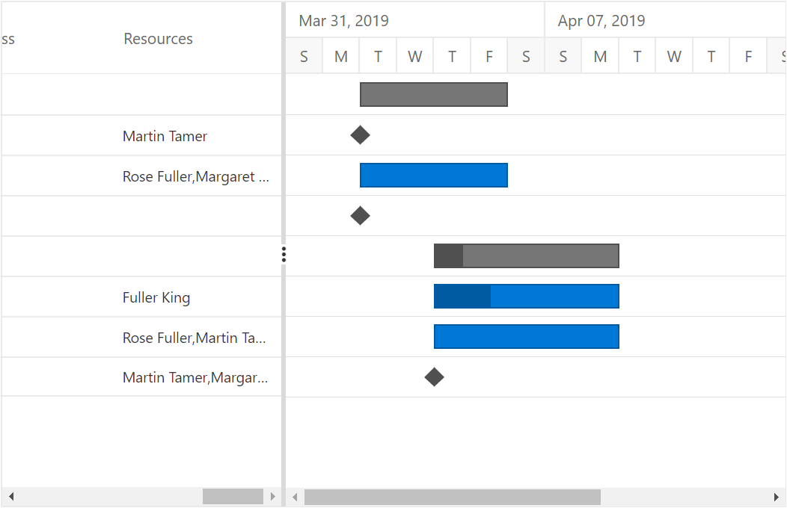
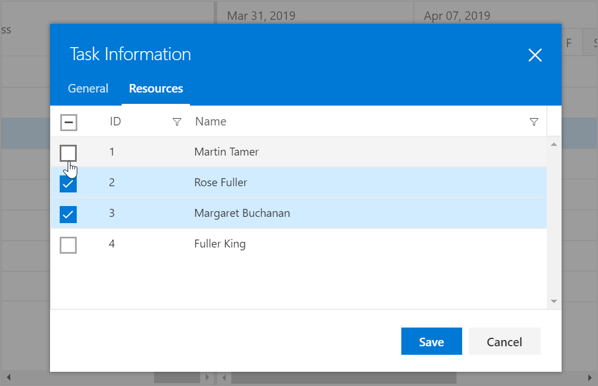

# Resources

In Gantt Chart, the resources are represented by staff, equipment and materials etc. In Gantt Chart component you can show or allocate the resources (human resources) for each task.

## Resource collection

The resource collection contains details about resources that are used in the project. Resources are JSON object that contains id and name of the resources and this collection is mapped to the Gantt Chart component using the `Resources` property. Id and name field of the resources are mapped by using the `ResourceIDMapping` and `ResourceNameMapping` properties. The following code snippets shows resource collection and how it assigned to Gantt Chart component.

```csharp
@using Syncfusion.Blazor.Gantt
<SfGantt DataSource="@TaskCollection" ResourceNameMapping="ResourceName" ResourceIDMapping="ResourceId" Resources="@ResourceCollection" Height="450px" Width="700px">
    <GanttTaskFields Id="TaskId" Name="TaskName" StartDate="StartDate" EndDate="EndDate" Duration="Duration" Progress="Progress" ResourceInfo="ResourceId" Child="SubTasks"></GanttTaskFields>
</SfGantt>

@code{
    public List<TaskData> TaskCollection { get; set; }
    public List<TaskResource> ResourceCollection { get; set; }
    protected override void OnInitialized()
    {
        this.TaskCollection = GetTaskCollection();
        this.ResourceCollection = GetResourceCollection();
    }

    public class TaskData
    {
        public int TaskId { get; set; }
        public string TaskName { get; set; }
        public DateTime StartDate { get; set; }
        public DateTime EndDate { get; set; }
        public string Duration { get; set; }
        public int Progress { get; set; }
        public string Predecessor { get; set; }
        public List<TaskData> SubTasks { get; set; }
        public int[] ResourceId { get; set; }
    }

    public static List <TaskData> GetTaskCollection() {
    List <TaskData> Tasks = new List <TaskData> () {
        new TaskData() {
            TaskId = 1,
            TaskName = "Project initiation",
            StartDate = new DateTime(2019, 04, 02),
            EndDate = new DateTime(2019, 04, 21),
            SubTasks = (new List <TaskData> () {
                new TaskData() {
                    TaskId = 2,
                    TaskName = "Identify Site location",
                    StartDate = new DateTime(2019, 04, 02),
                    Duration = "0",
                    Progress = 30,
                    ResourceId = new int[] {
                        1
                    },
                },
                new TaskData() {
                    TaskId = 3,
                    TaskName = "Perform soil test",
                    StartDate = new DateTime(2019, 04, 02),
                    Duration = "4",
                    Predecessor = "2",
                    ResourceId = new int[] {
                        2,
                        3
                    },
                },
                new TaskData() {
                    TaskId = 4,
                    TaskName = "Soil test approval",
                    StartDate = new DateTime(2019, 04, 02),
                    Duration = "0",
                    Progress = 30,
                    Predecessor = "3"
                },
            })
        },
        new TaskData() {
            TaskId = 5,
            TaskName = "Project estimation",
            StartDate = new DateTime(2019, 04, 02),
            EndDate = new DateTime(2019, 04, 21),
            SubTasks = (new List <TaskData> () {
                new TaskData() {
                    TaskId = 6,
                    TaskName = "Develop floor plan for estimation",
                    StartDate = new DateTime(2019, 04, 04),
                    Duration = "3",
                    Progress = 30,
                    Predecessor = "4",
                    ResourceId = new int[] {
                        4
                    },
                },
                new TaskData() {
                    TaskId = 7,
                    TaskName = "List materials",
                    StartDate = new DateTime(2019, 04, 04),
                    Duration = "3",
                    Predecessor = "6",
                    ResourceId = new int[] {
                        2,
                        1
                    },
                },
                new TaskData() {
                    TaskId = 8,
                    TaskName = "Estimation approval",
                    StartDate = new DateTime(2019, 04, 04),
                    Duration = "0",
                    Predecessor = "7",
                    ResourceId = new int[] {
                        1,
                        3
                    },
                }
            })
        }
    };

    return Tasks;
}

    public class TaskResource
    {
        public int ResourceId { get; set; }
        public string ResourceName { get; set; }
    }
    public static List <TaskResource> GetResourceCollection() {
    List <TaskResource> Resources = new List <TaskResource> () {
        new TaskResource() {
            ResourceId = 1,
            ResourceName = "Martin Tamer"
        },
        new TaskResource() {
            ResourceId = 2,
            ResourceName = "Rose Fuller"
        },
        new TaskResource() {
            ResourceId = 3,
            ResourceName = "Margaret Buchanan"
        },
        new TaskResource() {
            ResourceId = 4,
            ResourceName = "Fuller King"
        }
    };
    return Resources;
}
}
```

## Assign resource

We can assign resources for a task at initial load, using the resource id value of the resources as a collection. This collection is mapped from the dataSource to the Gantt Chart component using the `ResourceInfo` property.
The following code snippet shows how to assign the resource for each task and map to Gantt Chart component.

```csharp
@using Syncfusion.Blazor.Gantt
<SfGantt DataSource="@TaskCollection" ResourceNameMapping="ResourceName" ResourceIDMapping="ResourceId" Resources="@ResourceCollection" Height="450px" Width="700px">
    <GanttTaskFields Id="TaskId" Name="TaskName" StartDate="StartDate" EndDate="EndDate" Duration="Duration" Progress="Progress" ResourceInfo="ResourceId" Child="SubTasks"></GanttTaskFields>
</SfGantt>

@code{
    public List<TaskData> TaskCollection { get; set; }
    public List<TaskResource> ResourceCollection { get; set; }
    protected override void OnInitialized()
    {
        this.TaskCollection = GetTaskCollection();
        this.ResourceCollection = GetResourceCollection();
    }

    public class TaskData
    {
        public int TaskId { get; set; }
        public string TaskName { get; set; }
        public DateTime StartDate { get; set; }
        public DateTime EndDate { get; set; }
        public string Duration { get; set; }
        public int Progress { get; set; }
        public string Predecessor { get; set; }
        public List<TaskData> SubTasks { get; set; }
        public int[] ResourceId { get; set; }
    }

    public static List <TaskData> GetTaskCollection() {
    List <TaskData> Tasks = new List <TaskData> () {
        new TaskData() {
            TaskId = 1,
            TaskName = "Project initiation",
            StartDate = new DateTime(2019, 04, 02),
            EndDate = new DateTime(2019, 04, 21),
            SubTasks = (new List <TaskData> () {
                new TaskData() {
                    TaskId = 2,
                    TaskName = "Identify Site location",
                    StartDate = new DateTime(2019, 04, 02),
                    Duration = "0",
                    Progress = 30,
                    ResourceId = new int[] {
                        1
                    },
                },
                new TaskData() {
                    TaskId = 3,
                    TaskName = "Perform soil test",
                    StartDate = new DateTime(2019, 04, 02),
                    Duration = "4",
                    Predecessor = "2",
                    ResourceId = new int[] {
                        2,
                        3
                    },
                },
                new TaskData() {
                    TaskId = 4,
                    TaskName = "Soil test approval",
                    StartDate = new DateTime(2019, 04, 02),
                    Duration = "0",
                    Progress = 30,
                    Predecessor = "3"
                },
            })
        },
        new TaskData() {
            TaskId = 5,
            TaskName = "Project estimation",
            StartDate = new DateTime(2019, 04, 02),
            EndDate = new DateTime(2019, 04, 21),
            SubTasks = (new List <TaskData> () {
                new TaskData() {
                    TaskId = 6,
                    TaskName = "Develop floor plan for estimation",
                    StartDate = new DateTime(2019, 04, 04),
                    Duration = "3",
                    Progress = 30,
                    Predecessor = "4",
                    ResourceId = new int[] {
                        4
                    },
                },
                new TaskData() {
                    TaskId = 7,
                    TaskName = "List materials",
                    StartDate = new DateTime(2019, 04, 04),
                    Duration = "3",
                    Predecessor = "6",
                    ResourceId = new int[] {
                        2,
                        1
                    },
                },
                new TaskData() {
                    TaskId = 8,
                    TaskName = "Estimation approval",
                    StartDate = new DateTime(2019, 04, 04),
                    Duration = "0",
                    Predecessor = "7",
                    ResourceId = new int[] {
                        1,
                        3
                    },
                }
            })
        }
    };

    return Tasks;
}

    public class TaskResource
    {
        public int ResourceId { get; set; }
        public string ResourceName { get; set; }
    }
    public static List <TaskResource> GetResourceCollection() {
    List <TaskResource> Resources = new List <TaskResource> () {
        new TaskResource() {
            ResourceId = 1,
            ResourceName = "Martin Tamer"
        },
        new TaskResource() {
            ResourceId = 2,
            ResourceName = "Rose Fuller"
        },
        new TaskResource() {
            ResourceId = 3,
            ResourceName = "Margaret Buchanan"
        },
        new TaskResource() {
            ResourceId = 4,
            ResourceName = "Fuller King"
        }
    };
    return Resources;
}
}
```



## Edit resource collection

By using cell edit option, we can add/remove the resource for particular task and also by using dialog edit support we can add/remove  resources.

```csharp
@using Syncfusion.Blazor.Gantt
    <SfGantt DataSource="@TaskCollection" ResourceNameMapping="ResourceName" ResourceIDMapping="ResourceId" Resources="@ResourceCollection" Height="450px" Width="700px">
        <GanttTaskFields Id="TaskId" Name="TaskName" StartDate="StartDate" EndDate="EndDate" Duration="Duration" Progress="Progress" ResourceInfo="ResourceId" Child="SubTasks"></GanttTaskFields>
        <GanttEditSettings AllowEditing="true" Mode="EditMode.Auto"></GanttEditSettings>
    </SfGantt>

@code{
    public List<TaskData> TaskCollection { get; set; }
    public List<TaskResource> ResourceCollection { get; set; }
    protected override void OnInitialized()
    {
        this.TaskCollection = GetTaskCollection();
        this.ResourceCollection = GetResourceCollection();
    }

    public class TaskData
    {
        public int TaskId { get; set; }
        public string TaskName { get; set; }
        public DateTime StartDate { get; set; }
        public DateTime EndDate { get; set; }
        public string Duration { get; set; }
        public int Progress { get; set; }
        public string Predecessor { get; set; }
        public List<TaskData> SubTasks { get; set; }
        public int[] ResourceId { get; set; }
    }

    public static List <TaskData> GetTaskCollection() {
    List <TaskData> Tasks = new List <TaskData> () {
        new TaskData() {
            TaskId = 1,
            TaskName = "Project initiation",
            StartDate = new DateTime(2019, 04, 02),
            EndDate = new DateTime(2019, 04, 21),
            SubTasks = (new List <TaskData> () {
                new TaskData() {
                    TaskId = 2,
                    TaskName = "Identify Site location",
                    StartDate = new DateTime(2019, 04, 02),
                    Duration = "0",
                    Progress = 30,
                    ResourceId = new int[] {
                        1
                    },
                },
                new TaskData() {
                    TaskId = 3,
                    TaskName = "Perform soil test",
                    StartDate = new DateTime(2019, 04, 02),
                    Duration = "4",
                    Predecessor = "2",
                    ResourceId = new int[] {
                        2,
                        3
                    },
                },
                new TaskData() {
                    TaskId = 4,
                    TaskName = "Soil test approval",
                    StartDate = new DateTime(2019, 04, 02),
                    Duration = "0",
                    Progress = 30,
                    Predecessor = "3"
                },
            })
        },
        new TaskData() {
            TaskId = 5,
            TaskName = "Project estimation",
            StartDate = new DateTime(2019, 04, 02),
            EndDate = new DateTime(2019, 04, 21),
            SubTasks = (new List <TaskData> () {
                new TaskData() {
                    TaskId = 6,
                    TaskName = "Develop floor plan for estimation",
                    StartDate = new DateTime(2019, 04, 04),
                    Duration = "3",
                    Progress = 30,
                    Predecessor = "4",
                    ResourceId = new int[] {
                        4
                    },
                },
                new TaskData() {
                    TaskId = 7,
                    TaskName = "List materials",
                    StartDate = new DateTime(2019, 04, 04),
                    Duration = "3",
                    Predecessor = "6",
                    ResourceId = new int[] {
                        2,
                        1
                    },
                },
                new TaskData() {
                    TaskId = 8,
                    TaskName = "Estimation approval",
                    StartDate = new DateTime(2019, 04, 04),
                    Duration = "0",
                    Predecessor = "7",
                    ResourceId = new int[] {
                        1,
                        3
                    },
                }
            })
        }
    };

    return Tasks;
}

    public class TaskResource
    {
        public int ResourceId { get; set; }
        public string ResourceName { get; set; }
    }
    public static List <TaskResource> GetResourceCollection() {
    List <TaskResource> Resources = new List <TaskResource> () {
        new TaskResource() {
            ResourceId = 1,
            ResourceName = "Martin Tamer"
        },
        new TaskResource() {
            ResourceId = 2,
            ResourceName = "Rose Fuller"
        },
        new TaskResource() {
            ResourceId = 3,
            ResourceName = "Margaret Buchanan"
        },
        new TaskResource() {
            ResourceId = 4,
            ResourceName = "Fuller King"
        }
    };
    return Resources;
}
}
```

`Note:` When the edit mode is set as `Auto`, on performing double click action on Tree Grid side the cells will be changed to editable mode and on performing double click action on chart side the edit dialog will appear for editing the task details. By using this support we can add/remove the resource for particular task using both cell and edit dialog


Editing resource with cell edit



Editing resource with edit dialog