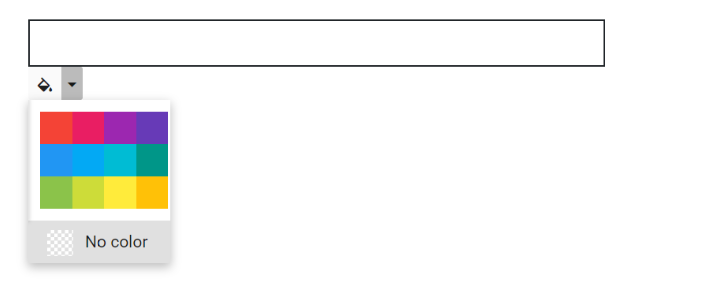

# Handle No Color Support

The Color Picker component supports no color functionality. By clicking the no color tile from palette, the selected color becomes `empty` and considered as no color has been selected from Color Picker.

## Default no color

To achieve this, set [`NoColor`](https://help.syncfusion.com/cr/blazor/Syncfusion.Blazor~Syncfusion.Blazor.Inputs.SfColorPicker~NoColor.html) property as true.

In the following sample, the first tile of the color palette represents the no color tile. By clicking the no color tile you can achieve the above functionalities.

```csharp

@using Syncfusion.Blazor.Inputs
@using Newtonsoft.Json.Linq;

<div id="preview" style="@StyleValue"></div>
<SfColorPicker NoColor="true" Mode="ColorPickerMode.Palette" ShowButtons="false" ModeSwitcher="false" ValueChange="@Changed"></SfColorPicker>

@code{
    public string StyleValue = "background-color:#008000";
    public GetCurrentValue ColorValue { get; set; }
    public void Changed(ColorPickerEventArgs args)
    {
        this.ColorValue = ((JObject)args.CurrentValue).ToObject<GetCurrentValue>();
        this.StyleValue = "background-color:" + this.ColorValue.hex;
        this.StateHasChanged();
    }
    public class GetCurrentValue
    {
        public string hex { get; set; }
        public string rgba { get; set; }
    }
}

<style>
    #preview{
        border: 1px solid;
        height: 40px;
        width: 50%;
    }
</style>

```

Output be like


## Custom No Color

The following sample show the color palette with custom no color option.

```csharp

@using Syncfusion.Blazor.Inputs
@using Syncfusion.Blazor.SplitButtons
@using Newtonsoft.Json.Linq;

<div id="preview" style="@StyleValue"></div>
    <SfSplitButton Target="#target" IconCss="e-icons e-picker"></SfSplitButton>
<ul id="target" tabindex="0">
    <li class="e-item e-palette-item">
        <SfColorPicker Columns="4" Inline="true" Mode="ColorPickerMode.Palette" PresetColors="@CustomValues[0]" ShowButtons="false" ModeSwitcher="false" ValueChange="@Changed"></SfColorPicker>
    </li>
    <li class="e-item" @onclick="@Clicked" id="no-color" tabindex="-1">
        <span class="e-menu-icon e-nocolor"></span>
        No color
    </li>
</ul>

@code{
    public string StyleValue = "background-color:#008000";
    public GetCurrentValue ColorValue { get; set; }
    public void Changed(ColorPickerEventArgs args)
    {
        this.ColorValue = ((JObject)args.CurrentValue).ToObject<GetCurrentValue>();
        this.StyleValue = "background-color:" + this.ColorValue.hex;
        this.StateHasChanged();
    }
    public class GetCurrentValue
    {
        public string hex { get; set; }
        public string rgba { get; set; }
    }
    public List<object> CustomValues = new List<object> {
    new{
        Custom = new string[] {"#f44336", "#e91e63", "#9c27b0", "#673ab7", "#2196f3", "#03a9f4", "#00bcd4", "#009688", "#8bc34a", "#cddc39", "#ffeb3b", "#ffc107"}
        }
    };
    public void Clicked()
    {
        this.StyleValue = "background-color: #ffffff";
    }
}

<style>
    .e-picker::before{
        content: '\e35c'
    }

    #preview {
        border: 1px solid;
        height: 40px;
        width: 50%;
    }

    .e-dropdown-popup ul#target {
        padding: 0;
    }

    .e-dropdown-popup ul .e-item.e-palette-item {
        height: auto;
        padding: 0;
    }

    .e-dropdown-popup ul .e-item .e-menu-icon.e-nocolor {
        height: 22px;
        margin-top: 8px;
        width: 22px;
        background: transparent url('data:image/svg+xml;base64,PD94bWwgdmVyc2lvbj0iMS4wIiBlbmNvZGluZz0iVVRGLTgiPz4KPHN2ZyB3aWR0aD0iNnB4IiBoZWlnaHQ9IjZweCIgdmlld0JveD0iMCAwIDYgNiIgdmVyc2lvbj0iMS4xIiB4bWxucz0iaHR0cDovL3d3dy53My5vcmcvMjAwMC9zdmciIHhtbG5zOnhsaW5rPSJodHRwOi8vd3d3LnczLm9yZy8xOTk5L3hsaW5rIj4KICAgIDwhLS0gR2VuZXJhdG9yOiBTa2V0Y2ggNTAgKDU0OTgzKSAtIGh0dHA6Ly93d3cuYm9oZW1pYW5jb2RpbmcuY29tL3NrZXRjaCAtLT4KICAgIDx0aXRsZT5Hcm91cCA5PC90aXRsZT4KICAgIDxkZXNjPkNyZWF0ZWQgd2l0aCBTa2V0Y2guPC9kZXNjPgogICAgPGRlZnM+PC9kZWZzPgogICAgPGcgaWQ9IlBhZ2UtMSIgc3Ryb2tlPSJub25lIiBzdHJva2Utd2lkdGg9IjEiIGZpbGw9Im5vbmUiIGZpbGwtcnVsZT0iZXZlbm9kZCI+CiAgICAgICAgPGcgaWQ9Ikdyb3VwLTkiPgogICAgICAgICAgICA8cmVjdCBpZD0iUmVjdGFuZ2xlLTExIiBmaWxsPSIjRTBFMEUwIiB4PSIwIiB5PSIwIiB3aWR0aD0iMyIgaGVpZ2h0PSIzIj48L3JlY3Q+CiAgICAgICAgICAgIDxyZWN0IGlkPSJSZWN0YW5nbGUtMTEtQ29weS0yIiBmaWxsPSIjRkZGRkZGIiB4PSIwIiB5PSIzIiB3aWR0aD0iMyIgaGVpZ2h0PSIzIj48L3JlY3Q+CiAgICAgICAgICAgIDxyZWN0IGlkPSJSZWN0YW5nbGUtMTEtQ29weSIgZmlsbD0iI0ZGRkZGRiIgeD0iMyIgeT0iMCIgd2lkdGg9IjMiIGhlaWdodD0iMyI+PC9yZWN0PgogICAgICAgICAgICA8cmVjdCBpZD0iUmVjdGFuZ2xlLTExLUNvcHktMyIgZmlsbD0iI0UwRTBFMCIgeD0iMyIgeT0iMyIgd2lkdGg9IjMiIGhlaWdodD0iMyI+PC9yZWN0PgogICAgICAgIDwvZz4KICAgIDwvZz4KPC9zdmc+');
    }
</style>

```

Output be like
