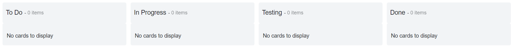
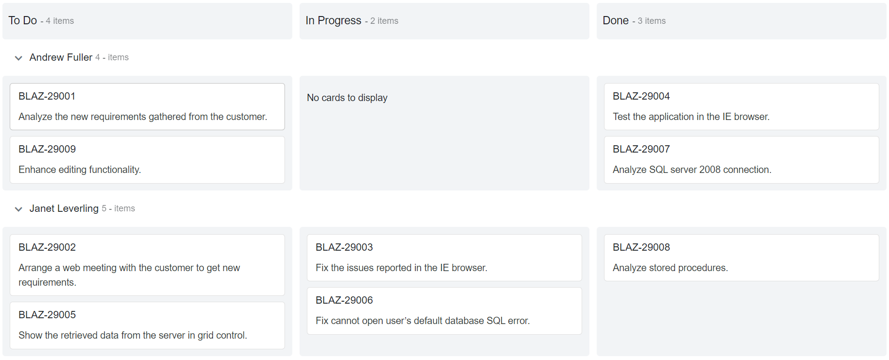

<!-- markdownlint-disable MD024 -->

# Getting Started

This section briefly explains how to include a Kanban component in your Blazor Server-side application. You can refer [Getting Started with Syncfusion Blazor for Server-Side in Visual Studio 2019 page](../getting-started/vs-blazor-server/) for the introduction and configuring the common specifications.

## Importing Syncfusion Blazor component in the application

* Install `Syncfusion.Blazor` NuGet package to the application by using the `NuGet Package Manager`.

> Please ensure to check the `Include prerelease` option for our Beta release.

* You can add the client-side resources through CDN or from NuGet package in the `<head>` element of the **~/Pages/_Host.cshtml** page.

```html

<head>
    <link href="_content/Syncfusion.Blazor/styles/bootstrap4.css" rel="stylesheet" />
    @*<link href="https://cdn.syncfusion.com/blazor/{:version:}/styles/bootstrap4.css" rel="stylesheet" />*@
</head>

```

> For Internet Explorer 11 kindly refer the polyfills. Refer the [documentation](../../common/how-to/render-blazor-server-app-in-ie/) for more information.

```html

<head>
    <link href="_content/Syncfusion.Blazor/styles/bootstrap4.css" rel="stylesheet" />
    <script src="https://github.com/Daddoon/Blazor.Polyfill/releases/download/3.0.1/blazor.polyfill.min.js"></script>
</head>

```

## Adding component package to the application

Open **~/_Imports.razor** file and import the `Syncfusion.Blazor.Kanban` package.

```csharp

@using Syncfusion.Blazor.Kanban

```

## Add SyncfusionBlazor service in Startup.cs

Open the **Startup.cs** file and add services required by Syncfusion components using `services.AddSyncfusionBlazor()` method. Add this method in the `ConfigureServices` function as follows.

```csharp

using Syncfusion.Blazor;
namespace BlazorApplication
{
    public class Startup
    {
        ....
        ....
        public void ConfigureServices(IServiceCollection services)
        {
            ....
            ....
            services.AddSyncfusionBlazor();
        }
    }
}

```

## Initialize Kanban component

To initialize the Kanban component, add the below code to your **Index.razor** view page which is present under **~/Pages** folder.

```csharp

@using Syncfusion.Blazor.Kanban

<SfKanban TValue="TasksModel">
    <KanbanColumns>
        <KanbanColumn HeaderText="To Do" KeyField=@(new List<string> { "Open" })></KanbanColumn>
        <KanbanColumn HeaderText="In Progress" KeyField=@(new List<string> { "InProgress" })></KanbanColumn>
        <KanbanColumn HeaderText="Testing" KeyField=@(new List<string> { "Testing" })></KanbanColumn>
        <KanbanColumn HeaderText="Done" KeyField=@(new List<string> { "Close" })></KanbanColumn>
    </KanbanColumns>
</SfKanban>

@code {
    public class TasksModel
    {
        public string Id { get; set; }
        public string Title { get; set; }
        public string Status { get; set; }
        public string Summary { get; set; }
    }
}

```

## Run the application

After successful compilation of your application, run the application.

The output will be as follows.



## Populating cards

To populate the empty Kanban with cards, define the Enumerable object or remote data using the `DataSource` property. To define `DataSource`, the mandatory fields in object or remote data should be relevant to `KeyField`. In the following example, you can see the cards defined with default fields such as ID, Summary, and Status.

```csharp

@using Syncfusion.Blazor.Kanban

<SfKanban TValue="TasksModel" KeyField="Status" DataSource="Tasks">
    <KanbanColumns>
        <KanbanColumn HeaderText="To Do" KeyField=@(new List<string> { "Open" })></KanbanColumn>
        <KanbanColumn HeaderText="In Progress" KeyField=@(new List<string> { "InProgress" })></KanbanColumn>
        <KanbanColumn HeaderText="Testing" KeyField=@(new List<string> { "Testing" })></KanbanColumn>
        <KanbanColumn HeaderText="Done" KeyField=@(new List<string> { "Close" })></KanbanColumn>
    </KanbanColumns>
    <KanbanCardSettings HeaderField="Title" ContentField="Summary"></KanbanCardSettings>
</SfKanban>

@code {
    public class TasksModel
    {
        public string Id { get; set; }
        public string Title { get; set; }
        public string Status { get; set; }
        public string Summary { get; set; }
    }

    public List<TasksModel> Tasks = new List<TasksModel>()
    {
        new TasksModel { Id = "Task 1", Title = "BLAZ-29001", Status = "Open", Summary = "Analyze the new requirements gathered from the customer." },
        new TasksModel { Id = "Task 2", Title = "BLAZ-29002", Status = "Open", Summary = "Show the retrieved data from the server in grid control." },
        new TasksModel { Id = "Task 3", Title = "BLAZ-29003", Status = "InProgress", Summary = "Improve application performance" },
        new TasksModel { Id = "Task 4", Title = "BLAZ-29004", Status = "Testing", Summary = "Fix the issues reported by the customer." },
        new TasksModel { Id = "Task 5", Title = "BLAZ-29005", Status = "Testing", Summary = "Fix the issues reported in Safari browser." },
        new TasksModel { Id = "Task 6", Title = "BLAZ-29006", Status = "Close", Summary = "Analyze SQL server 2008 connection." },
        new TasksModel { Id = "Task 7", Title = "BLAZ-29007", Status = "Close", Summary = "Analyze grid control." },
        new TasksModel { Id = "Task 8", Title = "BLAZ-29008", Status = "Close", Summary = "Stored procedure for initial data binding of the grid." }
    };
}

```

The output will be as follows.


## Enable Swimlane

`Swimlane` can be enabled by mapping the fields `KanbanSwimlaneSettings.KeyField` to appropriate column name in DataSource. This enables the grouping of the cards based on the mapped column values.

```csharp

@using Syncfusion.Blazor.Kanban

<SfKanban TValue="TasksModel" KeyField="Status" DataSource="Tasks">
    <KanbanColumns>
        <KanbanColumn HeaderText="To Do" KeyField=@(new List<string> { "Open" })></KanbanColumn>
        <KanbanColumn HeaderText="In Progress" KeyField=@(new List<string> { "InProgress" })></KanbanColumn>
        <KanbanColumn HeaderText="Done" KeyField=@(new List<string> { "Close" })></KanbanColumn>
    </KanbanColumns>
    <KanbanCardSettings HeaderField="Title" ContentField="Summary"></KanbanCardSettings>
    <KanbanSwimlaneSettings KeyField="Assignee"></KanbanSwimlaneSettings>
</SfKanban>

@code {
    public class TasksModel
    {
        public string Id { get; set; }
        public string Title { get; set; }
        public string Status { get; set; }
        public string Summary { get; set; }
        public string Assignee { get; set; }
    }

    public List<TasksModel> Tasks = new List<TasksModel>()
{
        new TasksModel { Id = "Task 1", Title = "BLAZ-29001", Status = "Open", Summary = "Analyze the new requirements gathered from the customer.", Assignee = "Andrew Fuller" },
        new TasksModel { Id = "Task 2", Title = "BLAZ-29002", Status = "Open", Summary = "Arrange a web meeting with the customer to get new requirements.", Assignee = "Janet Leverling" },
        new TasksModel { Id = "Task 3", Title = "BLAZ-29003", Status = "InProgress", Summary = "Fix the issues reported in the IE browser.", Assignee = "Janet Leverling" },
        new TasksModel { Id = "Task 4", Title = "BLAZ-29004", Status = "Close", Summary = "Test the application in the IE browser.", Assignee = "Andrew Fuller" },
        new TasksModel { Id = "Task 5", Title = "BLAZ-29005", Status = "Open", Summary = "Show the retrieved data from the server in grid control.", Assignee = "Janet Leverling" },
        new TasksModel { Id = "Task 6", Title = "BLAZ-29006", Status = "InProgress", Summary = "Fix cannot open user’s default database SQL error.", Assignee = "Janet Leverling" },
        new TasksModel { Id = "Task 7", Title = "BLAZ-29007", Status = "Close", Summary = "Analyze SQL server 2008 connection.", Assignee = "Andrew Fuller" },
        new TasksModel { Id = "Task 8", Title = "BLAZ-29008", Status = "Close", Summary = "Analyze stored procedures.", Assignee = "Janet Leverling" },
        new TasksModel { Id = "Task 9", Title = "BLAZ-29009", Status = "Open", Summary = "Enhance editing functionality.", Assignee = "Andrew Fuller" },
    };
}

```

The output will be as follows.



## See Also

* [Getting Started with Syncfusion Blazor for client-side in .NET Core CLI](../getting-started/dotnet-cli-blazor/)

* [Getting Started with Syncfusion Blazor for server-side in Visual Studio 2019](../getting-started/vs-blazor-server/)

* [Getting Started with Syncfusion Blazor for server-side in .NET Core CLI](../getting-started/dotnet-cli-blazor-server/)