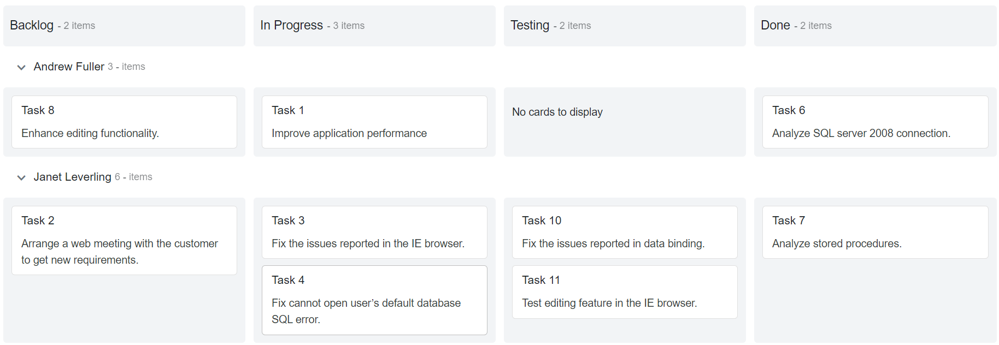
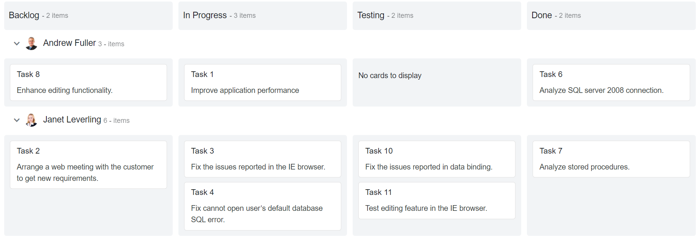
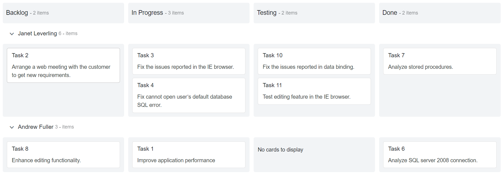
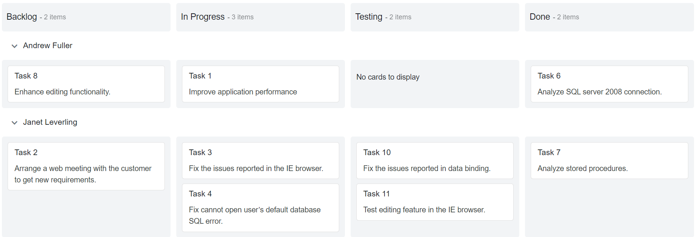

# Swimlane

Swimlanes are horizontal categorizations of cards on the Kanban board.  It is used for grouping of cards, which brings transparency to the workflow process.

## Render swimlane row

Cards can be grouped based on `KeyField` and displayed in rows, which are separated by columns. It is mandatory to define the `KeyField` that is mapped from the datasource for rendering swimlane rows in the Kanban board.

```csharp

@using Syncfusion.Blazor.Kanban

<SfKanban TValue="TasksModel" KeyField="Status" DataSource="Tasks">
    <KanbanColumns>
        <KanbanColumn HeaderText="Backlog" KeyField=@(new List<string> { "Open" })></KanbanColumn>
        <KanbanColumn HeaderText="In Progress" KeyField=@(new List<string> { "InProgress" })></KanbanColumn>
        <KanbanColumn HeaderText="Testing" KeyField=@(new List<string> { "Testing" })></KanbanColumn>
        <KanbanColumn HeaderText="Done" KeyField=@(new List<string> { "Close" })></KanbanColumn>
    </KanbanColumns>
    <KanbanCardSettings HeaderField="Id" ContentField="Summary"></KanbanCardSettings>
    <KanbanSwimlaneSettings KeyField="Assignee"></KanbanSwimlaneSettings>
</SfKanban>

@code {
    public class TasksModel
    {
        public string Id { get; set; }
        public string Title { get; set; }
        public string Status { get; set; }
        public string Summary { get; set; }
        public string Assignee { get; set; }
    }

    public List<TasksModel> Tasks = new List<TasksModel>()
    {
        new TasksModel { Id = "Task 1", Title = "BLAZ-29001", Status = "InProgress", Summary = "Improve application performance", Assignee = "Andrew Fuller" },
        new TasksModel { Id = "Task 2", Title = "BLAZ-29002", Status = "Open", Summary = "Arrange a web meeting with the customer to get new requirements.", Assignee = "Janet Leverling" },
        new TasksModel { Id = "Task 3", Title = "BLAZ-29003", Status = "InProgress", Summary = "Fix the issues reported in the IE browser.", Assignee = "Janet Leverling" },
        new TasksModel { Id = "Task 4", Title = "BLAZ-29004", Status = "InProgress", Summary = "Fix cannot open user’s default database SQL error.", Assignee = "Janet Leverling" },
        new TasksModel { Id = "Task 5", Title = "BLAZ-29005", Status = "Review", Summary = "Fix the issues reported in data binding.", Assignee = "Janet Leverling" },
        new TasksModel { Id = "Task 6", Title = "BLAZ-29006", Status = "Close", Summary = "Analyze SQL server 2008 connection.", Assignee = "Andrew Fuller" },
        new TasksModel { Id = "Task 7", Title = "BLAZ-29007", Status = "Close", Summary = "Analyze stored procedures.", Assignee = "Janet Leverling" },
        new TasksModel { Id = "Task 8", Title = "BLAZ-29008", Status = "Open", Summary = "Enhance editing functionality.", Assignee = "Andrew Fuller" },
        new TasksModel { Id = "Task 9", Title = "BLAZ-29009", Status = "Review", Summary = "Fix the editing issues reported by the customer.", Assignee = "Janet Leverling" },
        new TasksModel { Id = "Task 10", Title = "BLAZ-29010", Status = "Testing", Summary = "Fix the issues reported in data binding.", Assignee = "Janet Leverling" },
        new TasksModel { Id = "Task 11", Title = "BLAZ-29011", Status = "Testing", Summary = "Test editing feature in the IE browser.", Assignee = "Janet Leverling" }
    };
}

```

Output be like the below.



## Custom row text

Customize the swimlane row header text by using the `TextField` property mapped from datasource.

> It is not mandatory to define the `TextField` to `KanbanSwimlaneSettings`.  It will automatically consider the `KeyField` to swimlane row header text.
> If the mapping `TextField` key is not present in the datasource, it will consider the swimlane `KeyField` as swimlane row header text.

```csharp

@using Syncfusion.Blazor.Kanban

<SfKanban TValue="TasksModel" KeyField="Status" DataSource="Tasks">
    <KanbanColumns>
        <KanbanColumn HeaderText="Backlog" KeyField=@(new List<string> { "Open" })></KanbanColumn>
        <KanbanColumn HeaderText="In Progress" KeyField=@(new List<string> { "InProgress" })></KanbanColumn>
        <KanbanColumn HeaderText="Testing" KeyField=@(new List<string> { "Testing" })></KanbanColumn>
        <KanbanColumn HeaderText="Done" KeyField=@(new List<string> { "Close" })></KanbanColumn>
    </KanbanColumns>
    <KanbanCardSettings HeaderField="Id" ContentField="Summary"></KanbanCardSettings>
    <KanbanSwimlaneSettings KeyField="Assignee" TextField="AssigneeName"></KanbanSwimlaneSettings>
</SfKanban>

@code {
    public class TasksModel
    {
        public string Id { get; set; }
        public string Title { get; set; }
        public string Status { get; set; }
        public string Summary { get; set; }
        public string Assignee { get; set; }
        public string AssigneeName { get; set; }
    }
    public List<TasksModel> Tasks = new List<TasksModel>()
    {
        new TasksModel { Id = "Task 1", Title = "BLAZ-29001", Status = "InProgress", Summary = "Improve application performance", Assignee = "Andrew Fuller", AssigneeName = "Andrew" },
        new TasksModel { Id = "Task 2", Title = "BLAZ-29002", Status = "Open", Summary = "Arrange a web meeting with the customer to get new requirements.", Assignee = "Janet Leverling", AssigneeName = "Janet" },
        new TasksModel { Id = "Task 3", Title = "BLAZ-29003", Status = "InProgress", Summary = "Fix the issues reported in the IE browser.", Assignee = "Janet Leverling", AssigneeName = "Janet" },
        new TasksModel { Id = "Task 4", Title = "BLAZ-29004", Status = "InProgress", Summary = "Fix cannot open user’s default database SQL error.", Assignee = "Janet Leverling", AssigneeName = "Janet" },
        new TasksModel { Id = "Task 5", Title = "BLAZ-29005", Status = "Review", Summary = "Fix the issues reported in data binding.", Assignee = "Janet Leverling", AssigneeName = "Janet" },
        new TasksModel { Id = "Task 6", Title = "BLAZ-29006", Status = "Close", Summary = "Analyze SQL server 2008 connection.", Assignee = "Andrew Fuller", AssigneeName = "Andrew" },
        new TasksModel { Id = "Task 7", Title = "BLAZ-29007", Status = "Close", Summary = "Analyze stored procedures.", Assignee = "Janet Leverling", AssigneeName = "Janet" },
        new TasksModel { Id = "Task 8", Title = "BLAZ-29008", Status = "Open", Summary = "Enhance editing functionality.", Assignee = "Andrew Fuller", AssigneeName = "Andrew" },
        new TasksModel { Id = "Task 9", Title = "BLAZ-29009", Status = "Review", Summary = "Fix the editing issues reported by the customer.", Assignee = "Janet Leverling", AssigneeName = "Janet" },
        new TasksModel { Id = "Task 10", Title = "BLAZ-29010", Status = "Testing", Summary = "Fix the issues reported in data binding.", Assignee = "Janet Leverling", AssigneeName = "Janet" },
        new TasksModel { Id = "Task 11", Title = "BLAZ-29011", Status = "Testing", Summary = "Test editing feature in the IE browser.", Assignee = "Janet Leverling", AssigneeName = "Janet" }
    };
}

```

Output be like the below.


## Template

You can customize the Kanban swimlane row by using `Template`, which is specified within the `KanbanSwimlaneSettings` property. In this demo, the swimlane header is customized with HTML element.

```csharp

@using Syncfusion.Blazor.Kanban

<SfKanban TValue="TasksModel" KeyField="Status" DataSource="Tasks">
    <KanbanColumns>
        <KanbanColumn HeaderText="Backlog" KeyField=@(new List<string> { "Open" })></KanbanColumn>
        <KanbanColumn HeaderText="In Progress" KeyField=@(new List<string> { "InProgress" })></KanbanColumn>
        <KanbanColumn HeaderText="Testing" KeyField=@(new List<string> { "Testing" })></KanbanColumn>
        <KanbanColumn HeaderText="Done" KeyField=@(new List<string> { "Close" })></KanbanColumn>
    </KanbanColumns>
    <KanbanCardSettings HeaderField="Id" ContentField="Summary"></KanbanCardSettings>
    <KanbanSwimlaneSettings KeyField="AssigneeKey" TextField="Assignee">
        <Template>
            @{
                SwimlaneSettingsModel swimlane = (SwimlaneSettingsModel)context;
                        <div class='swimlane-template e-swimlane-template-table'>
                            
                            <span>@swimlane.TextField</span>
                        </div>
            }
        </Template>
    </KanbanSwimlaneSettings>
</SfKanban>

<style>
        .swimlane-template {
            display: inline-block;
            font-size: 15px;
            font-weight: 500;
        }

        .swimlane-template img {
            height: 24px;
            width: 24px;
            border-radius: 50%;
        }

        .swimlane-template span {
            padding-left: 5px;
            vertical-align: middle;
        }

        .e-kanban .e-kanban-content .e-content-row.e-swimlane-row .e-content-cells .e-swimlane-header. e-item-count {
            padding: 4px;
        }
</style>

@code {
    public class TasksModel
    {
        public string Id { get; set; }
        public string Title { get; set; }
        public string Status { get; set; }
        public string Summary { get; set; }
        public string Assignee { get; set; }
        public string AssigneeName { get; set; }
        public string AssigneeKey { get; set; }
    }

    public List<TasksModel> Tasks = new List<TasksModel>()
    {
        new TasksModel { Id = "Task 1", Title = "BLAZ-29001", Status = "InProgress", Summary = "Improve application performance", Assignee = "Andrew Fuller", AssigneeKey = "andrew-fuller" },
        new TasksModel { Id = "Task 2", Title = "BLAZ-29002", Status = "Open", Summary = "Arrange a web meeting with the customer to get new requirements.", Assignee = "Janet Leverling", AssigneeKey = "janet-leverling" },
        new TasksModel { Id = "Task 3", Title = "BLAZ-29003", Status = "InProgress", Summary = "Fix the issues reported in the IE browser.", Assignee = "Janet Leverling", AssigneeKey = "janet-leverling" },
        new TasksModel { Id = "Task 4", Title = "BLAZ-29004", Status = "InProgress", Summary = "Fix cannot open user’s default database SQL error.", Assignee = "Janet Leverling", AssigneeKey = "janet-leverling" },
        new TasksModel { Id = "Task 5", Title = "BLAZ-29005", Status = "Review", Summary = "Fix the issues reported in data binding.", Assignee = "Janet Leverling", AssigneeKey = "janet-leverling" },
        new TasksModel { Id = "Task 6", Title = "BLAZ-29006", Status = "Close", Summary = "Analyze SQL server 2008 connection.", Assignee = "Andrew Fuller", AssigneeName = "Andrew", AssigneeKey = "andrew-fuller" },
        new TasksModel { Id = "Task 7", Title = "BLAZ-29007", Status = "Close", Summary = "Analyze stored procedures.", Assignee = "Janet Leverling", AssigneeKey = "janet-leverling" },
        new TasksModel { Id = "Task 8", Title = "BLAZ-29008", Status = "Open", Summary = "Enhance editing functionality.", Assignee = "Andrew Fuller", AssigneeName = "Andrew", AssigneeKey = "andrew-fuller" },
        new TasksModel { Id = "Task 9", Title = "BLAZ-29009", Status = "Review", Summary = "Fix the editing issues reported by the customer.", Assignee = "Janet Leverling", AssigneeKey = "janet-leverling" },
        new TasksModel { Id = "Task 10", Title = "BLAZ-29010", Status = "Testing", Summary = "Fix the issues reported in data binding.", Assignee = "Janet Leverling", AssigneeKey = "janet-leverling" },
        new TasksModel { Id = "Task 11", Title = "BLAZ-29011", Status = "Testing", Summary = "Test editing feature in the IE browser.", Assignee = "Janet Leverling", AssigneeKey = "janet-leverling" }
    };
}

```

Output be like the below.



## Sorting

Swimlane rows are rendered on descending order when using the `SortBy` property set to `Descending` order. By default, swimlane rows are rendered by **Ascending** order.

```csharp

@using Syncfusion.Blazor.Kanban

<SfKanban TValue="TasksModel" KeyField="Status" DataSource="Tasks"  >
    <KanbanColumns>
        <KanbanColumn HeaderText="Backlog" KeyField=@(new List<string> { "Open" })></KanbanColumn>
        <KanbanColumn HeaderText="In Progress" KeyField=@(new List<string> { "InProgress" })></KanbanColumn>
        <KanbanColumn HeaderText="Testing" KeyField=@(new List<string> { "Testing" })></KanbanColumn>
        <KanbanColumn HeaderText="Done" KeyField=@(new List<string> { "Close" })></KanbanColumn>
    </KanbanColumns>
    <KanbanCardSettings HeaderField="Id" ContentField="Summary"></KanbanCardSettings>
    <KanbanSwimlaneSettings KeyField="Assignee" SortDirection="SortDirection.Descending"></KanbanSwimlaneSettings>
</SfKanban>

@code {
    public class TasksModel
    {
        public string Id { get; set; }
        public string Title { get; set; }
        public string Status { get; set; }
        public string Summary { get; set; }
        public string Assignee { get; set; }
        public string AssigneeName { get; set; }
    }

    public List<TasksModel> Tasks = new List<TasksModel>()
    {
        new TasksModel { Id = "Task 1", Title = "BLAZ-29001", Status = "InProgress", Summary = "Improve application performance", Assignee = "Andrew Fuller", AssigneeName = "Andrew" },
        new TasksModel { Id = "Task 2", Title = "BLAZ-29002", Status = "Open", Summary = "Arrange a web meeting with the customer to get new requirements.", Assignee = "Janet Leverling", AssigneeName = "Janet" },
        new TasksModel { Id = "Task 3", Title = "BLAZ-29003", Status = "InProgress", Summary = "Fix the issues reported in the IE browser.", Assignee = "Janet Leverling", AssigneeName = "Janet" },
        new TasksModel { Id = "Task 4", Title = "BLAZ-29004", Status = "InProgress", Summary = "Fix cannot open user’s default database SQL error.", Assignee = "Janet Leverling", AssigneeName = "Janet" },
        new TasksModel { Id = "Task 5", Title = "BLAZ-29005", Status = "Review", Summary = "Fix the issues reported in data binding.", Assignee = "Janet Leverling", AssigneeName = "Janet" },
        new TasksModel { Id = "Task 6", Title = "BLAZ-29006", Status = "Close", Summary = "Analyze SQL server 2008 connection.", Assignee = "Andrew Fuller", AssigneeName = "Andrew" },
        new TasksModel { Id = "Task 7", Title = "BLAZ-29007", Status = "Close", Summary = "Analyze stored procedures.", Assignee = "Janet Leverling", AssigneeName = "Janet" },
        new TasksModel { Id = "Task 8", Title = "BLAZ-29008", Status = "Open", Summary = "Enhance editing functionality.", Assignee = "Andrew Fuller", AssigneeName = "Andrew" },
        new TasksModel { Id = "Task 9", Title = "BLAZ-29009", Status = "Review", Summary = "Fix the editing issues reported by the customer.", Assignee = "Janet Leverling", AssigneeName = "Janet" },
        new TasksModel { Id = "Task 10", Title = "BLAZ-29010", Status = "Testing", Summary = "Fix the issues reported in data binding.", Assignee = "Janet Leverling", AssigneeName = "Janet" },
        new TasksModel { Id = "Task 11", Title = "BLAZ-29011", Status = "Testing", Summary = "Test editing feature in the IE browser.", Assignee = "Janet Leverling", AssigneeName = "Janet" }
    };
}

```

Output be like the below.



## Drag-and-drop

By default, The Kanban does not allow dragging the cards across the swimlane rows. Enabling the `AllowDragAndDrop` property allows you to drag the cards across the swimlane rows, which is specified inside `KanbanSwimlaneSettings` property.

```csharp

@using Syncfusion.Blazor.Kanban

<SfKanban TValue="TasksModel" KeyField="Status" DataSource="Tasks"  >
    <KanbanColumns>
        <KanbanColumn HeaderText="Backlog" KeyField=@(new List<string> { "Open" })></KanbanColumn>
        <KanbanColumn HeaderText="In Progress" KeyField=@(new List<string> { "InProgress" })></KanbanColumn>
        <KanbanColumn HeaderText="Testing" KeyField=@(new List<string> { "Testing" })></KanbanColumn>
        <KanbanColumn HeaderText="Done" KeyField=@(new List<string> { "Close" })></KanbanColumn>
    </KanbanColumns>
    <KanbanCardSettings HeaderField="Id" ContentField="Summary"></KanbanCardSettings>
    <KanbanSwimlaneSettings KeyField="Assignee" AllowDragAndDrop="true"></KanbanSwimlaneSettings>
</SfKanban>

@code {
    public class TasksModel
    {
        public string Id { get; set; }
        public string Title { get; set; }
        public string Status { get; set; }
        public string Summary { get; set; }
        public string Assignee { get; set; }
        public string AssigneeName { get; set; }
    }

    public List<TasksModel> Tasks = new List<TasksModel>()
{
        new TasksModel { Id = "Task 1", Title = "BLAZ-29001", Status = "InProgress", Summary = "Improve application performance", Assignee = "Andrew Fuller", AssigneeName = "Andrew" },
        new TasksModel { Id = "Task 2", Title = "BLAZ-29002", Status = "Open", Summary = "Arrange a web meeting with the customer to get new requirements.", Assignee = "Janet Leverling", AssigneeName = "Janet" },
        new TasksModel { Id = "Task 3", Title = "BLAZ-29003", Status = "InProgress", Summary = "Fix the issues reported in the IE browser.", Assignee = "Janet Leverling", AssigneeName = "Janet" },
        new TasksModel { Id = "Task 4", Title = "BLAZ-29004", Status = "InProgress", Summary = "Fix cannot open user’s default database SQL error.", Assignee = "Janet Leverling", AssigneeName = "Janet" },
        new TasksModel { Id = "Task 5", Title = "BLAZ-29005", Status = "Review", Summary = "Fix the issues reported in data binding.", Assignee = "Janet Leverling", AssigneeName = "Janet" },
        new TasksModel { Id = "Task 6", Title = "BLAZ-29006", Status = "Close", Summary = "Analyze SQL server 2008 connection.", Assignee = "Andrew Fuller", AssigneeName = "Andrew" },
        new TasksModel { Id = "Task 7", Title = "BLAZ-29007", Status = "Close", Summary = "Analyze stored procedures.", Assignee = "Janet Leverling", AssigneeName = "Janet" },
        new TasksModel { Id = "Task 8", Title = "BLAZ-29008", Status = "Open", Summary = "Enhance editing functionality.", Assignee = "Andrew Fuller", AssigneeName = "Andrew" },
        new TasksModel { Id = "Task 9", Title = "BLAZ-29009", Status = "Review", Summary = "Fix the editing issues reported by the customer.", Assignee = "Janet Leverling", AssigneeName = "Janet" },
        new TasksModel { Id = "Task 10", Title = "BLAZ-29010", Status = "Testing", Summary = "Fix the issues reported in data binding.", Assignee = "Janet Leverling", AssigneeName = "Janet" },
        new TasksModel { Id = "Task 11", Title = "BLAZ-29011", Status = "Testing", Summary = "Test editing feature in the IE browser.", Assignee = "Janet Leverling", AssigneeName = "Janet" }
    };
}

```

Output be like the below.


## Calculate cards count

Users can show or hide the cards count by swimlane row in header when enabling the `ShowItemCount` property, which is enabled by default on the Kanban board.

> Provided localization support for **Items** text.

In below demo, disabled on `ShowItemCount` property on rendering swimlane row without total count.

```csharp

@using Syncfusion.Blazor.Kanban

<SfKanban TValue="TasksModel" KeyField="Status" DataSource="Tasks">
    <KanbanColumns>
        <KanbanColumn HeaderText="Backlog" KeyField=@(new List<string> { "Open" })></KanbanColumn>
        <KanbanColumn HeaderText="In Progress" KeyField=@(new List<string> { "InProgress" })></KanbanColumn>
        <KanbanColumn HeaderText="Testing" KeyField=@(new List<string> { "Testing" })></KanbanColumn>
        <KanbanColumn HeaderText="Done" KeyField=@(new List<string> { "Close" })></KanbanColumn>
    </KanbanColumns>
    <KanbanCardSettings HeaderField="Id" ContentField="Summary"></KanbanCardSettings>
    <KanbanSwimlaneSettings KeyField="Assignee" ShowItemCount="false"></KanbanSwimlaneSettings>
</SfKanban>

@code {
    public class TasksModel
    {
        public string Id { get; set; }
        public string Title { get; set; }
        public string Status { get; set; }
        public string Summary { get; set; }
        public string Assignee { get; set; }
        public string AssigneeName { get; set; }
    }

    public List<TasksModel> Tasks = new List<TasksModel>()
{
        new TasksModel { Id = "Task 1", Title = "BLAZ-29001", Status = "InProgress", Summary = "Improve application performance", Assignee = "Andrew Fuller", AssigneeName = "Andrew" },
        new TasksModel { Id = "Task 2", Title = "BLAZ-29002", Status = "Open", Summary = "Arrange a web meeting with the customer to get new requirements.", Assignee = "Janet Leverling", AssigneeName = "Janet" },
        new TasksModel { Id = "Task 3", Title = "BLAZ-29003", Status = "InProgress", Summary = "Fix the issues reported in the IE browser.", Assignee = "Janet Leverling", AssigneeName = "Janet" },
        new TasksModel { Id = "Task 4", Title = "BLAZ-29004", Status = "InProgress", Summary = "Fix cannot open user’s default database SQL error.", Assignee = "Janet Leverling", AssigneeName = "Janet" },
        new TasksModel { Id = "Task 5", Title = "BLAZ-29005", Status = "Review", Summary = "Fix the issues reported in data binding.", Assignee = "Janet Leverling", AssigneeName = "Janet" },
        new TasksModel { Id = "Task 6", Title = "BLAZ-29006", Status = "Close", Summary = "Analyze SQL server 2008 connection.", Assignee = "Andrew Fuller", AssigneeName = "Andrew" },
        new TasksModel { Id = "Task 7", Title = "BLAZ-29007", Status = "Close", Summary = "Analyze stored procedures.", Assignee = "Janet Leverling", AssigneeName = "Janet" },
        new TasksModel { Id = "Task 8", Title = "BLAZ-29008", Status = "Open", Summary = "Enhance editing functionality.", Assignee = "Andrew Fuller", AssigneeName = "Andrew" },
        new TasksModel { Id = "Task 9", Title = "BLAZ-29009", Status = "Review", Summary = "Fix the editing issues reported by the customer.", Assignee = "Janet Leverling", AssigneeName = "Janet" },
        new TasksModel { Id = "Task 10", Title = "BLAZ-29010", Status = "Testing", Summary = "Fix the issues reported in data binding.", Assignee = "Janet Leverling", AssigneeName = "Janet" },
        new TasksModel { Id = "Task 11", Title = "BLAZ-29011", Status = "Testing", Summary = "Test editing feature in the IE browser.", Assignee = "Janet Leverling", AssigneeName = "Janet" }
    };
}

```

Output be like the below.


