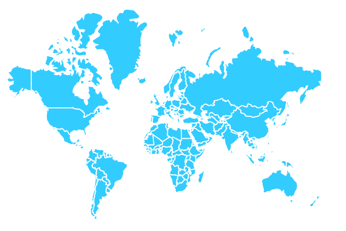
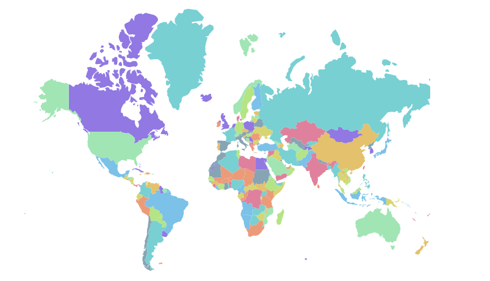
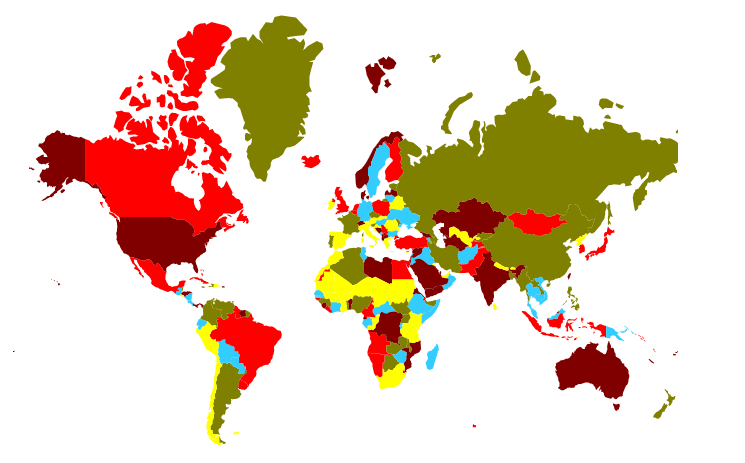
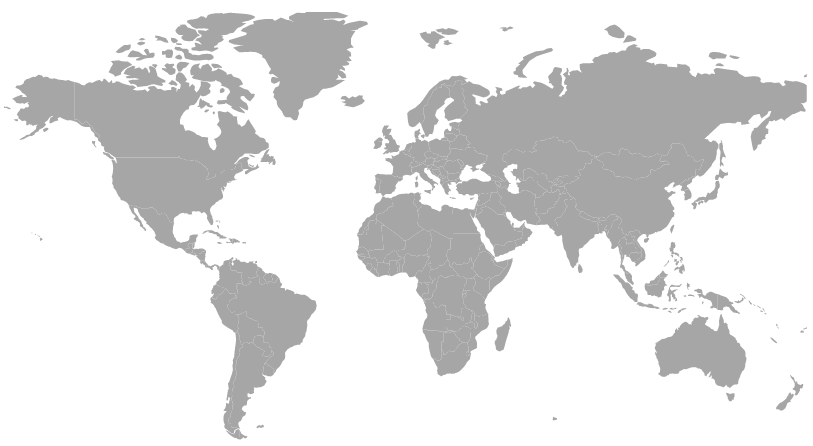

# Customization

## Customizing shape

The following properties are available in [`MapsShapeSettings`](https://help.syncfusion.com/cr/aspnetcore-blazor/Syncfusion.Blazor~Syncfusion.Blazor.Maps.MapsShapeSettings_members.html) to customize the shapes of the Maps component.

* Fill - Customizes the shape color.
* Autofill - Applies the default palette colors to shapes.
* Palette - Applies own custom palette for shapes.
* MapsShapeBorder - Customizes the maps shape border.
* DashArray - Customizes the different dash array border line format.
* Opacity - Customizes the shape opacity.
* CircleRadius - Adjusts the rounded corner.

```csharp
@using Syncfusion.Blazor.Maps

<SfMaps>
    <MapsLayers>
        <MapsLayer ShapeData='new {dataOptions ="https://cdn.syncfusion.com/maps/map-data/world-map.json"}'>
            @* To customize map shape *@
            <MapsShapeSettings Fill="#33CCFF">
                <MapsShapeBorder Color="#FFFFFF" Width="2"></MapsShapeBorder>
            </MapsShapeSettings>
        </MapsLayer>
    </MapsLayers>
</SfMaps>
```



To apply the default palette colors to shapes, enable the [`Autofill`](https://help.syncfusion.com/cr/aspnetcore-blazor/Syncfusion.Blazor~Syncfusion.Blazor.Maps.ShapeSettingsModel~Autofill.html) property.

```csharp
@using Syncfusion.Blazor.Maps

<SfMaps>
    <MapsLayers>
        <MapsLayer ShapeData='new {dataOptions ="https://cdn.syncfusion.com/maps/map-data/world-map.json"}'>
            @* To set shape color automatically *@
            <MapsShapeSettings Autofill="true"></MapsShapeSettings>
        </MapsLayer>
    </MapsLayers>
</SfMaps>
```



To apply own custom palette to shapes, provide the palette colors to [`Palette`](https://help.syncfusion.com/cr/aspnetcore-blazor/Syncfusion.Blazor~Syncfusion.Blazor.Maps.MapsShapeSettings~Palette.html).

```csharp
@using Syncfusion.Blazor.Maps

<SfMaps>
    <MapsLayers>
        <MapsLayer ShapeData='new {dataOptions ="https://cdn.syncfusion.com/maps/map-data/world-map.json"}'>
            <MapsShapeSettings Autofill="true" Palette='new string[] {"#33CCFF", "#FF0000", "#800000", "#FFFF00", "#808000"}'>
            </MapsShapeSettings>
        </MapsLayer>
    </MapsLayers>
</SfMaps>
```



For more customization, see [`Color mapping`](../maps/color-mapping) feature.

## Change Maps projection

By default, the Maps component is rendered with Mercator projection type. In this type, the maps are rendered based on coordinates, so it is not stretched.

The Maps component has the following projection types:

* Mercator
* Equirectangular
* Miller
* Eckert3
* Eckert5
* Eckert6
* Winkel3
* AitOff

```csharp
@using Syncfusion.Blazor.Maps

@* To change Maps projection *@
<SfMaps ProjectionType="ProjectionType.Miller">
    <MapsLayers>
        <MapsLayer ShapeData='new {dataOptions ="https://cdn.syncfusion.com/maps/map-data/world-map.json"}'>
        </MapsLayer>
    </MapsLayers>
</SfMaps>
```

