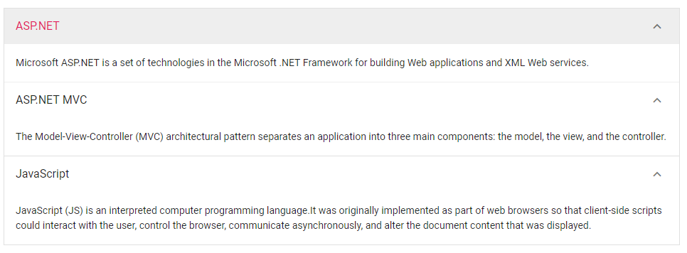

# Expand Mode

 The Accordion supports the two listed types of expand modes while expanding or collapsing the item.

* Single
* Multiple

## Single

This property enables to expand only one Accordion item at a time. If you expand any new item, the previously expanded one is collapsed and new item changed to expanded state.

```csharp

@using Syncfusion.Blazor.Navigations

<SfAccordion ExpandMode="ExpandMode.Single">
    <AccordionItems>
        <AccordionItem Expanded="true" Header="ASP.NET" Content="Microsoft ASP.NET is a set of technologies in the Microsoft .NET Framework for building Web applications and XML Web services."></AccordionItem>
        <AccordionItem Header="ASP.NET MVC" Content="The Model-View-Controller (MVC) architectural pattern separates an application into three main components: the model, the view, and the controller."></AccordionItem>
        <AccordionItem Header="JavaScript" Content="JavaScript (JS) is an interpreted computer programming language.It was originally implemented as part of web browsers so that client-side scripts could interact with the user, control the browser, communicate asynchronously, and alter the document content that was displayed."></AccordionItem>
    </AccordionItems>
</SfAccordion>

```

Output be like the below.


## Multiple

Default [ExpandMode](https://help.syncfusion.com/cr/aspnetcore-blazor/Syncfusion.Blazor~Syncfusion.Blazor.Navigations.SfAccordion~ExpandMode.html) of the Accordion is `Multiple`. It enables you to expand more than one Accordion item at a time. Expand/collapse action can also be toggled by clicking on it again. For example, expanded item is collapsed when you click on it again.

```csharp

@using Syncfusion.Blazor.Navigations

<SfAccordion ExpandMode="ExpandMode.Multiple">
    <AccordionItems>
        <AccordionItem Expanded="true" Header="ASP.NET" Content="Microsoft ASP.NET is a set of technologies in the Microsoft .NET Framework for building Web applications and XML Web services."></AccordionItem>
        <AccordionItem Header="ASP.NET MVC" Content="The Model-View-Controller (MVC) architectural pattern separates an application into three main components: the model, the view, and the controller."></AccordionItem>
        <AccordionItem Header="JavaScript" Content="JavaScript (JS) is an interpreted computer programming language.It was originally implemented as part of web browsers so that client-side scripts could interact with the user, control the browser, communicate asynchronously, and alter the document content that was displayed."></AccordionItem>
    </AccordionItems>
</SfAccordion>

```

Output be like the below.


