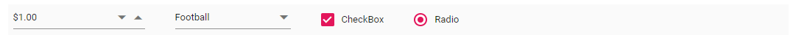

# Item Configuration

The Toolbar can be rendered by defining an array of items. Items can be constructed with the following built-in command types or item template.

## Button

`Button` is the default command [Type](https://help.syncfusion.com/cr/aspnetcore-blazor/Syncfusion.Blazor~Syncfusion.Blazor.Navigations.ToolbarItem~Type.html), and it can be rendered by using the `Text` property.
Properties of the button command type:

  Property   | Description
------------ | -------------
  Text       | The text to be displayed for button.
 ID         | The ID of the button to be rendered. If the ID is not given, auto ID is generated.
  PrefixIcon | Defines the class used to specify an icon for the button. The icon is `positioned before` the text if text is available or the icon alone button is rendered.
SuffixIcon | Defines the class used to specify an icon for the button. The icon is `positioned after` the text if text is available. If both [PrefixIcon](https://help.syncfusion.com/cr/aspnetcore-blazor/Syncfusion.Blazor~Syncfusion.Blazor.Navigations.ToolbarItem~PrefixIcon.html) and [SuffixIcon](https://help.syncfusion.com/cr/aspnetcore-blazor/Syncfusion.Blazor~Syncfusion.Blazor.Navigations.ToolbarItem~SuffixIcon.html) are specified, only `PrefixIcon` is considered.
  Width      | Used to set the width of the button.

## Separator

The `Separator` type adds a vertical separation between the Toolbar's Single/Multiple commands.

```csharp
@using Syncfusion.Blazor.Navigations

<SfToolbar>
  <ToolbarItems>
    <ToolbarItem Text="Cut"></ToolbarItem>
    <ToolbarItem Text="Copy"></ToolbarItem>
    <ToolbarItem Type="ItemType.Separator"></ToolbarItem>
    <ToolbarItem Text="Paste"></ToolbarItem>
    <ToolbarItem Type="ItemType.Separator"></ToolbarItem>
    <ToolbarItem Text="Undo"></ToolbarItem>
    <ToolbarItem Text="Redo"></ToolbarItem>
  </ToolbarItems>
</SfToolbar>
```

> If `Separator` is added as the first or the last item, it will not be visible.

## Input

The `Input` type is only applicable for adding `Template` elements when the  `Template` property is defined as an `object`. Input type creates an `input element` internally that acts as the container for `Syncfusion` input based components.

### NumericTextBox

* The `NumericTextBox` component can be included by importing the `@using Syncfusion.Blazor.Inputs` package into the `~/_Imports.razor` file.

* Initialize the `NumericTextBox` in [Template](https://help.syncfusion.com/cr/aspnetcore-blazor/Syncfusion.Blazor~Syncfusion.Blazor.Navigations.ToolbarItem~Template.html) property, where the Toolbar item `Type` is set as `Input`.

* Related `NumericTextBox` component properties can also be configured as given below.

```csharp

<SfNumericTextBox Format="n2"></SfNumericTextBox>

```

### DropDownList

* The `DropDownList` component can be included by importing the `@using Syncfusion.Blazor.DropDowns` package into the `~/_Imports.razor` file.

* Initialize the `DropDownList` in `Template` property, where the Toolbar item `Type` is set as `Input`.

* Related `DropDownList` component properties can also be configured as given below.

```csharp

<SfDropdownList Width="100"></SfDropdownList>

```

### RadioButton

* The `RadioButton` component can be included by importing the `@using Syncfusion.Blazor.Buttons` package into the `~/_Imports.razor` file.

* Initialize the `RadioButton` in `Template` property, where the Toolbar item `Type` is set as `Input`.

* Related `RadioButton` component properties can also be configured as given below.

```csharp

<SfRadioButton Label="Option 1" Name="Default"></SfRadioButton>

```

The following code explains how to add `NumericTextBox`, `DropDownList`, `RadioButton` and `CheckBox` components to the Toolbar.

```csharp
@using Syncfusion.Blazor.Navigations
@using Syncfusion.Blazor.Inputs
@using Syncfusion.Blazor.DropDowns
@using Syncfusion.Blazor.Buttons

<SfToolbar>
    <ToolbarItems>
        <ToolbarItem Type="ItemType.Input">
          <Template>
            <SfNumericTextBox Width="150" Value=1 Format="c2"></SfNumericTextBox>
          </Template>
        </ToolbarItem>
        <ToolbarItem></ToolbarItem>
        <ToolbarItem Type="ItemType.Input">
            <Template>
                <SfDropDownList TValue="string" ID="Games" DataSource="@SportsData" Width="120" Index="2" TItem="Games">
                    <DropDownListFieldSettings Value="Text"></DropDownListFieldSettings>
                </SfDropDownList>
            </Template>
        </ToolbarItem>
        <ToolbarItem></ToolbarItem>
        <ToolbarItem Type="ItemType.Input">
            <Template>
                <SfCheckBox Checked="true" Label="CheckBox"></SfCheckBox>
            </Template>
        </ToolbarItem>
        <ToolbarItem></ToolbarItem>
        <ToolbarItem Type="ItemType.Input">
            <Template>
                <SfRadioButton Label="Radio" Name="default" Checked="true"></SfRadioButton>
            </Template>
        </ToolbarItem>
    </ToolbarItems>
</SfToolbar>

@code {
    public class Games
    {
        public string Id { get; set; }
        public string Text { get; set; }
    }
    List<Games> SportsData = new List<Games> {
    new Games() { Id= "Game2", Text= "Badminton" },
    new Games() { Id= "Game4", Text= "Cricket" },
    new Games() { Id= "Game5", Text= "Football" },
    new Games() { Id= "Game6", Text= "Golf" },
    new Games() { Id= "Game10", Text= "Tennis"}s
  };
}
```

Output be like the below.


