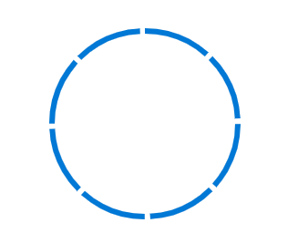

# Customization

## Segments

<!-- markdownlint-disable MD033 -->

We can divide a progress bar into multiple segments using a `SegmentCount` to visualize the progress of multiple sequential tasks.

```csharp
<SfProgressBar Type="ProgressType.Circular" Value="100" Height="60" SegmentCount="8" Minimum="0" Maximum="100">
</SfProgressBar>
```



## Thickness

You can customize the thickness of the track  using `TrackThickness` and progress using `ProgressThickness` to render the ProgressBar with different appearances.

 ```csharp
<SfProgressBar Type="ProgressType.Linear" Value="100" Height="60" Width="90%" TrackThickness="24" ProgressThickness="24" ShowProgressValue="true" Minimum="0" Maximum="100">
</SfProgressBar>
```


## Radius

<!-- markdownlint-disable MD033 -->

The  radius of the progress bar can be customized using `Radius` property and  corner can be customized by **CornerRadius** property.

```csharp
<SfProgressBar Type="ProgressType.Circular" Value="60" Height="160px" Width="160px" EnableRtl="false"
                TrackColor="#FFD939" Radius="100%" InnerRadius="190%" ProgressColor="white" TrackThickness="80" ProgressThickness="10" CornerRadius="CornerType.Round" Minimum="0" Maximum="100">
</SfProgressBar>
```


## InnerRadius

<!-- markdownlint-disable MD033 -->

The inner radius of the progress bar can be customized using `InnerRadius` property.

```csharp
  <SfProgressBar Type="ProgressType.Circular" Value="60" Height="160px" Width="160px" EnableRtl="false"
                TrackColor="#FFD939" Radius="100%" InnerRadius="190%" ProgressColor="white" TrackThickness="80" ProgressThickness="10" CornerRadius="CornerType.Round" Minimum="0" Maximum="100">
</SfProgressBar>
```


## Progress colour and track colour

<!-- markdownlint-disable MD033 -->

We can customize the color of progress and track by using  **ProgressColor** and **TrackColor** property.

```csharp
    <SfProgressBar Type="ProgressType.Linear" Value="50" Height="60" Width="90%" TrackColor="#F8C7D8"
                   ShowProgressValue="true" InnerRadius="190%" ProgressColor="#E3165B" TrackThickness="24" CornerRadius="CornerType.Round"
                   ProgressThickness="24" Minimum="0" Maximum="100">
    </SfProgressBar>
```

