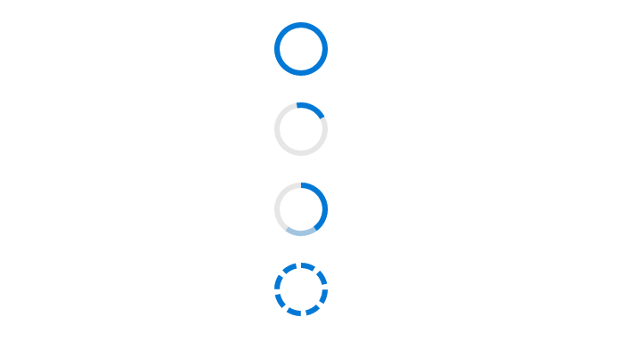

# Types

Visualize progress in different shapes (rectangle, circle, and semi-circle) to give a unique appearance to your app design.

## Linear

<!-- markdownlint-disable MD033 -->

Set **Type** to Linear to get the linear progress bar. It also support secondary progress and different mode of progress.

```csharp
    <SfProgressBar Type="ProgressType.Linear" Value="100" Height="60" Minimum="0" Maximum="100">
    </SfProgressBar>

    <SfProgressBar Type="ProgressType.Linear" Value="20" Height="60" IsIndeterminate="true" Minimum="0" Maximum="100">
    </SfProgressBar>

    <SfProgressBar Type="ProgressType.Linear" Value="40" Height="60" SecondaryProgress="60" Minimum="0" Maximum="100">
    </SfProgressBar>

    <SfProgressBar Type="ProgressType.Linear" Value="100" Height="60" SegmentCount="8" Minimum="0" Maximum="100">
    </SfProgressBar>
```


## Circular

Set **Type** to Circular to get the circular progress bar. It also support secondary progress and different mode of progress.

```csharp
    <SfProgressBar Type="ProgressType.Circular" Value="100" Height="60" Minimum="0" Maximum="100">
    </SfProgressBar>

    <SfProgressBar Type="ProgressType.Circular" Value="20" Height="60" IsIndeterminate="true" Minimum="0" Maximum="100">
    </SfProgressBar>

    <SfProgressBar Type="ProgressType.Circular" Value="40" Height="60" SecondaryProgress="60" Minimum="0" Maximum="100">
    </SfProgressBar>

    <SfProgressBar Type="ProgressType.Circular" Value="100" Height="60" SegmentCount="8" Minimum="0" Maximum="100">
    </SfProgressBar>
```

