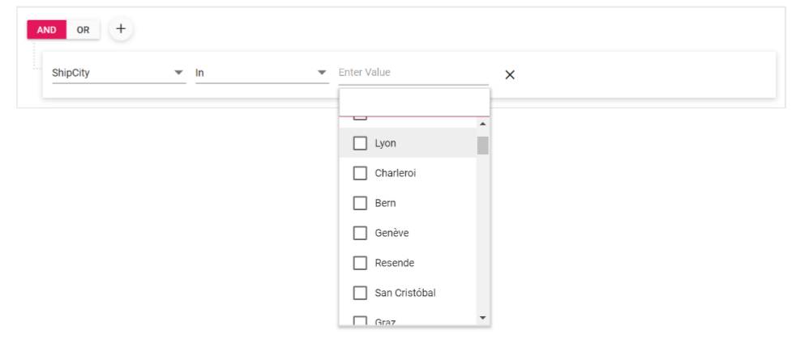

# Data binding

The Query Builder uses `DataManager` to bind the dataSource which supports both RESTful JSON data services binding and local object binding. The [`DataSource`](https://help.syncfusion.com/cr/blazor/Syncfusion.Blazor.QueryBuilder.SfQueryBuilder.html#Syncfusion_Blazor_QueryBuilder_SfQueryBuilder_DataSource) property can be assigned either with the instance of `DataManager` or object collection.

## Local data

To bind local data to the Query Builder, you can assign the [`DataSource`](https://help.syncfusion.com/cr/blazor/Syncfusion.Blazor.QueryBuilder.SfQueryBuilder.html#Syncfusion_Blazor_QueryBuilder_SfQueryBuilder_DataSource) property  with a list of object.

```csharp
@using Syncfusion.Blazor.QueryBuilder

<SfQueryBuilder DataSource="@EmployeeDetails" Rule="@ImportRules">
                <QueryBuilderColumns>
                    <QueryBuilderColumn Field="EmployeeID" Label="Employee ID" Type="number"></QueryBuilderColumn>
                    <QueryBuilderColumn Field="FirstName" Label="First Name" Type="string"></QueryBuilderColumn>
                    <QueryBuilderColumn Field="TitleOfCourtesy" Label="Title Of Courtesy" Type="boolean"></QueryBuilderColumn>
                    <QueryBuilderColumn Field="HireDate" Label="Hire Date" Type="date" Format = "MM/dd/yyyy"></QueryBuilderColumn>
                    <QueryBuilderColumn Field="Country" Label="Country" Type="string"></QueryBuilderColumn>
                </QueryBuilderColumns>
            </SfQueryBuilder>

@code {
    public List<Employee> EmployeeDetails = new List<Employee>
        {
        new Employee{ FirstName = "Martin", EmployeeID = "1001", Country = "England", City = "Manchester", HireDate = "23/04/2014" },
        new Employee{ FirstName = "Benjamin", EmployeeID = "1002", Country = "England", City = "Birmingham", HireDate = "19/06/2014" },
        new Employee{ FirstName = "Stuart", EmployeeID = "1003", Country = "England", City = "London", HireDate = "04/07/2014"},
        new Employee{ FirstName = "Ben", EmployeeID = "1004", Country = "USA", City = "California", HireDate = "15/08/2014" },
        new Employee{ FirstName = "Joseph", EmployeeID = "1005", Country = "Spain", City = "Madrid", HireDate = "29/08/2014" }
    };

    public class Employee {
        public string FirstName { get; set; }
        public string EmployeeID { get; set; }
        public string Country { get; set; }
        public string City { get; set; }
        public string HireDate { get; set; }
    }

    public QueryBuilderRule ImportRules = new QueryBuilderRule
    {
        Condition = "or",
        Rules = new List<RuleModel> { new RuleModel { Field = "EmployeeID", Value = "1001", Operator = "notequal" },
        new RuleModel { Field = "Country", Value = "England", Operator = "equal" } }
    };
}
```

Output will be shown as


## Remote Data

To bind remote data to Query Builder component, assign service data as an instance of SfDataManager to the [`DataSource`](https://help.syncfusion.com/cr/blazor/Syncfusion.Blazor.QueryBuilder.SfQueryBuilder.html#Syncfusion_Blazor_QueryBuilder_SfQueryBuilder_DataSource) property or by using `SfDataManager` component. To interact with remote data source, provide the endpoint `Url`.Refer to the following code example for remote Data binding using `OData` service.

```csharp

@using Syncfusion.Blazor.QueryBuilder
@using Syncfusion.Blazor.Data

<SfQueryBuilder>
    <QueryBuilderColumns>
        <QueryBuilderColumn Field="EmployeeID" Label="Employee ID" Type="number">
        </QueryBuilderColumn>
        <QueryBuilderColumn Field="FirstName" Label="First Name" Type="string"></QueryBuilderColumn>
        <QueryBuilderColumn Field="TitleOfCourtesy" Label="Title Of Courtesy" Type="boolean">
        </QueryBuilderColumn>
        <QueryBuilderColumn Field="HireDate" Label="Hire Date" Type="date" Format="MM/dd/yyyy">
        </QueryBuilderColumn>
        <QueryBuilderColumn Field="Country" Label="Country" Type="string"></QueryBuilderColumn>
    </QueryBuilderColumns>
    <SfDataManager Url="https://js.syncfusion.com/demos/ejServices/Wcf/Northwind.svc/Employees" Adaptor="Syncfusion.Blazor.Adaptors.ODataAdaptor" CrossDomain="true"></SfDataManager>
</SfQueryBuilder>

```

Output will be shown as

