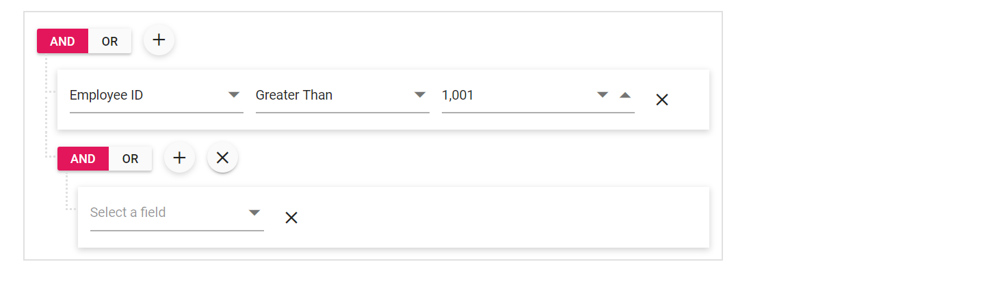

# Restrict the groups

You can restrict the groups by defining the [`MaxGroupCount`](https://help.syncfusion.com/cr/blazor/Syncfusion.Blazor~Syncfusion.Blazor.QueryBuilder.SfQueryBuilder~MaxGroupCount.html) property. By default, the value is 5. In the below demo, the `MaxGroupCount` is set to 2 .

```csharp
@using Syncfusion.Blazor.QueryBuilder

<SfQueryBuilder DataSource="@EmployeeDetails" MaxGroupCount="2">
                <QueryBuilderColumns>
                    <QueryBuilderColumn Field="EmployeeID" Label="Employee ID" Type="number"></QueryBuilderColumn>
                    <QueryBuilderColumn Field="FirstName" Label="First Name" Type="string"></QueryBuilderColumn>
                    <QueryBuilderColumn Field="TitleOfCourtesy" Label="Title Of Courtesy" Type="boolean"></QueryBuilderColumn>
                    <QueryBuilderColumn Field="HireDate" Label="Hire Date" Type="date"></QueryBuilderColumn>
                    <QueryBuilderColumn Field="Country" Label="Country" Type="string"></QueryBuilderColumn>
                    <QueryBuilderColumn Field="City" Label="City" Type="string"></QueryBuilderColumn>
                </QueryBuilderColumns>
</SfQueryBuilder>

@code {
    public List<Employee> EmployeeDetails = new List<Employee>
        {
        new Employee{ FirstName = "Martin", EmployeeID = "1001", Country = "England", City = "Manchester", HireDate = "23/04/2014" },
        new Employee{ FirstName = "Benjamin", EmployeeID = "1002", Country = "England", City = "Birmingham", HireDate = "19/06/2014" },
        new Employee{ FirstName = "Stuart", EmployeeID = "1003", Country = "England", City = "London", HireDate = "04/07/2014"},
        new Employee{ FirstName = "Ben", EmployeeID = "1004", Country = "USA", City = "California", HireDate = "15/08/2014" },
        new Employee{ FirstName = "Joseph", EmployeeID = "1005", Country = "Spain", City = "Madrid", HireDate = "29/08/2014" }
    };

    public class Employee {
        public string FirstName { get; set; }
        public string EmployeeID { get; set; }
        public string Country { get; set; }
        public string City { get; set; }
        public string HireDate { get; set; }
    }
}

```

Output will shown as



> You can use this property in the mobile mode to restrict the nested group creation.
