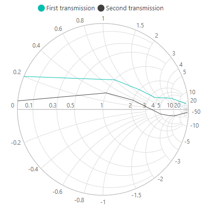

# Legend

Legend is a key used in Smith Chart, that contains symbol and descriptions. It provides valuable information for interpreting what the Smith Chart is displaying and can be represented in various colors, shapes or other identifiers based on the data. In simple words, we can define that legend is used to denote the series rendered in the Smith Chart.

## Position and Alignment

By default visibility of the legend is false. To enable the legend, kindly set `Visible` as true in `SmithchartLegendSettings`. Default position for the legend is bottom. By using `Position` property, you can change the position of the legend. You can either place the legend at bottom, top, right and left side of the Smith Chart.

```csharp
<SfSmithchart>
    <SmithchartLegendSettings Visible='true' Position='Top'></SmithchartLegendSettings>
    <SmithchartSeriesCollection>
        <SmithchartSeries Name="Transmission1" Points='FirstTransmissionData'></SmithchartSeries>
        <SmithchartSeries Name="Transmission2" Points='SecondTransmissionData'></SmithchartSeries>
    </SmithchartSeriesCollection>
</SfSmithchart>

@code {
    public class SmithDataSource
    {
        public double? resistance;
        public double? reactance;
    };
    private List<SmithDataSource> FirstTransmissionData = new List<SmithDataSource> {
        new SmithDataSource { resistance= 10, reactance= 25 },
        new SmithDataSource { resistance= 6, reactance= 4.5 },
        new SmithDataSource { resistance= 3.5, reactance= 1.6 },
        new SmithDataSource { resistance= 2, reactance= 1.2 },
        new SmithDataSource { resistance= 1, reactance= 0.8 },
        new SmithDataSource { resistance= 0, reactance= 0.2 }
    };
    private List<SmithDataSource> SecondTransmissionData = new List<SmithDataSource> {
        new SmithDataSource { resistance= 20, reactance= -50 },
        new SmithDataSource { resistance= 9, reactance= -4.5 },
        new SmithDataSource { resistance= 7, reactance= -2.5 },
        new SmithDataSource { resistance= 5, reactance= -1 },
        new SmithDataSource { resistance= 2, reactance= 0.5 },
        new SmithDataSource { resistance= 1, reactance= 0.4 },
        new SmithDataSource { resistance= 0, reactance= 0.05 }
    };
}
```


Other than these positions, you can place the legend anywhere in the Smith Chart. To achieve this, you have to set `Position` as 'Custom' in `SmithchartLegendSettings` tag and specify the x and y coordinates using the `X` and `Y` properties in the `SmithchartLegendLocation` tag.

```csharp
<SfSmithchart>
    <SmithchartLegendSettings Visible='true' Position='Custom'>
        <SmithchartLegendLocation X='80' Y='100'></SmithchartLegendLocation>
    </SmithchartLegendSettings>
    <SmithchartSeriesCollection>
        <SmithchartSeries Name="Transmission1" Points='FirstTransmissionData'></SmithchartSeries>
        <SmithchartSeries Name="Transmission2" Points='SecondTransmissionData'></SmithchartSeries>
    </SmithchartSeriesCollection>
</SfSmithchart>

@code {
    public class SmithDataSource
    {
        public double? resistance;
        public double? reactance;
    };
    private List<SmithDataSource> FirstTransmissionData = new List<SmithDataSource> {
        new SmithDataSource { resistance= 10, reactance= 25 },
        new SmithDataSource { resistance= 6, reactance= 4.5 },
        new SmithDataSource { resistance= 3.5, reactance= 1.6 },
        new SmithDataSource { resistance= 2, reactance= 1.2 },
        new SmithDataSource { resistance= 1, reactance= 0.8 },
        new SmithDataSource { resistance= 0, reactance= 0.2 }
    };
    private List<SmithDataSource> SecondTransmissionData = new List<SmithDataSource> {
        new SmithDataSource { resistance= 20, reactance= -50 },
        new SmithDataSource { resistance= 9, reactance= -4.5 },
        new SmithDataSource { resistance= 7, reactance= -2.5 },
        new SmithDataSource { resistance= 5, reactance= -1 },
        new SmithDataSource { resistance= 2, reactance= 0.5 },
        new SmithDataSource { resistance= 1, reactance= 0.4 },
        new SmithDataSource { resistance= 0, reactance= 0.05 }
    };
}
```


### Legend Alignment

Other than positioning the legend in the Smith Chart, you can customize its alignment also. By default, legend is aligned in center position. Using the `Alignment` property, you can align the legend in near and far locations of the Smith Chart.

```csharp
<SfSmithchart>
    <SmithchartLegendSettings
        Visible='true'
        Position='Top'
        Alignment='@SmithchartAlignment.Near'>
    </SmithchartLegendSettings>
    <SmithchartSeriesCollection>
        <SmithchartSeries Name="Transmission1" Points='FirstTransmissionData'></SmithchartSeries>
        <SmithchartSeries Name="Transmission2" Points='SecondTransmissionData'></SmithchartSeries>
    </SmithchartSeriesCollection>
</SfSmithchart>

@code {
    public class SmithDataSource
    {
        public double? resistance;
        public double? reactance;
    };
    private List<SmithDataSource> FirstTransmissionData = new List<SmithDataSource> {
        new SmithDataSource { resistance= 10, reactance= 25 },
        new SmithDataSource { resistance= 6, reactance= 4.5 },
        new SmithDataSource { resistance= 3.5, reactance= 1.6 },
        new SmithDataSource { resistance= 2, reactance= 1.2 },
        new SmithDataSource { resistance= 1, reactance= 0.8 },
        new SmithDataSource { resistance= 0, reactance= 0.2 }
    };
    private List<SmithDataSource> SecondTransmissionData = new List<SmithDataSource> {
        new SmithDataSource { resistance= 20, reactance= -50 },
        new SmithDataSource { resistance= 9, reactance= -4.5 },
        new SmithDataSource { resistance= 7, reactance= -2.5 },
        new SmithDataSource { resistance= 5, reactance= -1 },
        new SmithDataSource { resistance= 2, reactance= 0.5 },
        new SmithDataSource { resistance= 1, reactance= 0.4 },
        new SmithDataSource { resistance= 0, reactance= 0.05 }
    };
}
```


## Customization

### Legend Shape

By default, legend is rendered in the circle shape and the color of the shape is as same as series color in the Smith Chart. Using the property `Shape` in legend settings, you can change the icon shape of the legend as rectangle, triangle and so on.

```csharp
<SfSmithchart>
    <SmithchartLegendSettings
        Visible='true'
        Position='Top'
        Shape='Rectangle'>
    </SmithchartLegendSettings>
    <SmithchartSeriesCollection>
        <SmithchartSeries Name="Transmission1" Points='FirstTransmissionData'></SmithchartSeries>
        <SmithchartSeries Name="Transmission2" Points='SecondTransmissionData'></SmithchartSeries>
    </SmithchartSeriesCollection>
</SfSmithchart>

@code {
    public class SmithDataSource
    {
        public double? resistance;
        public double? reactance;
    };
    private List<SmithDataSource> FirstTransmissionData = new List<SmithDataSource> {
        new SmithDataSource { resistance= 10, reactance= 25 },
        new SmithDataSource { resistance= 6, reactance= 4.5 },
        new SmithDataSource { resistance= 3.5, reactance= 1.6 },
        new SmithDataSource { resistance= 2, reactance= 1.2 },
        new SmithDataSource { resistance= 1, reactance= 0.8 },
        new SmithDataSource { resistance= 0, reactance= 0.2 }
    };
    private List<SmithDataSource> SecondTransmissionData = new List<SmithDataSource> {
        new SmithDataSource { resistance= 20, reactance= -50 },
        new SmithDataSource { resistance= 9, reactance= -4.5 },
        new SmithDataSource { resistance= 7, reactance= -2.5 },
        new SmithDataSource { resistance= 5, reactance= -1 },
        new SmithDataSource { resistance= 2, reactance= 0.5 },
        new SmithDataSource { resistance= 1, reactance= 0.4 },
        new SmithDataSource { resistance= 0, reactance= 0.05 }
    };
}
```


### Legend Size

By default, legend takes 20% - 25% of the Smith Chart's height horizontally, when it is placed on top or bottom position and 20% - 25% of the width vertically, while placing on left or right position of the chart. You can change this default legend size by using the `Width` and `Height` property of the legendSettings.

```csharp
<SfSmithchart>
    <SmithchartLegendSettings Visible='true' Position='Top' Height='100' Width='200'>
    </SmithchartLegendSettings>
    <SmithchartSeriesCollection>
        <SmithchartSeries Name='Transmission1' Points='SmithChartPointData'></SmithchartSeries>
        <SmithchartSeries Name='Transmission2' Points='SmithChartPointDataSource'></SmithchartSeries>
    </SmithchartSeriesCollection>
</SfSmithchart>

@code {
    public class SmithDataSource {
        public double resistance;
        public double reactance;
    };
    private List<SmithDataSource> SmithChartPointData = new List<SmithDataSource> {
        new SmithDataSource { resistance= 10, reactance= 25 }, new SmithDataSource { resistance= 8, reactance= 6 },
        new SmithDataSource { resistance= 6, reactance= 4.5 }, new SmithDataSource { resistance= 4.5, reactance= 2 },
        new SmithDataSource { resistance= 3.5, reactance= 1.6 }, new SmithDataSource { resistance= 2.5, reactance= 1.3 },
        new SmithDataSource { resistance= 2, reactance= 1.2 }, new SmithDataSource { resistance= 1.5, reactance= 1 },
        new SmithDataSource { resistance= 1, reactance= 0.8 }, new SmithDataSource { resistance= 0.5, reactance= 0.4 },
        new SmithDataSource { resistance= 0.3, reactance= 0.2 }, new SmithDataSource { resistance= 0.001, reactance= 0.15 },
    };
    private List<SmithDataSource> SmithChartDataSource = new List<SmithDataSource> {
        new SmithDataSource { resistance= 20, reactance= -50 }, new SmithDataSource { resistance= 10, reactance= -10 },
        new SmithDataSource { resistance= 9, reactance= -4.5 }, new SmithDataSource { resistance= 8, reactance= -3.5 },
        new SmithDataSource { resistance= 7, reactance= -2.5 }, new SmithDataSource { resistance= 6, reactance= -1.5 },
        new SmithDataSource { resistance= 5, reactance= -1 }, new SmithDataSource { resistance= 4.5, reactance= -0.5 },
        new SmithDataSource { resistance= 2, reactance= 0.5 }, new SmithDataSource { resistance= 1.5, reactance= 0.4 },
        new SmithDataSource { resistance= 1, reactance= 0.4 }, new SmithDataSource { resistance= 0.5, reactance= 0.2 },
        new SmithDataSource { resistance= 0.3, reactance= 0.1 }, new SmithDataSource { resistance= 0.001, reactance= 0.05 },
    };
}
```



### Padding

You can customize the space between two legend items and space between legend shape and text as per your requirement. For customizing the space between two legend items, you can use `ItemPadding` property. To control space between legend shape and text, you can use `ShapePadding` property.

```csharp
<SfSmithchart>
    <SmithchartLegendSettings
        Visible='true'
        Position='Top'
        ItemPadding='40'
        ShapePadding='10'>
    </SmithchartLegendSettings>
    <SmithchartSeriesCollection>
        <SmithchartSeries Name="First transmission" Points='FirstTransmissionData'></SmithchartSeries>
        <SmithchartSeries Name="Second transmission" Points='SecondTransmissionData'></SmithchartSeries>
    </SmithchartSeriesCollection>
</SfSmithchart>

@code {
    public class SmithDataSource
    {
        public double? resistance;
        public double? reactance;
    };
    private List<SmithDataSource> FirstTransmissionData = new List<SmithDataSource> {
        new SmithDataSource { resistance= 10, reactance= 25 },
        new SmithDataSource { resistance= 6, reactance= 4.5 },
        new SmithDataSource { resistance= 3.5, reactance= 1.6 },
        new SmithDataSource { resistance= 2, reactance= 1.2 },
        new SmithDataSource { resistance= 1, reactance= 0.8 },
        new SmithDataSource { resistance= 0, reactance= 0.2 }
    };
    private List<SmithDataSource> SecondTransmissionData = new List<SmithDataSource> {
        new SmithDataSource { resistance= 20, reactance= -50 },
        new SmithDataSource { resistance= 9, reactance= -4.5 },
        new SmithDataSource { resistance= 7, reactance= -2.5 },
        new SmithDataSource { resistance= 5, reactance= -1 },
        new SmithDataSource { resistance= 2, reactance= 0.5 },
        new SmithDataSource { resistance= 1, reactance= 0.4 },
        new SmithDataSource { resistance= 0, reactance= 0.05 }
    };
}
```


## Toggle Visibility

By default series name is displayed in the legend. You can collapse the visibility of the series by clicking the legend for the particular series. You can toggle the series visibility as true or false using the `ToggleVisibility` property. By default it is true.

```csharp
<SfSmithchart>
    <SmithchartLegendSettings
        Visible='true'
        Position='Top'
        ToggleVisibility="true">
    </SmithchartLegendSettings>
    <SmithchartSeriesCollection>
        <SmithchartSeries Name="First transmission" Points='FirstTransmissionData'></SmithchartSeries>
        <SmithchartSeries Name="Second transmission" Points='SecondTransmissionData'></SmithchartSeries>
    </SmithchartSeriesCollection>
</SfSmithchart>

@code {
    public class SmithDataSource
    {
        public double? resistance;
        public double? reactance;
    };
    private List<SmithDataSource> FirstTransmissionData = new List<SmithDataSource> {
        new SmithDataSource { resistance= 10, reactance= 25 },
        new SmithDataSource { resistance= 6, reactance= 4.5 },
        new SmithDataSource { resistance= 3.5, reactance= 1.6 },
        new SmithDataSource { resistance= 2, reactance= 1.2 },
        new SmithDataSource { resistance= 1, reactance= 0.8 },
        new SmithDataSource { resistance= 0, reactance= 0.2 }
    };
    private List<SmithDataSource> SecondTransmissionData = new List<SmithDataSource> {
        new SmithDataSource { resistance= 20, reactance= -50 },
        new SmithDataSource { resistance= 9, reactance= -4.5 },
        new SmithDataSource { resistance= 7, reactance= -2.5 },
        new SmithDataSource { resistance= 5, reactance= -1 },
        new SmithDataSource { resistance= 2, reactance= 0.5 },
        new SmithDataSource { resistance= 1, reactance= 0.4 },
        new SmithDataSource { resistance= 0, reactance= 0.05 }
    };
}
```
