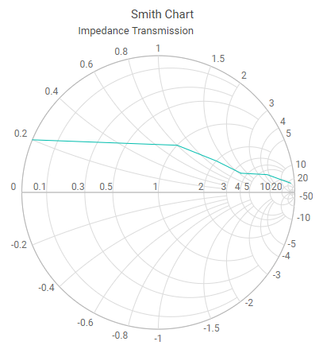

# Title and Subtitle

## Enable title

Title and subtitle is used to depicts the information about the data plotted in the Smith Chart. You can set the title and subtitle of the Smith Chart using the `Text` property in `SmithchartTitle` and `SmithchartSubTitle` tags. By default visibility of the title as well as subtitle is enabled. You need to set simply text for title and subtitle in your sample as like below.

```csharp
<SfSmithchart>
    <SmithchartTitle Text="Smith Chart">
        <SmithchartSubTitle Text="Impedance Transmission"></SmithchartSubTitle>
    </SmithchartTitle>
    <SmithchartSeriesCollection>
        <SmithchartSeries Points='FirstTransmissionData'></SmithchartSeries>
    </SmithchartSeriesCollection>
</SfSmithchart>

@code {
    public class SmithDataSource
    {
        public double? resistance;
        public double? reactance;
    };
    private List<SmithDataSource> FirstTransmissionData = new List<SmithDataSource> {
        new SmithDataSource { resistance= 10, reactance= 25 },
        new SmithDataSource { resistance= 6, reactance= 4.5 },
        new SmithDataSource { resistance= 3.5, reactance= 1.6 },
        new SmithDataSource { resistance= 2, reactance= 1.2 },
        new SmithDataSource { resistance= 1, reactance= 0.8 },
        new SmithDataSource { resistance= 0, reactance= 0.2 }
    };
}
```



## Title trim

Both title and subtitle of the Smith Chart can be trimmed if it exceeds the certain length. Trimming is enabled using `EnableTrim` for title. This length can be changed using the property `MaximumWidth`.

```csharp
<SfSmithchart>
    <SmithchartTitle
        Text="Demo for Smith Chart impedance transmission. For more info"
        EnableTrim="true"
        MaximumWidth="400">
    </SmithchartTitle>
    <SmithchartSeriesCollection>
        <SmithchartSeries Points='FirstTransmissionData'></SmithchartSeries>
    </SmithchartSeriesCollection>
</SfSmithchart>

@code {
    public class SmithDataSource
    {
        public double? resistance;
        public double? reactance;
    };
    private List<SmithDataSource> FirstTransmissionData = new List<SmithDataSource> {
        new SmithDataSource { resistance= 10, reactance= 25 },
        new SmithDataSource { resistance= 6, reactance= 4.5 },
        new SmithDataSource { resistance= 3.5, reactance= 1.6 },
        new SmithDataSource { resistance= 2, reactance= 1.2 },
        new SmithDataSource { resistance= 1, reactance= 0.8 },
        new SmithDataSource { resistance= 0, reactance= 0.2 }
    };
}
```

